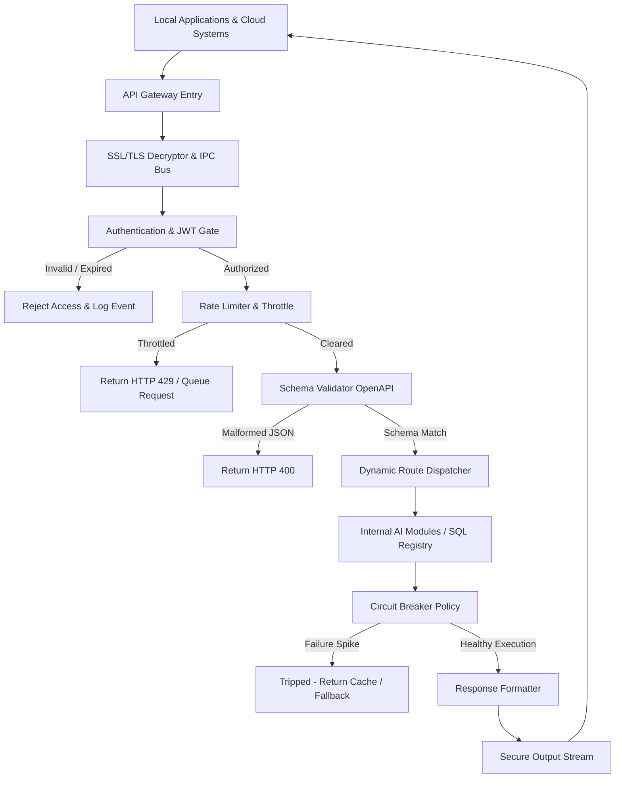
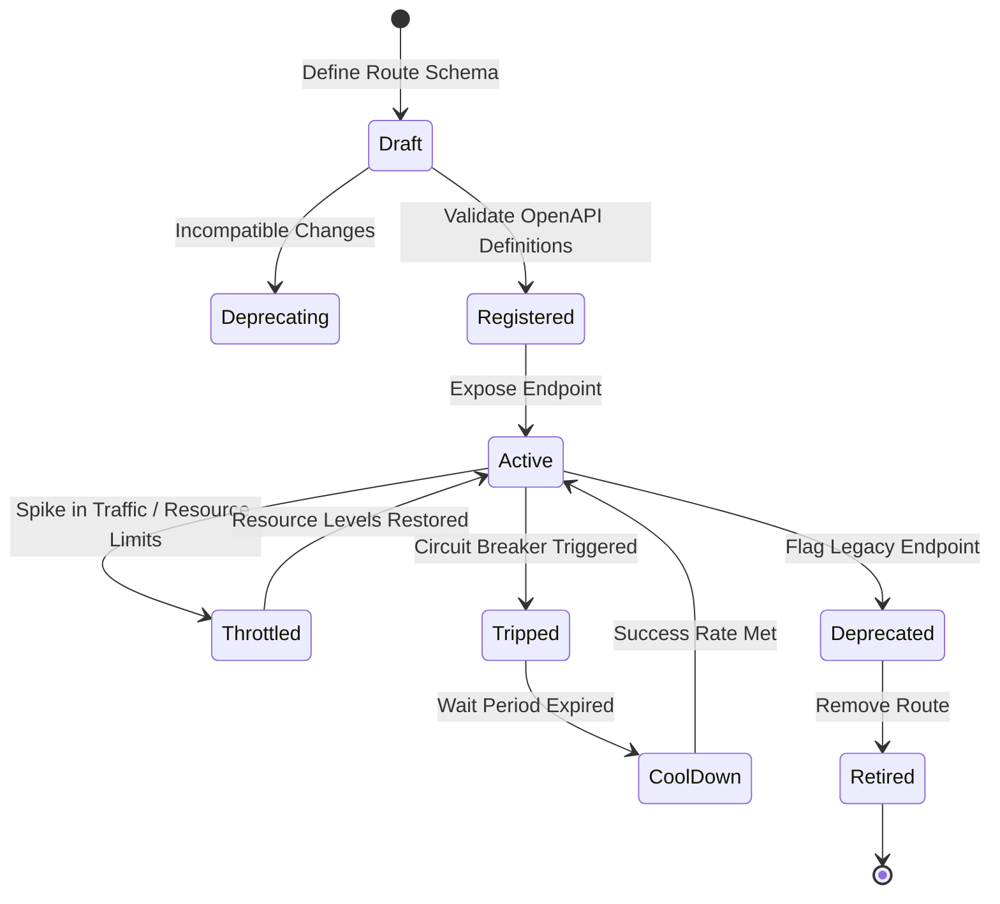
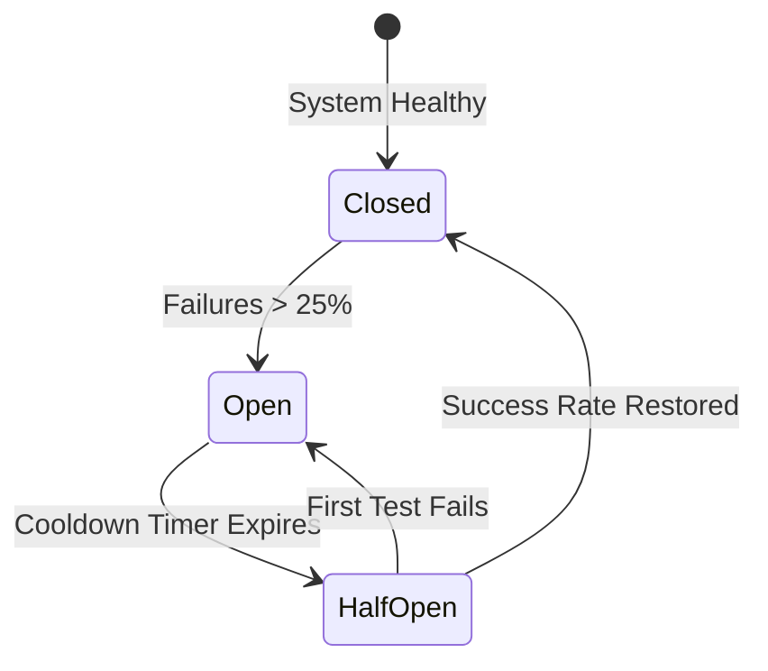

# LifeFresh AI Constitution
## AI API Engine Specification v1.0

**Version:** 1.0  
**Status:** Approved / Core Reference Architecture  
**Last Updated:** July 2026  
**Classification:** Enterprise Internal  

---

### Purpose
The **AI API Engine** is the core interface gateway, routing arbitrator, and compliance enforcement layer of the LifeFresh AI platform. Operating on-device as an offline-first foundation, it exposes, secures, validates, routes, versions, and monitors all internal and external APIs across the platform. In high-security, decentralized healthcare environments, this engine serves as a zero-trust broker, shielding core system architectures and clinical records while providing type-safe, resilient communication channels for local applications and external services.

---

### Scope
This specification governs the design, lifecycle, gateway routers, authentication blocks, rate-limiting policies, OpenAPI documentation schemas, and internal data structures of the local API Engine. It covers REST, gRPC-readiness, WebSockets, and local IPC architectures at the edge.

---

### Objectives
* **Type-Safe API Expose & Route:** Provide unified, declarative routing and serialization for all local and external engine interfaces.
* **Zero-Trust Access Control:** Enforce mandatory JWT, OAuth, or API-key verification on all incoming requests before processing.
* **Low-Latency Routing:** Ensure request routing, schema validation, and dispatch sequences are resolved locally in **<3ms**.
* **Resilient Connection Protection:** Implement local circuit breakers and adaptive throttles to maintain system stability during resource contention.

---

### Design Principles
* **Interface Decoupling:** System components must interact exclusively via defined, schema-validated APIs rather than direct state modification.
* **Strict Schema Conformity:** Requests and responses must match designated schemas exactly, with malformed inputs rejected automatically.
* **Fail-Closed Authorization:** If token verification, role checks, or constraint validation fail or timeout, the transaction must terminate immediately.
* **Comprehensive Ingestion Audit:** Every API call, status response, and authentication failure must be recorded in an append-only, signed log.

---

### 1. Engine Overview
The **AI API Engine** acts as the universal gateway for all programmatic interaction on-device. It receives interface requests, decrypts transport layers, verifies authorization tokens, validates body schemas against active specifications, routes payloads to target engines, and captures telemetry for performance analytics.

---

### 2. Core Responsibilities
* **Unified Interface Exposure:** Exposing secure endpoints for internal engines, local databases, and external cloud integrations.
* **Dynamic Request Routing:** Directing payloads to appropriate action channels based on URL path or request type.
* **Pre-Processing Validation:** Ensuring all incoming payloads strictly adhere to OpenAPI schema rules.
* **Resilient Guardrail Enforcement:** Enforcing local rate limits, circuit breaker blocks, and encryption policies.

---

### 3. API Architecture
The API Engine acts as a structured gateway managing input-output flows between applications and systems:



---

### 4. API Lifecycle
API configurations and endpoints follow a strict progression to maintain system stability:



---

### 5. Internal APIs
Internal APIs coordinate processes inside the device boundaries, linking the UI layer with local database interfaces, planning routines, and execution runners.

---

### 6. External APIs
External APIs interface with authorized cloud portals, syncing sanitized compliance telemetry and operational logs when secure connections are active.

---

### 7. REST Architecture
REST endpoints provide clean, state-neutral pathways for resource CRUD processes, mapping HTTP methods (`GET`, `POST`, `PUT`, `DELETE`) to data actions.

---

### 8. gRPC Readiness
The engine provides protocol-buffer serialization maps, preparing the device to interface with low-latency, streaming gRPC microservices.

---

### 9. WebSocket Support
Establishes bi-directional, persistent connection tunnels, allowing real-time event alerts to stream between the device and enterprise routers.

---

### 10. Local IPC APIs
Local Inter-Process Communication (IPC) pipelines utilize secure Unix sockets, enabling safe communications with host-system services.

---

### 11. API Gateway
The **API Gateway** acts as the single point of entry, executing payload decryption, token checks, and route matching within a single high-performance pipeline.

---

### 12. Request Routing
The router matches paths to targets. If a path is unrecognized, the gateway rejects the request immediately with an HTTP 404 code.

---

### 13. Response Processing
All responses are processed to remove debugging headers or unmasked sensitive fields before being serialized into outbound transport payloads.

---

### 14. Authentication
Authentications are managed securely on-device. Tokens are verified using hardware-backed cryptographic certificates, ensuring zero-trust containment.

---

### 15. Authorization
Role-Based Access Control (RBAC) maps token claims to permitted endpoints, blocking unauthorized personnel from editing critical system schemas.

---

### 16. API Keys
System components utilize signed, hardware-linked API keys, preventing unauthorized devices from mimicking internal network adapters.

---

### 17. JWT Integration
JSON Web Tokens (JWT) are validated locally. The engine inspects signature headers and checks expiry parameters before initiating requests:

```kotlin
fun validateJwtToken(token: String, publicKey: PublicKey): Boolean {
    return try {
        Jwts.parserBuilder()
            .setSigningKey(publicKey)
            .build()
            .parseClaimsJws(token)
        true
    } catch (e: Exception) {
        Log.e("API_ENGINE", "JWT Signature Validation Failed: ${e.message}")
        false
    }
}
```

---

### 18. OAuth Readiness
The gateway includes standard OAuth 2.0 authorization-code redirect layers, enabling federated authentication configurations.

---

### 19. Request Validation
Incoming payloads must conform to strict rules:
* **Size Isolation:** Payloads exceeding **2MB** are blocked automatically to prevent memory spikes.
* **Format Boundaries:** Input structures must conform strictly to expected JSON and XML structures.

---

### 20. Schema Validation
Schemas are verified dynamically using embedded OpenAPI validation maps, throwing exceptions and rejecting malformed requests immediately.

---

### 21. Rate Limiting
Rate limits utilize a local Token Bucket algorithm, throttling requests that exceed predefined frequencies during active sessions.

---

### 22. Throttling
Throttling mechanisms adjust bounds based on device battery, lowering background API execution speeds during low-resource states.

---

### 23. Versioning Strategy
API endpoints carry explicit version identifiers (e.g., `/api/v1/`), allowing old and new endpoints to run concurrently during system migrations.

---

### 24. API Documentation
The engine auto-compiles interface details into accessible, offline-readable OpenAPI YAML formats.

---

### 25. OpenAPI Specifications
Endpoints are documented using standard OpenAPI format maps, ensuring vendor-neutral integration compatibility:

```yaml
openapi: 3.0.3
info:
  title: LifeFresh Local API Engine
  version: 1.0.0
paths:
  /api/v1/patient/intake:
    post:
      summary: Submit patient intake record
      security:
        - BearerAuth: []
      requestBody:
        required: true
        content:
          application/json:
            schema:
              $ref: '#/components/schemas/IntakePayload'
      responses:
        '200':
          description: Intake processed successfully
        '401':
          description: Unauthorized session
```

---

### 26. Error Codes
The API Engine maps internal exceptions to structured, standardized error payloads:

| Error Code | HTTP Status | Description | Action Recommendation |
| :--- | :--- | :--- | :--- |
| `ERR_AUTH_INVALID` | 401 Unauthorized | JWT validation or signature check failed | Renew credentials and retry |
| `ERR_VAL_MALFORMED` | 400 Bad Request | Payload fails OpenAPI schema checks | Correct payload format |
| `ERR_THROTTLE_LIMIT` | 429 Too Many Requests | Request frequency exceeds Token Bucket allocation | Backoff and retry later |
| `ERR_CIRCUIT_TRIPPED` | 503 Service Unavailable | Circuit breaker active due to internal errors | Wait for cooldown period |

---

### 27. Retry Policies
Outbound requests configure exponential backoff delays, automatically retrying connections when transient network drops are identified.

---

### 28. Circuit Breakers
Circuit breakers monitor success rates. If error rates on an outbound API exceed **25%** over a 20-request window, the breaker trips, blocking further connections:



---

### 29. Monitoring
* **Routing Speed:** Tracks processing times, triggering alerts if validation and routing exceed **3ms**.
* **Error Ratios:** Measures error distributions to catch security scans or system failures early.

---

### 30. Logging
Logs record connection actions. PII, medical data, and token strings are redacted automatically:

```
[2026-07-11 03:51:11] [INFO] [API_GATEWAY] POST /api/v1/patient/intake - Size: 1.2KB
[2026-07-11 03:51:11] [INFO] [API_GATEWAY] JWT Validated. User: usr_practitioner_012.
[2026-07-11 03:51:11] [INFO] [API_GATEWAY] Schema matches OpenAPI template: tpl_intake_schema.
[2026-07-11 03:51:11] [INFO] [API_GATEWAY] Dispatched to internal database handler. Duration: 1.8ms.
```

---

### 31. Analytics
Captures performance metrics, compiling average response latencies, active token counts, and routing distributions for local dashboard engines.

---

### 32. APIs for AI Modules
Exposes programmatic channels for local AI models, enabling prompt registrations, token calculations, and context updates.

---

### 33. Internal Data Structures
To ensure safe cross-thread performance, route profiles use immutable Kotlin definitions:

```kotlin
data class RouteDefinition(
    val routeId: String,
    val path: String,
    val httpMethod: String,
    val requiredScope: String,
    val rateLimitCap: Int,
    val schemaFile: String
)
```

---

### 34. SQL API Registry Schema
The SQLite database stores active routes, configuration policies, and security credentials:

```sql
CREATE TABLE api_routes (
    route_id TEXT PRIMARY KEY NOT NULL,
    path TEXT NOT NULL,
    http_method TEXT NOT NULL,
    required_scope TEXT NOT NULL,
    rate_limit_cap INTEGER NOT NULL,
    state TEXT NOT NULL
);

CREATE TABLE api_keys (
    key_id TEXT PRIMARY KEY NOT NULL,
    owner_identity TEXT NOT NULL,
    key_hash TEXT NOT NULL,
    scope TEXT NOT NULL,
    expiration_utc INTEGER NOT NULL,
    state TEXT NOT NULL
);

CREATE TABLE api_transactions_log (
    transaction_id TEXT PRIMARY KEY NOT NULL,
    route_id TEXT NOT NULL,
    client_ip TEXT NOT NULL,
    response_code INTEGER NOT NULL,
    latency_ms INTEGER NOT NULL,
    timestamp_utc INTEGER NOT NULL,
    FOREIGN KEY (route_id) REFERENCES api_routes(route_id)
);
```

---

### 35. Performance Optimization
* **Direct Path Mapping:** Uses efficient hash maps to match paths directly to targets, minimizing string comparisons.
* **Header Pre-Parsing:** Extracts authentication data first, dropping invalid sessions before reading payload buffers.

---

### 36. Error Handling
* **Header Parsing Failures:** Malformed headers trip immediate request rejection, clearing transport channels.
* **Invalid Payload Envelopes:** Payload structures that fail validation are discarded, protecting background threads from processing corrupt states.

---

### 37. Recovery Mechanisms
If the routing daemon hangs, a diagnostic watchdog resets the gateway pipeline and reloads configuration records from SQLite.

---

### 38. Enterprise Deployment
For corporate environments, gateway routes, security settings, and whitelisted client certificates can be packaged as signed configurations deployed across device fleets using MDM platforms.

---

### 39. Future Expansion
* **Decentralized Local Routing:** Dynamic routing adjustments based on local peer-to-peer network node states.
* **Context-Weighted Rate Limiting:** Throttling request limits dynamically based on active user fatigue levels.

---

### Conclusion
The AI API Engine provides a highly optimized, safe, and zero-trust routing framework designed for edge-native healthcare applications. By combining OpenAPI validations, JWT and role gates, rate-limiting tokens, and robust circuit breakers, the Engine ensures that programmatic interaction remains safe, consistent, and secure under all operating conditions.

### Related AI Constitution Documents
* `AI_Policy_Engine.md`
* `AI_Permission_Engine.md`
* `AI_Integration_Engine.md`

### References
1. API Gateway Patterns: Design and Deployment on Mobile and Resource-Constrained Environments
2. NIST SP 800-162: Attribute-Based Agency and Secure Gateway Integration
3. RFC 7519: JSON Web Token (JWT) Security and Cryptographic Validation Guidelines
