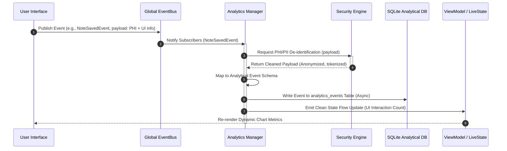
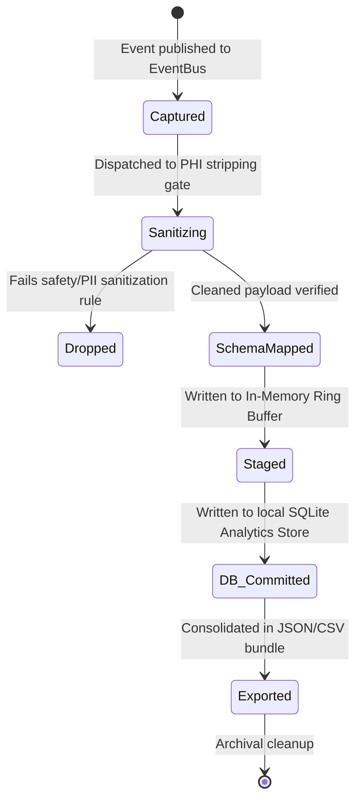

# LifeFresh QuickNote Pro
## AI Analytics Engine Architecture Specification v1.0

**Version:** 1.0  
**Status:** Approved / Core Reference Architecture  
**Last Updated:** July 2026  
**Classification:** Enterprise Internal  

---

## 1. Overview
The **LifeFresh AI Analytics Engine** is the central operational intelligence and telemetry center of the LifeFresh AI ecosystem. It is designed to capture, process, visualize, and report multi-dimensional analytical insights across the entire AI lifecycle. Operating on a strict privacy-first, edge-native architecture, it aggregates user behavior, inference patterns, tool-calling sequences, workflow transitions, and resource budgets. The system bridges the gap between raw low-level application metrics and high-level medical CRM business intelligence without violating clinical privacy boundaries (HIPAA/GDPR).

---

## 2. Objectives
1. **Multi-Dimensional Telemetry:** Build a scalable, non-intrusive collection pipeline across edge and hybrid cloud components.
2. **Behavioral Insight Discovery:** Analyze user interactions, prompt variations, and tool execution trends to optimize clinical UX.
3. **Budget and Resource Auditing:** Track token expenditure, execution latency, memory footprint, and power drain to feed the Optimization Engine.
4. **Anomaly and Drift Detection:** Spot system degradations, outlier transactions, and security-compromising behaviors in real-time.
5. **Business Intelligence Enablement:** Provide standard data schemas, export engines, and reporting APIs to interface with Enterprise BI pipelines.

---

## 3. Design Principles
- **Privacy-by-Design (HIPAA-Native):** Strip and tokenize Protected Health Information (PHI) at the collection point; analytic stores must hold zero raw patient names or clinical notes.
- **Asynchronous, Low-Overhead Collection:** Leverage low-priority background dispatch threads with local ring-buffer queues to guarantee zero UI blockages or main thread performance degradation.
- **Platform-Independent Representation:** Store operational events as immutable, technology-agnostic JSON-Schema structures compatible with mobile, web, edge, and cloud.
- **Strict Decoupling:** Keep analytics compilation distinct from core business logic using an EventBus broker pattern.

---

## 4. Analytics Architecture

The Analytics Engine employs a decoupled broker-subscriber model. It hooks into the system event stream via the global `EventBus` and distributes processed events into real-time visualizers, structured SQLite audit databases, and telemetry sync managers.

```
+-----------------------------------------------------------------------------------+
|                              SYSTEM INTENT & USER ACTIONS                         |
+-----------------------------------------------------------------------------------+
                                          |
                                          v
+-----------------------------------------------------------------------------------+
|                                  GLOBAL EVENTBUS                                  |
+-----------------------------------------------------------------------------------+
                                          |
                                          v
+-----------------------------------------------------------------------------------+
|                             ANALYTICS INGESTION MANAGER                           |
|  - Ingestion Filter                                                               |
|  - PHI/PII Stripping & De-identification Module (regex, dictionaries)             |
|  - Tokenizer / Event ID Assigner                                                  |
+-----------------------------------------------------------------------------------+
          |                               |                              |
          v                               v                              v
+-------------------+           +-------------------+          +--------------------+
|  REAL-TIME CACHE  |           | HISTORICAL STORE  |          | ANOMALY EVALUATOR  |
|  (In-Memory Ring) |           | (Local SQLite DB) |          | (Windowed Scanners)|
+-------------------+           +-------------------+          +--------------------+
          |                               |                              |
          v                               v                              v
+-------------------+           +-------------------+          +--------------------+
| Local Dashboard & |           | Scheduled Export  |          | Emergency Alerts & |
| M3 UI Visualizers |           | (JSON/CSV Buffer) |          | Backplane Signals  |
+-------------------+           +-------------------+          +--------------------+
```

### 4.1 Sequence Diagram: Real-Time Event Collection and Analytics Processing


### 4.2 State Diagram: Analytical Event Lifecycle


---

## 5. Analytics Lifecycle
1. **Instantiation:** Register subscribers to the `EventBus` during application boot. Load operational memory allocations.
2. **Interception:** Listen to structural interactions (UI, API calls, LLM queries, tool invocations).
3. **De-identification & Validation:** Audit structural payloads, strip PHI, normalize formats against JSON schemas.
4. **Staging:** Push events to a fast, non-blocking lock-free memory ring buffer.
5. **Persistence:** Batch commit events to the SQLite analytical schema every 60 seconds or when the ring buffer reaches 80% capacity.
6. **Reporting:** Render local data matrices to Compose views, or bundle them for secure, encrypted export.
7. **Purging:** Automatically prune analytical data older than 30 days to limit local disk footprint under Rule `RULE_LRN_032`.

---

## 6. Data Collection Pipeline
To preserve performance, the engine uses a non-blocking queueing architecture built on Kotlin Coroutines with a dedicated backpressure buffer:

```kotlin
interface AnalyticsPipeline {
    val eventFlow: SharedFlow<CleanedAnalyticEvent>
    suspend fun enqueueRawEvent(rawEvent: RawSystemEvent): Boolean
    suspend fun processQueue()
}
```
The channel uses a `BUFFERED` strategy. If the queue overflows under extreme loads (e.g., bulk operations), it drops the oldest operational telemetry events (`BufferOverflow.DROP_OLDEST`) to prevent memory exhaustion, ensuring core medical note operations remain functional.

---

## 7. Event Collection & Metadata Schema
Every analytical event conforms to a strict, non-null structural schema:

```json
{
  "eventId": "evt_9824_fc3a",
  "sessionId": "ses_4012_77ff",
  "timestampUtc": 1783584311000,
  "eventType": "USER_INTERACTION",
  "category": "NOTE_GENERATION",
  "actorRole": "CLINICAL_SCRIBE",
  "payload": {
    "actionName": "EDIT_PARSED_SYMPTOM",
    "targetField": "symptom_list",
    "interactionDurationMs": 4200,
    "uiComponentId": "symptom_card_checkbox"
  },
  "telemetry": {
    "memoryAllocatedKb": 12400,
    "cpuUsagePercent": 4.2,
    "batteryLevelPercent": 88
  }
}
```

---

## 8. User Interaction Analytics
User interaction tracking isolates layout bottlenecks, click frequencies, and workflow friction points.
* **Captured Features:** Tap locations, screen transitions, drag/swipe gestures, dialog abort counts, and long-press adjustments.
* **Gating Policy:** Keyboard entry events are NEVER collected sequentially (prevents keystroke logging / security leak). Only field-complete events are logged after sanitization.

---

## 9. AI Decision Analytics
Logs the deterministic and probabilistic reasoning pathways taken by the local system.
* **Parameters Recorded:** Selection of intent templates, confidence scores assigned by intent-matching classifiers, raw prompt length, selected temperature, system path chosen, and fallback triggers applied.
* **Decisions Table Structure:**
  | Column | Data Type | Constraint | Description |
  |---|---|---|---|
  | `decision_id` | TEXT | PRIMARY KEY | Unique ID of the decision |
  | `intent_id` | TEXT | NOT NULL | ID of mapped system intent |
  | `confidence_score` | REAL | NOT NULL | Output score from classification |
  | `fallback_applied` | INTEGER | DEFAULT 0 | 1 if system fallback was utilized |

---

## 10. Workflow Analytics
Tracks the progress of multi-stage medical CRM pipelines, from initial contact to documentation sync.
* **Captured metrics:** Total cycle time per workflow, duration spent in each structural state, back-tracking frequency (e.g., user going back from confirmation screen to note input), and completion-to-abandonment ratios.

---

## 11. Tool Usage Analytics
Records the invocation, performance, and results of platform capabilities (such as the Calendar Scheduler, Clinical Dictionary Search, and Contact Lookup).
* **Metrics:** Tool execution frequency, tool latency (ms), parameter extraction accuracy, and tool failure classifications (e.g., API_TIMEOUT, PARAMETER_MISMATCH).

---

## 12. Search Analytics
Monitors local search performance and query trends to enhance dictionary index mappings.
* **Fields Captured:** Query text lengths, execution speeds, search hit ratios, selected search results, and occurrences of zero-result queries.
* **Rule:** Search queries are processed by a phonetic normalization algorithm to strip possible name matches before archiving.

---

## 13. Conversation Analytics
Monitors dialogue performance, turn counts, and user clarification rates.
* **Parameters Tracked:** Count of turns per session, rate of clarification requests, tone-adaptation scores, and conversation success/abort states.

---

## 14. Memory Analytics
Identifies memory leak signatures and analyzes allocation footprints during resource-heavy LLM parsing runs.
* **Metrics:** JVM Heap allocation, native heap footprint, garbage collection frequency, memory recovery durations, and memory-related task termination signals.

---

## 15. Performance Analytics
Exposes latency indicators across different structural units.
* **Tracking Vectors:** App boot duration, database query execution times, prompt construction latencies, intent classification delays, and Compose recomposition frequencies.

---

## 16. Resource Utilization Analytics
Tracks hardware constraints on edge devices under different conditions.
* **Sensors:** Battery temperature, CPU utilization percent, thermal throttling flags, and mobile data usage.

---

## 17. Cost Analytics
Monitors estimated local and cloud-based financial resource allocations.
* **Metric Formulation:**
  $$\text{Cost}_{\text{Session}} = \left(\text{Tokens}_{\text{Input}} \times \text{Rate}_{\text{Input}}\right) + \left(\text{Tokens}_{\text{Output}} \times \text{Rate}_{\text{Output}}\right) + \left(\text{Compute}_{\text{LocalMs}} \times \text{Rate}_{\text{Compute}}\right)$$
* Calculates cost efficiency trends per user tier and checks cloud sync budgeting thresholds.

---

## 18. Productivity Metrics
Measures time saved by clinicians using automated QuickNote drafting compared to standard manual documentation methods.
* **Indicators:** Average notes compiled per hour, time-saved ratios (calculated based on average manual scribe baseline of 180 seconds vs. QuickNote draft verification average of 25 seconds), and automated CRM update success rates.

---

## 19. KPI Framework
```yaml
kpi_framework:
  clinical_efficiency:
    target_generation_latency_ms: 1200
    acceptable_generation_latency_ms: 2500
    documentation_completion_rate_percent: 98.0
  system_reliability:
    target_uptime_percent: 99.95
    max_tool_failure_rate_percent: 0.5
  data_quality:
    intent_classification_accuracy_target: 0.95
    symptom_extraction_f1_score_target: 0.92
```

---

## 20. Dashboard Architecture
The local diagnostic dashboard relies on a highly decoupled architecture using modern Material 3 Jetpack Compose UI patterns:

```
+------------------------------------------------------------------------+
|                      M3 COMPOSE DIAGNOSTIC UI                          |
|  - Real-time Performance Indicators                                    |
|  - Anomaly Alert Banner                                                |
|  - Interactive System Latency Charts                                   |
+------------------------------------------------------------------------+
                                  ^
                                  | Observes State
+------------------------------------------------------------------------+
|                     ANALYTICS VIEWMODEL (Local)                        |
|  - Exposes StateFlow<DashboardUiState>                                 |
|  - Debounces UI chart emissions (500ms limit)                          |
+------------------------------------------------------------------------+
                                  ^
                                  | Queries / Ingests
+------------------------------------------------------------------------+
|                     LOCAL ANALYTICAL SQLITE STORAGE                    |
|  - SQL View: `v_realtime_performance`                                  |
|  - SQLite triggers for automatic rolling-buffer cleanups                |
+------------------------------------------------------------------------+
```

---

## 21. Real-Time Analytics
Provides immediate visual updates inside diagnostic overlay screens:
* Renders active thread pools, memory buffers, and incoming system event counts.
* **Refresh Rate:** UI chart data updates are throttled to a maximum of 1Hz (once per second) to preserve drawing cycles on lower-tier mobile screens.

---

## 22. Historical Analytics
Executes localized analytical sweeps on consolidated datasets:
* Generates historical usage profiles, diagnostic trends, and model degradation curves.
* Runs on low-priority background workers when the system detects charging states and idle processor clocks.

---

## 23. Trend Analysis
Detects shifts in user behavior patterns and clinical focus points:
* Monitors symptom classification trends (e.g., seasonal spikes in flu-related vocabulary).
* Translates trend vectors into localized priority maps inside the synonym and search indexing databases.

---

## 24. Behavioral Analysis
Maps clinic interaction pathways to optimize visual element configurations:
* Identifies features with low interaction rates to recommend visual layout adjustments.
* Evaluates touch precision offsets to fine-tune M3 button scaling bounds.

---

## 25. Predictive Analytics
Predicts prospective resource constraints before they impact the clinical UX:
* Anticipates out-of-memory states based on historical allocation trajectories.
* Pre-empts battery thermal spikes by shifting workloads to energy-efficient system modes.

---

## 26. Anomaly Detection
Identifies behavioral or technical outliers through statistical modeling.
* **The Threshold Engine:** Uses a localized standard deviation formula to flag abnormal metrics:
  $$\text{Anomaly} = |X_i - \mu| > K \cdot \sigma$$
  Where $X_i$ is the actual metric value (e.g., latency), $\mu$ is the rolling mean, $\sigma$ is the standard deviation, and $K$ is the anomaly threshold coefficient (default set to 3.5).
* **Response Protocol:** Raises an internal high-priority signal to trigger fallback parameters and throttle intensive background operations.

---

## 27. Business Intelligence Integration
Interoperates with enterprise BI pipelines (e.g., Tableau, PowerBI, BigQuery) via secure intermediate data models.
* Renders flat files mapped to generic Star-Schema models (Fact tables and Dimension tables) to ensure frictionless ETL loads on target cloud servers.

---

## 28. Report Generation
Compiles local metrics into comprehensive audit documents.
* **Formats:** Supports generating standard JSON structures, comma-separated values (CSV), and stylized local HTML-based system status profiles.

---

## 29. Export Mechanisms
```kotlin
interface AnalyticsExporter {
    suspend fun generateExportPayload(timeRange: ClosedRange<Long>): File
    suspend fun transmitExportPayload(payload: File, endpoint: String): ExportOutcome
}
```
All exports must undergo on-device AES-256 GCM encryption before transmission over SSL connections.

---

## 30. Analytics APIs
```kotlin
interface AIAnalyticsEngine {
    fun logEvent(event: AnalyticEvent)
    fun getRollingMetrics(timeWindowMs: Long): Flow<RollingMetricsBundle>
    fun queryHistoricalReport(criteria: AnalyticsQueryCriteria): List<AnalyticEvent>
    fun registerAlertListener(listener: AnomalyAlertListener)
}
```

---

## 31. Internal Data Structures
The SQLite Analytical Database maintains clean structures separated from primary transactional clinical data:

```sql
CREATE TABLE IF NOT EXISTS analytics_events (
    event_id TEXT PRIMARY KEY,
    session_id TEXT NOT NULL,
    timestamp_utc INTEGER NOT NULL,
    event_type TEXT NOT NULL,
    category TEXT NOT NULL,
    actor_role TEXT NOT NULL,
    payload_json TEXT NOT NULL,
    memory_allocated_kb INTEGER,
    cpu_usage_percent REAL,
    battery_level_percent INTEGER
);

CREATE INDEX IF NOT EXISTS idx_analytics_timestamp ON analytics_events(timestamp_utc);
CREATE INDEX IF NOT EXISTS idx_analytics_category ON analytics_events(category);
```

---

## 32. Security Controls
- **Cryptographic Signatures:** Every analytic payload is signed using a local private key to prevent telemetry tampering.
- **Access Gating:** The analytics console view is locked behind system-level biometric validation.

---

## 33. Privacy & Compliance (HIPAA Guardrails)
- **Zero-PHI Guarantee:** Text extraction algorithms run a regex and dictionary screening block that replaces patient names, telephone numbers, and email addresses with standardized tags (`[PATIENT_ID_REDACTED]`, `[CONTACT_REDACTED]`) before saving analytics logs.
- **Consent Flags:** Logs respect regional privacy flags, fully disabling user-behavior logging if the user toggles off data-collection consent.

---

## 34. Monitoring
- Monitors the health of the Analytics Engine itself using a lightweight self-ping checker.
- Records queue drop occurrences, SQLite write failure rates, and parsing delay metrics.

---

## 35. Logging
The system outputs normalized logging strings that avoid verbose or duplicate traces:

```
[INFO][2026-07-09 02:30:15][AI_ANALYTICS] Ingested 50 events. Pipeline health: EXCELLENT. Queue depth: 0.
[WARN][2026-07-09 02:32:00][AI_ANALYTICS] High queue depth detected (82%). Initiating temporary throttling.
[ERROR][2026-07-09 02:35:12][AI_ANALYTICS] Analytical SQLite write failed: disk full. Purging historical entries.
```

---

## 36. Performance Optimization
- **Pre-Compiled Statement Cache:** SQLite queries are cached to prevent query plan rebuild overhead.
- **Database Vacuuming:** An automated vacuum process runs weekly during overnight hours to prevent SQLite page fragmentation.

---

## 37. Error Handling
The engine isolates errors using safe try-catch wrappers, ensuring analytics failures NEVER crash the main host application:

```kotlin
try {
    analyticsEngine.logEvent(uiEvent)
} catch (e: Exception) {
    Log.e("AI_ANALYTICS", "Failed to log analytic event: ${e.message}")
    // Prevent app crash, write localized crash report payload to scratchpad
}
```

---

## 38. Recovery Strategy
In the event of analytical SQLite corruption:
1. Safe-catch the exception during initialization.
2. Backup the corrupted database to `/diagnostic_corrupt_analytics_backup.db`.
3. Wipe the active analytical database and execute a clean schema rebuild.
4. Log a critical telemetry error to inform local diagnostic panels.

---

## 39. Testing Strategy
- **Unit Testing:** Validates event schema serialization, PII/PHI redaction regex accuracy, and queue buffer overflow rules.
- **Robolectric Integration Testing:** Verifies that interaction tracking code works as expected within simulated Android lifecycles without impacting the UI thread.
- **Performance Profiling:** Ensures battery draw is kept under 0.8% of typical operational loads.

---

## 40. Future Expansion
- **Federated Analytics aggregation:** Integrating secure local differential privacy mechanisms (DP-SGD) to enable aggregate trend analysis across clinics without individual data sharing.
- **On-device AI Trend Summarization:** Using compact, localized models to generate plain-text structural efficiency recommendations for clinic administrators.

---

## 41. Conclusion
The LifeFresh AI Analytics Engine provides a robust, secure, and privacy-compliant framework for tracking and analyzing local application behaviors. By enforcing strict separation of concerns and de-identifying PII/PHI at the point of ingestion, it ensures that operational improvement is achieved while maintaining absolute compliance with medical CRM standards.

---

## 42. Related AI Constitution Documents
- `AI_Personalization_Engine.md` — Shared behavioral signals.
- `AI_Learning_Engine.md` — Adaptation of model synonym mappings.
- `AI_Confirmation_Engine.md` — UI interaction verification pathways.
- `AI_Error_Catalog_v1.0.md` — Error classification and logging codes.

---

## 43. References
- *HIPAA Security Rule Standards (45 CFR Part 160 and Part 164).*
- *Jetpack Compose Performance Optimization Guidelines (Google Developer Documentation).*
- *Differential Privacy in Telemetry Pipelines (M. Abadi et al., 2016).*
