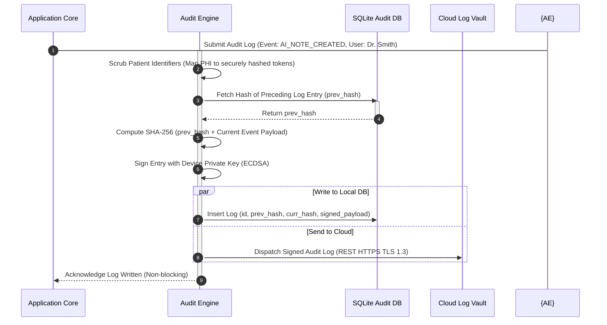
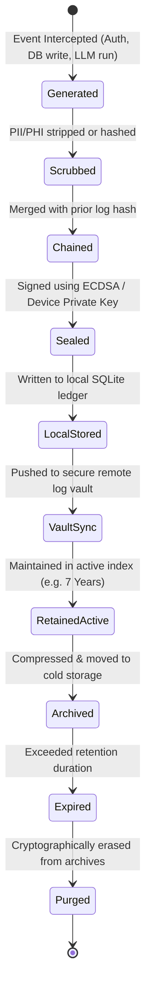

# LifeFresh QuickNote Pro
## AI Audit Engine Architecture Specification v1.0

**Version:** 1.0  
**Status:** Approved / Core Reference Architecture  
**Last Updated:** July 2026  
**Classification:** Enterprise Internal  

---

## 1. Engine Overview
The **LifeFresh AI Audit Engine** is the primary compliance, security-auditing, forensic-tracking, and immutability-verification layer of the LifeFresh AI platform. Operating at the boundary of on-device execution and enterprise security architectures, the Audit Engine provides a continuous, tamper-evident record of all platform activities, AI inferences, database mutations, and human operations.

In clinical systems handling Patient Health Information (PHI) and critical medical records, maintaining a detailed audit log is not only an operational necessity but also a strict regulatory mandate under HIPAA, HITECH, GDPR, and other global healthcare compliance frameworks. The Audit Engine satisfies these mandates by generating a cryptographically sealed, immutable ledger of all operations, ensuring transparency, accountability, and enabling forensic reconstruction of any system state.

---

## 2. Objectives
1. **Regulatory Compliance:** Meet all audit tracking and security logging mandates of HIPAA, HITECH, GDPR, and SOC 2 Type II.
2. **Guarantee Log Immutability:** Utilize cryptographic chaining and digital signatures to prevent tampering by unauthorized users or administrators.
3. **Trace AI Decision Paths:** Log the complete prompt templates, context parameters, models used, and confidence factors behind every AI-generated medical note.
4. **Facilitate Forensic Analysis:** Enable rapid, automated verification of log integrity to identify security incidents, system breaches, or data changes.
5. **Ensure Unobtrusive Operation:** Write audit records using non-blocking, isolated background threads to prevent UI performance bottlenecks.

---

## 3. Design Principles
- **Cryptographic Immutability:** Seal consecutive audit logs into a hash-chained structure (such as an append-only Merkle log chain) to make retrospective modifications detectable.
- **Privacy by Design:** Strip or encrypt sensitive patient details (like names, clinical diagnoses, and phone numbers) from log entries, using secure hash mappings to ensure only anonymized metadata remains in plain text logs.
- **Fail-Secure Write Pipelines:** Implement a robust write queue that buffers audit logs in volatile memory, falling back to local persistent disk storage if write targets are temporarily unavailable.
- **Separate Operations from Security Controls:** Maintain a strict separation of concerns where system developers cannot modify audit rules or delete active logs.

---

## 4. Core Responsibilities
- **Log Ingestion:** Intercepting system events from the database, dialogue managers, and network endpoints.
- **Data Scrubbing:** Removing sensitive Patient Health Information (PHI) from log entries prior to serialization.
- **Cryptographic Chaining:** Hash-linking consecutive log entries to create a tamper-evident audit ledger.
- **Digital Signing:** Applying secure ECDSA signatures using hardware-backed private keys.
- **Integrity Auditing:** Periodically verifying the hash chain to confirm log integrity.

---

## 5. Audit Architecture
The Audit Engine intercepts events from the application core, transaction database, dialogue managers, and remote sync gateways. It processes these events through a security-cleared ingestion pipeline, computes cryptographic hashes, and commits them to an immutable local ledger and secure remote log vaults.

```
+-----------------------------------------------------------------------------------+
|                            APPLICATION EVENT SOURCES                              |
+-----------------------------------------------------------------------------------+
                                          |
          +-------------------------------+-------------------------------+
          | (User Activity)               | (AI Decision)                 | (System Events)
          v                               v                               v
+-----------------------------------------------------------------------------------+
|                             AUDIT INGESTION GATEWAY                               |
|  - Anonymizes PII/PHI (Secure Hash Mappings)                                      |
|  - Classifies Event Type & Priority (CRITICAL / WARN / INFO)                     |
+-----------------------------------------------------------------------------------+
                                          |
                                          v
+-----------------------------------------------------------------------------------+
|                             CRYPTOGRAPHIC SEALING UNIT                            |
|  - Hash-Chaining: SHA-256(Current + Previous Hash)                                |
|  - Encrypts Log Entry with System-Level Public Key                                |
+-----------------------------------------------------------------------------------+
          |                                                               |
          v (Local Write Path)                                            v (Remote Write Path)
+-----------------------------------+                           +-------------------+
|     IMMUTABLE LOCAL SQLITE        |                           | SECURE CLOUD VAULT|
|                                   |                           |                   |
| - SQLite with SQLCipher           |                           | - REST HTTPS TLS  |
| - Read-Only Connection Limits     |                           | - Append-Only Log |
+-----------------------------------+                           +-------------------+
```

### 5.1 Ingestion Pipeline Sequence


---

## 6. Audit Lifecycle
The lifecycle of an audit entry follows a strict pipeline from creation to archive:



---

## 7. Audit Event Pipeline
The pipeline is designed to process and store events sequentially:
- **Scrubbing:** Sanitizes input payloads to remove any patient identifiable details.
- **Priority Scoring:** Classifies incoming logs into prioritized bins (`CRITICAL`, `WARNING`, `INFORMATIONAL`) to optimize processing queues.

---

## 8. User Activity Auditing
Logs all user actions including page views, tab clicks, note modifications, and manual synchronization runs:
- Tracks the specific user account ID, session token, and local device footprint.
- Provides context on the current state of the application interface during the action.

---

## 9. AI Decision Auditing
Records prompt templates, context parameters, generated texts, token counts, and target model versions:
- Essential for tracking changes in AI model behavior and identifying potential hallucinations.
- Retains semantic indicators to verify AI decision pathways.

---

## 10. Workflow Auditing
Tracks progress and transitions inside clinical workflows:
- Logs status changes (e.g., transition of a medical note from "Draft" to "Approved").
- Captures user authorizations associated with each workflow step.

---

## 11. Memory Auditing
Audits updates to long-term memory indexes managed by on-device semantic memory engines:
- Logs when semantic links are formed, edited, or deleted.
- Ensures memory changes do not leak private healthcare contexts.

---

## 12. Tool Execution Auditing
Logs executions of external integrations (such as calendar scheduling, contact queries, and dictation pipelines):
- Records the tool name, input arguments, execution duration, and return code.
- Identifies failures in external dependencies.

---

## 13. API Auditing
Tracks incoming and outgoing network interface calls:
- Records HTTP headers, destination URLs, response codes, and network latency profiles.
- Strips authorization bearer tokens prior to logging to protect system credentials.

---

## 14. Search Auditing
Tracks queries dispatched to on-device databases and semantic indexes:
- Captures query strings, filters used, and returned result statistics.
- Useful for detecting potential data scraping or unauthorized database harvesting attempts.

---

## 15. Synchronization Auditing
Audits synchronization runs between the local database and the cloud:
- Records synchronization status, batch IDs, processed rows count, and conflict resolution details.
- Flags replication drifts and sync failures.

---

## 16. Configuration Auditing
Tracks modifications to system configurations, database settings, and remote gateways:
- Captures previous configuration values and new values.
- Registers authorizations associated with config changes.

---

## 17. Security Auditing
Logs security-sensitive events including key rotations, database integrity checks, and security alerts:
- Critical for verifying the integrity of security and encryption gates.
- Dispatches high-priority alerts on detection of security anomalies.

---

## 18. Authentication Auditing
Tracks user log-in attempts, logouts, session timeouts, and lockout actions:
- Records the source IP address, device fingerprints, and status (Success/Failure).
- Helps identify brute-force or unauthorized credential entry attempts.

---

## 19. Authorization Auditing
Logs access-denied actions when a user attempts to perform unauthorized operations:
- Triggers real-time security alerts if multiple access-denied events occur sequentially.
- Essential for identifying lateral movement or access breach attempts.

---

## 20. Permission Auditing
Audits changes to user access levels and feature permissions:
- Logs who granted or revoked permissions, when the change occurred, and the affected roles.
- Confirms the alignment of permission settings with access policies.

---

## 21. Policy Auditing
Tracks updates to access control policies and regulatory validation rules:
- Logs modifications to HIPAA validation limits and user verification rules.
- Retains old policy definitions for historical comparison.

---

## 22. Rule Auditing
Logs updates to the on-device parsing rules and data-sanitization models:
- Tracks edits to formatting regular expressions and clinical terms.
- Ensures custom processing rules are fully tracked.

---

## 23. Data Modification Auditing
Tracks changes and soft-deletes of clinical records using change-data-capture triggers:
- Records the row key, table name, changed columns, and preceding state.
- Enables complete tracking of entity histories.

---

## 24. System Auditing
Logs low-level operating system events and platform alerts:
- Tracks RAM usage, storage availability limits, and battery throttling states.
- Ensures diagnostic tracing during hardware issues.

---

## 25. Infrastructure Auditing
Tracks server-side architecture updates, cluster health checks, and database indexing actions:
- Logs container restarts, routing updates, and replication lag profiles.
- Essential for tracking cloud platform availability.

---

## 26. Compliance Auditing
Evaluates and logs system states against healthcare compliance checklists:
- Runs automated daily audits to verify compliance statuses.
- Formats reports to match auditing frameworks.

---

## 27. HIPAA Audit Readiness
Maintains audit logs to satisfy HIPAA security regulations:
- Logs all access to patient data, including views, edits, and deletions.
- Restricts log access to authorized compliance personnel.

---

## 28. GDPR Audit Readiness
Enables compliance with GDPR privacy mandates:
- Supports the tracking of right-to-be-forgotten requests.
- Confirms that all related local and remote data stores are fully wiped.

---

## 29. Immutable Audit Logs
Ensures logs are write-once and cannot be modified:
- Implements an append-only architecture inside the SQLCipher audit database.
- Read-only limits prevent modification or deletion of historical logs.

---

## 30. Tamper Detection
Identifies when historical log entries are altered:
- Validates the hash chain periodically on device startup.
- Breaks in the hash chain trigger system lockouts and notify security administrators.

---

## 31. Digital Signatures
- Uses hardware-backed private keys to sign audit entries.
- Prevents falsification of log records by unauthorized parties.

---

## 32. Cryptographic Hash Chains
- Chains consecutive log entries using secure hashing:
  $$H_n = \text{SHA-256}\left(H_{n-1} \parallel \text{Payload}_n \parallel \text{Timestamp}_n\right)$$
- Protects log histories against retroactive updates.

---

## 33. Chain of Trust
- Derives local device signatures from the enterprise certificate authority.
- Establishes a verifiable chain of trust from client devices to security vaults.

---

## 34. Evidence Preservation
- Secures audit logs during active security incidents:
  - Freezes local log databases to prevent modification or deletion.
  - Automatically exports signed log files to remote security vaults.

---

## 35. Forensic Investigation
- Enables administrators to reconstruct system states step-by-step:
  - Replays historical log entries sequentially to trace data modifications.
  - Identifies the actor ID, device footprint, and timestamp associated with each modification.

---

## 36. Compliance Reporting
- Generates signed, tamper-proof compliance reports:
  - Formatted to align with regulatory requirements (e.g., HIPAA, SOC 2).
  - Includes integrity indicators to confirm report validity.

---

## 37. Audit Dashboards
- Renders system metrics, log entry volumes, and security alerts visually:
  - Built using clean Material 3 design guidelines.
  - Provides intuitive filters to scan logs by category, priority, or user account ID.

---

## 38. Retention Policies
- Defines data retention parameters to manage log files over time:
  - Active logs: Retained locally on device for 90 days.
  - Archived logs: Transmitted to remote security vaults and retained for 7 years to meet compliance mandates.

---

## 39. Secure Archiving
- Compresses and encrypts old logs before moving them to cold storage:
  - Uses ZSTD compression and client-side AES-256-GCM encryption.
  - Retains cryptographic hashes to verify archive integrity.

---

## 40. Monitoring
- Tracks system health parameters including log queue latency, write success rates, and validation outcomes.
- Dispatches warnings if log queues encounter processing blocks.

---

## 41. Logging
Logs system actions without exposing Patient Health Information (PHI) or system credentials:

```
[INFO][2026-07-09 03:00:15][AI_AUDIT] Ingested event: AUTH_SUCCESS. Actor: user_829. Hash: 8f2b3c...
[INFO][2026-07-09 03:01:22][AI_AUDIT] Scheduled chain integrity check completed. Result: VALID.
[WARN][2026-07-09 03:15:00][AI_AUDIT] Cloud log vault offline. Buffering logs locally on device.
[ERROR][2026-07-09 03:30:12][AI_AUDIT] Security Alert: Audit chain break detected at index 4521!
```

---

## 42. APIs (YAML Configuration Specification)
```yaml
audit_engine_configuration:
  system_profile: "HIPAA_SECURE_MOBILE"
  log_storage_targets:
    local_ledger: "/data/user/0/com.aistudio.lifefresh/secure_audit.db"
    cloud_vault: "https://audit-vault.lifefresh-enterprise.com/v1/ingest"
  cryptography:
    hash_algorithm: "SHA-256"
    signing_algorithm: "SHA256withECDSA"
    keystore_provider: "AndroidKeyStore"
    active_key_alias: "lifefresh_audit_signing_key_v1"
  retention:
    active_local_days: 90
    archive_cloud_years: 7
```

---

## 43. Internal Data Structures
JSON structure of a signed audit log entry:

```json
{
  "entry_id": 4512,
  "previous_hash": "a1b2c3d4e5f6...",
  "current_hash": "8f2b3c4d5e6f...",
  "timestamp_utc": 1783585200000,
  "event_category": "AI_DECISION",
  "actor_id": "usr_smith_981",
  "anonymized_payload": "{\"model\":\"gemini-1.5\",\"tokens\":452}",
  "digital_signature": "MEQCID6v+3uP8d12L..."
}
```

---

## 44. SQL Audit Database Design
The SQLite database schema used to store the append-only audit log ledger:

```sql
CREATE TABLE IF NOT EXISTS audit_chain_ledger (
    entry_id INTEGER PRIMARY KEY AUTOINCREMENT,
    previous_hash TEXT NOT NULL,
    current_hash TEXT UNIQUE NOT NULL,
    timestamp_utc INTEGER NOT NULL,
    event_category TEXT NOT NULL,
    actor_id TEXT NOT NULL,
    anonymized_payload TEXT NOT NULL,
    digital_signature TEXT NOT NULL,
    verification_status TEXT DEFAULT 'PENDING'
);

CREATE INDEX IF NOT EXISTS idx_audit_timestamp ON audit_chain_ledger(timestamp_utc);
CREATE INDEX IF NOT EXISTS idx_audit_category ON audit_chain_ledger(event_category);
```

---

## 45. Security Controls
- **Keystore Isolation:** Digital signing private keys are isolated inside the hardware secure enclave.
- **Access Restrictions:** Prevents modification of audit records by any application processes.

---

## 46. Privacy Controls
- **Scrubbing Engine:** Automatically sanitizes log payloads to strip Patient Health Information (PHI) prior to serialization.
- **Anonymization:** Maps patient identifiers to securely hashed tokens.

---

## 47. Performance Optimization
- **Non-blocking Writes:** Runs log hashing, signing, and writing operations on low-priority background threads.
- **Atomic Batching:** Groups consecutive log entries and commits them in small batches to reduce disk operations.

---

## 48. Error Handling
The Audit Engine isolates execution errors using clean try-catch blocks to prevent system crashes:

```kotlin
try {
    auditEngine.writeLogEntry(entry)
} catch (e: Exception) {
    Log.e("AI_AUDIT", "Failed to write audit log entry: ${e.message}")
    auditEngine.handleAuditError(e)
}
```

---

## 49. Recovery Mechanisms
- **Log Recovery:** Rebuilds active log databases from cloud secure vaults if local files are corrupted.
- **Integrity Recovery:** Resets validation flags and recovers broken chains if signature verification succeeds.

---

## 50. Future Expansion
- **Decentralized Audit Log:** Implementing decentralized log synchronization to establish high-trust audit trails across independent clinical systems.
- **Real-Time Threat Detection:** Using lightweight on-device models to analyze log patterns and identify security threats in real-time.

---

## 51. Conclusion
The LifeFresh AI Audit Engine provides a highly secure, immutable, and compliance-ready auditing framework. By utilizing cryptographic hash chains and digital signatures, it ensures absolute transparency and data integrity, allowing clinical systems to confidently meet strict enterprise security standards.

---

## 52. Future Enhancements
- Support for distributed ledger technology to enable cross-enterprise audit verification.
- Automated anomaly detection using on-device pattern classifiers.

---

## 53. Related AI Constitution Documents
- `AI_Runtime_v1.0.md` — Managing coroutine runs.
- `AI_Sync_Engine.md` — Secure remote synchronization.
- `AI_Error_Catalog_v1.0.md` — Diagnostic error codes.
- `AI_Backup_Recovery_Engine.md` — Rebuilding database tables.

---

## 54. References
- *HIPAA Administrative Simplification Security Rule (45 CFR Part 164).*
- *The Design of Append-Only Cryptographic Ledgers (NIST).*
- *Practical Techniques for Tamper-Evident Database Audit Logs (ACM SIGMOD).*
