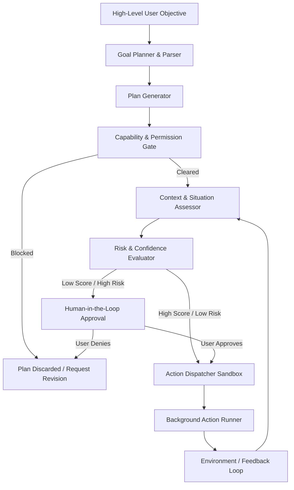
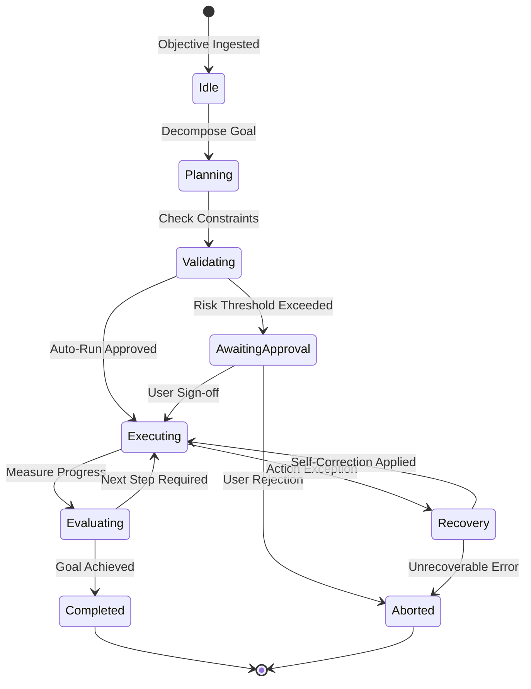

# LifeFresh AI Constitution
## AI Autonomous Engine Specification v1.0

**Version:** 1.0  
**Status:** Approved / Core Reference Architecture  
**Last Updated:** July 2026  
**Classification:** Enterprise Internal  

---

### Purpose
The **AI Autonomous Engine** is the execution brain responsible for orchestrating safe, goal-oriented, self-directed agent behavior across the LifeFresh AI ecosystem. Operating under the security controls of the `AI_Permission_Engine.md` and governed by the boundaries of the `AI_Policy_Engine.md`, this engine enables local system components to plan sequences, assess environments, and complete complex workflows with high autonomy. It bridges local task execution with high-level human oversight, ensuring all agent-driven behaviors are safe, auditable, and compliant with clinical standards.

---

### Scope
This document covers the lifecycle, system architecture, safety boundaries, task execution patterns, and recovery procedures of the Autonomous Engine. It manages autonomous background agents, automated scheduling systems, local synchronization loops, and dynamic workflow planning networks.

---

### Objectives
* **Goal-Driven Autonomy:** Translate abstract, high-level objectives (e.g., "optimize clinic schedule efficiency") into concrete, validated action steps.
* **Continuous Safety Boundaries:** Enforce absolute behavioral constraints, ensuring autonomous agents cannot execute destructive or non-compliant operations.
* **Proactive Context-Awareness:** Evaluate environmental, user, and device conditions to prioritize background tasks.
* **Human-Centric Collaboration:** Provide intuitive feedback interfaces and confirmation triggers to support seamless human oversight.

---

### Design Principles
* **Bounded Agency:** Agents can only execute within capabilities verified by the active policy and permission databases.
* **Explainability by Default:** Record the justification path, confidence score, and policy evaluation trace for every planned action sequence.
* **Deterministic Fallbacks:** Fallback to safe, human-controlled states if target goals cannot be resolved with high confidence.
* **Resource Preservation:** Throttle background execution to prevent performance impact or battery degradation on host systems.

---

### 1. Engine Overview
The Autonomous Engine acts as the planner and execution manager for background automation. It parses high-level objectives, evaluates environmental context, compiles plans, checks permission structures, and coordinates task execution with other platform components.

---

### 2. Core Responsibilities
* **Objective Decomposition:** Translating complex goals into structured task execution steps.
* **Dynamic Context Assessment:** Monitoring environmental changes to adapt active execution steps.
* **Risk and Confidence Rating:** Assessing safety metrics before initiating any plan step.
* **Dynamic Planning and Correction:** Recalculating task paths when obstacles or errors are encountered.

---

### 3. Autonomous Architecture
The Autonomous Engine is organized as a closed-loop monitoring and execution system:



---

### 4. Autonomous Lifecycle
Tasks cycle through structured execution states to maintain complete traceability and support runtime recovery:



---

### 5. Autonomy Levels
To support varying risk profiles and operational contexts, the system enforces five distinct levels of operational autonomy:

| Autonomy Level | Operational Boundary | Execution Pattern | Use Case Example |
| :--- | :--- | :--- | :--- |
| **Level 1 (Direct Action)** | Complete human execution | No automated actions; prompts only | Manual entry of clinical records |
| **Level 2 (Cooperative)** | Suggestive automation | Proposes actions; requires user sign-off | Scheduling check-up tasks |
| **Level 3 (Supervised)** | Conditional execution | Auto-runs low-risk tasks; logs actions | Syncing non-sensitive metadata |
| **Level 4 (Delegated)** | Full task execution | Runs full workflows; reports achievements | Optimization of local database tables |
| **Level 5 (Autonomous)** | Complete agency | Self-directed scheduling and correction | Fleet-wide context synchronization |

---

### 6. Human-in-the-Loop
For Level 2 and Level 3 actions, the engine uses **Human-in-the-Loop (HITL)** gates. If a planned action carries high risk (e.g., emailing data exports), execution is blocked until the user completes biometric authentication.

---

### 7. Human-on-the-Loop
For Level 4 and Level 5 actions, the system operates with **Human-on-the-Loop (HOTL)** monitoring. The engine displays live progress bars, task cards, and execution trees on the dashboard, allowing users to pause or cancel tasks at any time.

---

### 8. Human Override
The system provides a global human override mechanism. Activating the "Manual Mode" switch in the app settings immediately suspends all background agents, aborts active plan tasks, and falls back to Level 1 manual execution.

---

### 9. Goal-driven Execution
Objectives (e.g., `OPTIMIZE_LOCAL_STORAGE`) are registered in SQLite tables. The planner decomposes these objectives into task sequences using local models, tracking progress towards the target objective after each execution step.

---

### 10. Context Awareness
The **Situation Assessment Subsystem** compiles environmental, device, and user metrics into a flat map. Tasks are rescheduled dynamically to optimize execution (e.g., deferring storage sweeps until the device is connected to power).

---

### 11. Situation Assessment
Before executing a step, the engine runs heuristic validations. If a change is detected (e.g., location coordinates indicating the user has left the clinic), the active task tree is updated.

---

### 12. Decision Autonomy
The engine can evaluate alternative execution paths dynamically when solving task requirements:
* **Route Prioritization:** Selects local SQLite indexes or files based on read speeds.
* **API Redirection:** Switches to cached storage during network offline states.

---

### 13. Task Autonomy
Individual tasks (e.g., database backups) handle execution internally, utilizing local retry-backoff algorithms to recover from temporary disk or access failures without requiring main-thread intervention.

---

### 14. Workflow Autonomy
The engine can orchestrate multi-day sequences (e.g., lead check-up pipelines), coordinating tasks, scheduling notifications, and validating execution states over extended timelines.

---

### 15. Safe Action Selection
Plans are evaluated against safety templates. If a plan contains steps that match prohibited patterns, the step is discarded and the planning subsystem compiles an alternative path.

---

### 16. Risk Assessment
Risk levels are calculated dynamically for every step by combining the probability of failure $P_{fail}$ and the impact severity score $I_{sev}$:

$$ \text{Risk Score} = P_{fail} \cdot I_{sev} $$

Steps with risk scores $R \ge 0.6$ are routed to the HITL portal, requiring biometric authentication before execution.

---

### 17. Confidence Evaluation
Each planned step is assigned a confidence metric ($C_{pred} \in [0.0, 1.0]$). If the confidence score drops below the active threshold ($T_{conf} = 0.75$), execution is suspended and alternative paths are calculated.

---

### 18. Autonomous Constraints
The engine operates under absolute execution boundaries:
* **CPU Throttle:** Background execution cannot consume $>15\%$ of active CPU cycles.
* **Storage Limits:** Automated caches must not exceed pre-allocated disk space.

---

### 19. Safety Boundaries
The system enforces absolute boundaries (e.g., the "Clinical Protection Gate"). Autonomous agents are strictly blocked from writing to patient medical records or modifying diagnosis fields.

---

### 20. Policy Enforcement
Every planned action is filtered through the local `AI_Policy_Engine.md`. If a plan step violates an active policy (e.g., storing data in unencrypted staging areas), the step is blocked.

---

### 21. Rule Integration
The engine integrates with the `AI_Rule_Engine.md` to resolve workflow transitions. RETE-based matches assess conditions and trigger follow-up actions automatically.

---

### 22. Permission Validation
Before a plan step is dispatched, the target action is validated against the active permissions database. If the capability is missing, the step fails and the incident is logged.

---

### 23. Continuous Monitoring
A background thread continuously monitors the status of active plan tasks, verifying that steps complete within execution limits to prevent deadlock scenarios.

---

### 24. Self-correction
If an action fails (e.g., file write error), the self-correction module evaluates the exception. It can automatically retry, adjust write paths, or compress files to resolve local errors.

---

### 25. Failure Detection
If execution fails or stalls for longer than 30 seconds, the engine flags the task, halts execution, and logs a diagnostic trace.

---

### 26. Recovery Strategy
When a failure is detected, the engine executes targeted recovery playbooks:
1. **Fallback:** Reverts the workspace state to the last verified snapshot.
2. **Re-plan:** Recalculates remaining plan steps using cached inputs.
3. **Escalate:** Prompts the user for manual intervention if errors persist.

---

### 27. Rollback Mechanisms
The engine utilizes a sliding execution log. If a plan fails mid-sequence, a recovery utility reverts all completed database operations, returning the system to a clean state.

---

### 28. Audit Integration
All planned goals, generated steps, confidence scores, policy checks, and execution outcomes log to local forensic databases:

```sql
CREATE TABLE autonomous_audit_ledger (
    event_id TEXT PRIMARY KEY NOT NULL,
    timestamp_utc INTEGER NOT NULL,
    goal_id TEXT NOT NULL,
    action_key TEXT NOT NULL,
    execution_state TEXT NOT NULL,
    risk_score REAL NOT NULL,
    justification_trace TEXT NOT NULL
);
```

---

### 29. Learning Feedback
Execution telemetry is fed back to the `AI_Learning_Engine.md`. Successful plans increment task priority weights, while manual cancels or failures adjust model selection rates.

---

### 30. Monitoring
* **Performance Metrics:** Tracks memory and CPU footprints of background tasks.
* **Goal Success Rate:** Monitors the ratio of completed goals to aborted sequences.

---

### 31. Logging
All logging messages are stripped of PII and clinical metrics before writing to disk:

```
[2026-07-09 17:30:11] [INFO] [AUTO_ENGINE] Planning goal: OPTIMIZE_LOCAL_STORAGE
[2026-07-09 17:30:11] [INFO] [AUTO_ENGINE] Step 1 compiled: COMPRESS_HISTORICAL_LOGS. Confidence: 0.94
[2026-07-09 17:30:12] [INFO] [AUTO_ENGINE] Policy checks PASSED. Initiating execution.
[2026-07-09 17:30:14] [INFO] [AUTO_ENGINE] Step 1 completed. Goal achievement state: 100%.
```

---

### 32. APIs
The Autonomous Engine exposes Kotlin interfaces to register objectives and check task progress:

```kotlin
interface AutonomousService {
    suspend fun registerObjective(goal: ObjectiveDefinition): Result<String>
    suspend fun getActivePlan(goalId: String): Result<ExecutionPlan>
    suspend fun setAutonomyLevel(level: Int): Boolean
    suspend fun triggerManualOverride(): Boolean
}
```

---

### 33. Internal Data Structures
Execution plan layouts use immutable structures to ensure safe background thread operations:

```kotlin
data class ExecutionPlan(
    val goalId: String,
    val planVersion: Int,
    val steps: List<PlanStep>,
    val autonomyLevel: Int,
    val aggregatedRisk: Float,
    val creationTimestamp: Long
)
```

---

### 34. Performance Optimization
* **Pre-allocated Task Queues:** Task planners use pre-allocated buffers to minimize GC churn during background evaluations.
* **Execution Throttling:** Suspends plan calculations when system battery drops below **15%** or CPU load exceeds **80%**.

---

### 35. Error Handling
* **Stalled Steps:** If a task stalls, the watchdog cancels the task, logs the anomaly, and initiates plan recovery.
* **Planning Failures:** If alternative plans cannot be compiled, the engine aborts the goal and prompts the user.

---

### 36. Enterprise Deployment
System policies and autonomy settings can be packaged as signed JSON configurations. These profiles are deployed across devices using corporate MDM platforms.

---

### 37. Future Expansion
* **Distributed Task Coordination:** Enable devices to share background tasks across secure, disconnected peer-to-peer networks.
* **Biometric Engagement Matching:** Adapt autonomy settings dynamically based on user engagement metrics and cognitive load.

---

### Conclusion
The AI Autonomous Engine provides a robust, safe, and goal-oriented execution framework designed for edge healthcare environments. By combining continuous policy checks, granular risk assessments, and robust human override controls, the Engine ensures automated workflows execute safely and compliant under all conditions.

### Related AI Constitution Documents
* `AI_Permission_Engine.md`
* `AI_Policy_Engine.md`
* `AI_Decision_Engine.md`

### References
1. Material Design 3 Guidelines: Accessibility and Dynamic Layout Adapters
2. NIST SP 800-162: Attribute-Based Access Control and Agency Management Guidelines
3. IEEE Std 1008-1987: Software Unit Testing and Autonomous Verification Standards
