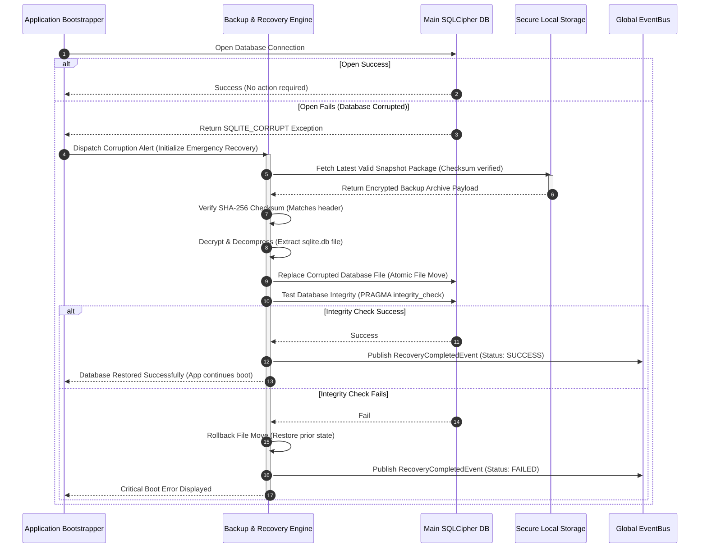
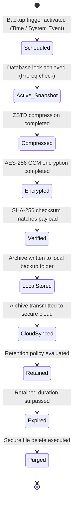

# LifeFresh QuickNote Pro
## AI Backup & Recovery Engine Architecture Specification v1.0

**Version:** 1.0  
**Status:** Approved / Core Reference Architecture  
**Last Updated:** July 2026  
**Classification:** Enterprise Internal  

---

## 1. Overview
The **LifeFresh AI Backup & Recovery Engine** is the core operational safety, data protection, and disaster recovery system of the LifeFresh AI ecosystem. Since the platform operates on an offline-first architecture, critical user configurations, local memory indices, conversation histories, customized workflows, and learned parameters reside primarily on individual client edge devices. Physical device loss, hardware failures, database corruption, or malicious attacks can lead to catastrophic data loss.

The Backup & Recovery Engine prevents data loss by coordinating automated, secure, and incremental backup routines. It packages local SQLite databases, preference files, and memory caches into encrypted, compressed, and checksummed archive packages. These packages can be stored in secure on-device partitions or synchronized with HIPAA-compliant cloud storage environments.

---

## 2. Objectives
1. **Prevent Data Loss:** Ensure continuous protection of clinical notes, CRM states, personalization indexes, and system configurations.
2. **Minimize Recovery Time Objective (RTO):** Support rapid system restoration, achieving a target RTO of under 10 seconds for standard local database rollbacks.
3. **Minimize Recovery Point Objective (RPO):** Limit potential data loss by executing automated incremental backups every 4 hours or upon significant system transitions.
4. **Guarantee Zero-Knowledge Security:** Encrypt all backup packages using client-controlled keys before storage or cloud transmission.
5. **Ensure Self-Healing Resilience:** Detect database corruption on application startup and execute automated, silent restorations to a known stable point.

---

## 3. Design Principles
- **End-to-End Encrypted (E2EE) Isolation:** All backup payloads must be encrypted using client-side keys derived from user credentials; no plain text data can ever be read by storage backplanes or cloud servers.
- **Resource-Aware Scheduling:** Backup operations must execute as low-priority background workers, throttling operations based on battery status, network conditions, and charging states.
- **Atomic Recovery Transactions:** Recovery operations must run within a single, isolated transaction boundary, rolling back completely to the original state if any recovery step fails.
- **Verification-Driven Storage:** Backup packages must include deterministic SHA-256 checksums, validating data integrity before committing any restore execution.

---

## 4. Backup & Recovery Architecture
The Backup & Recovery Engine operates as an isolated background utility. It interfaces with the local database layer, file system managers, and the global `EventBus` to capture snapshot states, verify integrity, and coordinate recovery pipelines.

```
+-----------------------------------------------------------------------------------+
|                            CORE BACKUP & RECOVERY CORE                            |
+-----------------------------------------------------------------------------------+
                                          |
          +-------------------------------+-------------------------------+
          | (Backup Path)                                                 | (Recovery Path)
          v                                                               v
+-----------------------------------+                           +-------------------+
|     SNAPSHOT & PACKAGE AGENT      |                           | RESTORE PIPELINE  |
|                                   |                           |                   |
| - Read Active SQLite Tables       |                           | - Read Archive pkg|
| - Extract User Preference Files   |                           | - Verify SHA-256  |
| - Generate Incremental Logs       |                           | - Decrypt & Unpack|
+-----------------------------------+                           +-------------------+
          |                                                               |
          v                                                               v
+-----------------------------------+                           +-------------------+
|     COMPRESSION & SECURITY GATE   |                           | ATOMIC TRANSACTION|
|                                   |                           |                   |
| - Compress Payload (ZSTD/Gzip)    |                           | - Suspend Engine  |
| - Encrypt Package (AES-256 GCM)   |                           | - Write to DB     |
| - Calculate SHA-256 Checksum      |                           | - Validate State  |
+-----------------------------------+                           +-------------------+
          |                                                               |
          v                                                               v
+-----------------------------------+                           +-------------------+
|      MULTI-DESTINATION MANAGER    |                           | RUNTIME RESET     |
|                                   |                           |                   |
| - Save to Secure Local Partition  |                           | - Resume Engine   |
| - Sync to Cloud Storage Gate      |                           | - Publish Event   |
+-----------------------------------+                           +-------------------+
```

### 4.1 Sequence Diagram: Automated Database Recovery on Boot


---

## 5. Backup Lifecycle
The lifecycle of backup creation, storage, and retention is managed through a deterministic, policy-driven pipeline:



---

## 6. Backup Methods
The engine supports three backup methods to optimize storage footprint and network usage:

| Backup Method | Frequency | Captured Components | Storage Footprint | Latency Cost |
|---|---|---|---|---|
| **Full Backup** | Weekly | All databases, preference files, local files | High | Medium |
| **Incremental Backup** | Every 4 Hours | Transaction logs and delta changes since last backup | Very Low | Low |
| **Differential Backup** | Daily | All database changes since the last Full Backup | Medium | Medium |

---

## 7. Snapshot Strategy & Database Locking
To ensure transaction consistency, the engine uses an online hot-snapshotting strategy:
* **Write-Ahead Logging (WAL):** SQLite databases operate in WAL mode, allowing read-only backup workers to snapshot active databases without blocking user writes.
* **Database Online Backup API:** Uses the native SQLite Online Backup API (`sqlite3_backup_init`) to copy active database pages incrementally into a memory buffer, avoiding sudden memory utilization spikes.

---

## 8. Backup Domain Categorization
Backups are structured across six distinct logical domains to allow granular restorations:

### 8.1 Configuration Backup
Includes application system configurations, feature flags, API endpoints, and regional system preferences.
* **Priority:** HIGH. Critical for proper application initialization.

### 8.2 AI Memory Backup
Includes long-term user memories, semantic index maps, and personalization profiles managed by the `AI_Memory_v1.0.md` engine.
* **Privacy Guard:** Must undergo secure client-side encryption. No cloud-based vector analytics are performed on this data.

### 8.3 Knowledge Backup
Includes custom clinical dictionaries, on-device synonym variations, and clinic-specific shortcuts.
* **Volume:** Low. Highly structured JSON formats.

### 8.4 Conversation Backup
Includes historical note scribe dialogues, transcription transcripts, and chat session histories.
* **Data Sensitivity:** CRITICAL. Classed as Primary PHI under HIPAA. Always subject to the highest encryption and access gating standards.

### 8.5 Workflow Backup
Includes the operational states, transition configurations, and historical paths of active medical CRM pipelines.
* **Sync Strategy:** Uploaded immediately upon workflow completion events.

### 8.6 User Preference Backup
Includes user-defined theme preferences, font sizes, custom button alignments, and system notification rules.
* **Restoration Speed:** Instantaneous. Loaded on the first screen inflation.

---

## 9. Secure Storage Configuration (YAML)
```yaml
backup_recovery_configuration:
  system_profile: "MOBILE_EDGE_OFFLINE"
  storage_targets:
    local_partition: "/data/user/0/com.aistudio.lifefresh/secure_backups"
    cloud_gateway: "https://backup-vault.lifefresh-enterprise.com/sync"
  compression:
    algorithm: "ZSTD"
    level: 7
  cryptography:
    algorithm: "AES-256-GCM"
    key_derivation: "PBKDF2WithHmacSHA256"
    pbkdf2_iterations: 150000
  retention_policy:
    local_snapshots_cap: 5
    cloud_snapshots_cap: 30
    purge_interval_days: 30
```

---

## 10. Integrity Verification & Checksum Formulation
To guarantee that a backup package is pristine before attempting restoration, the engine verifies its integrity using a SHA-256 checksum:

```kotlin
object BackupIntegrityVerifier {
    fun calculateChecksum(file: java.io.File): String {
        val digest = java.security.MessageDigest.getInstance("SHA-256")
        file.inputStream().use { input ->
            val buffer = ByteArray(8192)
            var bytesRead = input.read(buffer)
            while (bytesRead != -1) {
                digest.update(buffer, 0, bytesRead)
                bytesRead = input.read(buffer)
            }
        }
        return digest.digest().joinToString("") { "%02x".format(it) }
    }

    fun verifyPackage(file: java.io.File, expectedChecksum: String): Boolean {
        if (!file.exists()) return false
        val actualChecksum = calculateChecksum(file)
        return actualChecksum.equals(expectedChecksum, ignoreCase = true)
    }
}
```

---

## 11. Point-In-Time Recovery (PITR) Workflow
The engine maintains a historical chain of delta transition files, allowing administrators to restore the application state to a precise historical microsecond:

```
[System Corruption / Error Detected]
                 │
                 ▼
      [Read Active Log Index] ──► Identifies closest preceding Full Backup
                 │
                 ▼
     [Restore Full Backup Base] ◄── Restores baseline database file
                 │
                 ▼
 [Replay Incremental Delta Logs] ◄── Iteratively applies incremental transaction
                 │                   files sequentially up to the target timestamp
                 ▼
     [Verify Target State] ──► Performs state integrity checks
                 │
                 ▼
      [System Back Online]
```

---

## 12. Disaster Recovery & Failover Strategies
To handle catastrophic failures, the engine implements a multi-tier failover protocol:
1. **Local Partition Corrupted:** Rebuilds active databases from the latest cloud backup archive.
2. **Cloud Backplane Offline:** Continues executing local incremental backups on device, logging sync actions to an offline buffer queue for reconciliation upon cloud reconnection.
3. **Hardware Platform Migration:** Allows users to restore their complete application state on a brand-new device using a secure recovery passphrase.

---

## 13. Automatic Rollback Policy
If an active database transaction fails or is interrupted mid-execution (e.g., due to low power or sudden crash):
* The engine catches the exception during transaction execution.
* Closes the active corrupted connection.
* Automatically reverts database files to the pre-transaction snapshot state stored inside the secure `/tmp` rollback folder.
* Restarts the database, ensuring zero partially written records remain in active tables.

---

## 14. High Availability & Continuity Operations
Ensures uninterrupted access to clinical data:
* Uses a split-schema architecture to isolate the active transcription engine from historical archives, ensuring transcription features remain functional even during historical database maintenance.
* Implements dynamic read/write connection pools to handle high-frequency concurrent operations.

---

## 15. Backup Schema Descriptor
The structure of each backup archive package is defined using a JSON descriptor file stored inside the root ZIP container:

```json
{
  "backupId": "bak_20260709_030000",
  "version": "1.0",
  "clientIdentifier": "cli_9883_ffac",
  "timestampUtc": 1783585200000,
  "backupType": "INCREMENTAL",
  "parentBackupId": "bak_20260705_000000",
  "checksumSha256": "8f430a902b4352f1e290cf0a2d20760a9287c8052cf05d3bca8bcda819a90432",
  "domains": [
    {
      "domainName": "AI_MEMORY",
      "fileName": "ai_memory_delta.bin",
      "encryptionAlgorithm": "AES-256-GCM"
    },
    {
      "domainName": "CONVERSATION",
      "fileName": "conversations_delta.db",
      "encryptionAlgorithm": "AES-256-GCM"
    }
  ]
}
```

---

## 16. Backup & Recovery SQL DB Schema
The engine tracks backup metadata and integrity history inside a persistent local SQLite database:

```sql
CREATE TABLE IF NOT EXISTS backup_history_log (
    backup_id TEXT PRIMARY KEY,
    timestamp_utc INTEGER NOT NULL,
    backup_type TEXT NOT NULL,
    file_path TEXT NOT NULL,
    file_size_bytes INTEGER NOT NULL,
    checksum_sha256 TEXT NOT NULL,
    status TEXT NOT NULL,
    error_message TEXT
);

CREATE TABLE IF NOT EXISTS recovery_history_log (
    recovery_id TEXT PRIMARY KEY,
    timestamp_utc INTEGER NOT NULL,
    target_backup_id TEXT NOT NULL,
    trigger_type TEXT NOT NULL,
    outcome TEXT NOT NULL,
    duration_ms INTEGER NOT NULL,
    FOREIGN KEY(target_backup_id) REFERENCES backup_history_log(backup_id)
);

CREATE INDEX IF NOT EXISTS idx_backup_timestamp ON backup_history_log(timestamp_utc);
CREATE INDEX IF NOT EXISTS idx_recovery_timestamp ON recovery_history_log(timestamp_utc);
```

---

## 17. Backup & Recovery API Interface (Kotlin Contract)
```kotlin
interface AIBackupRecoveryEngine {
    suspend fun createSnapshot(type: BackupType, domains: List<BackupDomain>): BackupOutcome
    suspend fun restoreFromSnapshot(backupId: String): RestoreOutcome
    suspend fun verifyBackupIntegrity(backupId: String): Boolean
    suspend fun listAvailableSnapshots(): List<BackupRecord>
    suspend fun purgeExpiredSnapshots(): Int
    suspend fun registerSystemHealthMonitor(monitor: BackupHealthListener)
}
```

---

## 18. Security Guardrails & Privacy Controls
To maintain absolute compliance with enterprise healthcare standards, the engine enforces strict security guardrails:
- **Zero-Knowledge Key Architecture:** Encryption keys are never stored on the same cloud server as the backup archives; keys are derived locally on-device based on user-controlled passphrases.
- **GDPR Right-To-Be-Forgotten Compliance:** Triggering a "Wipe Profile" action purges all local backup snapshots, zeroes active memory pages, and dispatches a secure remote delete command to cloud storage targets.

---

## 19. Monitoring & Alerting
* Tracks active backup sizes, generation latencies, and file counts.
* Publishes high-priority alerts to the global system log if three consecutive backup synchronization attempts fail.

---

## 20. Logging Protocols
Logs are structured to prevent the leakage of sensitive clinical parameters or personal identifiers:

```
[INFO][2026-07-09 03:00:15][AI_BACKUP] Initiated incremental backup: bak_20260709_030000. Mode: WAL Hot-Snapshot.
[INFO][2026-07-09 03:01:22][AI_BACKUP] Backup completed. Encrypted payload: 12.4 MB. SHA-256 match: TRUE.
[WARN][2026-07-09 03:15:00][AI_BACKUP] Cloud sync target offline. Enqueueing package to offline buffer database.
[ERROR][2026-07-09 03:30:12][AI_RECOVERY] Automatic recovery triggered: database corruption detected. RTO started.
```

---

## 21. Error Handling & Fail-Safe Recovery
The system isolates execution errors using clean try-catch blocks to prevent crashes:

```kotlin
try {
    backupEngine.createSnapshot(BackupType.INCREMENTAL, listOf(BackupDomain.AI_MEMORY))
} catch (e: Exception) {
    Log.e("AI_BACKUP", "Failed to create incremental snapshot: ${e.message}")
    backupEngine.registerFailure(e)
}
```

---

## 22. Testing Strategy
- **Unit Testing:** Validates file-checksum matching accuracy, AES decryption performance, and WAL page extraction behavior.
- **Disaster Recovery Simulation:** Artificially corrupts SQLite databases at runtime to verify that the automatic recovery pipeline restores the app state correctly on the subsequent boot.
- **Stress Testing:** Measures system resource utilization under low storage limits (under 5%) to confirm that safety-first pruning and vacuum operations behave as expected.

---

## 23. Future Expansion
- **Continuous Stream Mirroring:** Implementing real-time transaction streaming to enable zero-RPO data protection models for enterprise-tier clinics.
- **Semantic Integrity Analysis:** Using lightweight neural verifiers to analyze recovered databases, ensuring historical clinical relationships remain accurate post-restoration.

---

## 24. Conclusion
The LifeFresh AI Backup & Recovery Engine provides a highly secure, offline-first data protection framework for clinical operations. By utilizing zero-knowledge client-side encryption and online WAL hot-snapshots, it ensures absolute data preservation and rapid recovery capabilities without compromising healthcare compliance standards.

---

## 25. Related AI Constitution Documents
- `AI_Personalization_Engine.md` — Shared behavioral profiles.
- `AI_Memory_v1.0.md` — Long-term semantic indexes.
- `AI_Error_Catalog_v1.0.md` — Fault classifications.
- `AI_Runtime_v1.0.md` — Coroutine execution.

---

## 26. References
- *SQLite Online Backup API Specification (sqlite.org).*
- *HIPAA Disaster Recovery Plan Requirements (45 CFR § 164.308).*
- *Zero-Knowledge Architecture Guidelines (National Institute of Standards and Technology).*
