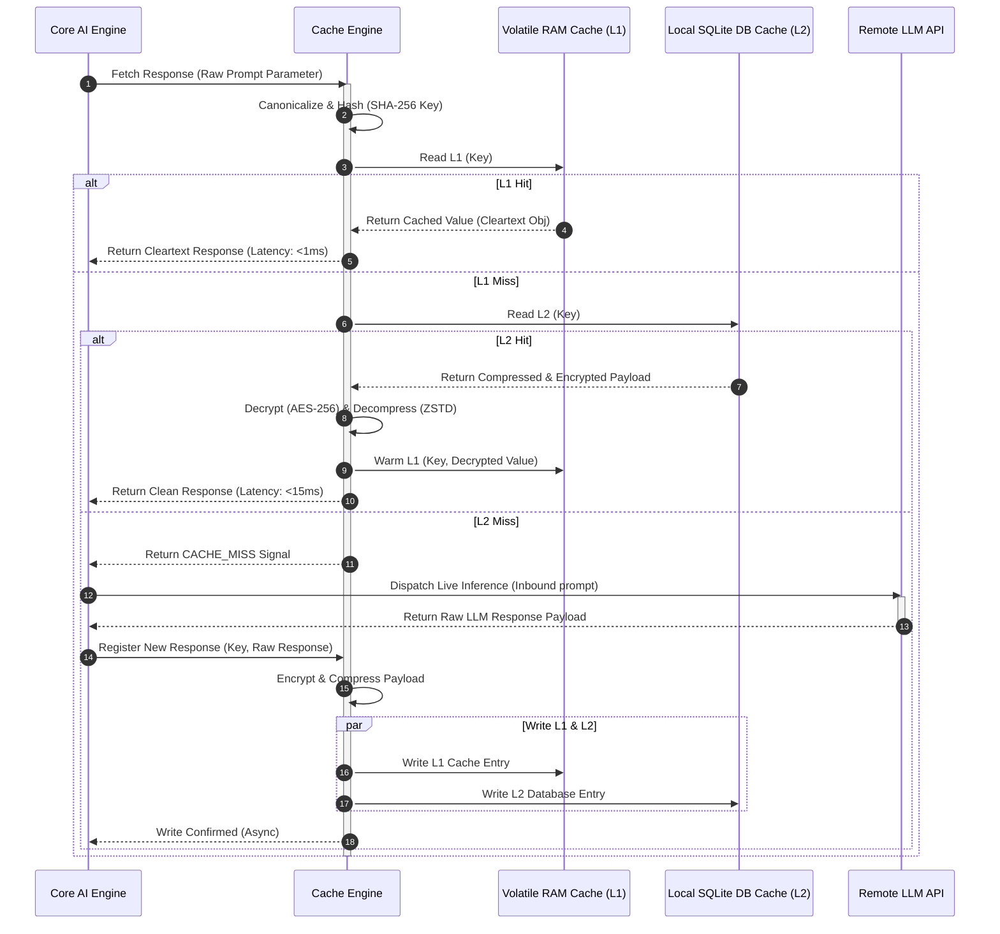
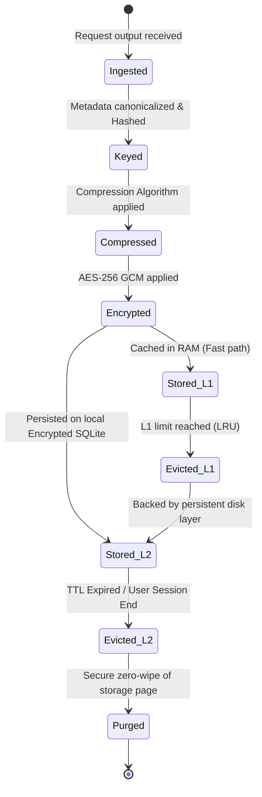

# LifeFresh QuickNote Pro
## AI Cache Engine Architecture Specification v1.0

**Version:** 1.0  
**Status:** Approved / Core Reference Architecture  
**Last Updated:** July 2026  
**Classification:** Enterprise Internal  

---

## 1. Overview
The **LifeFresh AI Cache Engine** is the primary execution acceleration and computational optimization system of the LifeFresh AI platform. In artificial intelligence systems, especially those processing intensive clinical transactions, voice transcriptions, and semantic search queries, repeating expensive model inferences and database scans introduces prohibitive latency, high operational costs, and rapid battery depletion. 

The Cache Engine resolves these inefficiencies by orchestrating an intelligent, multi-layered, privacy-preserving cache network across the client edge and cloud backplanes. By checking for previously computed semantic embeddings, intent matches, synthesized prompts, and API response structures, the Cache Engine reduces system latency to sub-millisecond ranges for hot-path operations while maintaining strict HIPAA compliance.

---

## 2. Objectives
1. **Reduce Operational Latency:** Achieve sub-10ms response times for recurring user actions, semantic search queries, and prompt reconstructions.
2. **Minimize Computational Costs:** Lower API token expenditure and on-device processor utilization by avoiding duplicate inferences.
3. **Optimize Multi-Tier Storage:** Coordinate high-speed volatile memory, persistent local storage, and cloud distributed cache layers.
4. **Preserve Device Battery and Thermal Health:** Maximize hit ratios for hot data, thereby minimizing active GPU/NPU rendering and CPU scheduling overhead.
5. **Enforce Absolute Data Isolation:** Ensure that cached clinical information is encrypted, localized, partitioned by user profile, and securely wiped on session expiry.

---

## 3. Design Principles
- **Privacy-First Locality:** Cached Patient Health Information (PHI) must be stored locally on-device inside encrypted SQLite tables and never written to cleartext or unencrypted disk segments.
- **Semantic Determinism:** Standardize prompt and input parameters into canonical representations to guarantee stable cache hit ratios despite trivial whitespace or formatting changes.
- **Non-Blocking Execution:** Cache validation, eviction, compression, and synchronization run entirely on low-priority background threads to prevent UI main thread stalls.
- **Fail-Safe Transparency:** Cache read or write failures must never disrupt the application's core operational flow; the system must gracefully fall back to fresh live processing.

---

## 4. Cache Architecture
The Cache Engine operates on a decoupled multi-layer layout that is closely integrated with the system's global `EventBus` and the `AI_Optimization_Engine.md`. It listens to incoming execution requests, evaluates cache key hashes, and serves cached data or forwards the execution to the underlying AI model/database engines.

```
+-----------------------------------------------------------------------------------+
|                            CORE RUNTIME ROUTING GATES                             |
+-----------------------------------------------------------------------------------+
                                          |
                                          v
+-----------------------------------------------------------------------------------+
|                                CACHE CONTROL GATE                                 |
|  - Request Parser & Parameter Canonicalizer                                      |
|  - Multi-Algorithm Cache Key Generator (MD5 / SHA-256)                             |
+-----------------------------------------------------------------------------------+
          |                                                               |
          v (Cache Hit)                                                   v (Cache Miss)
+-----------------------------------+                           +-------------------+
|     MULTI-LEVEL STORAGE DISPATCH  |                           | CORE EXECUTION    |
|                                   |                           | - Local NPU/GPU   |
|  L1: Volatile RAM Cache (Lru)     |                           | - Remote LLM API  |
|  L2: Encrypted Local SQLite       |                           | - SQLite DB Scan  |
|  L3: Distributed Cloud Redis      |                           +-------------------+
+-----------------------------------+                                     |
          |                                                               |
          v                                                               v
+-----------------------------------------------------------------------------------+
|                               CACHE INGESTION PIPELINE                            |
|  - Compression (ZSTD / Brotli)                                                    |
|  - Encryption (AES-256 GCM)                                                       |
|  - Indexing & TTL/LFU Allocation                                                  |
+-----------------------------------------------------------------------------------+
```

### 4.1 Sequence Diagram: Multi-Layer Cache Read/Write Flow


---

## 5. Cache Lifecycle
The lifecycle of any cached item inside the engine undergoes a strict, deterministic sequence of state changes from instantiation to final reclamation or eviction:



---

## 6. Multi-Level Cache Architecture
The Cache Engine implements a hierarchical three-level layout, balancing memory speeds with persistent capacity constraints:

| Cache Level | Storage Medium | Volatility | Latency Ceiling | Target Capacity | Purpose |
|---|---|---|---|---|---|
| **L1 (RAM)** | JVM LinkedHashMap | Volatile | < 1 ms | 50 Items | High-frequency active session variables |
| **L2 (Disk)** | Local SQLCipher DB | Persistent | < 15 ms | 500 Items | Inter-session historical context & static prompts |
| **L3 (Cloud)**| Distributed Redis | Hybrid | < 80 ms | Unlimited | Shared global synonym tables & public templates |

---

## 7. L1 Volatile RAM Cache
* **Implementation:** Built upon a thread-safe, lock-free `ConcurrentHashMap` wrapped with an eviction listener.
* **Access Policy:** Direct memory references. No serialization or deserialization is performed during reads.
* **Size Boundary:** Capped at 5% of total allocated JVM heap memory to prevent memory pressure or excessive Garbage Collection pauses.

---

## 8. L2 Local Persistent Disk Cache
* **Implementation:** Uses a dedicated, isolated SQLCipher database on the local device storage.
* **Storage format:** Compressed BLOB structures indexed by unique SHA-256 keys.
* **Retention Policy:** Retained across system reboots, but cleared instantly upon user profile shifts, logouts, or corruption detection.

---

## 9. L3 Distributed Cloud Cache (Cloud-Ready)
* **Access Gateway:** Interfaced via an HTTPS REST gateway utilizing encrypted bearer tokens.
* **Usage Restrictions:** Restructured to hold only generic system variables, static model configurations, and non-PHI synonym mappings. No patient-related metadata can ever enter L3 caches.

---

## 10. Cache Domain Categorization
To maximize system optimization, caches are divided into nine functional domains:

### 10.1 Session Cache
Stores short-lived user authentication states, current UI configurations, and ongoing note drafts.
* **TTL Policy:** 15 minutes. Automatically deleted on application background timeout or manual tab closures.

### 10.2 Context Cache
Holds active sliding-window dialogue context parsed by the `AI_Dialogue_Engine.md`.
* **Strategy:** Employs hierarchical tree structures, linking parent conversation turns to their children so old turns can be pruned dynamically.

### 10.3 Prompt Cache
Caches pre-compiled and compressed system instructions, prompt templates, and schema definitions.
* **Warming Mode:** Pre-loaded into L1 RAM cache during application startup to reduce the first-turn generation latency.

### 10.4 Response Cache
Caches outputs of local and remote LLM inferences indexed by canonical input parameter strings.
* **Invalidation Trigger:** Cleared if underlying clinical entities referenced in the query are modified inside the database.

### 10.5 Embedding Cache
Caches generated floating-point semantic embeddings of medical terms and quick-note paragraphs.
* **Optimization:** Bypasses costly on-device neural network embedding runs for previously processed vocabulary.

### 10.6 Search Cache
Caches results of local clinical dictionary lookups and synonym scans.
* **Hashing Mode:** Lowercases, trims, and phonetically processes the search keyword to group similar queries.

### 10.7 API Response Cache
Accelerates system checks, cloud synchronization status inquiries, and static taxonomy references.
* **Header compliance:** Honors standard HTTP cache-control directives while enforcing a hard-capped maximum TTL of 24 hours.

### 10.8 Tool Result Cache
Caches outputs of external platform integrations (e.g., calendar lookups, user contact queries).
* **Dependency mapping:** Associates cached results with their underlying system data flags. If the user edits an appointment, linked scheduler tool caches are invalidated instantly.

### 10.9 Knowledge Cache
Stores compiled local knowledge maps, medical dictionary indices, and clinic operational rules.
* **Eviction Policy:** Retained permanently on-disk; updated only when system configuration updates are dispatched.

---

## 11. Cache Key Generation
To maximize hit ratios and prevent collision anomalies, Cache Keys are generated through a strict canonicalization and hashing pipeline:

```
[Raw User Input / Context Map]
              │
              ▼
    [Text Canonicalization]  ◄── Strips double whitespaces, trims trailing markers,
              │                  normalizes casing and unicode strings
              ▼
   [Parameter Sorting Gate]  ◄── Alphabetically orders dictionary keys to prevent
              │                  ordering shifts from changing the key hash
              ▼
 [Hashed String Production]  ◄── Generates hexadecimal outputs via SHA-256 hash
              │
              ▼
     [Final Cache Key]       ◄── Format: "chk_sha256_<hex_string>"
```

---

## 12. Hashing Strategy & Algorithm
The Cache Engine utilizes a parameterized hashing strategy that ensures high performance and prevents data collisions:

```kotlin
object CacheKeyGenerator {
    fun generateKey(prefix: String, input: String, parameters: Map<String, Any>): String {
        val canonicalizedParams = parameters.entries
            .sortedBy { it.key }
            .joinToString(separator = ";") { "${it.key.trim().lowercase()}=${it.value.toString().trim().lowercase()}" }
        
        val normalizedString = "${input.trim().lowercase()}::$canonicalizedParams"
        val md = java.security.MessageDigest.getInstance("SHA-256")
        val hashBytes = md.digest(normalizedString.toByteArray(Charsets.UTF_8))
        val hexString = hashBytes.joinToString("") { "%02x".format(it) }
        
        return "chk_${prefix.trim().lowercase()}_$hexString"
    }
}
```

---

## 13. Cache Invalidation Strategies
To prevent serving outdated clinical parameters, the engine implements three concurrent invalidation strategies:

```
                      +-----------------------------+
                      |   CACHE INVALIDATION PATHS  |
                      +-----------------------------+
                                     |
         +---------------------------+---------------------------+
         |                           |                           |
         v                           v                           v
+------------------+       +------------------+       +------------------+
| TIME-BASED (TTL) |       | EVENT-DRIVEN     |       | MANUAL PURGE     |
| - Fixed Duration |       | - SQL Triggers   |       | - User Logout    |
| - Sliding Window |       | - EventBus Alerts|       | - Corruption recovery|
+------------------+       +------------------+       +------------------+
```

1. **Fixed Duration Invalidation:** Evicts cache keys immediately upon crossing their predefined Time-To-Live (TTL) threshold.
2. **Event-Driven Invalidation:** Listens to `EventBus` modification tags. If a clinical record is updated, all related search and response cache keys are purged instantly.
3. **Sliding Window Invalidation:** Updates the expiration timestamp of active cache keys upon a cache hit, extending their retention window.

---

## 14. Cache Eviction Algorithms (Adaptive Replacement Cache - ARC)
When cache limits are reached, L1 memory is managed using an **Adaptive Replacement Cache (ARC)** algorithm, which dynamically balances between Recency (LRU) and Frequency (LFU):

```
                       +-----------------------------+
                       |    ACTIVE CACHE CAPACITY    |
                       +-----------------------------+
                                      |
                 +--------------------+--------------------+
                 |                                         |
                 v (Recency Focus)                         v (Frequency Focus)
        +------------------+                      +------------------+
        |  L1 LRU LIST     |                      |  L1 LFU LIST     |
        |  (Recent Items)  |                      |  (Frequent Items)|
        +------------------+                      +------------------+
                 \                                         /
                  +-------------------+-------------------+
                                      |
                                      v (Dynamic Target Split Boundary "p")
                             Modulated based on hits
                             to the L1 or L2 ghost lists
```

- **Algorithm Formulation:**
  - ARC maintains two lists: $L_1$ for items accessed once recently, and $L_2$ for items accessed at least twice.
  - Each list is split into top active items ($T_1, T_2$) and bottom ghost items ($B_1, B_2$) that only track historical keys without storing their actual payloads.
  - The engine dynamically tunes a split target parameter $p \in [0, c]$ (where $c$ is the cache capacity):
    - If a cache hit occurs in the recency ghost list $B_1$, the target size $p$ is increased:
      $$p = \min\left(p + \max\left(1, \frac{|B_2|}{|B_1|}\right), c\right)$$
      This allocates more space to the recency-focused $T_1$ cache segment.
    - If a cache hit occurs in the frequency ghost list $B_2$, the target size $p$ is decreased:
      $$p = \max\left(p - \max\left(1, \frac{|B_1|}{|B_2|}\right), 0\right)$$
      This prioritizes the frequency-focused $T_2$ cache segment.

---

## 15. Cache Warming Mechanisms
To ensure responsive performance after application updates, the Cache Engine executes automated cache-warming procedures:
* **Startup Warming:** Loads compressed system prompt structures, dictionary indexes, and UI layouts into L1 RAM.
* **Context Warming:** Pre-fetches the previous three turns of active clinic conversations when a user opens the Note Scribe panel.
* **Background Scheduling:** Schedules heavy diagnostic caching sweeps during device charging periods to avoid processing bottlenecks.

---

## 16. Compression Configuration
Local disk-cached payloads are compressed before write execution to optimize storage capacity.
* **Algorithm:** Utilizes **ZSTD (Zstandard)** due to its rapid decompression speeds and highly efficient resource profiles.
* **Policy Constraints:** Compression is bypassed for payloads smaller than 256 bytes to avoid computational overhead on tiny text strings.

---

## 17. Security and Encryption Gates
All cached data, whether in-memory or persisted on disk, is strictly guarded against unauthorized access:
- **AES-256-GCM Encryption:** Every L2 disk cache entry payload is encrypted using on-device AES-256-GCM.
- **Key Derivation:** The encryption key is derived dynamically using PBKDF2 with the user's system PIN and a unique local hardware salt.
- **Cryptographic Memory Zeroing:** JVM byte arrays holding sensitive cached entities are overwritten with zeros immediately after usage.

---

## 18. API Configuration (YAML)
```yaml
cache_engine_configuration:
  system_profile: "MOBILE_EDGE_M3"
  active_levels:
    - "L1_RAM"
    - "L2_DISK"
  l1_ram_limits:
    max_memory_allocation_bytes: 16777216
    initial_target_split_p: 25
  l2_disk_limits:
    database_filename: "lifefresh_secure_cache.db"
    max_storage_bytes: 104857600
    weekly_vacuum_schedule: "0 2 * * 0"
  security_mode: "AES_256_GCM_PBKDF2"
```

---

## 19. SQL Database Schema
The L2 SQLite database utilizes a schema optimized for high-throughput reads and concurrent operations:

```sql
CREATE TABLE IF NOT EXISTS secure_cache_store (
    cache_key TEXT PRIMARY KEY,
    cache_domain TEXT NOT NULL,
    encrypted_payload BLOB NOT NULL,
    gcm_nonce BLOB NOT NULL,
    gcm_tag BLOB NOT NULL,
    compression_type TEXT NOT NULL,
    hit_count INTEGER DEFAULT 1,
    created_utc INTEGER NOT NULL,
    expires_utc INTEGER NOT NULL,
    last_accessed_utc INTEGER NOT NULL
);

CREATE INDEX IF NOT EXISTS idx_cache_expiry ON secure_cache_store(expires_utc);
CREATE INDEX IF NOT EXISTS idx_cache_domain ON secure_cache_store(cache_domain);
```

---

## 20. Cache Engine API Interface (Kotlin Contract)
```kotlin
interface AICacheEngine {
    suspend fun <T> get(key: String, clazz: Class<T>): CacheOutcome<T>
    suspend fun <T> put(key: String, value: T, policy: CacheAllocationPolicy): Boolean
    suspend fun invalidate(key: String): Boolean
    suspend fun invalidateDomain(domain: String): Boolean
    suspend fun getMetrics(): CacheEngineMetrics
    suspend fun clearAll(): Boolean
}
```

---

## 21. Performance Metrics & Diagnostics
The Cache Engine publishes operational telemetry to the Analytics Engine to monitor efficiency and detect bottlenecks:
- **Metrics Collected:** Cache hit ratio (Hits/Misses), read/write latency distributions, compression ratio efficiency, L1-to-L2 eviction frequencies, and key hash collision rates.
- **Reporting Interval:** Standard status matrices are compiled every 5 minutes and displayed in the local diagnostic panel.

---

## 22. Error Handling & Recovery Strategies
The system implements self-healing routines to handle runtime anomalies:
* **Disk Write Failure:** If a write operation fails (e.g., due to storage full), the engine falls back to L1-only mode and triggers database vacuuming to reclaim space.
* **Corrupted Cache Pages:** If encryption verification fails, the corrupted cache entry is immediately deleted to protect data integrity.
* **Emergency Memory Wipe:** If the system triggers a low-memory warning, L1 caches are cleared instantly, retaining only critical session states.

---

## 23. Testing Strategy
- **Unit Testing:** Validates ARC eviction logic accuracy, key generation determinism, and compression/decompression operations.
- **Stress Testing:** Executes 5,000 concurrent read/write actions to confirm the thread safety of underlying atomic structures.
- **Screenshot/Visual Verification:** Ensures diagnostic charts rendering cache performance remain clean and readable across diverse M3 device display aspect ratios.

---

## 24. Future Expansion
- **Semantic Caching Layer:** Integrating lightweight, on-device vector comparison models to allow cache hits based on semantic similarity rather than exact keyword hashes.
- **Adaptive Cache Compaction:** Automatically adjusting compression levels based on active CPU throttling trends and battery temperatures.

---

## 25. Conclusion
The LifeFresh AI Cache Engine provides a highly optimized, secure, and privacy-compliant framework for accelerating AI workloads on edge devices. By implementing an adaptive multi-layer caching model, it balances computational speed with resource constraints, ensuring a responsive, offline-first clinical user experience.

---

## 26. Related AI Constitution Documents
- `AI_Optimization_Engine.md` — Dynamic resource throttling.
- `AI_Analytics_Engine.md` — Telemetry and metric collation.
- `AI_Dialogue_Engine.md` — Conversation state managers.
- `AI_Error_Catalog_v1.0.md` — Performance failure classifications.

---

## 27. References
- *Adaptive Replacement Cache (ARC) Algorithm Specifications (Nimrod Megiddo & Dharmendra S. Modha, USENIX 2003).*
- *SQLCipher Encryption Standards (Zetetic Documentation).*
- *On-device Neural Cache Architectures (ACM Sigmobile Publications, 2025).*
