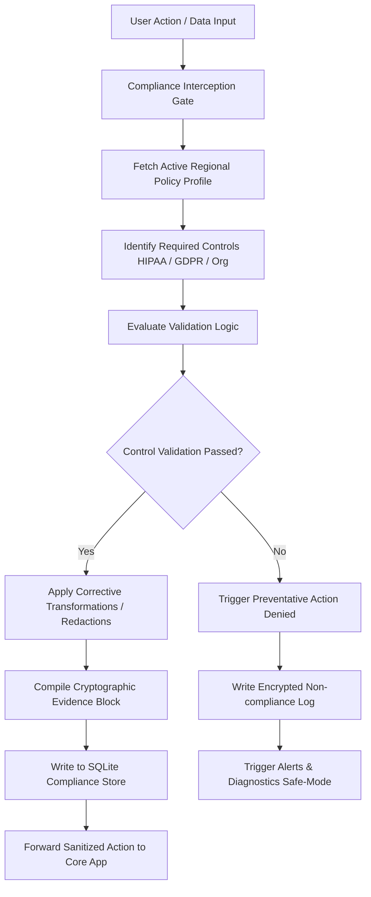
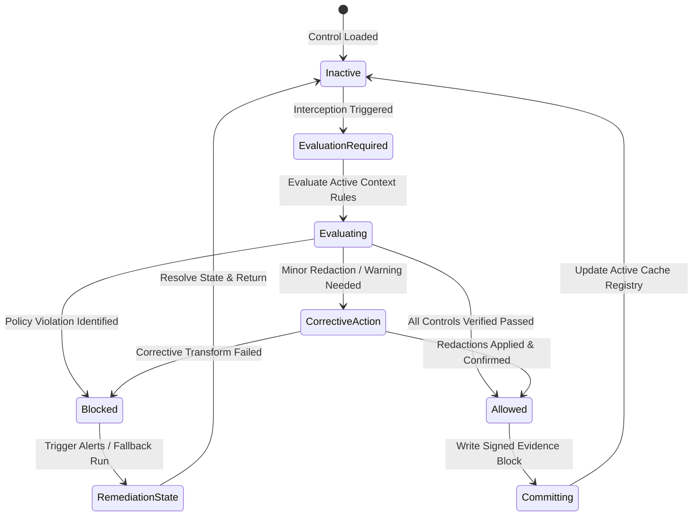
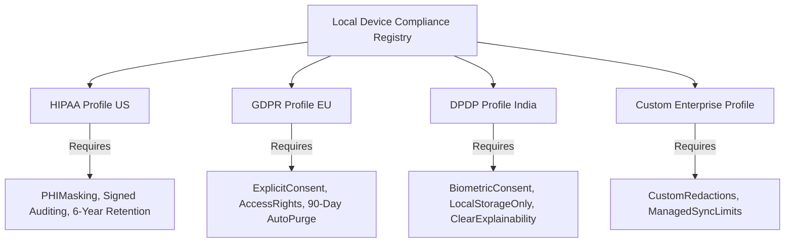

# LifeFresh AI Constitution
## AI Compliance Engine Specification v1.0

**Version:** 1.0  
**Status:** Approved / Core Reference Architecture  
**Last Updated:** July 2026  
**Classification:** Enterprise Internal  

> [!WARNING]
> **LEGAL DISCLAIMER:** This document represents an engineering architecture and software specification designed to implement technical enforcement mechanisms. It does **NOT** constitute legal advice. All applicable laws, health regulations, and privacy standards (including HIPAA, GDPR, and localized statutes) must be reviewed and approved by qualified legal and compliance professionals prior to production deployment.

---

### Purpose
The **AI Compliance Engine** is the primary governance, policy enforcement, and audit-trail authority for the LifeFresh QuickNote Pro platform. Engineered to run natively on edge devices without relying on continuous internet access, this engine translates applicable regulatory, security, regional, and organizational healthcare requirements into enforceable, programmatic system controls. By validating and monitoring data ingestion, note storage, local AI execution, and user actions on-device, the Compliance Engine prevents violations of user privacy or clinical guidelines before they occur, keeping the system continuously compliant.

---

### Scope
This specification governs the design, state evaluation logic, regional profiles, database schemas, API structures, and testing strategies of the on-device Compliance Engine. It covers data protection rules, consent boundaries, purpose limitations, explainable AI constraints, high-risk action checks, and encrypted logging pipelines. This engine is designed for cross-platform edge execution, including low-resource Android devices, mobile clinical stations, and secure enterprise environments.

---

### Objectives
* **Active Policy Enforcement:** Block non-compliant data access, unconsented storage, and unverified AI activities in **<5ms**, preventing data breaches.
* **Region-Specific Adaptability:** Provide a modular policy model where regional parameters (HIPAA, GDPR, local statutes) are loaded via configurable profiles rather than hard-coded logic.
* **Deterministic Transparency:** Provide explanation templates for all local AI outputs to support regulatory explainability demands.
* **Verifiable Evidence Trails:** Write tamper-proof compliance reports signed with device-specific cryptographic keys, preparing systems for direct corporate audits.

---

### Design Principles
* **Engineering-First Independence:** Implement compliance checks as isolated, programmatic filters that intercept application workflows, ensuring security rules cannot be bypassed.
* **Zero Universal Hardcoding:** All regulatory rules must exist as configurable parameter files. No law or regulation should be treated as universally applicable.
* **Fail-Closed Safety:** If the compliance engine fails, encounters database locks, or registers missing configurations, the system must immediately switch to a restricted, read-only mode to prevent non-compliant operations.
* **Data Minimization:** Keep collected evidence and compliance histories to the minimum required size, pruning expired entries automatically.

---

### 1. Functional Boundaries & Distinctions
To maintain strict structural isolation, the AI Compliance Engine defines clear functional boundaries:

| System Domain | Primary Action | Target Data Type | Audit Method | Reference Module |
| :--- | :--- | :--- | :--- | :--- |
| **Compliance Engine** | Translates regional regulations into programmatic checks. | Structural attributes, consent parameters. | Cryptographic evidence hashes. | `AI_Compliance_Engine.md` |
| **Security Operations** | Handles system encryption, key storage, and sandboxing. | Key buffers, network protocols. | Hardened diagnostic logs. | `AI_Security_Engine.md` |
| **Permission Engine** | Evaluates OS level and local application access controls. | Token parameters, role bindings. | Action deny events. | `AI_Permission_Engine.md` |
| **Logging Engine** | Captures debug events, operational steps, and system errors. | Standard text, variable arrays. | Encrypted rotation buffers. | `AI_Logging_Engine.md` |

---

### 2. Compliance Architecture
The Compliance Engine intercepts active operations, routing data and actions through validation gates before committing changes:



---

### 3. Core Components
* **Requirement Registry:** A local database tracking dynamic regulatory controls, region maps, and organizational settings.
* **Policy Evaluator:** Executes context checks, comparing active notes and operations against consent configurations and retention limits.
* **Evidence Collector:** Collects and hashes diagnostic telemetry and compliance events, creating signed audit-trail summaries.
* **Action Interceptor:** A framework component that intercepts application requests (such as text exports, sync runs, and model execution), blocking non-compliant steps.
* **Remediation Specialist:** Resolves minor policy warnings (such as redacting PII or removing expired local caches) before logs are saved to disk.

---

### 4. Compliance State Machine
Compliance controls on-device are managed through a formal operational lifecycle:



---

### 5. Multi-Domain Regulatory Configurations
The compliance engine uses configurable parameter sheets to enforce different regional and organizational standards:



* **HIPAA Configuration Profile:** Enforces patient identifier redaction, restricts note sharing outside corporate networks, and preserves transaction logs for audit retention.
* **GDPR Configuration Profile:** Enforces explicit user consent boundaries, supports "Right to Be Forgotten" purges, and restricts on-device caching intervals.
* **Indian DPDP Configuration Profile:** Manages local data storage, restricts cloud sync paths, and requires clear explainability reports for AI-driven summaries.
* **Organizational Rules Profile:** Custom enterprise parameters dictating working hours, device sharing guidelines, and minimum diagnostic security checks.

---

### 6. Compliance Decision & Control Matrix
The following control matrix guides active systems based on region configurations and user roles:

| Reg Profile | Action | User Role | Consent Present? | Current Environment | Outcome Action |
| :--- | :--- | :--- | :--- | :--- | :--- |
| **HIPAA** | Export Note PDF | Clinician | Yes | Secure Hospital Wifi | Allow Export, Log Audit Record |
| **HIPAA** | Export Note PDF | Clinician | No | Secure Hospital Wifi | Block Export, Prompt Consent |
| **GDPR** | Process Local AI | Patient | Yes | Home / Disconnected | Run Model, Save Evidence |
| **GDPR** | Process Local AI | Patient | No | Home / Disconnected | Block Model, Request Consent |
| **DPDP** | Sync Note Data | Clinician | Yes | Public Wifi | Block Sync, Store to Offline Cache |

---

### 7. Evaluation & Enforcement Algorithms

#### 7.1 Compliance Evaluation Pipeline
Resolves target controls, validates requirements, and generates signed evidence logs:

```kotlin
class ComplianceEvaluator(
    private val cryptoSigner: DeviceSigner,
    private val consentRegistry: ConsentRegistry
) {
    fun evaluateAction(
        actionContext: ActionContext,
        activeProfile: ComplianceProfile
    ): EvaluationResult {
        // 1. Verify User Consent Prerequisites
        val consentGranted = consentRegistry.checkConsent(
            userId = actionContext.userId,
            purpose = actionContext.purpose
        )
        if (!consentGranted && activeProfile.requiresExplicitConsent) {
            return EvaluationResult.Denied("Required consent not found for purpose: ${actionContext.purpose}")
        }

        // 2. Evaluate Privacy Controls (PII/PHI)
        var sanitizedData = actionContext.rawData
        if (activeProfile.enablePiiMasking) {
            sanitizedData = maskIdentifiers(sanitizedData)
        }

        // 3. Compile Signed Compliance Evidence Block
        val evidenceHash = calculateEvidenceHash(actionContext, sanitizedData)
        val signature = cryptoSigner.signPayload(evidenceHash)

        return EvaluationResult.Approved(
            sanitizedData = sanitizedData,
            evidenceRecord = EvidenceRecord(
                actionId = actionContext.actionId,
                timestampUtc = System.currentTimeMillis(),
                userIdHash = hashString(actionContext.userId),
                actionType = actionContext.actionType,
                evidenceHash = evidenceHash,
                signature = signature
            )
        )
    }

    private fun maskIdentifiers(data: String): String {
        return data.replace(Regex("[a-zA-Z0-9._%+-]+@[a-zA-Z0-9.-]+\\.[a-zA-Z]{2,6}"), "[MASKED_EMAIL]")
    }

    private fun calculateEvidenceHash(context: ActionContext, data: String): String {
        val input = "${context.actionId}:${context.userId}:${context.actionType}:${data.hashCode()}"
        return hashString(input)
    }

    private fun hashString(input: String): String {
        val bytes = java.security.MessageDigest.getInstance("SHA-256").digest(input.toByteArray())
        return bytes.joinToString("") { "%02x".format(it) }
    }
}

data class ActionContext(
    val actionId: String,
    val userId: String,
    val actionType: String, // EXPORT, LOCAL_AI_RUN, SYNC
    val purpose: String, // CLINICAL_ASSESSMENT, RESEARCH, AUDIT
    val rawData: String
)

data class ComplianceProfile(
    val profileId: String,
    val requiresExplicitConsent: Boolean,
    val enablePiiMasking: Boolean
)

sealed class EvaluationResult {
    data class Approved(val sanitizedData: String, val evidenceRecord: EvidenceRecord) : EvaluationResult()
    data class Denied(val reason: String) : EvaluationResult()
}

data class EvidenceRecord(
    val actionId: String,
    val timestampUtc: Long,
    val userIdHash: String,
    val actionType: String,
    val evidenceHash: String,
    val signature: String
)

interface DeviceSigner {
    fun signPayload(payload: String): String
}
```

---

### 8. API Contracts & Structures

#### 8.1 Kotlin API Definition
```kotlin
interface ComplianceEngineService {
    suspend fun getActiveComplianceProfile(): ComplianceProfileRecord
    suspend fun evaluateOperation(operation: ComplianceOperation): ComplianceResult
    suspend fun registerUserConsent(consent: ConsentDefinition): Boolean
    suspend fun revokeUserConsent(userId: String, purpose: String): Boolean
    suspend fun exportComplianceEvidence(): List<EvidenceLogRecord>
}

data class ComplianceProfileRecord(
    val regionCode: String, // US, EU, IN, GLOBAL
    val profileVersion: String,
    val lastUpdatedUtc: Long,
    val activeControlsCount: Int
)

data class ComplianceOperation(
    val opId: String,
    val actorId: String,
    val actorRole: String,
    val payloadType: String,
    val payloadString: String
)

data class ComplianceResult(
    val isPermitted: Boolean,
    val responseMessage: String,
    val sanitizedPayload: String?,
    val evidenceSignature: String?
)
```

#### 8.2 SQLite Compliance Schema
```sql
CREATE TABLE compliance_requirements (
    control_id TEXT PRIMARY KEY NOT NULL,
    region_code TEXT NOT NULL,
    control_name TEXT NOT NULL,
    control_type TEXT NOT NULL, -- PREVENTATIVE, DETECTIVE, CORRECTIVE
    validation_regex TEXT,
    is_active INTEGER NOT NULL,
    last_modified_utc INTEGER NOT NULL
);

CREATE TABLE compliance_consents (
    consent_id TEXT PRIMARY KEY NOT NULL,
    user_id_hash TEXT NOT NULL,
    purpose TEXT NOT NULL, -- CLINICAL_NOTES, SYNC_BACKUP, AI_INFERENCE
    is_granted INTEGER NOT NULL,
    granted_utc INTEGER NOT NULL,
    revoked_utc INTEGER,
    consent_signature TEXT NOT NULL
);

CREATE TABLE compliance_evidence_logs (
    evidence_id TEXT PRIMARY KEY NOT NULL,
    timestamp_utc INTEGER NOT NULL,
    user_id_hash TEXT NOT NULL,
    action_type TEXT NOT NULL,
    control_id TEXT NOT NULL,
    payload_hash TEXT NOT NULL,
    signature TEXT NOT NULL,
    FOREIGN KEY (control_id) REFERENCES compliance_requirements(control_id)
);
```

#### 8.3 YAML Configuration Template
```yaml
compliance_profile:
  region: "EU"
  version: "1.0.4"
  legal_framework: "GDPR"
  enforced_rules:
    - id: "ctrl_explicit_consent_ai"
      name: "Explicit Consent for AI Processing"
      type: "PREVENTATIVE"
      is_mandatory: true
      prerequisites:
        consent_purpose: "AI_INFERENCE"
    - id: "ctrl_pii_redaction"
      name: "Auto-PII Redaction on Export"
      type: "CORRECTIVE"
      is_mandatory: true
      parameters:
        mask_pattern_email: "[REDACTED_EMAIL]"
        mask_pattern_phone: "[REDACTED_PHONE]"
    - id: "ctrl_retention_purge"
      name: "Note Retention Limitation"
      type: "DETECTIVE"
      is_mandatory: false
      parameters:
        maximum_retention_days: 90
```

#### 8.4 JSON Control Verification Example
```json
{
  "eventId": "evt_comp_verify_00918a",
  "timestampUtc": 1783648110000,
  "controlId": "ctrl_explicit_consent_ai",
  "actorIdHash": "f3b0c44298fc1c149afbf4c8996fb92427ae41e4649b934ca495991b7852b855",
  "evaluatedAction": "LOCAL_MODEL_INFERENCE",
  "status": "APPROVED",
  "validationEvidence": {
    "consentVerified": true,
    "consentTimestamp": 1783000000000,
    "sanitizationApplied": false
  },
  "cryptographicSignature": "sig_rsa_device_verification_hash"
}
```

---

### 9. Technical Specifications

#### 9.1 Offline Policy Enforcement
* **Local Policy Store:** Compliance profiles, requirements, and consent tables are kept on-device. The engine evaluates compliance locally, ensuring security checks are maintained in disconnected areas.
* **Disconnected Consent Check:** Evaluates active consent records cached in the SQLite database, blocking actions if consent records are expired or missing.

#### 9.2 Evidence Cryptographic Verification
To support non-repudiation during compliance reviews, evidence blocks are signed using hardware-backed keys:

$$ \text{EvidenceSignature} = \text{Sign}_{\text{Key}}(\text{Timestamp} \parallel \text{UserHash} \parallel \text{ActionType} \parallel \text{PayloadHash}) $$

This prevents manual database edits or record deletion, validating system compliance history for auditors.

---

### 10. Security and Privacy
* **Zero PHI Storage:** Evidence logs record only hashes of the operations, keeping patient data (PHI) out of audit databases.
* **Biometric Authentication Integration:** Accessing consent revocation settings or exporting evidence logs requires local biometric confirmation.
* **Isolated Sanitize Boundaries:** Sanitization and PII/PHI redaction run on isolated background threads, avoiding side-channel leaks.

---

### 11. Performance Optimization
* **Compiled Match Arrays:** The engine compiles regular expression patterns into memory arrays on startup, optimizing evaluation speeds.
* **Evidence Batch Ingestion:** Evidence logs are held in memory buffers before being committed to the database in batches, minimizing write overhead.
* **Low-Resource Throttling:** Compliance evaluations use minimal CPU and memory overhead, allowing checks to run on low-power devices without impacting the user interface.

---

### 12. Testing Strategy
* **Consent Revocation Verification:** Confirms that revoking consent instantly blocks local model loading and sync actions.
* **Verification Match Tests:** Passes dummy notes containing varied formatting styles, confirming that sanitization filters find and mask PII.
* **Tampered Log Identification:** Edits database records manually to verify that the validation Specialist detects and logs the tamper attempt.

---

### 13. Enterprise Governance
* **Waiver Management:** Allows enterprise administrators to deploy signed waiver profiles, adjusting specific non-critical rules for designated device segments.
* **Audit Exports:** Provides secure compliance history exports, allowing administrators to verify device adherence to security policies.

---

### 14. Best Practices & Anti-patterns

#### Best Practices
* **Evaluate Compliance Locally:** Keep policy checks on-device to maintain continuous compliance in disconnected zones.
* **Use Modifiers for Interception:** Intercept application actions using decorator and modifier patterns, separating security logic from feature code.
* **Encrypt Diagnostic Records:** Store compliance registries and consent records in encrypted SQLite databases.

#### Anti-patterns
* **Hardcoding Specific Statutes:** Writing rule definitions (like US-specific HIPAA requirements) directly in code, making global updates difficult.
* **Logging Plaintext Patient Data:** Writing raw notes or patient names into compliance evidence logs.
* **Evaluating Policies on Main Threads:** Running complex string matches or SQLite queries on the main thread, causing interface sluggishness.

---

### Future Enhancements
* **Dynamic Biomarker Diagnostics:** Automatically calibrate diagnostic rules and alert priorities based on active user fatigue trends.
* **Decentralized Local Diagnostics Mesh:** Cross-verify diagnostic reports securely on offline networks, helping administrators locate and isolate failed hardware nodes.

---

### Related AI Constitution Documents
* `AI_Feature_Flag_Engine.md`
* `AI_Health_Monitor.md`
* `AI_Logging_Engine.md`

---

### References
1. Local Governance and Pragmatic Compliance Enforcement on Edge Medical Terminals: Best Practices
2. NIST SP 800-162: Zero Trust Compliance Verification and Data Sanitization Guidelines
3. Android NNAPI: Cryptographic Auditing and Local Consent Policy Architecture

---

### Conclusion
The AI Compliance Engine provides a secure, predictable, and local framework designed to translate healthcare and corporate regulations into programmatic system controls. By combining modular compliance profiles, deterministic evaluation logic, and hardware-signed evidence logs, the Engine ensures the host platform remains safe, stable, and compliant under all operating conditions.
