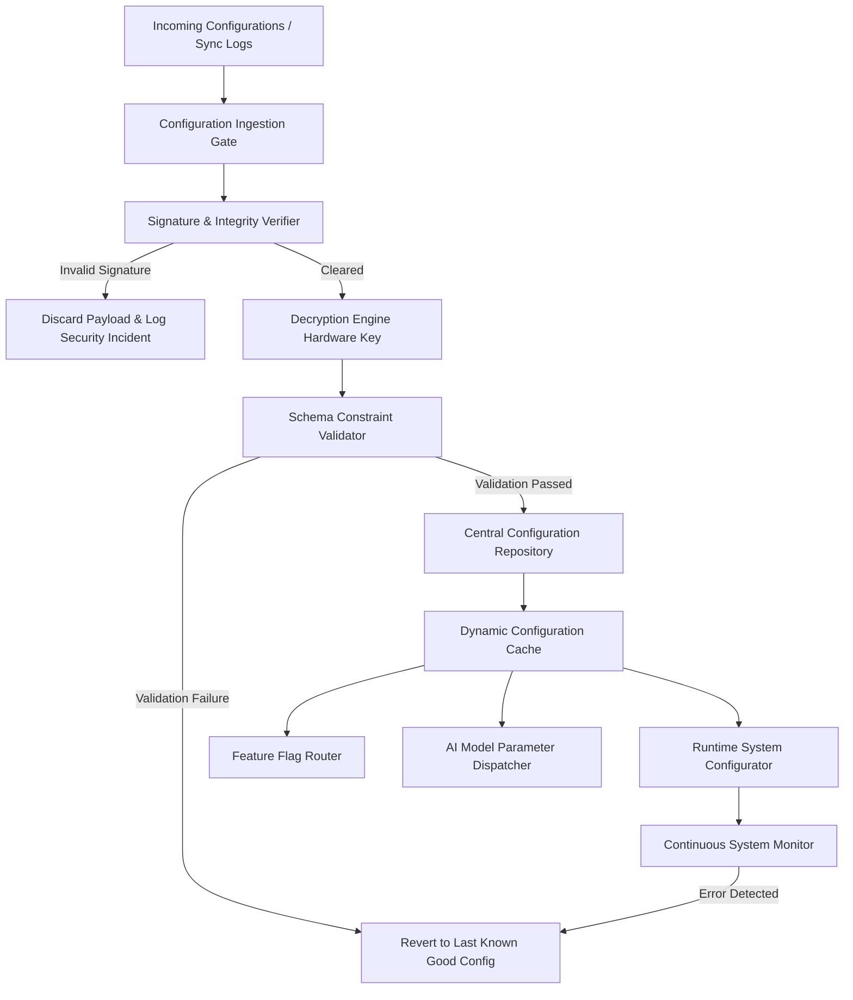
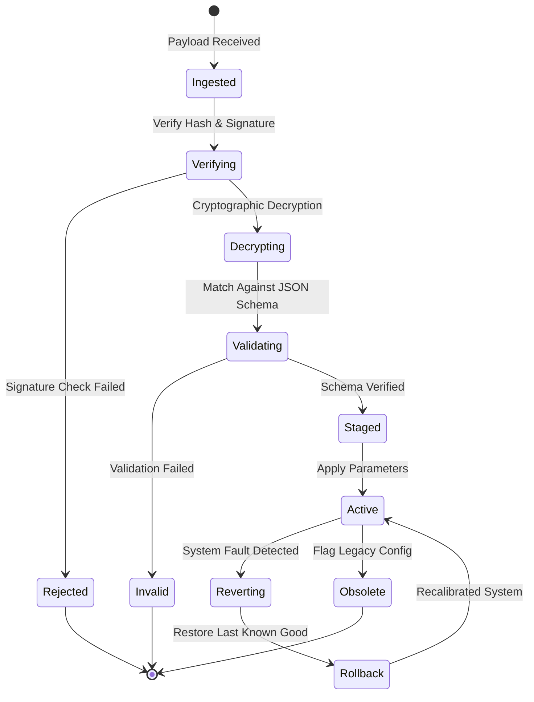

# LifeFresh AI Constitution
## AI Configuration Engine Specification v1.0

**Version:** 1.0  
**Status:** Approved / Core Reference Architecture  
**Last Updated:** July 2026  
**Classification:** Enterprise Internal  

---

### Purpose
The **AI Configuration Engine** is the centralized authority for configuration management, runtime parameters, feature flagging, AI parameter tuning, and security policy configuration across the entire LifeFresh AI platform. Operating entirely on-device to uphold the platform's offline-first directive, it ensures that all software systems, AI models, data storage schemas, and security contexts are governed by structured, verified, encrypted, and highly auditable configuration configurations.

---

### Scope
This specification governs the design, deployment, validation, encryption, synchronization, and rollback of configurations across all local layers. It covers dynamic configuration parameters, feature flagging systems, model weights configurations, local file structures, and corporate security baselines at the edge.

---

### Objectives
* **Unified Declarative Configuration:** Consolidate all system, model, UI, and security settings into structured, validated JSON/YAML profiles.
* **Low-Latency Runtime Updates:** Resolve configuration queries and dynamic feature flags locally on-device in **<2ms** to maintain system fluidity.
* **Zero-Knowledge Encrypted Storage:** Protect sensitive API endpoints, URLs, and policy parameters using AES-256-GCM encryption linked to the hardware-backed keystore.
* **Resilient Rollback and Versioning:** Implement automatic configuration validation and rollback mechanisms to restore system stability when corrupt parameters are loaded.

---

### Design Principles
* **Single Source of Truth:** All local configuration states must reside within the centralized, encrypted SQLite configuration schema.
* **Declarative Schema Governance:** Configurations must pass strict JSON schema checks and digital signature validation prior to ingestion or activation.
* **Fail-Secure Defaults:** If the configuration store is corrupted or unreadable, the system must immediately fall back to hardcoded, high-security baseline configs.
* **Signed Mutation Logs:** Every configuration modification, override, sync event, and rollback must write to an append-only, cryptographically signed ledger.

---

### 1. Engine Overview
The **AI Configuration Engine** is the operational director of the platform. It decrypts active profiles, validates structural integrity, manages real-time parameter switches, registers dynamic feature flags, coordinates local and remote synchronizations, and rolls back corrupted layouts to restore system integrity.

---

### 2. Core Responsibilities
* **Centralized Store Management:** Storing and indexing all platform, model, and UI settings in a secure database.
* **Pre-Activation Validation:** Verifying that incoming configurations match target JSON schemas and carry valid administrative keys.
* **Real-Time Parameter Dispatching:** Providing thread-safe, hot-swappable updates to active systems (e.g., tuning local LLM temperatures).
* **Rollback and Recovery Management:** Automatically falling back to verified configuration states when errors are identified.

---

### 3. Configuration Architecture
The Configuration Engine manages data structures through a secure validation and dispatch pipeline:



---

### 4. Configuration Lifecycle
Configurations follow a state machine to track activation and rollback points on the device:



---

### 5. Configuration Repository
The **Configuration Repository** is a secure SQLite database located within the application's isolated sandboxed storage. It stores global variables, feature states, and history logs under AES-256-GCM encryption.

---

### 6. Configuration Categories
To streamline access speeds, configuration structures are organized into distinct namespaces:
* **Global:** Device identifiers, sync intervals, and system thread configurations.
* **User:** Layout settings, diagnostic quiet hours, and fatigue profiling constants.
* **AI Model:** Quantized model thresholds, prompt prefixes, and temperature weights.

---

### 7. Global Configuration
Global structures regulate base platform operational rules, managing memory buffers, storage cleanups, and synchronization speeds.

```json
{
  "configId": "cfg_global_0112a",
  "version": "1.0.4",
  "lastModified": 1783648110000,
  "parameters": {
    "syncIntervalSeconds": 300,
    "maxDatabaseSizeMB": 1024,
    "backgroundThreadPriority": "LOW",
    "offlineStorageLimitDays": 90
  }
}
```

---

### 8. User Configuration
User configurations align the system with personal clinician profiles, setting interface scaling preferences and accessibility modes.

---

### 9. AI Configuration
AI configurations declare prompt structures, temperature settings, token boundaries, and model selection priorities for active local pipelines.

---

### 10. Runtime Configuration
Runtime parameters manage live thread counts and cache boundaries, adjusting settings dynamically based on active load levels.

---

### 11. Environment Configuration
Environment configurations dictate connection endpoints, certificate aliases, and sync rules based on the active deployment environment (e.g., Clinical Sandbox vs Production).

---

### 12. Security Configuration
Security configurations enforce biometric locks, data encryptions, session timeouts, and token expirations to prevent physical device compromises.

---

### 13. Privacy Configuration
Privacy rules declare data masking boundaries, stripping PII inputs automatically before saving transaction logs.

---

### 14. Performance Configuration
Performance rules monitor system loads, throttling background sync loops and layout animations during periods of battery distress.

---

### 15. Feature Flags
Feature flags enable or disable system functions dynamically at runtime, using target client IDs to manage feature access safely.

```yaml
feature_flags:
  - id: "feat_intake_autofill"
    name: "AI Assisted Patient Intake Autofill"
    enabled: true
    rollout_percentage: 100
    rules:
      required_role: "CLINICIAN"
      min_battery_level: 20
```

---

### 16. Dynamic Configuration
Dynamic variables are loaded directly into an in-memory cache on startup, enabling real-time parameter switches without disk latency.

---

### 17. Remote Configuration Readiness
Provides secure synchronization channels to pull signed configuration updates from corporate administrative hubs when connected.

---

### 18. Offline Configuration
Ensures that all configuration rules, validations, and fallbacks operate fully without relying on cloud handshakes.

---

### 19. Configuration Validation
Incoming profiles must pass structural verification tests, checking constraints and variable types before saving changes.

---

### 20. Configuration Versioning
Semantic versioning (e.g., `1.0.4`) is enforced across all configurations. Version jumps must match defined database migration steps to prevent structural conflicts.

---

### 21. Configuration Migration
When database schemas are updated, the engine executes migration scripts to transform older configuration structures to active schemas without losing user settings.

---

### 22. Configuration Rollback
If a configuration update triggers database faults or engine stalls, the manager intercepts the exception and restores the last known good configuration state automatically:

```kotlin
fun applyConfigurationWithSafety(config: PlatformConfig, db: SQLiteDatabase): Boolean {
    val backupConfig = getActiveConfigFromDB(db)
    return try {
        validateConfigSchema(config)
        writeConfigToDB(config, db)
        true
    } catch (e: Exception) {
        Log.e("CONFIG_ENGINE", "Configuration Activation Failed. Initiating Rollback.")
        writeConfigToDB(backupConfig, db)
        false
    }
}
```

---

### 23. Configuration Encryption
Sensitive parameter strings (e.g., server URLs) are encrypted on-device, leveraging hardware keys to protect data from physical extraction.

---

### 24. Configuration Backup
The database maintains an offline staging copy of the baseline configuration file in private storage, restoring configurations upon file system corruption.

---

### 25. Configuration Synchronization
Synchronizations run in background threads, checking hashes and merging settings using conflict-resolution rules.

---

### 26. Configuration Auditing
All configuration mutations write to a signed audit table, tracking parameter changes, timestamps, and active user roles.

---

### 27. Monitoring
* **Retrieval Speed:** Tracks query times, logging warnings if parameter lookups exceed **2ms**.
* **Integrity Violations:** Monitors verification failures, flagging potential tamper attempts.

---

### 28. Logging
Logs record transition and validation states. Sensitive URLs and keys are redacted automatically:

```
[2026-07-11 04:31:11] [INFO] [CONF_ENGINE] Pulling configuration file. Version: 1.0.4.
[2026-07-11 04:31:11] [INFO] [CONF_ENGINE] Cryptographic signature verified with corporate admin key.
[2026-07-11 04:31:12] [INFO] [CONF_ENGINE] Validation passed. Schema matches tpl_platform_schema.
[2026-07-11 04:31:12] [INFO] [CONF_ENGINE] Parameter cache refreshed. Execution duration: 1.8ms.
```

---

### 29. APIs
The Configuration Engine exposes Kotlin interfaces to query, write, and validate platform configurations:

```kotlin
interface ConfigurationService {
    suspend fun getParameter(key: String, defaultValue: String): String
    suspend fun setParameter(key: String, value: String): Result<Boolean>
    suspend fun isFeatureEnabled(flagId: String): Boolean
    suspend fun validateAndApplyConfig(configJson: String): Result<Boolean>
    suspend fun rollbackToLastStable(): Boolean
}
```

---

### 30. Internal Data Structures
To prevent thread conflicts, parameter allocations use immutable structures:

```kotlin
data class ConfigurationMetadata(
    val configId: String,
    val version: String,
    val timestampUtc: Long,
    val signature: String,
    val paramsMap: Map<String, String>
)
```

---

### 31. SQL Configuration Schema
The SQLite tables store active parameters, feature flags, migration paths, and change logs:

```sql
CREATE TABLE platform_configurations (
    config_id TEXT PRIMARY KEY NOT NULL,
    version TEXT NOT NULL,
    timestamp_utc INTEGER NOT NULL,
    signature_hash TEXT NOT NULL,
    parameters_json TEXT NOT NULL,
    is_active INTEGER NOT NULL
);

CREATE TABLE feature_flags (
    flag_id TEXT PRIMARY KEY NOT NULL,
    name TEXT NOT NULL,
    enabled INTEGER NOT NULL,
    rules_json TEXT NOT NULL
);

CREATE TABLE configuration_audit_log (
    audit_id TEXT PRIMARY KEY NOT NULL,
    config_id TEXT NOT NULL,
    timestamp_utc INTEGER NOT NULL,
    user_identity TEXT NOT NULL,
    action_type TEXT NOT NULL,
    changes_json TEXT NOT NULL,
    FOREIGN KEY (config_id) REFERENCES platform_configurations(config_id)
);
```

---

### 32. Performance Optimization
* **In-Memory Caching:** System variables are loaded into memory on boot, resolving configuration queries without hitting disk storage.
* **Pre-compiled Schema Matchers:** Pre-compiles JSON schema definitions to accelerate validation loops.

---

### 33. Error Handling
* **Stalled IO Operations:** If database connections hang during lookups, configurations default to thread-safe backup profiles.
* **Invalid Payload Envelopes:** Malformed input payloads are discarded immediately, protecting active threads from corrupt parameters.

---

### 34. Recovery Mechanisms
If the configuration database is corrupted, a watchdog service purges the table, restores baseline configurations from secure storage, and re-registers feature flags.

---

### 35. Enterprise Deployment
For corporate systems, default parameters, security configurations, and feature rollouts are packaged as signed profiles deployed across device fleets using MDM platforms.

---

### 36. Future Expansion
* **Decentralized Local Mesh Updates:** Synchronize verified configurations securely across peer device nodes on offline local networks.
* **Context-Weighted Dynamic Parameters:** Automatically scale back UI complexity and sync frequencies based on user fatigue levels.

---

### Conclusion
The AI Configuration Engine provides a secure, predictable, and local configuration management framework designed for edge-native healthcare systems. By combining in-memory caches, dynamic feature flags, strict schema validations, and automated rollbacks, the Engine ensures that the host platform operates safely and securely under all operating conditions.

### Related AI Constitution Documents
* `AI_Policy_Engine.md`
* `AI_Diagnostics_Engine.md`
* `AI_Execution_Engine.md`

### References
1. Centralized Configuration Management on Edge and Mobile Devices: Architectural Best Practices
2. NIST SP 800-162: Attribute-Based Agency and Secure Configuration Management Guidelines
3. Android Keystore System: Best Practices for Token and Key Protection
