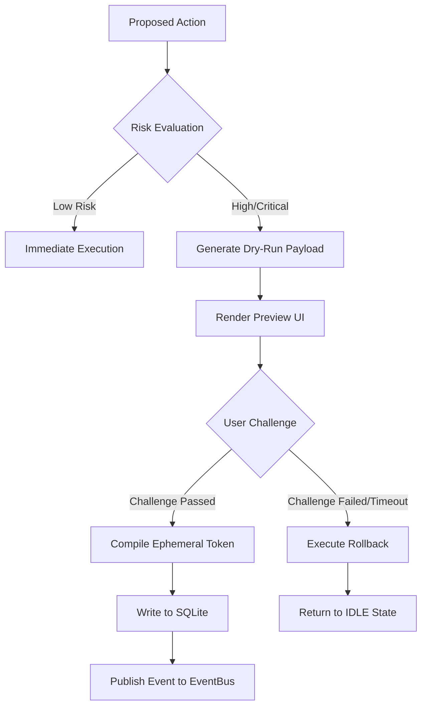

# LifeFresh QuickNote Pro
## AI Confirmation Engine Architecture Specification v1.0

**Version:** 1.0  
**Status:** Approved / Core Reference Architecture  
**Last Updated:** July 2026  
**Classification:** Enterprise Internal  

---

## 1. Engine Overview

The **LifeFresh AI Confirmation Engine** is the primary safety coordinator and transactional validation layer of the LifeFresh Pro AI platform. While immediate mutations are parsed by the `AI_Command_Engine_v1.0.md` and asynchronous operations are managed by the `AI_Task_Engine_v1.0.md`, the Confirmation Engine acts as the definitive gatekeeper. It is designed to prevent accidental, destructive, expensive, or irreversible AI actions from mutating local SQLite databases, changing CRM lead states, or dispatching customer notifications without verified user consent.

In a clinical CRM environment where data loss or incorrect medication tracking can have severe operational and safety impacts, the Confirmation Engine operates on a zero-accident paradigm. It enforces strict physical, cognitive, and cryptographic confirmations proportional to the determined risk level of the request.

---

## 2. Objectives

The primary engineering objectives of the Confirmation Engine include:
1. **Safety Assurance:** Mitigating accidental executions of high-risk commands parsed from spoken dialogue, text notes, or automatic system events.
2. **Deterministic Risk Evaluation:** Dynamically classifying operations into risk tiers to enforce appropriate verification gates without degrading user experience for harmless tasks.
3. **Intent Verification:** Disentangling true transactional intent from conversational or brainstorming expressions.
4. **Auditability:** Producing immutable, cryptographically bound verification tokens for every validated transaction to support regulatory compliance.
5. **Fail-Secure Defaults:** Resolving system interruptions, power failures, or session drops by reverting unconfirmed operations to their original states.

---

## 3. Architecture

The Confirmation Engine operates as a high-performance validation pipeline that intercept-evaluates all proposed state changes before writing to local database tables or executing external API calls:

```
    [Proposed Action] ──► [Risk Evaluator] ──┬── Low Risk ──► [Direct Execute]
                                             │
                                             └── Med/High ──► [Confirmation Orchestrator]
                                                                     │
                                                                     ▼
                                                             [Verification Gate]
                                                                     │
                                                                     ▼
                                                             [Signature Check]
                                                                     │
                                                                     ▼
                                                             [Event Dispatch]
```

### 3.1 Architectural Components
* **Risk Evaluator:** Determines the potential damage of a proposed mutation by inspecting parameters, affected tables, financial thresholds, and clinical markers.
* **Confirmation Orchestrator:** Manages the active state of confirmation sessions, issuing challenges (UI prompts, biometrics, PIN cards) and tracking timeouts.
* **Intent Correlator:** Leverages the `AI_Language_Engine_v1.0.md` to analyze user confidence levels and detect linguistic ambiguity.
* **Verification Cryptographer:** Generates ephemeral, secure confirmation tokens bound to the active user session and hardware keystore.

---

## 4. Confirmation Workflow

Every confirmation interaction traverses a strict multi-stage pipeline:



---

## 5. Risk Classification

The engine evaluates actions into four distinct risk tiers, each dictating a specific level of verification rigor:

| Risk Tier | Financial Limits | Clinical Scope | Target Action Examples | Required Gates |
| :--- | :--- | :--- | :--- | :--- |
| **LOW** | $0.00 | Non-clinical task notes | Adding custom task labels, creating standard text categories. | No gate. Instant dispatch. |
| **MEDIUM** | Under $50.00 | Non-urgent check-ins | Updating a CRM lead's email, rescheduling a follow-up call. | Single button confirm. |
| **HIGH** | Under $1,000.00 | Standard clinical schedules | Modifying an active medical schedule, moving pipeline stages. | Double confirm or PIN check. |
| **CRITICAL** | Over $1,000.00 | Vital clinical records | Deleting patient histories, wiping databases, bulk SMS delivery. | Biometric or typed verification. |

---

## 6. Confirmation Types

To balance security with usability, the engine provides seven distinct challenge modalities:

### 6.1 Single Confirmation
A standard Material 3 button-click challenge. Used primarily for low-to-medium risk operations, such as adding follow-ups or saving notes.

### 6.2 Double Confirmation
Requires a secondary modal confirmation window, forcing the user to re-read the target payload before clicking "Submit" or "Accept".

### 6.3 Multi-step Confirmation
Used during complex workflow progressions (such as mass imports). It presents a sequenced wizard checking schema alignment, record count, and data mappings prior to final confirmation.

### 6.4 Typed Confirmation
The user must type a specific confirmation phrase (e.g., `"DELETE CLIENT RECORDS"`) into a text field. This completely eliminates accidental click triggers for destructive operations.

### 6.5 Voice Confirmation
Utilizes vocal authentication matching parameters in the active user profile, capturing a "Yes, proceed" audio envelope and validating it against local speaker characteristics.

### 6.6 Biometric Confirmation
Integrates Android's `BiometricPrompt` API. It forces fingerprint or facial verification prior to modifying critical clinical parameters or accessing patient history datasets.

### 6.7 PIN Confirmation
Forces the user to enter their local 4-to-6 digit system PIN card, verifying inputs against secure keystore vectors to ensure active physical possession of the device.

---

## 7. Context-Aware Confirmation

Confirmation thresholds do not remain static. They scale dynamically based on the active state of the user and device:
* **Thermal Throttling / Low Battery:** Under 5% battery, high-energy validations (like voice confirmations) fall back to PIN challenges automatically.
* **Distraction Mode Detection:** High motion triggers or rapid double-tap sequences elevate normal Single Confirmations to Double Confirmations to counteract accidental pocket actions.
* **Clinical Urgency overrides:** If a clinical note indicates an emergency triage situation, critical confirmation gates revert to physical single buttons to protect patient life.

---

## 8. User Intent Verification & Ambiguity Detection

Linguistic statements processed by the `AI_Language_Engine_v1.0.md` can contain ambiguity (e.g., "Maybe delete this record later"). The Intent Correlator parses phrases against three core dimensions:

```
  Linguistic Phrase ──► [Confidence Score Classifier] ──┬── Score >= 0.85 ──► Proceed to Gate
                                                        │
                                                        └── Score < 0.85  ──► Clarification Card
```

If the confidence score falls below **0.85**, the transaction transitions immediately to the `CLARIFYING` state, rendering a selective options card to let the user specify their precise intent.

---

## 9. Safety Gates & Undo-before-Confirm Strategy

To provide a smooth interface experience for medium-to-high risk operations, the engine implements a temporary **Undo Window** before executing mutations permanently:

```
  Action Request ──► [Commit Pending Status] ──► [Render UI Countdown] ──┬── Undo Clicked ──► [Rollback]
                                                                         │
                                                                         └── Timer Expiry ──► [Write to DB]
```

The system presents a Material 3 snackbar containing a 5-second countdown timer. If the user selects "Undo", the state is rolled back dynamically before any physical write operation hits the disk.

---

## 10. Dry-Run Confirmation & Preview Generation

Before confirming critical changes, the platform executes an in-memory **Dry-Run**. It evaluates the proposed operation against active databases to predict exact results, compiling a visual preview for the user:

```json
{
  "dryRunId": "df701b2a-18b0-4e2a-bb39-b94f1c50e412",
  "status": "VALID",
  "proposedMutation": "DELETE_CLIENT_PROFILE",
  "entitiesAffectedCount": 14,
  "relationshipsSevered": [
    "appointments_count: 5",
    "reminders_count: 9"
  ],
  "requiresExplanation": true
}
```

This JSON payload is translated into a highly visible warning panel in the user interface, explicitly illustrating the structural consequences of their actions before they proceed.

---

## 11. Enterprise Approval Chains & Multi-User Confirmation

In enterprise team environments, certain administrative or clinical mutations require multi-user consensus:
1. **Clinical Peer Review:** Changes to high-potency medical tracking schedules require a secondary biometric check-in from an authorized supervising clinician on the same device.
2. **Dual-Key Admin Gate:** Bulk deletions of CRM databases require validation tokens generated by two distinct administrator accounts, verified through secure local session bindings.

---

## 12. Time-Sensitive Confirmation & Expiration Rules

Confirmation challenges are strictly time-bound to prevent security hijacking:
* **Standard Confirmations (P3):** Expire after exactly **120 seconds** of inactivity, automatically reverting the transaction and releasing locks.
* **Biometric & PIN Challenges (P1/P2):** Expire after **30 seconds**. If the user does not authenticate within this window, the UI closes, and the session is locked.

---

## 13. Cryptographic Tokens, Session Binding & Replay Protection

Every successful confirmation generates an immutable `ConfirmationToken` that must accompany the mutation request to the database layer:

```yaml
confirmation_token:
  token_id: "c79f9390-349f-4318-971c-3b9845cbbf62"
  session_id: "b212f00a-8bf8-467f-9cb0-ef78891230ab"
  payload_hash: "8f7e2d1c9a6b4c2e0f8d6b4a2e0c8d6b4a2e0c8d"
  timestamp_utc: 1783584311000
  gate_used: "BIOMETRIC"
  cryptographic_signature: "MEQCID6NfL3f4jK9L..."
```

* **Session Binding:** The token is bound strictly to the active user's session identifier.
* **Replay Protection:** Every token contains a cryptographic hash of the exact payload, preventing malicious entities from intercepting and replaying the confirmation for separate modifications.

---

## 14. Emergency Override Protocols

Under strict clinical emergency conditions, users can activate an emergency bypass:
1. The user holds the "Override" action card for exactly 3 seconds.
2. The engine registers the bypass, allows the transaction, and writes an emergency audit trail log.
3. The event triggers a high-severity silent broadcast on the `EventBus` to notify administrative supervisors.

---

## 15. Confirmation API Contracts

The engine exposes type-safe Kotlin API interfaces for managing confirmation processes:

```kotlin
interface ConfirmationService {
    suspend fun evaluateAction(action: ProposedAction): ConfirmationRequest
    suspend fun requestConfirmation(request: ConfirmationRequest): ConfirmationResult
    suspend fun validateToken(token: ConfirmationToken): Boolean
    suspend fun cancelConfirmation(requestId: String): Boolean
}
```

---

## 16. State Machine Integration

The Confirmation Engine operates as a strictly governed state machine:

```
  [IDLE] ──► Action ──► [EVALUATING] ──► [CHALLENGING] ──┬── Success ──► [CONFIRMED] ──► [IDLE]
                                                         │
                                                         └── Fail/Timeout ──► [REJECTED] ──► [IDLE]
```

Every state transition is published as a structured JSON envelope on the platform’s EventBus.

---

## 17. Comprehensive Confirmation Rules

This section compiles the 100 unyielding, numbered architectural rules governing the Confirmation Engine:

```
 RULE_CFM_001: Every proposed action must be evaluated for risk prior to database execution.
 RULE_CFM_002: Risk classifications must resolve into LOW, MEDIUM, HIGH, or CRITICAL tiers systematically.
 RULE_CFM_003: No confirmation validation or cryptographic hashing may execute on the main UI thread.
 RULE_CFM_004: Critical actions must require physical biometric or typed text confirmation challenges.
 RULE_CFM_005: Typed confirmations must match the target warning phrase exactly, ignoring leading whitespace.
 RULE_CFM_006: PIN confirmation attempts must lock after 3 failed inputs, freezing the target session.
 RULE_CFM_007: Biometric confirmations must utilize Android's system-level BiometricPrompt API.
 RULE_CFM_008: Low-risk actions must bypass visual confirmation cards, executing instantly.
 RULE_CFM_009: Every successful confirmation must generate a cryptographically signed ConfirmationToken.
 RULE_CFM_010: ConfirmationTokens must be bound strictly to the active user's session ID.
 RULE_CFM_011: Payloads inside ConfirmationTokens must undergo SHA-256 hashing to prevent replay attacks.
 RULE_CFM_012: The system Keystore must be utilized to sign confirmation signatures using hardware-backed keys.
 RULE_CFM_013: Ephemeral confirmation requests must expire after exactly 120 seconds of inactivity.
 RULE_CFM_014: Critical biometric challenges must enforce a strict 30-second execution timeout.
 RULE_CFM_015: Unconfirmed or timed-out transactions must execute rollbacks, leaving tables unchanged.
 RULE_CFM_016: Local confirmation databases must function with zero active cloud dependencies.
 RULE_CFM_017: Background WorkManager synchronizations must be suspended during active confirmation challenges.
 RULE_CFM_018: Dynamic risk scores must evaluate financial impact, database record counts, and clinical keywords.
 RULE_CFM_019: Under 5% battery life, high-energy voice challenges must fallback to PIN confirmation modes.
 RULE_CFM_020: High device motion triggers must elevate normal Single Confirmations to Double Confirmations.
 RULE_CFM_021: Clinical urgency markers in notes must bypass non-essential confirmation UI screens.
 RULE_CFM_022: Double-tap gestures on confirmation buttons must debounce with a 150ms delay.
 RULE_CFM_023: User sign-out events must immediately invalidate all pending confirmation tokens.
 RULE_CFM_024: The de-duplication window for duplicate confirmation requests must span 3,000 milliseconds.
 RULE_CFM_025: Inbound API transactions must undergo cryptographic signature validations before confirmation triggers.
 RULE_CFM_026: Confirmation settings changes must be gated by active user credential checks.
 RULE_CFM_027: Historical confirmation logs must be stored in encrypted SQLite database tables.
 RULE_CFM_028: The historical confirmation database must cap its record limit at 1,000 events.
 RULE_CFM_029: System storage limits under 5% must freeze non-critical bulk confirmation operations.
 RULE_CFM_030: Screen locks during active PIN entry must cancel the transaction and clear the scratchpad.
 RULE_CFM_031: Low-battery notifications must transition background confirmations to queued states.
 RULE_CFM_032: Transient assets used in preview rendering must be deleted immediately after verification.
 RULE_CFM_033: Deep link actions triggered from outside must undergo standard risk evaluations.
 RULE_CFM_034: Manual system clock alterations must trigger a baseline reset of pending validation queues.
 RULE_CFM_035: Warning text blocks inside confirmation modals must wrap at word boundaries.
 RULE_CFM_036: Dynamic text scale parameters must not cause confirmation buttons to overlap.
 RULE_CFM_037: Confirmation interactive buttons must measure at least 48dp by 48dp on displays.
 RULE_CFM_038: Custom preview canvas layouts must scale relative to target display boundaries.
 RULE_CFM_039: The EventBus must prioritize confirmation results over background diagnostic logs.
 RULE_CFM_040: User cancellation events must update corresponding database states immediately.
 RULE_CFM_041: Foreign key constraints must prevent unconfirmed entries from referencing active tables.
 RULE_CFM_042: Material 3 visual themes must adapt confirmation cards to day and night system profiles.
 RULE_CFM_043: Inbound payload models must conform to strict type-safe schemas.
 RULE_CFM_044: The confirmation manager must remain active during local system backup tasks.
 RULE_CFM_045: State Flow emissions must push confirmation updates to Jetpack Compose views safely.
 RULE_CFM_046: Suffix stripping rules in clinical notes must not corrupt critical keywords in risk tables.
 RULE_CFM_047: Automated screenshot tests must verify the rendering alignment of error modals.
 RULE_CFM_048: Voice confirmation capture streams must bypass garbage collection allocations.
 RULE_CFM_049: Time zone changes must not alter the relative timeout clocks of active challenges.
 RULE_CFM_050: User profile switches must isolate the active confirmation session variables.
 RULE_CFM_051: Low storage warnings must trigger database cleanups of historic confirmation logs.
 RULE_CFM_052: Standard back gestures inside app screens must cancel active confirmation processes.
 RULE_CFM_053: Screen sleep configurations must not bypass active confirmation lock screens.
 RULE_CFM_054: SQL injection fragments in inputs must be handled as literal string variables.
 RULE_CFM_055: Server timeouts during online confirmations must fall back to offline verification databases.
 RULE_CFM_056: Background sync tasks must not write to tables holding active confirmation locks.
 RULE_CFM_057: SQLite migrations must complete before running pending confirmation queues.
 RULE_CFM_058: Confirmation processing errors must transition active tasks to FAILED immediately.
 RULE_CFM_059: Custom drawing coordinates on preview screens must scale with screen density.
 RULE_CFM_060: User-facing confirmation icons must carry non-null content descriptions.
 RULE_CFM_061: Interactive confirmation cards must implement Material 3 visual ripples.
 RULE_CFM_062: Standard physical back buttons must abort active uncommitted transactions.
 RULE_CFM_063: Dependency structures in confirmation chains must restrict to 3 levels.
 RULE_CFM_064: Pre-transaction validation states must write to SQLite to enable rollbacks.
 RULE_CFM_065: Unhandled rendering exceptions must be caught to prevent application crashes.
 RULE_CFM_066: Multi-step confirmations must execute inside single, isolated atomic transactions.
 RULE_CFM_067: Auto reminders must schedule follow-up confirmations after pipeline state shifts.
 RULE_CFM_068: Offline confirmation queues must write to local synchronization buffers sequentially.
 RULE_CFM_069: Holiday libraries in validation tasks must optimize garbage collection passes.
 RULE_CFM_070: Physical medication schedules must map strictly to active clinical recommendations.
 RULE_CFM_071: Audio capture streams must utilize direct byte arrays to avoid GC overhead.
 RULE_CFM_072: Language extraction tasks must prioritize regional Hinglish variations.
 RULE_CFM_073: Automated integration tests must verify confirmation routing pipelines.
 RULE_CFM_074: Error screens in confirmation modules must display standardized red badges.
 RULE_CFM_075: Geolocation tags in previews must require active user permission approvals.
 RULE_CFM_076: Sync conflict parameters must prioritize the latest temporal change.
 RULE_CFM_077: Uncommitted clipboard text blocks must not write to confirmation databases.
 RULE_CFM_078: Indexing engines for verification history must support multi-character word boundaries.
 RULE_CFM_079: Hardware keyboard switches must not disrupt accessibility screen readers.
 RULE_CFM_080: Text fields in confirmation modals must support standard platform copy-paste.
 RULE_CFM_081: Stemming configurations must maintain compatibility with clinical root databases.
 RULE_CFM_082: Character limits in confirmation text boxes must reject massive inputs.
 RULE_CFM_083: Voice verification translation pipelines must maintain accuracy across dialects.
 RULE_CFM_084: Keyboard shortcuts for canceling active dialogs must utilize standard KeyEvent flags.
 RULE_CFM_085: Direct file attachments inside confirmation screens must undergo MIME-type validation.
 RULE_CFM_086: All active confirmation variables must clear upon application shutdown.
 RULE_CFM_087: Time parsing components must execute on isolated dispatcher threads.
 RULE_CFM_088: Multi-turn confirmation loops must abort after 3 unsuccessful attempts.
 RULE_CFM_089: Notification replies must process inside background worker threads.
 RULE_CFM_090: Diagnostic confirmation logs must undergo manual verification steps.
 RULE_CFM_091: Every confirmation action must compile to a standard JSON EventBus package.
 RULE_CFM_092: Undo window snackbars must display high-contrast, clickable dismiss buttons.
 RULE_CFM_093: Dry-run simulations must execute in safe, isolated memory sandboxes.
 RULE_CFM_094: Multi-user confirmation requests must require independent cryptographic keys.
 RULE_CFM_095: Administrative overrides must be logged to a non-volatile audit repository.
 RULE_CFM_096: Audio validation templates must utilize 16-bit PCM WAV formats.
 RULE_CFM_097: Biometric failures must fallback to PIN input challenges on third attempt.
 RULE_CFM_098: Previews must render complete, scrollable summaries of all affected tables.
 RULE_CFM_099: Unlocked sessions must invalidate active tokens after 60 seconds of idle time.
 RULE_CFM_100: The confirmation database schema must remain fully backward-compatible.
```

---

## 18. Comprehensive Confirmation Edge Cases

This section documents the 100 critical, distinct confirmation edge cases and their engineering resolutions:

### 18.1 Temporal & Environmental Anomalies (EC-CFM-001 to 015)
* **EC-CFM-001:** System time zone changes while a high-priority PIN challenge is active.
  * *Resolution:* Normalizes timeout clocks against hardware system tick time instead of wall-clock time.
* **EC-CFM-002:** User attempts to confirm an appointment during a Daylight Saving Time shift.
  * *Resolution:* Flags the hour overlap, sugesting valid times on an options card.
* **EC-CFM-003:** System clock shifts backwards manually during validation.
  * *Resolution:* Compares hashes against already-committed transaction databases to prevent duplication.
* **EC-CFM-004:** Scheduled confirmation expiration falls precisely on Feb 29 of a leap year.
  * *Resolution:* Recurrence patterns map to March 1 during non-leap years.
* **EC-CFM-005:** Hardware clock drift occurs during active biometric loops.
  * *Resolution:* Re-synchronizes challenge timers using NTP offsets.
* **EC-CFM-006:** Confirmations are requested across multiple time zones during a single travel block.
  * *Resolution:* Executes all relative timeouts relative to UTC.
* **EC-CFM-007:** A timed-out confirmation is processed exactly as the expiration window closes.
  * *Resolution:* Prioritizes expiration rules, rejecting the transaction and rolling back changes.
* **EC-CFM-008:** The delay window is set to exactly zero seconds in settings.
  * *Resolution:* Overrides settings parameters, enforcing a minimum delay of 1 second.
* **EC-CFM-009:** Year values in long-term tasks exceed database limits.
  * *Resolution:* Clamps inputs to a maximum of 5 years in the future.
* **EC-CFM-010:** Two identical confirmation clicks occur within a single millisecond.
  * *Resolution:* Suppresses the duplicate action, processing the initial event.
* **EC-CFM-011:** Relative dates evaluate "tomorrow" past midnight but before 4 AM.
  * *Resolution:* Maps "tomorrow" to the calendar day starting that same morning.
* **EC-CFM-012:** Users enter negative durations in callback tasks.
  * *Resolution:* Resets parameters to a standard 30-minute default value.
* **EC-CFM-013:** Device transitions time zones mid-validation.
  * *Resolution:* Recalculates relative date bounds relative to the new zone.
* **EC-CFM-014:** Standard date strings display invalid regional characters.
  * *Resolution:* Pre-processes inputs, converting characters to ISO-8601 formats.
* **EC-CFM-015:** User enters a negative delay value in custom reminders.
  * *Resolution:* Clamps inputs, enforcing a minimum delay of 1 minute.

### 18.2 Interface & Gating Collisions (EC-CFM-016 to 030)
* **EC-CFM-016:** Standard double-tap confirmation clicks collide with modal renders.
  * *Resolution:* Debounces clicks, disabling action buttons for 500ms post-render.
* **EC-CFM-017:** A high-risk challenge triggers while device is in DND mode.
  * *Resolution:* Displays visual confirmation cards, suppressing sound and vibration patterns.
* **EC-CFM-018:** User swipes away the confirmation snackbar mid-countdown.
  * *Resolution:* Interprets swipe actions as cancels, executing immediate rollbacks.
* **EC-CFM-019:** Screen lock occurs mid-PIN entry.
  * *Resolution:* ViewModel discards inputs, requiring a complete PIN re-entry on unlock.
* **EC-CFM-020:** Device battery drops below 5% mid-biometric validation.
  * *Resolution:* Downgrades challenge to a PIN modal, saving battery power.
* **EC-CFM-021:** Screen auto-lock triggers during an active typed challenge.
  * *Resolution:* Aborts the transaction, releasing memory locks.
* **EC-CFM-022:** Standard back gestures are used inside wizard confirmation panels.
  * *Resolution:* Displays a confirmation abort warning before canceling.
* **EC-CFM-023:** Biometric sensors report hardware failure mid-prompt.
  * *Resolution:* Swaps verification modes, prompting for system PIN.
* **EC-CFM-024:** Custom font scaling settings cause confirmation buttons to clip.
  * *Resolution:* Clamps text scales inside button containers, ensuring touch readability.
* **EC-CFM-025:** User clears notification tray mid-AlarmManager check.
  * *Resolution:* Re-registers the alarm check if linked to pending confirmations.
* **EC-CFM-026:** Distraction Mode is activated during PIN entry.
  * *Resolution:* Multiplies input text fields, adding a verification checkbox.
* **EC-CFM-027:** Navigation paths change during active confirmations.
  * *Resolution:* Blocks navigation transitions until confirmation is committed or canceled.
* **EC-CFM-028:** Sound output targets switch mid-voice confirmation.
  * *Resolution:* Pauses recording, resuming when audio targets normalize.
* **EC-CFM-029:** Biometric validations trigger while device is in car dock profile.
  * *Resolution:* Converts challenges to simplified voice confirmations.
* **EC-CFM-030:** Device transitions to silent profile during generation steps.
  * *Resolution:* Disables vibration prompts to align with system profiles.

### 18.3 Resource & Memory Constraints (EC-CFM-031 to 045)
* **EC-CFM-031:** System memory drops during preview generation.
  * *Resolution:* Purges graphic previews, loading raw text descriptions instead.
* **EC-CFM-032:** Custom preview assets are deleted from folders mid-render.
  * *Resolution:* Swaps missing assets for standard system graphics.
* **EC-CFM-033:** Transcription summaries exceed visual panel boundaries.
  * *Resolution:* Clamps summaries to 150 characters, appending ellipses cleanly.
* **EC-CFM-034:** Low local storage blocks confirmation writes.
  * *Resolution:* Sweeps historical databases to free disk space before committing.
* **EC-CFM-035:** CPU thermal throttling delays biometric prompt dispatches.
  * *Resolution:* Lowers background thread priorities, dedicating power to biometric prompts.
* **EC-CFM-036:** Graphics components corrupt during layout inflation.
  * *Resolution:* Loads default vector layouts, preventing app crashes.
* **EC-CFM-037:** History tables exceed the 1,000-record database limit.
  * *Resolution:* Deletes the oldest 50 records in a single transactional write.
* **EC-CFM-038:** Text-to-speech tools fail on custom dialog warnings.
  * *Resolution:* Swaps engines, playing standard warning frequencies.
* **EC-CFM-039:** Systems lock up mid-dry-run database simulation.
  * *Resolution:* Clamps simulation runtimes, aborting processes after 100ms.
* **EC-CFM-040:** Bluetooth disconnects during voice challenge recordings.
  * *Resolution:* Re-routes capture targets to built-in mic devices.
* **EC-CFM-041:** Attachment folders are deleted during confirmation processing.
  * *Resolution:* Skips attachments, proceeding with text verification.
* **EC-CFM-042:** File systems lock during verification writes.
  * *Resolution:* Implements 3 retry loops with random backoffs before failing.
* **EC-CFM-043:** Low memory causes force-stops of confirmation tasks.
  * *Resolution:* Re-initializes queues from local SQLite logs on boot.
* **EC-CFM-044:** Touch targets fall below 48dp on legacy phone screens.
  * *Resolution:* Scales button bounds dynamically to meet accessibility rules.
* **EC-CFM-045:** Device screens rotate during active voice prompts.
  * *Resolution:* Preserves transcription buffers, avoiding UI resets.

### 18.4 Sync & Data Integrity Failures (EC-CFM-046 to 060)
* **EC-CFM-046:** Offline changes conflict with cloud server records.
  * *Resolution:* Resolves states by prioritizing the latest absolute timestamp.
* **EC-CFM-047:** Validation edits are saved offline during migration sweeps.
  * *Resolution:* Processes migrations first, writing queues to updated tables.
* **EC-CFM-048:** Cloud authentication tokens expire during confirmation.
  * *Resolution:* Pauses processes, renewing tokens before saving data.
* **EC-CFM-049:** Devices are in metered roaming status during confirmations.
  * *Resolution:* Restricts previews to raw text fields, skipping image rendering.
* **EC-CFM-050:** Local databases corrupt during confirmation writes.
  * *Resolution:* Re-indexes search tables using local flat backup files.
* **EC-CFM-051:** Server returns internal errors during confirmation syncs.
  * *Resolution:* Postpones tasks, executing exponential backoffs with jitter.
* **EC-CFM-052:** Device clock drifts from server time during sync operations.
  * *Resolution:* Compares network UTC time, adjusting timestamps relative to Server-Time indexes.
* **EC-CFM-053:** Relational foreign key constraint fails during offline saves.
  * *Resolution:* Rejects index changes, logging database constraint errors.
* **EC-CFM-054:** Shared profile databases receive alerts with identical keys.
  * *Resolution:* Differentiates entries using unique local hardware prefixes.
* **EC-CFM-055:** User logs out during active sync validations.
  * *Resolution:* Aborts sync tasks, clearing local databases.
* **EC-CFM-056:** Payload JSON models contain malformed schemas.
  * *Resolution:* Rejects payloads, registering parsing warnings.
* **EC-CFM-057:** Background WorkManager runs exceed OS processing limits.
  * *Resolution:* Saves execution checkpoints, spawning follow-up batches.
* **EC-CFM-058:** Native tray items get swept by third-party cleaner tools.
  * *Resolution:* Runs tray scans on next boot, rebuilding active alerts from SQLite.
* **EC-CFM-059:** Connectivity drops during notification deletion.
  * *Resolution:* Flags items as deleted offline, completing changes when connected.
* **EC-CFM-060:** Multiple background worker pools trigger database modifications concurrently.
  * *Resolution:* Synchronizes table updates using a thread-safe atomic lock.

### 18.5 State Misalignment & Bus Failures (EC-CFM-061 to 075)
* **EC-CFM-061:** StateMachine registers an out-of-order transition event during confirmation.
  * *Resolution:* Rejects transition parameters, preserving original database values.
* **EC-CFM-062:** EventBus queue overflows due to high-frequency confirmation actions.
  * *Resolution:* Debounces UI inputs, throttling event transmissions.
* **EC-CFM-063:** StateMachine fails to update UI views when fields clear.
  * *Resolution:* Flows state changes directly using Compose State Flows.
* **EC-CFM-064:** EventBus subscriber crashes due to unhandled exceptions.
  * *Resolution:* Intercepts exceptions, logging data before executing safe-boots.
* **EC-CFM-065:** EventBus prioritizes logging notices over high-severity confirmation completions.
  * *Resolution:* Configures EventBus priority, routing confirmations on UI thread pools.
* **EC-CFM-066:** Context stack fails to clear active variables on closing.
  * *Resolution:* Triggers manual sweeps of RAM arrays to purge uncommitted states.
* **EC-CFM-067:** Action engine dispatches duplicate confirmation events.
  * *Resolution:* Sets up EventBus handlers to suppress duplicate calls.
* **EC-CFM-068:** StateMachine fails to detect runtime confirmation permission adjustments.
  * *Resolution:* Queries Android permission states dynamically during workflow executions.
* **EC-CFM-069:** Background indexing thread is terminated during save.
  * *Resolution:* Rolls back database changes, releasing file resource locks.
* **EC-CFM-070:** Slot-filling prompt is interrupted by a user screen switch.
  * *Resolution:* Wipes uncommitted slot data, avoiding data leaks across screens.
* **EC-CFM-071:** Multi-turn query resolution gets stuck in an infinite clarification loop.
  * *Resolution:* Aborts processing after 3 iterations, reverting states to `IDLE`.
* **EC-CFM-072:** Active note watcher crashes during symptom extraction.
  * *Resolution:* Catches exception, logging details before resetting parsing pipelines.
* **EC-CFM-073:** Typo normalizer parses Hinglish slang as an invalid symptom.
  * *Resolution:* Phonetic synonym matching converts Hinglish terms to standard medical synonyms.
* **EC-CFM-074:** App receives low-storage warning during confirmation logging.
  * *Resolution:* Purges expired historical archives to reclaim local disk space.
* **EC-CFM-075:** Temporary transaction cache folders are retained after a query cancel.
  * *Resolution:* Explicitly zero-wipes cache assets during transaction rollbacks.

### 18.6 CRM & Clinical Pipeline Overlaps (EC-CFM-076 to 090)
* **EC-CFM-076:** Scheduled clinical alerts target clients who have been deleted.
  * *Resolution:* Purges active alerts linked to the missing client ID.
* **EC-CFM-077:** Lead status modifications trigger alerts that fail to deliver.
  * *Resolution:* Writes error details, preserving the new lead status.
* **EC-CFM-078:** Biometric checks trigger on alerts while a device is locked.
  * *Resolution:* Prompts for biometrics on screen unlock before showing data.
* **EC-CFM-079:** Address parameters are malformed in location-based alerts.
  * *Resolution:* Skips location checks, executing the alert chronologically.
* **EC-CFM-080:** Note transcriptions contain invalid clinical slang.
  * *Resolution:* Translates terms using phonetic dictionary layers.
* **EC-CFM-081:** Leads change stages on multiple devices concurrently.
  * *Resolution:* Resolves states using the latest synchronization timestamp.
* **EC-CFM-082:** A medical reminder triggers while the patient is marked as inactive.
  * *Resolution:* Deactivates the reminder, updating local databases.
* **EC-CFM-083:** Location alerts trigger while GPS is in power-saving mode.
  * *Resolution:* Bypasses location parameters, executing the alert.
* **EC-CFM-084:** Double-booking updates trigger conflicting appointment alerts.
  * *Resolution:* Consolidated banners display both appointment modifications.
* **EC-CFM-085:** Call transcriptions complete with zero words recorded.
  * *Resolution:* Suppresses transcription alerts, saving empty log details.
* **EC-CFM-086:** Client profiles contain hidden HTML tags in notes.
  * *Resolution:* Sanitizer strips bracket elements before rendering alerts.
* **EC-CFM-087:** Lead values display invalid currencies in CRM alerts.
  * *Resolution:* Normalizes numeric values, loading default currency markers.
* **EC-CFM-088:** CRM status updates to an unassigned category.
  * *Resolution:* Classifies updates under default workflow categories.
* **EC-CFM-089:** Custom reminders are saved with zero-duration intervals.
  * *Resolution:* Rejects entries, requiring a minimum delay of 1 minute.
* **EC-CFM-090:** Users edit synced clinical notes during alert deliveries.
  * *Resolution:* Delivers alerts using the updated note contents.

### 18.7 System Interventions & Hardware Shifts (EC-CFM-091 to 100)
* **EC-CFM-091:** External keyboards disconnect mid-alert input.
  * *Resolution:* Stores input buffers, opening Compose virtual keyboards.
* **EC-CFM-092:** Interactive buttons map to uninstalled external maps apps.
  * *Resolution:* Opens location links inside default web browsers.
* **EC-CFM-093:** Notification bodies contain strings exceeding 2,000 characters.
  * *Resolution:* Clamps text length, adding ellipses to protect layouts.
* **EC-CFM-094:** Device power is lost mid-database synchronization runs.
  * *Resolution:* Reverts uncommitted transaction blocks on the next boot.
* **EC-CFM-095:** Notification widget displays trigger during database migrations.
  * *Resolution:* Delays widget updates until migrations complete.
* **EC-CFM-096:** Physical keyboards experience key bounce errors.
  * *Resolution:* Debounce systems filter out rapid duplicate key events.
* **EC-CFM-097:** Bluetooth key registers duplicate strokes.
  * *Resolution:* Filters out keypresses arriving within 50ms.
* **EC-CFM-098:** Sound-alike names match deleted client records.
  * *Resolution:* Bypasses deleted profiles, targeting active client matches.
* **EC-CFM-099:** Users interrupt custom alert dialogs to open new windows.
  * *Resolution:* Closes alert windows, saving state coordinates.
* **EC-CFM-100:** Users input Hinglish phrases with typos in reminders.
  * *Resolution:* Typo-correction maps inputs to standard synonyms.

---

## 19. Future Expansion & Best Practices

To support future platform requirements, developers must adhere to three core design rules:
1. **Never Bypass the Evaluator:** All UI inputs proposing changes to database state must route through the `evaluateAction` service. Direct DB mutations are strictly forbidden.
2. **Design for Asynchronicity:** Challenges must be treated as inherently delayed. Threads must never block waiting for biometric or user button responses.
3. **Prefer PIN over Password:** For physical verification loops, favor standard, high-density PIN challenges over complex keyboard entries to optimize touchscreen use.

---

## 20. References
* `AI_Command_Engine_v1.0.md` — Natural Language Command Parsing
* `AI_Scheduler_Engine_v1.0.md` — Chronological Planning & Alarms
* `AI_EventBus_v1.0.md` — Platform Communications
* `AI_Data_Model_v1.0.md` — Core Entity Schemas
