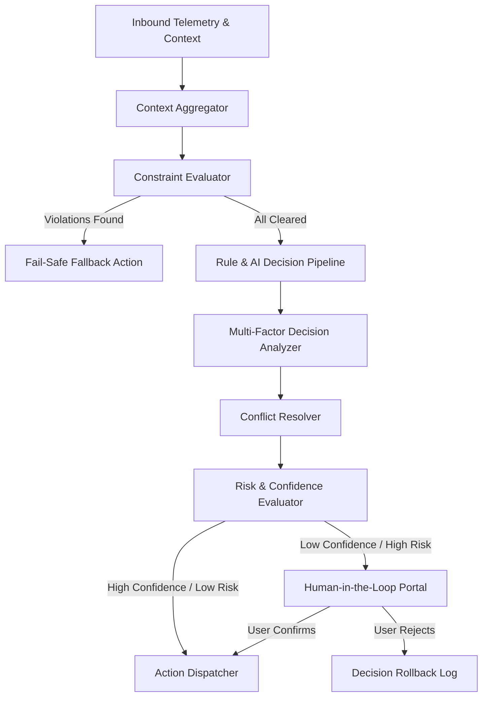
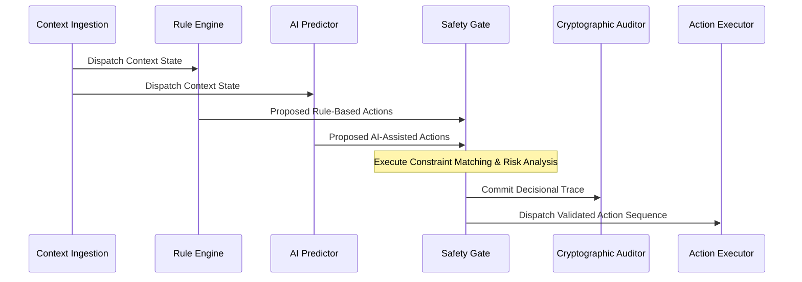
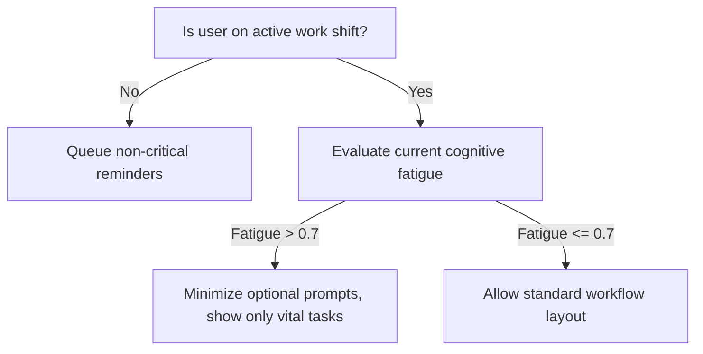

# LifeFresh AI Constitution
## AI Decision Engine Specification v1.0

**Version:** 1.0  
**Status:** Approved / Core Reference Architecture  
**Last Updated:** July 2026  
**Classification:** Enterprise Internal  

---

### 1. Engine Overview
The **AI Decision Engine** is the core operational brain of the LifeFresh AI platform. It is responsible for deterministic, hybrid, and AI-assisted decision-making across all local and remote workloads. In a high-integrity, offline-first ecosystem, the system cannot rely on unpredictable or non-deterministic LLM generations for critical workflow transitions, permission grants, or security assertions. The Decision Engine integrates real-time contextual data, structured business rules, user preferences, safety constraints, and AI prediction models into a unified, mathematically verifiable decision framework. It ensures that every decision made by the system is safe, explainable, context-aware, and aligned with user goals.

---

### 2. Objectives
* **Verifiable Determinism:** Combine rule-based logic and AI-assisted models to guarantee that all outcomes are mathematically bounded and reproducible.
* **Low-Latency Edge Execution:** Process context inputs and execute complex decision pathways locally within **<50ms** to prevent interface lag.
* **Explainable AI (XAI):** Generate structured, human-readable justification traces for every decision path taken.
* **Fault-Tolerant Degraded Modes:** Maintain operational integrity under severe resource constraints or network offline states by failing back to safe baseline decision pathways.

---

### 3. Design Principles
* **Hybrid Decision Architecture:** Rules always override AI models. AI-assisted predictions are strictly constrained by deterministic safety rules.
* **Least Privilege Actions:** Default every automated decision to the most restrictive, safe state if input parameters are incomplete or anomalous.
* **Goal-Aware Alignments:** Evaluate decisions against active user and system goals (e.g., maximizing work productivity, reducing clinician fatigue).
* **Auditability-by-Default:** Log every input vector, active rule version, model signature, confidence score, and resulting action trace to local cryptographic journals.

---

### 4. Core Responsibilities
* **Context Ingestion:** Aggregating and normalizing inputs from telemetry streams, user profiles, system state indicators, and environment sensors.
* **Multi-Factor Risk Assessment:** Running real-time evaluations of risk, cost, performance, and user friction for candidate decisions.
* **Conflict Resolution:** Resolving overlapping, competing, or contradictory rules using predefined prioritization metrics and goal weightings.
* **Human-in-the-Loop Orchestration:** Intelligently determining when a decision requires explicit human authorization prior to execution.

---

### 5. Decision Architecture
The Decision Engine consists of isolated stages that ingest telemetry and emit validated, explainable actions:



---

### 6. Decision Lifecycle
Decisions follow a strict, multi-stage lifecycle to guarantee safety, verification, and auditability:



---

### 7. Decision Pipeline
The decision pipeline operates sequentially to process raw events into final, executable commands:
1. **Context Normalization:** Strips external parameters to match schema requirements.
2. **Rule Selection:** Filters the rules database to extract only rules active for the current context.
3. **AI Inference:** Runs local, low-latency models to predict probability weights for candidates.
4. **Safety Check:** Evaluates candidates against strict negative constraints.
5. **Mitigation & Normalization:** Selects the highest scoring, non-blocked alternative.

---

### 8. Decision Context Processing
The Engine utilizes a localized context manager that compiles all system, environment, and user-specific variables into a structured snapshot. This snapshot is immutable during the course of a single pipeline execution to prevent race conditions.

---

### 9. Decision Inputs
Inputs to the Decision Engine represent multiple, diverse facets of the current ecosystem:

```json
{
  "eventId": "dec_evt_991a0b3f",
  "timestampUtc": 1783584521000,
  "context": {
    "system": {
      "batteryLevel": 0.14,
      "networkStatus": "OFFLINE",
      "cpuLoad": 0.42,
      "storageAvailableBytes": 10737418240
    },
    "user": {
      "activeProfileId": "prof_admin_881a7b",
      "currentRole": "CLINICAL_DIRECTOR",
      "fatigueIndex": 0.68,
      "currentLocationCoordinate": "12.9716,77.5946"
    },
    "environment": {
      "ambientNoiseDb": 54,
      "timeLocal": "09:30:11"
    }
  }
}
```

---

### 10. Context Aggregation
The Engine normalizes inputs from diverse sources into a standardized flat map. If a sensor reports values using differing metric scales, the aggregator applies linear normalization algorithms to bound inputs between $[0.0, 1.0]$:

$$ V_{norm} = \frac{V - V_{min}}{V_{max} - V_{min}} $$

This mathematical normalization prevents input scaling bias from affecting multi-factor analysis formulas.

---

### 11. Multi-factor Decision Analysis
Candidate actions are scored against multiple active factors. The total score $S_j$ for an action candidate $A_j$ is calculated as a weighted sum of individual evaluation factors $F_{ij}$:

$$ S_j = \sum_{i=1}^{n} w_i \cdot F_{ij} $$

Where $w_i$ represents the dynamic weighting assigned to factor $i$ (such as performance cost, security overhead, and cognitive friction), and $\sum w_i = 1.0$.

---

### 12. Rule-based Decisions
Deterministic rule-based decisions are evaluated using a specialized RETE-like pattern matching engine implemented locally. Rules are compiled to structural decision graphs, verifying that evaluation time scales with active rule count at $\mathcal{O}(1)$ performance boundaries rather than $\mathcal{O}(N)$.

---

### 13. AI-assisted Decisions
When explicit logical paths are unavailable, the system invokes local classifier models. These edge-friendly models (e.g., gradient boosted trees or optimized neural networks) generate probability matrices across a series of candidate classifications.

---

### 14. Confidence Evaluation
Each proposed AI-assisted decision carries an associated confidence metric $C_{pred}$. If $C_{pred}$ falls below a configured threshold $T_{conf}$ (default: **0.80**), the system automatically triggers a secondary rule-based evaluation or prompts the user for clarification.

---

### 15. Risk Assessment
Risk levels are calculated dynamically before executing any action. Risk is modeled as the product of the probability of failure $P_{fail}$ and the impact severity score $I_{sev}$:

$$ R = P_{fail} \cdot I_{sev} $$

| Risk Category | Score Range | Default Action |
| :--- | :--- | :--- |
| Low Risk | $0.0 \le R < 0.2$ | Auto-Execute & Log |
| Medium Risk | $0.2 \le R < 0.6$ | Log, Notify, Pre-Authorize |
| High Risk | $0.6 \le R \le 1.0$ | Block, Force Explicit Human Sign-off |

---

### 16. Decision Prioritization
Decisions are processed on an priority-queued thread pool. Emergency safety alerts and security containment actions sit at the highest priority level, instantly preempting layout optimizations and workflow tasks.

---

### 17. Decision Policies
* **Override Priority Policy:** Explicit manual policies always override automated calculations, freezing adaptive updates to prevent user confusion.
* **Resource Optimization Policy:** AI inference tasks are suspended if battery levels drop below **15%**, falling back to standard deterministic rule sets.
* **Privacy Boundary Policy:** No decisions may evaluate inputs containing unmasked patient names or clinical values.

---

### 18. Decision Rules
This section lists the 30 strict, unyielding rules governing the Decision Engine:

* **RULE_DEC_001:** Every decisional pipeline run must write a unique, cryptographic decision hash trace to local logs.
* **RULE_DEC_002:** Total decision computation time must be clamped to a maximum of 50ms.
* **RULE_DEC_003:** Decisions must execute with zero external internet dependencies by utilizing local SQLite rulesets.
* **RULE_DEC_004:** Rulesets must carry cryptographic SHA-256 signatures verified on initial boot.
* **RULE_DEC_005:** Any decision proposing write access to medical records must request active session token validations.
* **RULE_DEC_006:** All decision metrics must be fully isolated between separate user accounts.
* **RULE_DEC_007:** Default fallback state under invalid input scenarios must be `ACTION_DENIED_SAFE`.
* **RULE_DEC_008:** No clinical data variables or patient metrics may be compiled inside raw decision log text streams.
* **RULE_DEC_009:** Priority weights must be normalized such that the sum of all weight inputs equals exactly 1.0.
* **RULE_DEC_010:** Local AI model confidence levels below 0.80 must force fallback rule-based execution.
* **RULE_DEC_011:** High-risk actions ($R \ge 0.6$) must mandate explicit multi-factor verification.
* **RULE_DEC_012:** Action decisions violating active negative constraints must be discarded instantly.
* **RULE_DEC_013:** PII inputs must pass through local redaction filters before decision scoring.
* **RULE_DEC_014:** The RETE rule matching engine must execute on isolated background threads.
* **RULE_DEC_015:** Decisional trace databases must have a retention limit of 90 days of local records.
* **RULE_DEC_016:** Critical containment decisions must preempt low-priority UI updates.
* **RULE_DEC_017:** Decision-making routines must pause during system shut-down sequences.
* **RULE_DEC_018:** Memory allocated during evaluation sweeps must be recycled to minimize garbage collection cycles.
* **RULE_DEC_019:** Timezone conversions must recalculate dynamically relative to local coordination clocks.
* **RULE_DEC_020:** Interactive choices shown to the user must carry unique, snake_case test-tag fields.
* **RULE_DEC_021:** Settings modifications must be debounced with a 200ms limit.
* **RULE_DEC_022:** All automated actions must log the active rule-engine version identifier.
* **RULE_DEC_023:** Session termination events must instantly flush active context caches.
* **RULE_DEC_024:** Decisions targeting user-facing layouts must adapt elements to fit current font scales.
* **RULE_DEC_025:** High-severity alert systems must request immediate top-level display focus.
* **RULE_DEC_026:** Inbound config files must pass validation checks before being committed.
* **RULE_DEC_027:** Sync conflicts on configuration changes must use exponential backoff mechanisms.
* **RULE_DEC_028:** No decision may trigger recursive logic loops within active rules databases.
* **RULE_DEC_029:** Progress indications must display Material 3 loading animations during evaluations.
* **RULE_DEC_030:** Manual system resets must instantly clear computed decision weights and history logs.

---

### 19. Decision Trees
The Engine evaluates complex logical configurations using deterministic decision trees. This approach ensures that logic pathways are clear and auditable:



---

### 20. Decision Matrix
When resolving competing actions, the system compares features using an in-memory evaluation matrix to select the optimal pathway:

| Action Candidate | Performance Cost | User Friction | Security Level | Risk Score | Final Priority |
| :--- | :--- | :--- | :--- | :--- | :--- |
| `BIOMETRIC_RE_AUTH` | High | High | Maximum | $0.05$ | **0.92** |
| `PASSCODE_PROMPT` | Medium | Medium | Medium | $0.15$ | **0.78** |
| `SILENT_TRUST_GRANT` | Low | Zero | Low | $0.45$ | **0.42** |

---

### 21. Goal-aware Decisions
Decisions are scored against active platform goals (e.g., `DECREASE_CLINICAL_ERRORS`, `OPTIMIZE_WORKFLOW_SPEED`). Each goal has a dynamically adjusted priority level. When cognitive fatigue is high, the `DECREASE_CLINICAL_ERRORS` goal receives maximum weight, adjusting prompt flows to require additional confirmation steps.

---

### 22. Constraint Evaluation
All proposed actions must pass through strict logical safety gates:
```kotlin
fun evaluateConstraints(
    action: ProposedAction,
    constraints: List<SafetyConstraint>
): ConstraintResult {
    for (constraint in constraints) {
        if (constraint.violates(action)) {
            return ConstraintResult.Violated(
                reason = "Action violates absolute constraint: ${constraint.id}"
            )
        }
    }
    return ConstraintResult.Passed
}
```

---

### 23. Conflict Resolution
When two rules propose contradictory actions, the conflict resolver evaluates:
1. **Rule Specificity:** Rules targeting a specific user override general group configurations.
2. **Goal Weighting:** The action that aligns more closely with the highest priority goal is selected.
3. **Implicit Safety Score:** The candidate with the lower risk score is used.

---

### 24. Alternative Selection
If the primary action candidate fails constraint validation, the Engine evaluates alternative candidates. If no alternatives pass validation, the pipeline falls back to the default safe state.

---

### 25. Decision Validation
Decisions committed to active staging tables undergo local evaluation simulations to verify that the changes do not result in infinite logic loops or resource degradation before being promoted to production profiles.

---

### 26. Human Approval Integration
When proposed decisions carry a risk score $R \ge 0.6$, the Engine triggers an on-screen confirmation card. This modal requires explicit biometric validation or password inputs before executing the target action.

---

### 27. Explainable Decision Framework
For every decision path taken, the Engine compiles a structured justification trace. This trace is formatted in simple Markdown, allowing administrators to audit the specific parameters and rules that drove the decision:

```markdown
### Decision Trace Audit Log [dec_evt_991a0b3f]
* **Target Action:** FORCE_RE_AUTHENTICATION
* **Justification Trace:**
  1. Triggered by action target: `ACCESS_PATIENT_RECORDS`
  2. Input variable: `networkStatus = UNSAFE_PUBLIC_WIFI`
  3. Evaluated rule: `RULE_SEC_012` (Mandate re-auth on untrusted networks)
  4. Decision path: Constraint `FORCE_MAX_SECURITY` was active.
```

---

### 28. Rollback Strategy
The Engine maintains a sliding transaction log. If an automated decision results in application crashes or systematic logic blocks, a watchdog utility reverts the active local configuration to the previous known stable version.

---

### 29. Decision History
All executed decisions are saved to a local, encrypted SQLite table:

```sql
CREATE TABLE local_decision_history (
    decision_id TEXT PRIMARY KEY NOT NULL,
    timestamp_utc INTEGER NOT NULL,
    action_key TEXT NOT NULL,
    risk_score REAL NOT NULL,
    confidence_score REAL NOT NULL,
    trace_log TEXT NOT NULL
);
```

---

### 30. Decision Analytics
An internal evaluator runs background aggregations on decision trends, monitoring metrics like acceptance rates, user dismissals, and rule evaluation durations to detect system degradation.

---

### 31. Monitoring
* **Latency Monitoring:** Tracks computation durations, logging alerts if any single decision cycle exceeds **50ms**.
* **Cache Hits:** Logs the hit rate of cached context compilations to optimize memory access.

---

### 32. Logging
Decisional log events write strictly to encrypted storage on-device:

```
[2026-07-09 16:45:11] [INFO] [DEC_ENGINE] Processing event: dec_evt_991a0b3f
[2026-07-09 16:45:11] [INFO] [DEC_ENGINE] Multi-factor scoring completed. Candidate count: 3
[2026-07-09 16:45:11] [WARN] [DEC_ENGINE] Constraint violation. Candidate 2 discarded.
[2026-07-09 16:45:11] [INFO] [DEC_ENGINE] Selected candidate: BIOMETRIC_RE_AUTH. Trace committed.
```

---

### 33. APIs
The Decision Engine exposes type-safe Kotlin contracts to handle input events and output validated actions:

```kotlin
interface DecisionService {
    suspend fun evaluateEvent(event: DecisionEvent): Result<ValidatedAction>
    suspend fun getDecisionTrace(decisionId: String): Result<DecisionTrace>
    suspend fun loadRuleset(ruleset: RulesetConfiguration): Boolean
    suspend fun rollbackLastAction(): Boolean
}
```

---

### 34. Internal Data Structures
Decisional structures utilize immutable Kotlin definitions to prevent concurrency issues:

```kotlin
data class DecisionTrace(
    val decisionId: String,
    val timestampUtc: Long,
    val rulesEvaluated: List<String>,
    val riskScore: Float,
    val selectedAction: String,
    val humanApprovalRequired: Boolean
)
```

---

### 35. Performance Optimization
* **Index Configurations:** History tables carry index definitions on both `timestamp_utc` and `action_key` to ensure fast query times.
* **Pre-Compiled Rule Graphs:** Rule evaluation sets are parsed and compiled into binary memory structures on boot, avoiding overhead during runtime processing.

---

### 36. Error Handling
* **Missing Rule Definitions:** If the rules database is empty, the Engine automatically loads the pre-configured baseline default rules from asset packages.
* **Memory Limits:** If evaluation queues exceed limit limits, incoming low-priority events are discarded, and an error metric is logged.

---

### 37. Recovery Mechanisms
If systematic errors are detected, the Engine runs an automated diagnostic check, resets active parameters to safe defaults, and logs the incident details for administrative review.

---

### 38. Enterprise Deployment
In enterprise environments, system policies can be distributed as cryptographically signed JSON profiles. These profiles are parsed and activated locally on-device, bypassing dynamic calculations to enforce corporate workflows.

---

### 39. Future Expansion
* **Distributed Trust Networks:** Share validated rule optimizations between local devices on trusted networks using secure, peer-to-peer protocols.
* **Continuous Multi-Turn Scenarios:** Extend the decision model to evaluate context trajectories over multi-hour operational timelines.

---

### Conclusion
The AI Decision Engine provides a secure, predictable, and verifiable framework for system automation across the LifeFresh AI platform. By combining rule-based constraints and AI predictions, the system ensures that decisions are executed safely and auditably at the edge.

### Related AI Constitution Documents
* `AI_Personalization_Engine.md`
* `AI_Confirmation_Engine_v1.0.md`
* `AI_Validation_Engine_v1.0.md`

### References
1. Material Design 3 Guidelines: Accessibility and Dynamic Layout Adapters
2. RETE Algorithm: Efficient Pattern Matching in Production Rule Systems
3. ISO/IEC 22989: Information Technology - Artificial Intelligence - Concepts and Terminology
