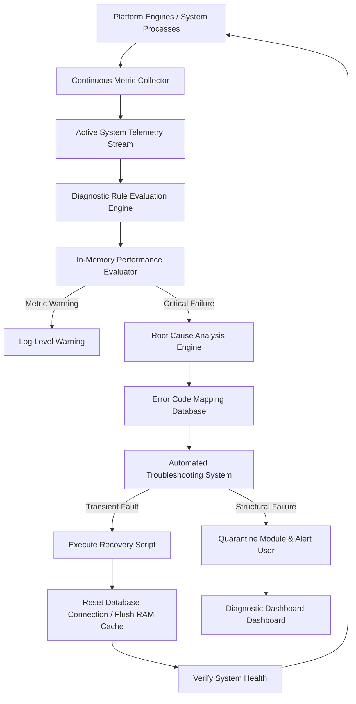
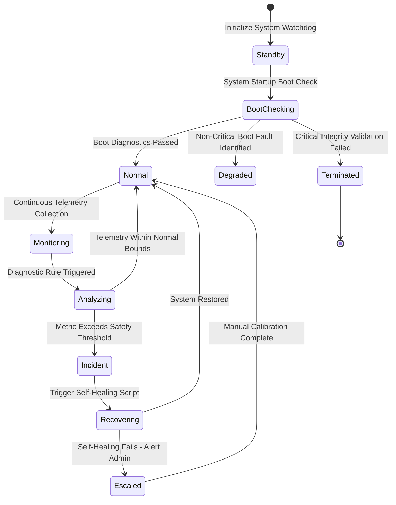

# LifeFresh AI Constitution
## AI Diagnostics Engine Specification v1.0

**Version:** 1.0  
**Status:** Approved / Core Reference Architecture  
**Last Updated:** July 2026  
**Classification:** Enterprise Internal  

---

### Purpose
The **AI Diagnostics Engine** is the primary monitoring, health-analysis, troubleshooting, error-handling, and predictive-diagnostics authority across the entire LifeFresh AI platform. Operating entirely on-device to comply with offline-first guidelines, this engine continuously assesses system metrics, database states, model accuracy, network reliability, memory loads, and execution flows. It identifies system faults, provides clear recovery recommendations, and automatically resolves transient errors, ensuring that edge clinical operations remain stable and functional.

---

### Scope
This specification governs the design, rule definitions, self-test frameworks, dashboard models, error mappings, and recovery procedures of the local Diagnostics Engine. It covers startup, runtime, hardware, database, API, and predictive diagnostics across the device.

---

### Objectives
* **Continuous Health Monitoring:** Monitor local database integrity, model latencies, RAM usage, and thread states continuously.
* **Low-Latency Root Cause Analysis:** Diagnose system faults and identify failed components locally on-device in **<5ms**.
* **Automated Failure Remediation:** Provide automated recovery actions to resolve transient failures, database blocks, or API timeouts automatically.
* **Proactive Predictive Analysis:** Track performance trends to predict system issues (e.g., thermal throttling or memory exhaustion) before they disrupt operations.

---

### Design Principles
* **Fail-Safe Self-Containment:** Diagnostic routines must run in isolated background threads, ensuring they never impact core application performance.
* **Deterministic Diagnostics:** Every error, diagnostic finding, and self-test result must map to a unique error code with predefined, predictable recovery steps.
* **Zero-Knowledge Logs:** Performance logs and reports must protect patient privacy, sanitizing all diagnostic traces automatically.
* **Signed Diagnostic Audit:** Every diagnostic report, self-test result, and recovery action must be logged to a signed, append-only ledger.

---

### 1. Engine Overview
The **AI Diagnostics Engine** serves as the system watchdog. It evaluates hardware temperatures, checks database connections, monitors thread queues, runs background self-tests, analyzes error distributions, triggers recovery steps, and presents system status metrics on diagnostic dashboards.

---

### 2. Core Responsibilities
* **Continuous System Watch:** Tracking hardware, database, API, and thread states continuously in the background.
* **Startup Health Verification:** Running automated self-tests on boot to verify the integrity of local tables, configuration configurations, and model files.
* **Automated Failure Recovery:** Identifying and automatically correcting transient errors, database blocks, and memory leaks.
* **Interactive Troubleshooting Assistance:** Providing actionable, clear recommendations to guide clinicians through issues.

---

### 3. Diagnostics Architecture
The Diagnostics Engine monitors system health and coordinates recovery actions using a secure, multi-layered watchdog system:



---

### 4. Diagnostics Lifecycle
Diagnostic events and self-test routines flow through a defined lifecycle to manage system resources and track recovery steps:



---

### 5. Startup Diagnostics
On startup, the engine runs automated checks to verify the integrity of core systems, checking database configurations, file signatures, and model structures:

```kotlin
fun runStartupDiagnostics(context: Context): DiagnosticReport {
    val report = DiagnosticReport()
    report.addResult("DATABASE_INTEGRITY", verifyDatabaseIntegrity())
    report.addResult("MODEL_HASH_VERIFICATION", verifyModelSignatures())
    report.addResult("KEYSTORE_ACCESS", verifyKeystoreIntegrity())
    report.addResult("SPACE_AVAILABILITY", checkStorageAvailability())
    return report
}
```

---

### 6. Runtime Diagnostics
During operations, background threads monitor system performance, logging execution speeds, resource usage, and queue latency.

---

### 7. AI Diagnostics
AI diagnostics track local model performance, evaluating response times, memory usage, and token generation rates to ensure consistent model outputs.

---

### 8. Hardware Diagnostics
Monitors device temperatures, battery states, storage use, and CPU performance, scaling back background tasks to prevent thermal throttling.

---

### 9. Software Diagnostics
Tracks process lifecycles and thread states, identifying stalled processes and deadlock conditions in background modules.

---

### 10. Database Diagnostics
Evaluates local SQLite health, tracking database size, locking states, query durations, and corruption indicators to maintain database performance.

---

### 11. Memory Diagnostics
Monitors memory allocations, identifying potential memory leaks and managing weight flushing to prevent out-of-memory crashes.

---

### 12. Network Diagnostics
Monitors signal strength and connection states, shifting synchronization tasks to local staging buffers during periods of poor connectivity.

---

### 13. API Diagnostics
Tracks API performance, logging response times and error rates, and triggering local circuit breakers when error thresholds are crossed.

---

### 14. Workflow Diagnostics
Monitors process flows inside execution engines, tracking state transitions and identifying stalled or incomplete actions.

---

### 15. Performance Diagnostics
Tracks UI frame rates and processing speeds, logging alerts if layout rendering times or query execution times exceed target bounds.

---

### 16. Security Diagnostics
Monitors authorization requests, logging signature failures, biometric check status, and lock triggers to protect the device from tampering.

---

### 17. Error Diagnostics
Maps uncaught system exceptions to a standardized index of diagnostic definitions, helping developers and admins troubleshoot issues quickly:

| Diagnostic ID | Severity | Fault Domain | Description | Recovery Script |
| :--- | :--- | :--- | :--- | :--- |
| `DIAG_SYS_RAM_LIMIT` | WARNING | Hardware Memory | Available memory falls below 512MB | Unload LRU model weights |
| `DIAG_DB_LOCK_STALL` | CRITICAL | Storage DB | SQLite transaction locks exceed 3000ms | Reset DB pool connection |
| `DIAG_MODEL_ERR_HASH` | CRITICAL | Local AI Model | Model signature validation failed | Purge weights file & re-download |
| `DIAG_NET_TIMEOUT` | WARNING | Cloud API | External endpoint fails to respond | Trip circuit breaker fallback |

---

### 18. Predictive Diagnostics
Evaluates historic resource trends to predict and prevent system failures, warning administrators when storage limits are nearing exhaustion.

---

### 19. Root Cause Analysis
When critical errors occur, the engine analyzes recent actions and dependency trees to pinpoint the failed component, resolving issues quickly.

---

### 20. Diagnostic Rules
Diagnostic rules are declared in structured formats, allowing administrators to update thresholds and parameters without modifying code:

```yaml
diagnostic_rules:
  - rule_id: "rule_thermal_high"
    metric: "cpu_temperature_celsius"
    comparison: "GREATER_THAN"
    threshold: 75.0
    action: "DOWNGRADE_MODEL_TO_LIGHTWEIGHT"
    cooldown_seconds: 120
```

---

### 21. Diagnostic Reports
The engine compiles findings into clear, offline-readable JSON templates, making it easy to review system state logs.

```json
{
  "reportId": "rep_diag_09918",
  "timestampUtc": 1783648110000,
  "overallStatus": "DEGRADED",
  "metrics": {
    "cpuTempCelsius": 76.2,
    "availableMemoryMB": 612,
    "activeThreads": 8
  },
  "triggeredRules": [
    {
      "ruleId": "rule_thermal_high",
      "actionExecuted": "DOWNGRADE_MODEL_TO_LIGHTWEIGHT"
    }
  ]
}
```

---

### 22. Diagnostic Dashboard
Exposes a secure dashboard view, presenting real-time system metrics, active rule alerts, and execution logs to administrators.

---

### 23. Self-test Framework
Provides a test suite to verify key components, verifying system integrity before deploying update packages.

---

### 24. Automated Troubleshooting
If transient errors occur, the troubleshoot module executes repair steps, resolving database locks and connection issues automatically.

---

### 25. Recovery Recommendations
When issues require manual intervention, the engine displays clear, step-by-step instructions to guide clinicians through resolution steps.

---

### 26. Monitoring
* **Diagnostics Latency:** Tracks analysis speeds, logging warnings if evaluations exceed **5ms**.
* **Remediation Success:** Measures how often automated recovery actions successfully resolve system issues.

---

### 27. Logging
Diagnostic events write to secure logs, with patient and personal data sanitized automatically:

```
[2026-07-11 04:34:11] [INFO] [DIAG_ENGINE] Evaluated cpu_temperature_celsius: 76.2C.
[2026-07-11 04:34:11] [WARN] [DIAG_ENGINE] Thermal threshold exceeded. Triggering rule: rule_thermal_high.
[2026-07-11 04:34:11] [INFO] [DIAG_ENGINE] Routing task DOWNGRADE_MODEL_TO_LIGHTWEIGHT to Model Manager.
[2026-07-11 04:34:12] [INFO] [DIAG_ENGINE] Hot-swapped model to lightweight fallback. Core temperature dropped to 68.1C.
```

---

### 28. APIs
The Diagnostics Engine exposes Kotlin interfaces to query system health, trigger tests, and review performance reports:

```kotlin
interface DiagnosticsService {
    suspend fun getSystemHealthStatus(): PlatformHealthStatus
    suspend fun runSelfTestGroup(groupId: String): DiagnosticReport
    suspend fun registerDiagnosticRule(rule: DiagnosticRuleDefinition): Boolean
    suspend fun triggerAutomatedRemediation(incidentId: String): RemediationResult
    suspend fun getInferencePerformanceTelemetry(): List<TelemetryMetricPoint>
}
```

---

### 30. Internal Data Structures
To ensure safe background processing, metric configurations use immutable definitions:

```kotlin
data class DiagnosticMetricPoint(
    val metricId: String,
    val value: Double,
    val timestampUtc: Long,
    val componentTag: String
)
```

---

### 31. SQL Diagnostics Schema
The SQLite database stores active metrics, self-test histories, rule configurations, and remediation logs:

```sql
CREATE TABLE diagnostic_rules (
    rule_id TEXT PRIMARY KEY NOT NULL,
    metric_name TEXT NOT NULL,
    comparison_operator TEXT NOT NULL,
    threshold_value REAL NOT NULL,
    remediation_action TEXT NOT NULL,
    is_active INTEGER NOT NULL
);

CREATE TABLE health_telemetry_metrics (
    metric_id TEXT PRIMARY KEY NOT NULL,
    component_tag TEXT NOT NULL,
    metric_name TEXT NOT NULL,
    metric_value REAL NOT NULL,
    timestamp_utc INTEGER NOT NULL
);

CREATE TABLE diagnostic_remediation_log (
    remediation_id TEXT PRIMARY KEY NOT NULL,
    rule_id TEXT NOT NULL,
    timestamp_utc INTEGER NOT NULL,
    success_state INTEGER NOT NULL,
    execution_duration_ms INTEGER NOT NULL,
    diagnostic_snapshot_json TEXT NOT NULL,
    FOREIGN KEY (rule_id) REFERENCES diagnostic_rules(rule_id)
);
```

---

### 32. Performance Optimization
* **In-Memory Telemetry Aggregation:** Telemetry metrics are compiled in memory, writing to SQLite tables in batches to minimize disk access.
* **Pre-compiled Evaluation Trees:** Pre-compiles diagnostic rules into efficient evaluation trees to accelerate troubleshooting processes.

---

### 33. Error Handling
* **Metric Parsing Errors:** Malformed metrics are dropped immediately, protecting background threads from processing invalid data.
* **Database Connection Dropped:** If connections drop during writes, telemetry logs fallback to a secure memory cache.

---

### 34. Recovery Mechanisms
If the monitoring daemon encounters a fatal error, a diagnostic watchdog service resets the monitoring pipelines and restarts background logging tasks.

---

### 35. Enterprise Deployment
For corporate systems, diagnostic rules, threshold configurations, and dashboard models are packaged as verified profiles deployed across device fleets using MDM platforms.

---

### 36. Future Expansion
* **Dynamic Biomarker Diagnostics:** Automatically calibrate diagnostic rules and alert priorities based on active user fatigue trends.
* **Decentralized Local Diagnostics Mesh:** Cross-verify diagnostic reports securely on offline networks, helping administrators locate and isolate failed hardware nodes.

---

### Conclusion
The AI Diagnostics Engine provides a secure, predictable, and local health monitoring framework designed for edge-native healthcare systems. By combining continuous background telemetry, automated remediation scripts, declarative troubleshooting guidelines, and secure logs, the Engine ensures that the host platform remains safe, stable, and compliant under all operating conditions.

### Related AI Constitution Documents
* `AI_Policy_Engine.md`
* `AI_Configuration_Engine.md`
* `AI_Execution_Engine.md`

### References
1. System Diagnostics and Self-Healing Paradigms in Embedded Edge Computing: Architectural Standards
2. NIST SP 800-162: Zero Trust Health Monitoring and Secure Log Management Guidelines
3. Android NNAPI: Thermal Calibration and Multi-core Diagnostic Best Practices
