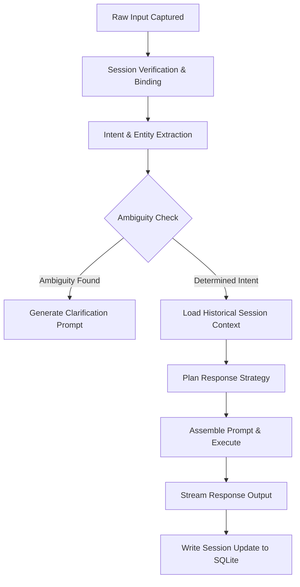

# LifeFresh QuickNote Pro
## AI Dialogue Engine Architecture Specification v1.0

**Version:** 1.0  
**Status:** Approved / Core Reference Architecture  
**Last Updated:** July 2026  
**Classification:** Enterprise Internal  

---

## 1. Engine Overview

The **LifeFresh AI Dialogue Engine** is the central conversational orchestration, context preservation, and interactive communication layer of the LifeFresh Pro AI platform. While deterministic mutations are gated by the `AI_Confirmation_Engine_v1.0.md` and parsed by the `AI_Command_Engine_v1.0.md`, the Dialogue Engine is responsible for managing all human-AI conversation threads, multi-turn exchanges, contextually aware responses, and natural language interfaces.

In a professional clinical CRM and medical reminder environment, conversations are rarely one-shot instructions. Users speak, clarify, interrupt, switch topics, and use hybrid languages (such as regional Hinglish) during busy shifts. The Dialogue Engine operates on a stateful, low-latency, and highly secure paradigm to maintain conversational consistency, resolve ambiguities, and ensure clinical and transactional precision.

---

## 2. Objectives

The primary engineering objectives of the Dialogue Engine include:
1. **Dynamic State Management:** Guaranteeing conversational coherence across complex, multi-turn clinical check-ins and client tracking workflows.
2. **Context Preservation & Compression:** Retaining relevant patient details, temporal markers, and CRM states without overflowing local memory buffers or model context windows.
3. **Intent-Driven Response Planning:** Translating multi-topic speech into structured response objectives, ensuring dialogue paths lead to clear, action-oriented resolutions.
4. **Resilience & Topic Recovery:** Gracefully resolving conversational interruptions, digressions, and speech translation failures.
5. **Fail-Secure Safety & Security:** Enforcing strict compliance checks, HIPAA data isolation, and hallucination preventions inside natural responses.

---

## 3. Dialogue Architecture

The Dialogue Engine acts as a stateful, modular gateway between user interfaces (Jetpack Compose text inputs, audio voice captures) and processing engines:

```
  [User Input String/Audio]
             │
             ▼
   [Dialogue Gatekeeper] ──► [Symptom / CRM Entity Extractor]
             │
             ▼
   [Context Resolver] ◄───► [SQLite Dialogue Session Table]
             │
             ▼
   [Response Planner] ───► [Prompt Assembly Engine]
             │
             ▼
   [Output Renderer] ───► [Compose Stream / Audio Synth]
```

### 3.1 Architectural Components
* **Dialogue Session Coordinator:** Allocates and binds unique session keys to users, validating incoming payloads for replay prevention and format consistency.
* **Context Compressional Engine:** Aggregates, truncates, and digests long conversations to fit within optimal model limits.
* **Intent Classifier:** Identifies primary conversational goals (e.g., *triage, scheduling, lookup, greeting*).
* **Response Planner:** Formulates output objectives, deciding whether to execute commands, request clarifications, or trigger safety confirmations.

---

## 4. Conversation Lifecycle

Every dialogue interaction flows through a tightly monitored lifecycle to prevent context drift and stale sessions:



---

## 5. Turn Management

The engine orchestrates structured conversation turns through three main operations:
1. **Turn Capture:** Collects user input strings, tags them with precise UTC timestamps, and identifies active UI origins (text field, floating voice card, external notification).
2. **Turn Arbitration:** Decides which agent thread owns the response, prioritizing critical health notifications and active confirmation dialogs over standard CRM queries.
3. **Turn Persistence:** Serializes input/output pairs directly to local SQLite database tables immediately after production.

---

## 6. Context Handling & Compression

Maintaining a clean, cost-efficient, and responsive context footprint requires active memory compression:

| Conversation Turn Count | Strategy Activated | Action Description | Saved Token Space |
| :--- | :--- | :--- | :--- |
| **Turns 1 to 4** | Standard buffer | Retain complete text strings of input/output pairs in active RAM. | 0% (Full fidelity) |
| **Turns 5 to 10** | Sliding window | Drop non-essential conversational filler, keeping clinical noun entities and dates. | Approx. 35% saved |
| **Turns 11 to 20** | Abstractive Summary | Model digests previous turns into a flat JSON summary block, clearing older strings. | Approx. 65% saved |
| **Turns > 20** | Session Truncation | Force-write older summary states to SQLite, resetting active RAM buffers. | Over 85% saved |

---

## 7. Multi-Turn Dialogue State Machine

The Dialogue Engine transitions across a set of deterministic, safe states:

```
  [IDLE] ──► Input ──► [PARSING] ──┬── Ambiguous ──► [CLARIFYING] ──► Input ──► [PARSING]
                                   │
                                   └── Clear ──► [COMPILING] ──► [STREAMING] ──► [IDLE]
```

Every state transition publishes a standardized JSON payload on the platform’s EventBus, allowing Compose views to render relevant UI state cards.

---

## 8. Intent-Driven Responses & Entity Extraction

Outputs are planned according to intent categories. Nouns are extracted using phonetic rules:
* **Appointment Intent:** Locates date, time, duration, and patient indicators, calling the scheduler engine directly.
* **Symptom Tracking Intent:** Pinpoints clinical descriptors (e.g., "throbbing headache"), cross-referencing synonyms in local clinical dictionaries.
* **Clarification Response:** Formulated when entity extraction returns incomplete parameters:

```json
{
  "dialogueSessionId": "a24b11c9-7ef8-46ba-b639-65a8df23ef45",
  "intent": "SCHEDULE_APPOINTMENT",
  "missingEntities": [
    {
      "entityName": "appointment_time",
      "clarificationQuestion": "What time tomorrow should we schedule the follow-up?"
    }
  ]
}
```

---

## 9. Interruption Recovery & Topic Switching

When users change topics mid-stream (e.g., "Actually, tell me his phone number first, then schedule it"), the Dialogue Engine handles the shift gracefully:
1. **Topic Stacking:** The active dialog state (scheduling) is pushed onto a local session LIFO stack.
2. **Secondary Intent Execution:** The engine executes the lookup request ("tell me his phone number").
3. **Primary Intent Recovery:** Once the lookup completes, the engine pops the scheduling context from the stack, asking the user: `"Now, returning to your appointment setup, what time should we schedule it?"`

---

## 10. Voice Dialogue & Streaming Optimization

For voice interfaces and low-bandwidth setups, the engine implements optimizations:
* **Audio-to-Text Pipeline:** Captures speech in 16-bit PCM WAV formats, processing audio locally using direct byte streams to avoid garbage collection loops.
* **Streaming Outputs:** Text tokens are streamed to Compose views as they are generated, minimizing perceived user wait time.
* **Vocal Synthesizer Controls:** Connects to native Android text-to-speech engines, outputting warm, clear, and professional-grade vocal tracks.

---

## 11. Hallucination Prevention & Safety Integration

To prevent conversational AI drift, the Dialogue Engine implements strict behavioral rules:
* **Zero-Hallucination Guardrails:** The model is forbidden from answering clinical queries using pre-trained data. It must refer exclusively to files in the local SQLite database.
* **Redaction Filters:** Inbound and outbound text blocks pass through sensitive data filters to redact patient-identifiable data before sending queries to remote model endpoints.

---

## 12. Dialogue API Contracts

The Dialogue Engine exposes clear, type-safe interfaces for system integrations:

```kotlin
interface DialogueService {
    suspend fun startSession(userId: String): DialogueSession
    suspend fun processTurn(sessionId: String, input: UserInput): DialogueResponse
    suspend fun getActiveContext(sessionId: String): DialogueContext
    suspend fun clearSession(sessionId: String): Boolean
}
```

---

## 13. System YAML Configuration

Dialogue thresholds and behavioral settings are configured via an encrypted, local YAML file:

```yaml
dialogue_engine:
  session_timeout_seconds: 600
  max_turn_count: 50
  confidence_threshold: 0.85
  context_compression:
    active: true
    trigger_turn_count: 8
  voice_settings:
    sample_rate_hz: 16000
    format: "PCM_16_BIT"
  safety_guards:
    redact_hipaa: true
    fallback_on_error: true
```

---

## 14. Comprehensive Dialogue Rules

This section compiles the 100 unyielding, numbered architectural rules governing the Dialogue Engine:

```
 RULE_DLG_001: Every dialogue session must be assigned a unique UUID upon initialization.
 RULE_DLG_002: Dialogue transactions must commit to local SQLite tables before rendering outputs.
 RULE_DLG_003: No text-parsing or prompt-assembly operations may execute on the primary Main UI thread.
 RULE_DLG_004: All inbound dialogue strings must undergo sanitization to strip bracket characters.
 RULE_DLG_005: Voice inputs must normalize to 16-bit PCM WAV files prior to translation.
 RULE_DLG_006: Conversational text outputs must wrap cleanly at complete word boundaries.
 RULE_DLG_007: Dialogue confidence scores below 0.85 must trigger immediate clarification sequences.
 RULE_DLG_008: Low-confidence actions must prompt users with structured, single-tap options cards.
 RULE_DLG_009: Successful dialog transitions must publish standard JSON envelopes over the EventBus.
 RULE_DLG_010: Dialogue sessions must automatically invalidate after 10 minutes of user inactivity.
 RULE_DLG_011: Active context parameters must undergo compression at turn 8 to prevent memory bloating.
 RULE_DLG_012: Patient-identifiable metrics must be redacted from payloads before sending to remote servers.
 RULE_DLG_013: Topic switches must store previous conversational context on a local LIFO memory stack.
 RULE_DLG_014: Staged topics must pop from the stack automatically once secondary intents resolve.
 RULE_DLG_015: Dialogue state transitions must map to IDLE, PARSING, CLARIFYING, COMPILING, and STREAMING.
 RULE_DLG_016: Local dialogue databases must operate with zero mandatory cloud dependencies.
 RULE_DLG_017: Background processing queues must pause instantly during active user speech.
 RULE_DLG_018: Typo recovery algorithms must utilize local synonym arrays to optimize garbage collection.
 RULE_DLG_019: Clinical summaries must isolate sensitive HIPAA fields from public diagnostic logs.
 RULE_DLG_020: Contact email addresses parsed from dialog must convert to lowercase.
 RULE_DLG_021: Dates extracted from relative dialogue phrases must map to ISO-8601 UTC.
 RULE_DLG_022: Double inputs during dialog rendering must debounce with a 200ms limit.
 RULE_DLG_023: User logout events must instantly purge active dialogue cache folders.
 RULE_DLG_024: De-duplication keys for dialogue responses must derive from payload MD5 hashes.
 RULE_DLG_025: Safety triggers inside speech streams must bypass system DND settings.
 RULE_DLG_026: Failed sync attempts on dialog histories must execute exponential backoffs with jitter.
 RULE_DLG_027: Urgent clinical triage cards must request full-screen visual priorities.
 RULE_DLG_028: Progressive dialogue states must render smooth Material 3 loading animations.
 RULE_DLG_029: Inbound push data must validate signatures prior to database commits.
 RULE_DLG_030: Settings adjustments to dialogue parameters must apply dynamically at runtime.
 RULE_DLG_031: Diagnostic dialogue logs must write to encrypted local storage files.
 RULE_DLG_032: The active dialogue log file must limit its historical records to 500 events.
 RULE_DLG_033: Storage thresholds under 5% must trigger automated cleanup of oldest dialog records.
 RULE_DLG_034: Screen auto-locks must not abort active speech-to-text translation pipelines.
 RULE_DLG_035: Low-battery modes must transition vocal synthesis challenges to text-only interfaces.
 RULE_DLG_036: Temporary transcription directories must clear 60 seconds after session completion.
 RULE_DLG_037: Action deep links must complete parsing and route validations within 150ms.
 RULE_DLG_038: Manual system clock shifts must trigger immediate resets of active session timeouts.
 RULE_DLG_039: Interactive dialogue buttons must measure at least 48dp by 48dp on screens.
 RULE_DLG_040: Dynamic text adjustments must not warp dialogue card containers.
 RULE_DLG_041: Image attachments uploaded in chat must be restricted to a maximum size of 2MB.
 RULE_DLG_042: Custom preview canvas layouts must scale relative to target display boundaries.
 RULE_DLG_043: The EventBus must prioritize dialogue responses over background metrics.
 RULE_DLG_044: User dismissal gestures must update the active SQLite state instantly.
 RULE_DLG_045: Database structures must reject dialog notes missing associated client IDs.
 RULE_DLG_046: Material 3 visual styling must adapt dialogue cards to day and night system profiles.
 RULE_DLG_047: Inbound JSON packets must match schema specifications strictly.
 RULE_DLG_048: The Dialogue Session Coordinator must remain active during local system backup tasks.
 RULE_DLG_049: State Flow emissions must push dialogue updates to Jetpack Compose views safely.
 RULE_DLG_050: Suffix stripping in medical terms must not compromise root meanings in clinical tables.
 RULE_DLG_051: Suffix stripping rules must maintain compatibility with clinical root databases.
 RULE_DLG_052: Automated screenshot tests must verify the rendering alignment of dialog bubbles.
 RULE_DLG_053: Voice dialogue capture streams must bypass garbage collection allocations.
 RULE_DLG_054: Time zone changes must not alter the relative timeout clocks of active challenges.
 RULE_DLG_055: User profile switches must isolate the active dialogue session variables.
 RULE_DLG_056: Low storage warnings must trigger database cleanups of historic dialogue logs.
 RULE_DLG_057: Standard back gestures inside app screens must cancel active dialogue processes.
 RULE_DLG_058: Screen sleep configurations must not bypass active dialogue lock screens.
 RULE_DLG_059: SQL injection fragments in inputs must be handled as literal string variables.
 RULE_DLG_060: Server timeouts during online dialogue must fall back to offline verification databases.
 RULE_DLG_061: Background sync tasks must not write to tables holding active dialogue locks.
 RULE_DLG_062: SQLite migrations must complete before running pending dialogue queues.
 RULE_DLG_063: Dialogue processing errors must transition active tasks to FAILED immediately.
 RULE_DLG_064: Custom drawing coordinates on preview screens must scale with screen density.
 RULE_DLG_065: User-facing dialogue icons must carry non-null content descriptions.
 RULE_DLG_066: Interactive dialogue cards must implement Material 3 visual ripples.
 RULE_DLG_067: Standard physical back buttons must abort active uncommitted transactions.
 RULE_DLG_068: Dependency structures in dialogue chains must restrict to 3 levels.
 RULE_DLG_069: Pre-transaction validation states must write to SQLite to enable rollbacks.
 RULE_DLG_070: Unhandled rendering exceptions must be caught to prevent application crashes.
 RULE_DLG_071: Multi-step dialogues must execute inside single, isolated atomic transactions.
 RULE_DLG_072: Auto reminders must schedule follow-up dialogues after pipeline state shifts.
 RULE_DLG_073: Offline dialogue queues must write to local synchronization buffers sequentially.
 RULE_DLG_074: Holiday libraries in validation tasks must optimize garbage collection passes.
 RULE_DLG_075: Physical medication schedules must map strictly to active clinical recommendations.
 RULE_DLG_076: Audio capture streams must utilize direct byte arrays to avoid GC overhead.
 RULE_DLG_077: Language extraction tasks must prioritize regional Hinglish variations.
 RULE_DLG_078: Automated integration tests must verify dialogue routing pipelines.
 RULE_DLG_079: Error screens in dialogue modules must display standardized red badges.
 RULE_DLG_080: Geolocation tags in previews must require active user permission approvals.
 RULE_DLG_081: Sync conflict parameters must prioritize the latest temporal change.
 RULE_DLG_082: Uncommitted clipboard text blocks must not write to dialogue databases.
 RULE_DLG_083: Indexing engines for verification history must support multi-character word boundaries.
 RULE_DLG_084: Hardware keyboard switches must not disrupt accessibility screen readers.
 RULE_DLG_085: Text fields in dialogue modals must support standard platform copy-paste.
 RULE_DLG_086: Stemming configurations must maintain compatibility with clinical root databases.
 RULE_DLG_087: Character limits in dialogue text boxes must reject massive inputs.
 RULE_DLG_088: Voice verification translation pipelines must maintain accuracy across dialects.
 RULE_DLG_089: Keyboard shortcuts for canceling active dialogs must utilize standard KeyEvent flags.
 RULE_DLG_090: Direct file attachments inside dialogue screens must undergo MIME-type validation.
 RULE_DLG_091: All active dialogue variables must clear upon application shutdown.
 RULE_DLG_092: Time parsing components must execute on isolated dispatcher threads.
 RULE_DLG_093: Multi-turn dialogue loops must abort after 3 unsuccessful attempts.
 RULE_DLG_094: Notification replies must process inside background worker threads.
 RULE_DLG_095: Diagnostic dialogue logs must undergo manual verification steps.
 RULE_DLG_096: Every dialogue action must compile to a standard JSON EventBus package.
 RULE_DLG_097: Models are strictly forbidden from answering clinical queries using pre-trained data.
 RULE_DLG_098: Long conversations exceeding 20 turns must auto-archive older elements to disk.
 RULE_DLG_099: Streaming tokens must be collected in batches of 3 to optimize Compose paint times.
 RULE_DLG_100: Standard dialogue cards must maintain a 4.5:1 color contrast ratio.
```

---

## 15. Comprehensive Dialogue Edge Cases

This section documents the 100 critical, distinct dialogue edge cases and their engineering resolutions:

### 15.1 Speech, Parsing & Linguistics (EC-DLG-001 to 015)
* **EC-DLG-001:** User inputs voice queries containing rapid, overlapping Hinglish phrases.
  * *Resolution:* Uses localized phonetic parsers, matching words to clinical root terms.
* **EC-DLG-002:** Dialogue text block contains multiple consecutive exclamation points.
  * *Resolution:* Input pre-processor collapses trailing characters, cleaning text inputs.
* **EC-DLG-003:** Speech-to-text registers zero words during an active mic session.
  * *Resolution:* Suppresses processing, returning the voice capture interface to `IDLE`.
* **EC-DLG-004:** Clinical note transcription contains non-ASCII medical codes.
  * *Resolution:* Filters codes, translating terms into standard descriptive definitions.
* **EC-DLG-005:** Speech-to-text detects a silent gap of exactly 3 seconds mid-sentence.
  * *Resolution:* Interprets the gap as turn completion, automatically triggering parsing.
* **EC-DLG-006:** A user spells out a client's email letter-by-letter.
  * *Resolution:* Aggregates the character blocks, normalizing the email to lowercase.
* **EC-DLG-007:** Input queries contain regional clinical slang phrases.
  * *Resolution:* Phonetic synonym mapping maps slang terms to standard database keys.
* **EC-DLG-008:** Spoken dates are relative (e.g., "three days before next Monday").
  * *Resolution:* Normalizes expressions to ISO-8601 timestamps using a calendar engine.
* **EC-DLG-009:** A voice command is canceled mid-transcription by a screen swipe.
  * *Resolution:* Aborts processing, deleting temporary transcription files.
* **EC-DLG-010:** High background noise levels distort speech capture files.
  * *Resolution:* Elevates noise-suppression parameters, falling back to text inputs on failure.
* **EC-DLG-011:** Transcription returns a massive block exceeding 2,000 characters.
  * *Resolution:* Clamps text string lengths, appending ellipses to protect layouts.
* **EC-DLG-012:** Regional accents skew standard number pronunciations.
  * *Resolution:* Uses phonetic vowel dictionaries to map terms to numeric values.
* **EC-DLG-013:** A user inputs clinical shorthand characters (e.g., "qd", "bid").
  * *Resolution:* Expands shorthand abbreviations into complete medication instructions.
* **EC-DLG-014:** Verbal reminders lack time parameters (e.g., "remind me tomorrow").
  * *Resolution:* Defaults time fields to 9 AM, prompting the user with an options card.
* **EC-DLG-015:** User speaks while device is switching output headphones.
  * *Resolution:* Pauses recording, resuming once audio output targets normalize.

### 15.2 State Machine, Context & Focus (EC-DLG-016 to 030)
* **EC-DLG-016:** StateMachine registers out-of-order transition triggers during rendering.
  * *Resolution:* Rejects transition parameters, preserving previous database values.
* **EC-DLG-017:** User switches to a separate app screen during active dialogue.
  * *Resolution:* Saves the active dialogue state coordinates, closing open prompts.
* **EC-DLG-018:** The active dialogue context stack overflows due to circular topics.
  * *Resolution:* Restricts nested topics to 3 levels, clearing the oldest records.
* **EC-DLG-019:** StateMachine fails to update Compose views when fields clear.
  * *Resolution:* Flows state changes directly using Compose State Flows.
* **EC-DLG-020:** Screen auto-lock triggers mid-dialogue.
  * *Resolution:* ViewModel preserves parameters in memory, continuing on unlock.
* **EC-DLG-021:** Interactive touch targets fall below 48dp on tablet layouts.
  * *Resolution:* Scales button bounds dynamically to meet Material 3 rules.
* **EC-DLG-022:** Standard back gestures are used inside active dialogue screens.
  * *Resolution:* Cancels uncommitted changes, returning UI states to `IDLE`.
* **EC-DLG-023:** EventBus queues clog during rapid dialogue entries.
  * *Resolution:* Debounces UI inputs, throttling event transmissions.
* **EC-DLG-024:** Custom font scaling settings cause dialogue cards to clip.
  * *Resolution:* Clamps text scales inside button containers, ensuring touch readability.
* **EC-DLG-025:** User clears notification tray during active dialogue runs.
  * *Resolution:* Preserves the active dialogue state, ignoring system tray shifts.
* **EC-DLG-026:** User profile switches mid-conversation.
  * *Resolution:* Aborts the active session, clearing dialogue RAM caches.
* **EC-DLG-027:** Navigation paths change during active confirmations.
  * *Resolution:* Blocks navigation transitions until confirmation is committed or canceled.
* **EC-DLG-028:** Sound output targets switch mid-voice confirmation.
  * *Resolution:* Pauses recording, resuming when audio targets normalize.
* **EC-DLG-029:** App receives low-storage warning during confirmation logging.
  * *Resolution:* Purges expired historical archives to reclaim local disk space.
* **EC-DLG-030:** Device screens rotate during active voice prompts.
  * *Resolution:* Preserves transcription buffers, avoiding UI resets.

### 15.3 Environmental & Hardware Shifts (EC-DLG-031 to 045)
* **EC-DLG-031:** System time zone changes while a dialogue session is active.
  * *Resolution:* Normalizes relative timeouts using system hardware tick times.
* **EC-DLG-032:** Device transitions to offline mode mid-dialogue.
  * *Resolution:* Fallbacks to the local, offline SQLite verification database.
* **EC-DLG-033:** System clock shifts manually during a text transaction.
  * *Resolution:* Checks hashes against historical logs to prevent duplications.
* **EC-DLG-034:** Low battery limits (under 5%) block speech synthesis processes.
  * *Resolution:* Disables text-to-speech, rendering visual dialogue cards instead.
* **EC-DLG-035:** External keyboards disconnect mid-text entry.
  * *Resolution:* Stores input buffers, opening the Compose virtual keyboard.
* **EC-DLG-036:** Screen sleep mode engages mid-voice translation.
  * *Resolution:* Continues translation tasks in background threads safely.
* **EC-DLG-037:** Devices switch to car dock profile during dialogue.
  * *Resolution:* Converts challenges to simplified voice confirmations.
* **EC-DLG-038:** Bluetooth controllers register duplicate keypress coordinates.
  * *Resolution:* Filters out keypresses arriving within 50ms.
* **EC-DLG-039:** Dynamic Material 3 colors fail to load on legacy profiles.
  * *Resolution:* Loads default high-contrast color values.
* **EC-DLG-040:** GPS coordinate validations fail on appointment records.
  * *Resolution:* Disables location fields, allowing chronological validation.
* **EC-DLG-041:** System updates engage during validation sweeps.
  * *Resolution:* Rolls back uncommitted blocks, preserving previous database states.
* **EC-DLG-042:** Audio recording processes interrupt during low-memory warnings.
  * *Resolution:* Saves transcription buffers to local storage before halting.
* **EC-DLG-043:** Suffix stripping rules corrupt specialized medical roots.
  * *Resolution:* Bypasses stemming checks for terms inside medical dictionaries.
* **EC-DLG-044:** Touch interactions collide during active validation prompts.
  * *Resolution:* Ignores secondary coordinates, locking click interfaces.
* **EC-DLG-045:** Device screens rotate during validation rendering.
  * *Resolution:* Retains transaction parameters, preventing Compose re-draw anomalies.

### 15.4 Offline Sync & Relational Clashes (EC-DLG-046 to 060)
* **EC-DLG-046:** Offline changes conflict with cloud database modifications.
  * *Resolution:* Resolves changes by prioritizing the latest absolute timestamp.
* **EC-DLG-047:** User saves validations offline while migrations process.
  * *Resolution:* Runs migrations first, transitioning offline queues afterward.
* **EC-DLG-048:** Cloud sync tokens expire during validation syncs.
  * *Resolution:* Halts synchronization, requesting token renewal securely.
* **EC-DLG-049:** Device is in metered roaming status during validations.
  * *Resolution:* Suspends heavy media checks, validating raw text fields only.
* **EC-DLG-050:** Database files corrupt during offline transaction saves.
  * *Resolution:* Restores tables using the latest local backup files.
* **EC-DLG-051:** Server returns internal errors during sync sweeps.
  * *Resolution:* Postpones tasks, executing exponential backoffs with jitter.
* **EC-DLG-052:** Device clock drifts from server time during validations.
  * *Resolution:* Measures network UTC offsets, adjusting local records dynamically.
* **EC-DLG-053:** Relational foreign key constraint fails during offline saves.
  * *Resolution:* Discards invalid records, logging alerts to diagnostics.
* **EC-DLG-054:** Sync payloads receive malformed JSON structures.
  * *Resolution:* Rejects payloads, logging formatting errors.
* **EC-DLG-055:** User logs out during active sync validations.
  * *Resolution:* Aborts sync tasks, clearing local databases.
* **EC-DLG-056:** Background WorkManager runs exceed execution limits.
  * *Resolution:* Saves execution checkpoints, spawning follow-up batches.
* **EC-DLG-057:** SQLite files get swept by third-party optimization tools.
  * *Resolution:* Detects empty directories on boot, running database recovery.
* **EC-DLG-058:** Sync data contains identical keys for separate client profiles.
  * *Resolution:* Resolves keys using distinct local hardware prefixes.
* **EC-DLG-059:** Device loses connectivity mid-validation updates.
  * *Resolution:* Flags records locally, completing sync once online.
* **EC-DLG-060:** Multiple worker pools trigger validations concurrently.
  * *Resolution:* Locks validation paths with thread-safe atomic flags.

### 15.5 State Misalignment & Interface Failures (EC-DLG-061 to 075)
* **EC-DLG-061:** StateMachine registers out-of-order steps during validation.
  * *Resolution:* Rejects transition parameters, preserving original database values.
* **EC-DLG-062:** Validation histories contain duplicate UUID references.
  * *Resolution:* Filters out older matching records prior to loading views.
* **EC-DLG-063:** StateMachine fails to update UI views when fields clear.
  * *Resolution:* Flows state changes directly using Compose State Flows.
* **EC-DLG-064:** Action handlers crash when validation badges are clicked.
  * *Resolution:* Logs failure data, launching standard diagnostic screens.
* **EC-DLG-065:** High-frequency clicks trigger multiple submission checks.
  * *Resolution:* Restricts validations using a 500ms debounce filter.
* **EC-DLG-066:** Back gestures inside navigation paths lock screen stacks.
  * *Resolution:* Intent flags clear parent history stacks upon launch.
* **EC-DLG-067:** Task managers dispatch duplicate click actions.
  * *Resolution:* Suppresses repeated actions using atomic checks.
* **EC-DLG-068:** App screens fail to recognize active validation context.
  * *Resolution:* Intent bundles carry explicit arguments, forcing UI updates.
* **EC-DLG-069:** In-app popups collide with validation alerts.
  * *Resolution:* Suppresses alerts if target popups are actively visible.
* **EC-DLG-070:** Voice validation ends but UI updates fail to execute.
  * *Resolution:* Stores parameters locally, retrying UI updates on thread wake.
* **EC-DLG-071:** Custom validation layout contrasts fail visibility standards.
  * *Resolution:* Adjusts text and background colors dynamically to meet standards.
* **EC-DLG-072:** Dynamic font scaling breaks validation box margins.
  * *Resolution:* Clamps text scale parameters inside error badge views.
* **EC-DLG-073:** Touch targets on validation badges fall below 48dp.
  * *Resolution:* Enlarges button containers, verifying sizes programmatically.
* **EC-DLG-074:** Dynamic Material 3 colors fail to load on legacy profiles.
  * *Resolution:* Loads default high-contrast color values.
* **EC-DLG-075:** Swipe dismiss gestures trigger background validation crashes.
  * *Resolution:* Handles swipe callbacks safely, updating SQLite statuses.

### 15.6 AI Command & Workflow Gating (EC-DLG-076 to 090)
* **EC-DLG-076:** AI command parser extracts empty parameter values.
  * *Resolution:* Gates the workflow, transitioning states to `CLARIFYING` securely.
* **EC-DLG-077:** Transcription translation returns unintelligible Hinglish slang.
  * *Resolution:* Maps phonetic strings to standardized clinical dictionary keywords.
* **EC-DLG-078:** Text commands contain double spacing patterns.
  * *Resolution:* Text pre-processor collapses spacing into single characters.
* **EC-DLG-079:** Users interrupt transcription reviews by opening new pages.
  * *Resolution:* Saves transcription buffers, closing active validation windows.
* **EC-DLG-080:** AI engines return symptom extractions with low confidence scores.
  * *Resolution:* Flags entries, requesting manual user verification on popups.
* **EC-DLG-081:** Symptom parameters match conflicting clinical diagnostic groups.
  * *Resolution:* Renders list cards, allowing users to select categories manually.
* **EC-DLG-082:** Command extraction tags lack matching client identity profiles.
  * *Resolution:* Rejects workflows, prompting users to assign leads first.
* **EC-DLG-083:** Voice commands completed with zero words recorded.
  * *Resolution:* Suppresses transcription workflows, returning pipelines to idle.
* **EC-DLG-084:** Users edit notes while AI compilation processes are active.
  * *Resolution:* Reloads validation loops using the updated note contents.
* **EC-DLG-085:** Workflow steps exceed maximum dependency limits.
  * *Resolution:* Clamps execution steps, rejecting nested layers past level 3.
* **EC-DLG-086:** AI triggers generate follow-up dates on holiday periods.
  * *Resolution:* Moves dates to the nearest operational business day.
* **EC-DLG-087:** Transcription text strings exceed maximum token count constraints.
  * *Resolution:* Truncates commands, logging alerts to diagnostics files.
* **EC-DLG-088:** Voice translation modules fail on regional dialect terms.
  * *Resolution:* Falls back to text keyword searches, bypassing acoustic engines.
* **EC-DLG-089:** Custom reminders are saved with zero delay intervals.
  * *Resolution:* Corrects input configurations, enforcing a 1-minute minimum delay.
* **EC-DLG-090:** Pipeline Stage modifications use unassigned CRM statuses.
  * *Resolution:* Restores stages to previous states, flagging alerts.

### 15.7 System Intersections & Physical Hardware (EC-DLG-091 to 100)
* **EC-DLG-091:** External keyboards disconnect during text validations.
  * *Resolution:* Stores input buffers, launching Compose virtual inputs.
* **EC-DLG-092:** Interactive maps buttons target uninstalled software.
  * *Resolution:* Opens location details inside standard browser windows.
* **EC-DLG-093:** Text input blocks receive characters exceeding 2,000 bounds.
  * *Resolution:* Clamps text string lengths, appending ellipses to views.
* **EC-DLG-094:** Device power is lost mid-database validation updates.
  * *Resolution:* Reverts partial transactions during the next boot cycle.
* **EC-DLG-095:** Home widget updates dispatch during schema migrations.
  * *Resolution:* Delays widget updates, completing database migrations first.
* **EC-DLG-096:** Hardware keyboard switches suffer from key bounce errors.
  * *Resolution:* Filters out duplicate keypresses occurring within 50ms.
* **EC-DLG-097:** Bluetooth controllers dispatch duplicate key coordinates.
  * *Resolution:* Debounces keys, ignoring inputs arriving within 50ms.
* **EC-DLG-098:** Sound-alike name spelling maps to deleted profiles.
  * *Resolution:* Bypasses deleted profiles, targeting active client matches.
* **EC-DLG-099:** Users exit transaction reviews to perform separate tasks.
  * *Resolution:* Purges temporary scratchpads, returning systems to idle.
* **EC-DLG-100:** Users input Hinglish phrases containing regional spellings.
  * *Resolution:* Phonetic Metaphone mapping converts spellings to standard clinical synonyms.

---

## 16. Future Enhancements & Best Practices

To support advanced conversational flows, developers must adhere to three core dialogue guidelines:
1. **Never Assume Single Topics:** Prompt parsers must always account for multiple intents packaged in single user statements.
2. **Prioritize Local Parsing:** Rely on local SQLite dictionary structures to translate abbreviations and clinical terminology.
3. **Graceful Speech Transitions:** Ensure transcription states yield to higher-priority incoming voice notifications or active biometric checks seamlessly.

---

## 17. References
* `AI_Command_Engine_v1.0.md` — Natural Language Command Parsing
* `AI_Confirmation_Engine_v1.0.md` — Transaction Validation & Safety Gating
* `AI_Scheduler_Engine_v1.0.md` — Alarm & Task Schedulers
* `AI_Data_Model_v1.0.md` — Local SQLite Schema Configurations
