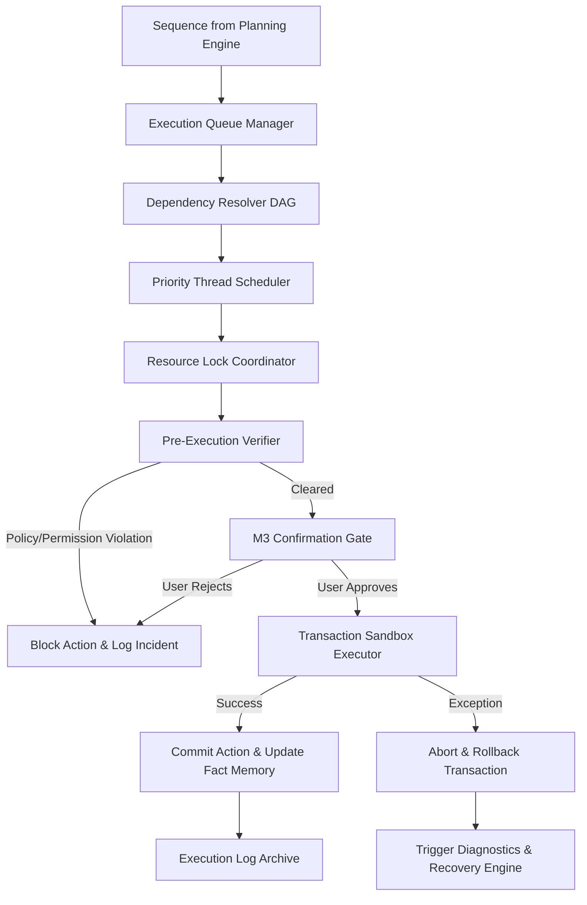
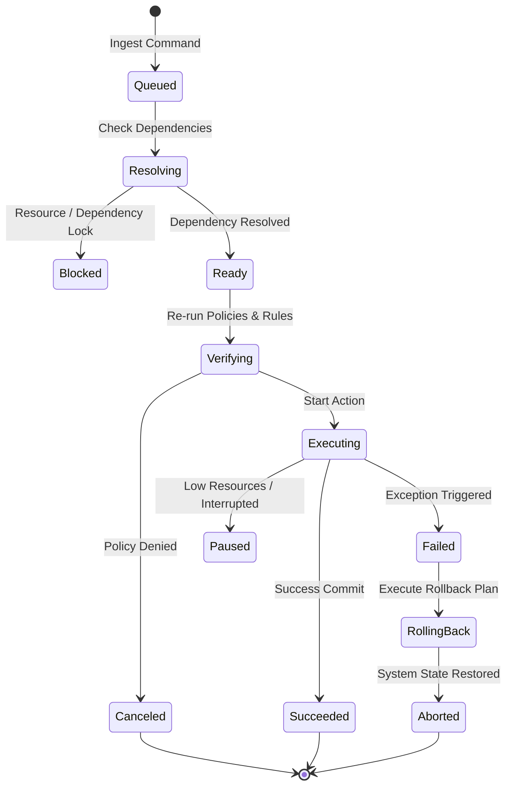

# LifeFresh AI Constitution
## AI Execution Engine Specification v1.0

**Version:** 1.0  
**Status:** Approved / Core Reference Architecture  
**Last Updated:** July 2026  
**Classification:** Enterprise Internal  

---

### Purpose
The **AI Execution Engine** is the core operational runtime and transaction coordinator of the LifeFresh AI platform. It is responsible for safely executing AI decisions, workflows, commands, actions, tasks, automations, and system operations across all platform environments. In a highly secure, offline-first clinical workspace, this engine acts as the final transactional executor. It guarantees that all actions scheduled by the `AI_Planning_Engine.md` and the `AI_Autonomous_Engine.md` are executed deterministically, validated dynamically against active security/policy contexts, logged cryptographically, and rolled back safely upon failure.

---

### Scope
This specification governs the design, execution pipeline, queuing mechanisms, scheduling rules, resource management, verification gates, transaction rollbacks, API schemas, and SQLite database layouts of the local Execution Engine. It covers parallel, sequential, conditional, event-driven, background, and scheduled execution profiles at the edge.

---

### Objectives
* **Deterministic Runtime Transactions:** Guarantee transactional integrity (ACID properties) for all local application and database operations.
* **Failsafe Context Verification:** Dynamically validate every command against the active `AI_Permission_Engine.md` and `AI_Policy_Engine.md` immediately prior to execution.
* **Low-Latency Dispatching:** Achieve task dispatch and execution coordination latencies of **<5ms** at the edge.
* **Zero-Downtime Offline Rollbacks:** Provide complete, localized recovery and state rollback procedures during network disconnected states.

---

### Design Principles
* **Transactional Immutability:** Execution commands must be treated as immutable, stateful transition operations.
* **Sandboxed Isolation:** Run untrusted, dynamic, or generative operations inside highly constrained memory sandboxes with strict thread priorities.
* **Fail-Safe Containment:** Any runtime exception, resource exhaustion, or validation failure must instantly suspend the active execution branch and trigger rollback routines.
* **Audit-Chained Execution:** Every execution state transition, resource allocation, and warning signal must write to a cryptographically linked, append-only local log.

---

### 1. Engine Overview
The **AI Execution Engine** is the concrete execution plane of the platform. It takes abstract step definitions, compiles them into executable commands, resolves their task dependencies, schedules thread pools, manages runtime resource locks, and commits changes to the local storage and device systems.

---

### 2. Core Responsibilities
* **Command Compilation and Parsing:** Translating JSON/YAML task specifications into executable, type-safe code actions.
* **Resource and Lock Coordination:** Managing memory, thread allocation, and database transaction locks during multi-threaded execution.
* **Dynamic Pre-Execution Verification:** Intercepting actions to re-verify permissions, safety rules, and policies.
* **State Recovery and Rollback:** Reverting system-wide database writes and local caches to pre-execution states upon task failure.

---

### 3. Execution Architecture
The Execution Engine intercepts, schedules, verifies, and runs tasks using an isolated execution pipeline:



---

### 4. Execution Lifecycle
Commands flow through strict, traceable state progressions to guarantee deterministic recovery path mapping:



---

### 5. Execution Pipeline
The Execution Pipeline runs in a non-blocking background sequence:
1. **Fetch:** Dequeues the highest priority ready command.
2. **Lock:** Allocates required local database locks and thread resources.
3. **Verify:** Re-checks permissions and compliance policies on the fly.
4. **Execute:** Runs the raw action block inside a transactional wrapper.
5. **Commit/Rollback:** Persists SQLite edits or cleanses modified buffers.

---

### 6. Command Execution
Commands represent primitive actions (e.g., `WRITE_FILE_RECORD`). They are defined as type-safe, compiled structures executing within bounded sandboxes.

```json
{
  "commandId": "cmd_exec_091a_write",
  "action": "WRITE_LOCAL_RECORD",
  "parameters": {
    "tableName": "patient_records",
    "recordId": "rec_9918",
    "fieldData": "AES_GCM_ENCRYPTED_BLOB"
  },
  "constraints": {
    "maxTimeoutMs": 1500,
    "requiredThreadPriority": "BACKGROUND"
  }
}
```

---

### 7. Action Execution
Actions represent groupings of commands executing together (e.g., updating user fatigue logs and simultaneously invalidating dynamic dashboard caches).

---

### 8. Workflow Execution
Workflows represent long-running execution graphs (e.g., patient intake registration), coordinating multiple sequential actions and UI updates across hours or days.

---

### 9. Task Execution
Tasks manage asynchronous background jobs (e.g., optimizing database indexes), scheduling execution segments during device idle windows.

---

### 10. Parallel Execution
The system uses Kotlin Coroutines to run non-dependent execution branches in parallel, utilizing thread pools optimized for multi-core processors.

---

### 11. Sequential Execution
When step sequences carry rigid dependency rules, the DAG scheduler executes commands sequentially, validating results at each step.

---

### 12. Conditional Execution
The engine can evaluate logical branches dynamically during execution. If a pre-condition fails (e.g., network timeout during a sync operation), the execution path diverges.

---

### 13. Event-driven Execution
Commands can be registered to trigger dynamically in response to system, sensor, or context events, utilizing a local event-bus architecture.

---

### 14. Background Execution
Background tasks are dispatched to low-priority threads, utilizing Android WorkManager structures to preserve screen responsiveness.

---

### 15. Scheduled Execution
Enables registration of recurring cron-like executions, managing routine data cleanup loops and local diagnostic checks.

---

### 16. Real-time Execution
Highly critical commands (e.g., local safety overrides) bypass background queues and run on high-priority threads to guarantee sub-millisecond dispatch times.

---

### 17. Execution Queue
The **Execution Queue** is a thread-safe, priority-sorted data structure managed in-memory on the device. It handles active execution buffers and coordinates thread dispatching.

---

### 18. Priority Scheduling
Thread allocation is managed dynamically using dynamic task prioritization indices ($P_{task} \in [0, 1000]$). Higher $P_{task}$ commands preempt lower-priority tasks.

---

### 19. Dependency Resolution
Task dependency maps are analyzed dynamically on ingestion. If a dependency loop is identified, the entire plan tree is discarded.

---

### 20. Resource Allocation
Executors monitor system health. If battery levels drop below **15%** or memory availability falls under **100MB**, low-priority background tasks are paused.

---

### 21. Runtime Validation
Before committing writes, the validation engine checks target states to ensure compliance with strict schema boundaries.

---

### 22. Permission Verification
Every command is re-validated against the `AI_Permission_Engine.md` immediately before execution to block stale token authorization bypasses.

---

### 23. Policy Verification
Commands are filtered through the `AI_Policy_Engine.md` dynamically, ensuring that runtime execution remains fully compliant with active organizational constraints.

---

### 24. Rule Verification
Execution paths are continually checked against the `AI_Rule_Engine.md` to trigger dynamic alerts or updates.

---

### 25. Confirmation Integration
For high-risk operations, the executor interfaces with the `AI_Confirmation_Engine_v1.0.md` to block action loops until explicit human confirmation is received.

---

### 26. Rollback Mechanisms
If an exception occurs during execution, the engine reverts all database writes using transactional `ROLLBACK` commands. For file system operations, cached staging copies are restored.

---

### 27. Retry Strategy
Failed commands utilize exponential-backoff retry policies:

```kotlin
suspend fun <T> executeWithRetry(
    maxAttempts: Int = 3,
    initialDelayMs: Long = 100,
    block: suspend () -> T
): T {
    var currentDelay = initialDelayMs
    repeat(maxAttempts - 1) {
        try {
            return block()
        } catch (e: Exception) {
            delay(currentDelay)
            currentDelay *= 2
        }
    }
    return block() // Final attempt
}
```

---

### 28. Failure Recovery
When structural errors are detected, the system initiates recovery playbooks:
1. **Quarantine:** Isolates the failing task tree to prevent cascading errors.
2. **Revert:** Restores the database and file cache to the last stable snapshot.
3. **Notify:** Alerts the user or administrators of the recovery state.

---

### 29. Monitoring
* **Execution Latency:** Tracks dispatch latencies, logging warnings if task startup delays exceed **5ms**.
* **Active Threads:** Monitors active coroutine counts to prevent resource exhaustion.

---

### 30. Logging
Execution traces are logged locally. Logs are stripped of raw patient data or security keys:

```
[2026-07-11 02:28:11] [INFO] [EXEC_ENGINE] Dequeuing command: cmd_exec_091a_write. Priority: 850
[2026-07-11 02:28:11] [INFO] [EXEC_ENGINE] Policy & Permission validation passed.
[2026-07-11 02:28:11] [INFO] [EXEC_ENGINE] Action committed successfully in 1.4ms.
[2026-07-11 02:30:42] [WARN] [EXEC_ENGINE] Command failed: cmd_sync_991b. Initiating rollback sequence.
```

---

### 31. APIs
The Execution Engine exposes type-safe Kotlin interfaces to coordinate operations with other platform layers:

```kotlin
interface ExecutionService {
    suspend fun executeCommand(command: CommandDefinition): ExecutionResult
    suspend fun cancelCommand(commandId: String): Boolean
    suspend fun getQueueStatus(): QueueSnapshot
    suspend fun registerEventListener(event: String, action: CommandDefinition): Boolean
}
```

---

### 32. Internal Data Structures
To ensure thread-safe operations across background coroutines, configurations use immutable Kotlin structures:

```kotlin
data class CommandDefinition(
    val commandId: String,
    val actionType: String,
    val parameters: Map<String, String>,
    val priority: Int,
    val dependencyList: List<String>,
    val maxTimeoutMs: Long
)
```

---

### 33. SQL Execution Schema
The SQLite database organizes active queues, command states, and execution histories:

```sql
CREATE TABLE execution_queue (
    command_id TEXT PRIMARY KEY NOT NULL,
    action_type TEXT NOT NULL,
    priority INTEGER NOT NULL,
    state TEXT NOT NULL,
    timeout_ms INTEGER NOT NULL,
    created_at INTEGER NOT NULL
);

CREATE TABLE execution_dependencies (
    parent_command_id TEXT NOT NULL,
    child_command_id TEXT NOT NULL,
    PRIMARY KEY (parent_command_id, child_command_id),
    FOREIGN KEY (parent_command_id) REFERENCES execution_queue(command_id) ON DELETE CASCADE,
    FOREIGN KEY (child_command_id) REFERENCES execution_queue(command_id) ON DELETE CASCADE
);

CREATE TABLE execution_history (
    history_id TEXT PRIMARY KEY NOT NULL,
    command_id TEXT NOT NULL,
    timestamp_utc INTEGER NOT NULL,
    final_state TEXT NOT NULL,
    execution_duration_ms INTEGER NOT NULL,
    error_message TEXT
);
```

---

### 34. Performance Optimization
* **In-memory Queuing:** Active queues are processed in memory to avoid SQLite read/write overhead during normal operation.
* **Coroutine Recyclers:** Reuses execution contexts to minimize garbage collection overhead during rapid-fire operations.

---

### 35. Error Handling
* **Stalled Threads:** Watchdog loops detect task hangs, terminating and rolling back tasks that exceed active timeouts.
* **Resource Exhaustion:** If system memory runs critically low, low-priority tasks are aborted and queued for deferred execution.

---

### 36. Enterprise Deployment
For enterprise fleets, default execution parameters and priority limits can be packaged as signed JSON configurations deployed across devices using MDM platforms.

---

### 37. Future Expansion
* **Decentralized Multi-Device Execution:** Split complex execution tasks across secure local peer-to-peer networks.
* **Biometric Pacing Adjustment:** Throttle background execution dynamically based on real-time biometric and fatigue metrics.

---

### Conclusion
The AI Execution Engine provides a highly optimized, safe, and transactional execution framework designed for edge-native healthcare environments. By enforcing dynamic pre-execution verification, robust rollback routines, and coroutine-based scheduling, the Engine ensures that automated tasks execute safely and compliant under all conditions.

### Related AI Constitution Documents
* `AI_Planning_Engine.md`
* `AI_Autonomous_Engine.md`
* `AI_Permission_Engine.md`

### References
1. Kotlin Coroutines and Flow: Advanced Concurrency Patterns on Android
2. NIST SP 800-162: Zero Trust Systems and Transaction Integrity Guidelines
3. IEEE Std 1008-1987: Software Unit Verification and Execution Standards
