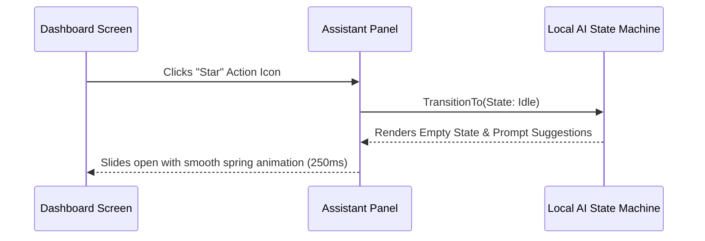
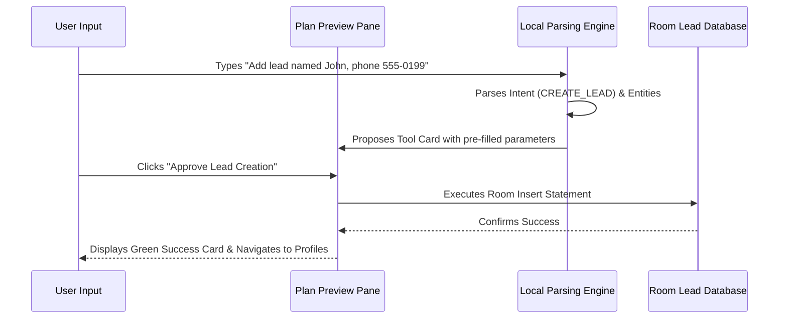
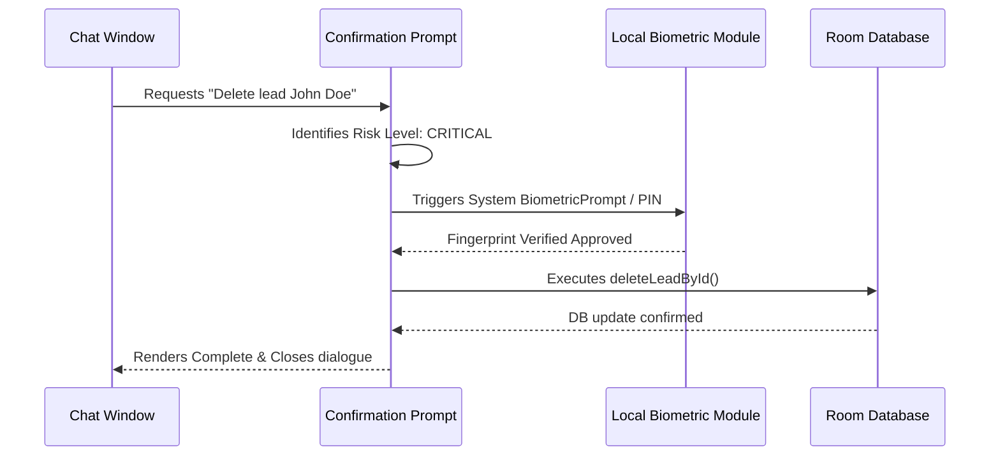
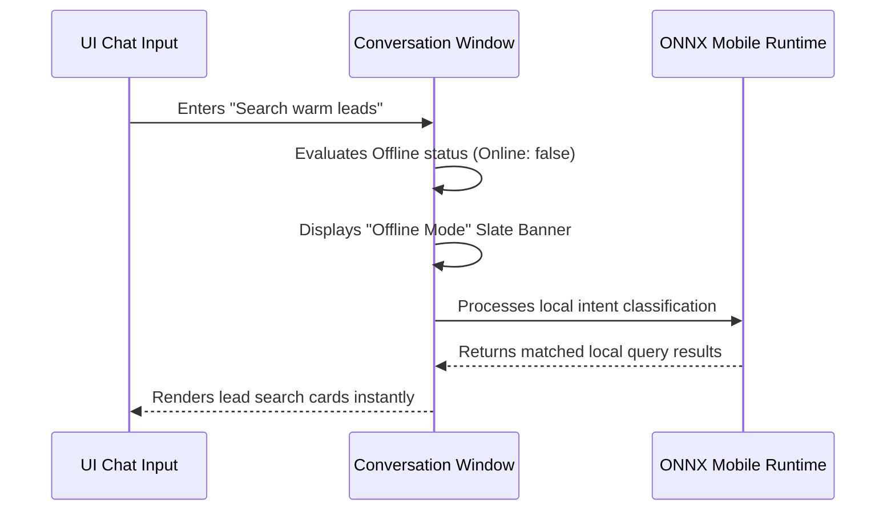

# LifeFresh QuickNote Pro AI Experience Design System
## Offline-First AI User Experience & Visual Design Specification v1.0

### Document Metadata
* **Version:** 1.0.0
* **Classification:** Enterprise Internal Confidential
* **Status:** Approved Reference Design
* **Authors:** LifeFresh Human-Computer Interaction Group & Lead Visual Designers
* **Date:** July 2026
* **Implementation Target:** Jetpack Compose (Kotlin Native Android), Material Design 3

---

### Experience Vision
The LifeFresh QuickNote Pro AI Experience is designed to be **safe, transparent, and entirely offline-capable**. In contrast to traditional, conversational chat designs that hide model behavior, this system exposes the AI's intent, planning, tool usage, and execution pipeline in real-time. By moving away from conversational conversational lists and towards structured, visual plan previews, the user maintains absolute control over CRM data, reminder configurations, and security policies.

---

### Design Goals
* **Absolute Autonomy Transparency:** Users must instantly understand what the AI is planning to do before any database write occurs.
* **Deterministic Action Execution:** Visual transitions must guarantee that actions are not falsely reported as complete before the local database confirms execution.
* **Offline Dignity:** The design should treat offline execution as the primary, high-status operational tier rather than a compromised fallback.

### Non-goals
* Establishing open-ended conversational companion dynamics.
* Automating user interactions by simulating touchscreen taps or gestures.

---

### User Trust Principles

#### Offline-first Experience Principles
The UI must explicitly display a persistent, low-overhead indicator marking model and network offline statuses. Offline work is presented with an elegant **Cosmic Slate Theme** with generous padding.

#### AI Transparency Principles
Every action selected by the AI must be presented as a "Tool Execution Proposal" card, detailing the target tool, risk levels, and precise variable inputs.

#### Safety-first Design Principles
High-risk operations (such as lead deletion, note overwriting, or bulk status changes) require mandatory physical user confirmations, PIN entries, or biometric approvals.

---

### Material 3 Alignment

#### Visual Identity
* **AI Assistant Name Placeholder Rules:** Refer to the AI exclusively as "LifeFresh Local Assistant". Promotional or humanized names are strictly banned to prevent user confusion.
* **AI Avatar Strategy:** A clean, geometric, non-humanoid stylized circular icon utilizing a local-first leaf motif with ambient pulse outlines.

#### Design Tokens

##### Typography Scale
| Role | Font Family | Size (sp) | Line Height (sp) | Tracking (sp) |
|---|---|---|---|---|
| **Display Headings** | Space Grotesk | 24 | 32 | -0.5 |
| **Subheadings** | Inter Medium | 16 | 24 | 0.1 |
| **Status Indicators** | JetBrains Mono | 12 | 16 | 0.5 |
| **Body Paragraphs** | Inter Regular | 14 | 20 | 0.25 |

##### Spacing Scale
* **Base Unit:** 8dp grid system.
* **Compact Padding:** 8dp.
* **Standard Padding:** 16dp.
* **Negative Margin / Card Spacing:** 24dp.

##### Shape Scale
* **Tool Cards:** 20dp Rounded Corner (Material 3 Extra Large).
* **Button Components:** 100dp (Full Capsule).
* **Dialog Overlays:** 28dp (Material 3 Large).

##### Elevation
* **Resting Cards:** 0dp (Flat bordered layout).
* **Proposed Action Cards:** 4dp.
* **Overlays & Dialogs:** 8dp.

##### Color Token Architecture

###### Light Theme
* **Primary:** `Color(0xFF2E7D32)` (LifeFresh Green)
* **Secondary Container:** `Color(0xFFE8F5E9)`
* **Surface Background:** `Color(0xFFFFFFFF)`
* **High Contrast Text:** `Color(0xFF1B5E20)`
* **Error / Alert:** `Color(0xFFC62828)`

###### Dark Theme
* **Primary:** `Color(0xFF4CAF50)`
* **Secondary Container:** `Color(0xFF1E2F20)`
* **Surface Background:** `Color(0xFF121212)`
* **High Contrast Text:** `Color(0xFFE8F5E9)`
* **Error / Alert:** `Color(0xFFEF5350)`

###### High Contrast Theme
* **Primary:** `Color(0xFF00FF00)`
* **Secondary Container:** `Color(0xFF000000)`
* **Surface Background:** `Color(0xFF000000)`
* **Border Accents:** `Color(0xFFFFFFFF)`

---

### Accessibility

#### Dynamic Text Support
All Compose typography definitions must use scale-independent pixels (`sp`) and support system font scaling up to 200% without overlapping text.

#### Screen Reader Support
Every interactive element, avatar, processing state, or status indicator must carry localized `contentDescription` attributes (e.g., "AI processing command", "Offline indicator").

#### Touch Target Requirements
All buttons, icons, and chip components maintain a minimum touch target size of **48dp x 48dp**.

#### Reduced Motion Support
Visual transition scales and progress animations are automatically disabled if system-level "Reduced Motion" is enabled.

---

### Responsive Layout

#### Screen Maps and Sizing Classes
* **Small Phone Layout (<600dp):** Single-column stacked timeline with bottom sheet inputs.
* **Tablet Readiness (600dp - 840dp):** Dual-pane view (list-detail format showing conversation history side-by-side with active plans).
* **Desktop Readiness (>840dp):** Three-column layout (active CRM profiles on left, chat center, and execution history log on right).

---

### AI Entry Points

#### Primary AI Entry Point
A dedicated top app bar icon (Material symbol `Star`) that smoothly slides open the assistant panel.

#### Contextual AI Entry Points
Contextual entry chips are displayed dynamically inside lead detail views and note creation panels (e.g., "Summarize client activity" or "Generate followup reminder").

#### Floating AI Button Decision
The use of a permanent floating action button for AI is strictly banned to protect the standard CRM workflow.

#### Bottom Navigation Decision
The AI is accessed via explicit top-level action bars rather than occupying a persistent tab, ensuring the interface remains uncluttered.

---

### AI Conversation Screens

#### Compact AI Bottom Sheet
Launches for quick, single-step commands, utilizing 50% screen height.

#### Expanded AI Bottom Sheet
Extends to 90% screen height when displaying multi-step workflow previews.

#### Full-screen AI Mode
Used for complete database diagnostics, system logs, and detailed offline model management.

---

### Conversation Message Types

The assistant conversation uses structured message cards to explicitly communicate state and execution progress:

```
+-------------------------------------------------------------+
| [User]: "Create a reminder to call John Doe tomorrow at 3"   |
+-------------------------------------------------------------+
                               |
                               v
+-------------------------------------------------------------+
| [Local Assistant]: "I understood your request. Here is the   |
| proposed plan."                                             |
|                                                             |
| +---------------------------------------------------------+ |
| | Tool: CREATE_REMINDER                                    | |
| | Target: John Doe                                        | |
| | Date: Tomorrow, 3:00 PM                                 | |
| | Risk Level: LOW                                         | |
| +---------------------------------------------------------+ |
|                                                             |
| [Cancel]                                        [Confirm]   |
+-------------------------------------------------------------+
```

* **User Message:** Clean, slate-colored text bubbles aligned to the trailing edge.
* **AI Informational Message:** Left-aligned, bordered card containing response text.
* **AI Planning Message:** Generates a structured sequence of execution cards displaying input arguments.
* **AI Tool Proposal:** Detailed card mapping target schemas, permissions, and risk states.
* **AI Confirmation Request:** Prompts with high-contrast Action buttons to authorize write activities.
* **AI Progress Message:** Low-contrast text paired with loading dots.
* **AI Success Message:** Highlights completed actions with a crisp green checkmark.
* **AI Warning Message:** Yellow-bordered indicator flagging parameters (e.g., "Date matches an existing slot").
* **AI Error Message:** Dark red card detailing failure reasons.
* **AI Rollback Message:** Indicates that database states have been safely reverted.
* **AI Offline Message:** Reassuring slate banner confirming local-model-only execution.
* **AI Unsupported Request Message:** Notifies if request exceeds capabilities.
* **AI Permission Request Message:** Triggers Android permission requests cleanly.
* **AI Policy Block Message:** Red shield showing why compliance rules blocked the run.
* **AI Security Block Message:** Indicates sandbox or credential limitations.

---

### System States and Indicators

The assistant visually progresses through structured operational states:

* **AI Empty State:** Displays helpful, system-approved quick-start templates (e.g., "Find inactive leads").
* **AI Thinking State:** Displays a subtle, horizontal infinite loading bar at the top of the card.
* **AI Understanding State:** Displays recognized entities and keywords.
* **AI Planning State:** Renders timeline previews of planned executions.
* **AI Waiting State:** Pauses with highlight markers waiting for user confirmation.
* **AI Executing State:** Displays active progress rings for each running tool.
* **AI Verifying State:** Checks database states and compliance signatures.
* **AI Completed State:** Success layout with brief conversational summaries.
* **AI Failed State:** Displays error catalogs and clear recovery steps.
* **AI Cancelled State:** Instantly updates UI, clearing active cards.
* **AI Rolled Back State:** Animates undo actions on-screen.
* **AI Degraded State:** Swaps to basic string parsers if thermal or RAM alerts fire.
* **AI Model Loading State:** Shows a percentage progress bar when models are unpackaged.
* **AI Model Missing State:** Displays download instructions and checksum logs.

---

### Device Telemetry Alerts
* **Low-memory Warning:** "Device memory is constrained. Swapping to lightweight text modes."
* **Low-storage Warning:** "Storage is low. Older history logs have been compressed."
* **Battery Warning:** "Battery is low. Background AI indexing has been paused."
* **Thermal Warning:** "Device is running warm. Throttling assistant speed."

---

### Tool Execution Card Specification

Every tool call is rendered inside an interactive component:
```
+-------------------------------------------------------------+
| [Icon: Analytics]   tool_lead_search                        |
| Purpose: Find leads matching term "John"                    |
| Status: EXECUTING...                                        |
| +---------------------------------------------------------+ |
| | Input Parameters:                                       | |
| | query: "John"                                           | |
| | limit: 10                                               | |
| +---------------------------------------------------------+ |
|                                                    [Abort]  |
+-------------------------------------------------------------+
```

---

### Multi-step Execution Timeline

```
                     +---------------------------+
                     | Plan: Multi-Step Workflow |
                     +---------------------------+
                                   |
                                   v
             +-------------------------------------------+
             | [Success] Step 1: Search Lead "Doe"       |
             +-------------------------------------------+
                                   |
                                   v
             +-------------------------------------------+
             | [Active]  Step 2: Create Note for Jane    |
             +-------------------------------------------+
                                   |
                                   v
             +-------------------------------------------+
             | [Pending] Step 3: Trigger exact reminder  |
             +-------------------------------------------+
```

---

### Confirmation Matrix

| Risk Level | Triggering Tool | Confirmation Style | User UI Component |
|---|---|---|---|
| **LOW** | Lead Search, Navigation | Auto-execute with Undo | 5-second snackbar with [Undo] button |
| **MEDIUM** | Note Creation, Reminder | Single Press | Accent confirmation card |
| **HIGH** | Lead Status Change, Bulk Edit | Double Tap | Double-button validation gate |
| **CRITICAL**| Lead Deletion, Clear Database | Secure Verification | PIN entry or local fingerprint prompt |

---

### Informational Flows & Mermaid Diagrams

#### Opening the AI from the Dashboard


#### Creating a Lead with AI


#### Confirming a Destructive Action (Lead Deletion)


#### Working Fully Offline in Airplane Mode


---

### Copywriting Principles

* **AI Tone:** Objective, concise, helpful, and transparent. Avoid exclamation points, flowery adjectives, or humanized pleasantries.
* **Concise Response Rules:** Conversational responses must remain under 2 sentences, prioritizing structured data and plan cards over paragraphs of text.
* **Error Copy Rules:** State what went wrong, why it happened, and how the user can resolve it (e.g., "Cannot create reminder in the past. Please check system date settings.").

---

### Flutter Component Mapping
To implement this experience design system in code, map the structural components to the respective Jetpack Compose layout widgets:

| Design Component Name | Native Compose Layout Equivalent | Primary Modifiers | TestTag Key |
|---|---|---|---|
| **Chat Bubble User** | `Box` wrapping styled `Text` | `Modifier.align(Alignment.End).clip(RoundedCornerShape(12.dp))` | `user_message_bubble` |
| **Tool Card Proposal** | `Card` with `BorderStroke` | `Modifier.fillMaxWidth().padding(8.dp)` | `tool_card_proposal` |
| **Offline Indicator** | `Row` with small green/grey dot | `Modifier.wrapContentSize().padding(4.dp)` | `status_indicator_offline` |
| **Timeline Preview** | `LazyColumn` containing steps | `Modifier.heightIn(max = 200.dp)` | `execution_timeline` |

---

### Design Acceptance Criteria
* The assistant panel slides open on a standard mobile test target in less than 200ms.
* The local offline banner is clearly readable in under 500ms after disabling device Wi-Fi.
* Every proposed action displays its target variables in high-contrast text before execution begins.
* All buttons meet accessibility Touch Target standards (>= 48dp) and support dynamic font scaling up to 2x.

---

### Visual Anti-patterns to Avoid
* **Vague Loading Spinners:** Displaying infinite progress wheels without indicating what the model is processing.
* **Humanized Companion Dialogues:** Replying with flowery pleasantries like "Hello, my friend! I would love to assist you on this gorgeous day!".
* **Simulating UI Gestures:** Generating automated touchscreen taps, scrolling, or drag gestures instead of executing registered tool contracts.
* **Over-nested Dialogs:** Launching alert screens more than 2 layers deep, cluttering user environments.

---

### Future Enhancements
* Incorporating voice-activated hands-free driving capabilities.
* Supporting specialized local model fine-tuning arrays based on local performance logs.
* Enabling on-device visual diagnostics to troubleshoot slow database queries.

---

### Conclusion
The LifeFresh QuickNote Pro AI Experience Design System establishes a highly predictable, safe, and transparent UX standard. By prioritizing tool previews, user confirmations, and Material 3 design parameters, the assistant guarantees continuous CRM operations, data security, and compliance across completely disconnected clinical zones.
