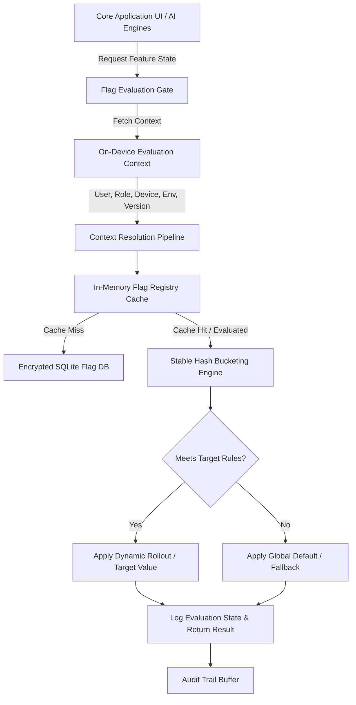
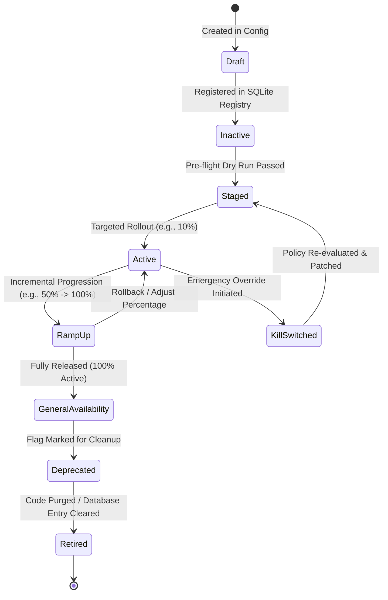
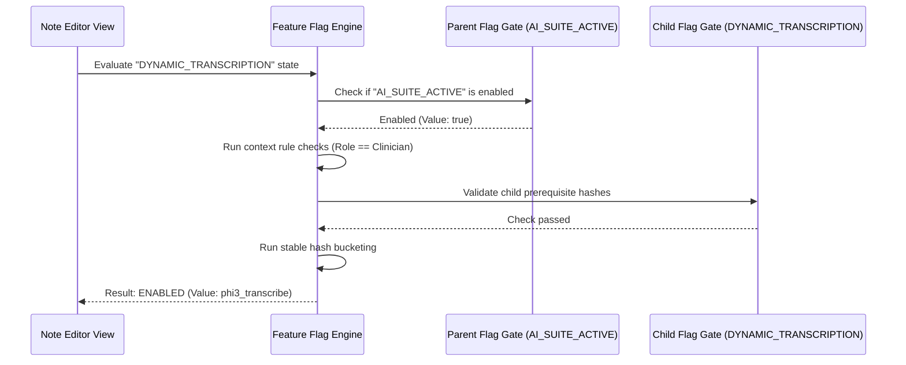

# LifeFresh AI Constitution
## AI Feature Flag Engine Specification v1.0

**Version:** 1.0  
**Status:** Approved / Core Reference Architecture  
**Last Updated:** July 2026  
**Classification:** Enterprise Internal  

---

### Purpose
The **AI Feature Flag Engine** is the primary system responsible for safely enabling, disabling, targeting, scheduling, and rolling back application capabilities and AI components inside the LifeFresh QuickNote Pro ecosystem. Operating entirely on-device to maintain an offline-first, edge-native profile, this engine decouples feature deployment from code releases. It allows the local AI system to dynamically toggle UI screens, database behaviors, prompt templates, local model configurations, and custom workflows. This guarantees continuous clinical operations, quick risk mitigation, and controlled beta evaluations without requiring active internet connectivity.

---

### Scope
This specification governs the design, evaluation pipelines, deterministic bucketing algorithms, SQLite storage schemas, YAML policies, security configurations, and API interfaces of the on-device Feature Flag Engine. It covers boolean flags, multivariate flags, numeric and string configuration values, and AI-specific target parameters (e.g., model file overrides, prompt template branches, and memory indexing settings). It is designed to work on low-resource Android tablets, clinical laptops, and offline mobile terminals.

---

### Objectives
* **Deterministic Local Evaluation:** Resolve flag states locally in **<1ms** with zero network roundtrips, ensuring zero UI stutter.
* **Granular Target Routing:** Support multi-factor target routing based on user role, device telemetry, location, environment, and version rules.
* **Instant Risk Mitigation:** Provide robust, hardware-independent emergency kill switches that instantly disable failing AI models or complex background workflows.
* **Zero-Knowledge Cohort Selection:** Support percentage-based rollouts and user cohort targeting using local, stable hashing without storing or transmitting identifiable patient records (PII/PHI).

---

### Design Principles
* **Fail-Safe Default Operation:** If a flag is missing, corrupted, or unreachable, the engine must fall back immediately to a hardcoded, highly secure default state.
* **Asynchronous Off-Thread Ingestion:** Flag configuration updates must ingest asynchronously on background threads, ensuring they never block active clinical notes operations.
* **Non-Blocking Cached Reads:** Keep flag evaluation contexts in high-speed, thread-safe in-memory cache blocks, reading from the SQLite store only on startup or configuration changes.
* **Strict Separation of Concerns:** Toggling feature flags must modify only the routing logic of target components without directly altering their internal implementations.

---

### 1. Functional Boundaries & Distinctions
To avoid structural overlap, the AI Feature Flag Engine defines clear operational boundaries:

| System Domain | Primary Responsibility | Data Duration | Sync Trigger | Reference Module |
| :--- | :--- | :--- | :--- | :--- |
| **Feature Flag Engine** | Resolves active features, model choices, and UI states dynamically. | Transient cache, local store. | Instant on-device update or MDM. | `AI_Feature_Flag_Engine.md` |
| **Configuration Engine** | Dispatches system thresholds, alarm bounds, and connection URLs. | Persistent parameters. | Periodic configuration updates. | `AI_Configuration_Engine.md` |
| **Deployment Engine** | Installs, packages, and verifies binary assets and models. | Lifecycle release state. | Software upgrade/downgrade steps. | `AI_Deployment_Engine.md` |
| **Policy/Rule Engine** | Evaluates clinical compliance and security restrictions. | Rigid rule sets. | Legal profile updates. | `AI_Compliance_Engine.md` |
| **Version Manager** | Governs binary code compatibility and active package versions. | SemVer tags on disk. | Explicit version hot-switches. | `AI_Version_Manager.md` |

---

### 2. Feature Flag Architecture
The Feature Flag Engine utilizes a non-blocking context evaluator paired with a thread-safe local registry:



---

### 3. Core Components
* **Registry Coordinator:** Manages the active state cache, handling YAML configurations and resolving database transactions.
* **Evaluation Pipeline:** Combines context rules (users, roles, device, environment, version) to determine flag active states.
* **Stable Hash Bucketer:** Implements non-cryptographic, stable hashing algorithms to partition users into percentage rollout buckets without identifying individual records.
* **Emergency Watchdog:** Listens to physical system signals (high temperatures, database locks) to trigger safety overrides and automatic rollbacks.
* **Audit Reporter:** Writes evaluation events, state transitions, and diagnostic metrics to the on-device secure log.

---

### 4. Feature Flag Lifecycle & State Machine
Every feature flag managed by the engine transitions through a formal, auditable lifecycle:



---

### 5. Multi-Domain Flag Classifications
The engine governs several distinct flag categories to support varied application requirements:

* **Boolean Flags:** Standard true/false toggles used to show or hide experimental UI views or new note-taking panels.
* **Multivariate Flags:** Multi-state flags returning complex strings or integers (e.g., switching model selection from `llama_3b_q4` to `phi3_mini` based on device RAM).
* **AI Model and Prompt Flags:** Toggles prompt layouts and target embeddings, allowing administrators to route users to optimized templates.
* **Safety & Emergency Kill Switches:** High-priority override flags that immediately disable heavy background indexing or voice transcription if battery levels drop or thermal limits are exceeded.
* **Offline Flags:** Stored configurations designed to survive long disconnected periods, providing predictable fallbacks without server synchronization.

---

### 6. Cohort Targeting & stable Hashing
Percentage-based rollouts must be deterministic and privacy-preserving. The engine uses a salt-hashed bucketing algorithm (MurmurHash3) to assign users to rollout buckets without storing sensitive identifiers.

```
                  +-----------------------------------+
                  | User ID + Flag Key + Salt String  |
                  +-----------------------------------+
                                    |
                                    v
                     +-----------------------------+
                     |  MurmurHash3 (32-bit Integer)|
                     +-----------------------------+
                                    |
                                    v
                       +-------------------------+
                       |   Bucket = Value % 100  |
                       +-------------------------+
                                    |
                   +---------------------------------+
                   |                                 |
                   v                                 v
         +-------------------+             +-------------------+
         | Bucket < Target%  |             | Bucket >= Target% |
         +-------------------+             +-------------------+
                   |                                 |
                   v                                 v
         +-------------------+             +-------------------+
         |  Enable Feature   |             |  Disable Feature  |
         +-------------------+             +-------------------+
```

---

### 7. Evaluation Algorithms & Rules

#### 7.1 MurmurHash3 Deterministic Bucketing
The bucketing algorithm ensures that users remain in the same cohort across flag updates:

```kotlin
object StableBucketer {
    fun calculateBucket(userId: String, flagKey: String, salt: String = "LifeFreshSalt"): Int {
        val input = "$userId:$flagKey:$salt"
        val hash = murmurHash3_32(input.toByteArray(Charsets.UTF_8))
        return Math.abs(hash % 100)
    }

    private fun murmurHash3_32(data: ByteArray, seed: Int = 0x01234567): Int {
        var h1 = seed
        val length = data.size
        val nblocks = length / 4

        for (i in 0 until nblocks) {
            var k1 = (data[i * 4].toInt() and 0xFF) or
                    ((data[i * 4 + 1].toInt() and 0xFF) shl 8) or
                    ((data[i * 4 + 2].toInt() and 0xFF) shl 16) or
                    ((data[i * 4 + 3].toInt() and 0xFF) shl 24)

            k1 *= 0xcc9e2d51
            k1 = (k1 shl 15) or (k1 ushr 17)
            k1 *= 0x1b873593

            h1 = h1 xor k1
            h1 = (h1 shl 13) or (h1 ushr 19)
            h1 = h1 * 5 + 0xe6546b64
        }

        var k1 = 0
        val tailStart = nblocks * 4
        val remaining = length - tailStart
        if (remaining > 0) {
            if (remaining >= 3) k1 = k1 or ((data[tailStart + 2].toInt() and 0xFF) shl 16)
            if (remaining >= 2) k1 = k1 or ((data[tailStart + 1].toInt() and 0xFF) shl 8)
            if (remaining >= 1) {
                k1 = k1 or (data[tailStart].toInt() and 0xFF)
                k1 *= 0xcc9e2d51
                k1 = (k1 shl 15) or (k1 ushr 17)
                k1 *= 0x1b873593
                h1 = h1 xor k1
            }
        }

        h1 = h1 xor length
        h1 = h1 xor (h1 ushr 16)
        h1 *= 0x85ebca6b
        h1 = h1 xor (h1 ushr 13)
        h1 *= -0x3d02c310
        h1 = h1 xor (h1 ushr 16)

        return h1
    }
}
```

---

### 8. System Switch Shift Matrix
The following decision matrix dictates system responses to flag dependencies and runtime conflicts:

| Target Flag Type | Prerequisites Met? | Telemetry Alert? | Memory Check? | Default Value Rule | Resolution Action |
| :--- | :--- | :--- | :--- | :--- | :--- |
| **AI Note Summarizer** | Yes | None | OK ($>256\text{MB}$) | `disabled` | Load dynamic Phi3 model |
| **AI Note Summarizer** | Yes | Temp Alert ($>45^\circ\text{C}$) | OK | `disabled` | Force CPU fallback / Throttle |
| **AI Note Summarizer** | Yes | Low Battery ($<10\%$) | OK | `disabled` | Switch to basic regex summarizer |
| **AI Note Summarizer** | No | None | OK | `disabled` | Force fallback, log prerequisite error |
| **Voice Transcriber** | Yes | None | RAM Low ($<128\text{MB}$) | `disabled` | Reject loading, notify user |

---

### 9. Flag Dependency Validation Flow
Ensures child flags cannot execute if parent flags are disabled or unvalidated:



---

### 10. API Contracts & Data Structures

#### 10.1 Kotlin API Definition
```kotlin
interface FeatureFlagService {
    suspend fun getBooleanFlag(flagKey: String, defaultValue: Boolean): Boolean
    suspend fun getStringFlag(flagKey: String, defaultValue: String): String
    suspend fun getIntFlag(flagKey: String, defaultValue: Int): Int
    suspend fun evaluateAllFlags(context: EvaluationContext): Map<String, Any>
    suspend fun forceLocalKillSwitch(flagKey: String): Boolean
}

data class EvaluationContext(
    val userId: String,
    val userRole: String, // CLINICIAN, ADMINISTRATOR, RESEARCHER
    val appVersion: String,
    val systemEnvironment: String, // PRODUCTION, STAGING, SANDBOX
    val currentBatteryLevel: Float,
    val currentDeviceTempCelsius: Float,
    val remainingMemoryMb: Long
)
```

#### 10.2 SQLite Database Registry Schema
```sql
CREATE TABLE feature_flag_definitions (
    flag_key TEXT PRIMARY KEY NOT NULL,
    display_name TEXT NOT NULL,
    flag_type TEXT NOT NULL, -- BOOLEAN, MULTIVARIATE, INT, STRING
    status TEXT NOT NULL, -- ACTIVE, INACTIVE, DEPRECATED, KILL_SWITCHED
    global_default_value TEXT NOT NULL,
    rules_json TEXT NOT NULL, -- Target cohorts and requirements
    salt TEXT NOT NULL,
    last_modified_utc INTEGER NOT NULL
);

CREATE TABLE feature_flag_evaluations (
    evaluation_id TEXT PRIMARY KEY NOT NULL,
    flag_key TEXT NOT NULL,
    user_id_hash TEXT NOT NULL,
    resolved_value TEXT NOT NULL,
    evaluation_reason TEXT NOT NULL, -- TARGET_RULE, PERCENTAGE, GLOBAL_DEFAULT
    evaluated_utc INTEGER NOT NULL,
    FOREIGN KEY (flag_key) REFERENCES feature_flag_definitions(flag_key) ON DELETE CASCADE
);

CREATE TABLE feature_flag_kill_switches (
    switch_id TEXT PRIMARY KEY NOT NULL,
    flag_key TEXT NOT NULL,
    activated_utc INTEGER NOT NULL,
    triggered_by TEXT NOT NULL, -- SYSTEM_MONITOR, MDM_PROFILE, MANUAL
    reason TEXT NOT NULL,
    FOREIGN KEY (flag_key) REFERENCES feature_flag_definitions(flag_key) ON DELETE CASCADE
);
```

#### 10.3 YAML Configuration Manifest
```yaml
feature_flag_policy:
  policy_version: "1.0.0"
  release_tag: "ff_v2026_07"
  definitions:
    - key: "ai_note_summarizer"
      name: "LifeFresh AI Prompt Summarizer"
      type: "MULTIVARIATE"
      status: "ACTIVE"
      global_default: "basic_regex"
      salt: "note_sum_salt_2026"
      rules:
        - cohort: "clinicians"
          conditions:
            role: "CLINICIAN"
            battery_min: 15.0
            ram_free_min_mb: 256
          rollout_percentage: 100
          value: "local_phi3_mini"
        - cohort: "beta_group"
          conditions:
            battery_min: 30.0
            ram_free_min_mb: 512
          rollout_percentage: 25
          value: "local_llama3_3b"
    - key: "background_sync_v2"
      name: "Background Sync Engine v2"
      type: "BOOLEAN"
      status: "ACTIVE"
      global_default: "false"
      salt: "bg_sync_v2_salt"
      rules:
        - cohort: "all_production"
          conditions:
            environment: "PRODUCTION"
            battery_min: 20.0
          rollout_percentage: 50
          value: "true"
```

#### 10.4 JSON Evaluation Log Example
```json
{
  "eventId": "evt_ff_eval_00912a",
  "timestampUtc": 1783648110000,
  "flagKey": "ai_note_summarizer",
  "userIdHash": "e3b0c44298fc1c149afbf4c8996fb92427ae41e4649b934ca495991b7852b855",
  "evaluatedContext": {
    "userRole": "CLINICIAN",
    "batteryLevel": 42.5,
    "freeMemoryMb": 384
  },
  "resolvedValue": "local_phi3_mini",
  "evaluationReason": "TARGET_RULE_MATCHED",
  "ruleMatched": "clinicians"
}
```

---

### 11. Security and Privacy
* **Zero PII Exposure:** User IDs are hashed on-device using SHA-256 before being processed by evaluation logs or stable bucketing routines, preventing patient record leaks.
* **Encrypted Storage Boundaries:** Flag definitions and on-device evaluations are stored in private, app-sandboxed SQLite tables, protected with hardware-linked keys.
* **Signature Enforcement:** Flag configuration files imported on-device require cryptographic signature validation before being ingested.

---

### 12. Performance Optimization
* **In-Memory Cache Layer:** The engine caches evaluated flag values during session lifetimes. Readings avoid disk access, keeping lookup latencies to **<1ms**.
* **High-Frequency Throttle:** When views reference flags inside scroll lists, the engine returns the cached state instantly, bypassing calculation loops.
* **Incremental Updates:** Synchronization files contain only modified flag definitions (deltas), reducing memory usage on low-capacity mobile links.

---

### 13. Testing Strategy
* **Fault Injection Checks:** Forces battery drop alerts ($<10\%$) and high temperature spikes during note summaries to confirm child flag and safe-mode overrides.
* **Bucketing Uniformity Tests:** Evaluates bucketing distributions using 10,000 dummy hashes to ensure cohorts remain uniformly distributed.
* **Cyclic Dependency Diagnostics:** Validates flag definitions on ingest to detect and reject circular prerequisites (e.g., Flag A depends on Flag B, which depends on Flag A).

---

### 14. Enterprise Governance
* **Stale Flag Auditing:** Automatically logs warnings if flags are active for more than 180 days, assisting developer cleanup efforts.
* **MDM Override Profiles:** Provides signed override packages, allowing enterprise administrators to lock or disable features across specific device segments.

---

### 15. Best Practices & Anti-patterns

#### Best Practices
* **Enforce Safe Fallbacks:** Define robust, fail-safe defaults for every flag to protect clinical operations if updates fail.
* **Minimize Flag Lifespans:** Plan feature removals when features reach General Availability, preventing technical debt.
* **Keep Evaluations Synchronous in UI:** Read flag states from high-speed caches to prevent UI freezing during layout creation.

#### Anti-patterns
* **Deeply Nested Flags:** Nesting prerequisite flags more than 3 levels deep, complicating troubleshooting.
* **Logging Direct Identifiers:** Saving raw patient names or clinician IDs in evaluation logs.
* **Dynamic Database Migrations via Flags:** Triggering SQLite schema changes dynamically using feature flags, causing structural instability.

---

### Future Enhancements
* **Dynamic Biomarker Diagnostics:** Automatically calibrate diagnostic rules and alert priorities based on active user fatigue trends.
* **Decentralized Local Diagnostics Mesh:** Cross-verify diagnostic reports securely on offline networks, helping administrators locate and isolate failed hardware nodes.

---

### Related AI Constitution Documents
* `AI_Compliance_Engine.md`
* `AI_Health_Monitor.md`
* `AI_Logging_Engine.md`

---

### References
1. Dynamic Asset Configuration and Edge-Based Feature Flag Evaluation Patterns: Best Practices
2. NIST SP 800-162: Zero Trust Access and Local Target Rule Enforcements
3. Android NNAPI: Hardware Profiling and Thermal-Aware AI Fallback Controls

---

### Conclusion
The AI Feature Flag Engine provides a highly secure, predictable, and local framework designed to manage and target application capabilities inside disconnected clinical zones. By combining stable hashing algorithms, contextual rules, and emergency kill switches, the Engine ensures that the LifeFresh platform maintains continuous operations, safety, and compliance under all working conditions.
