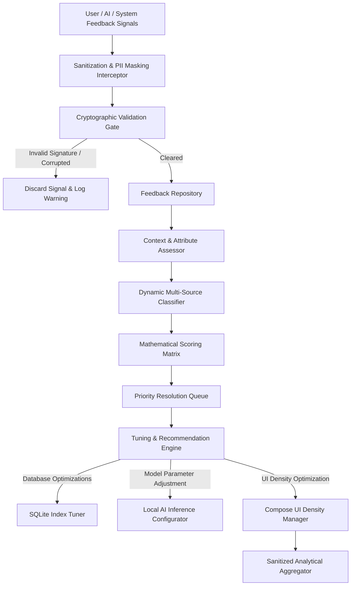
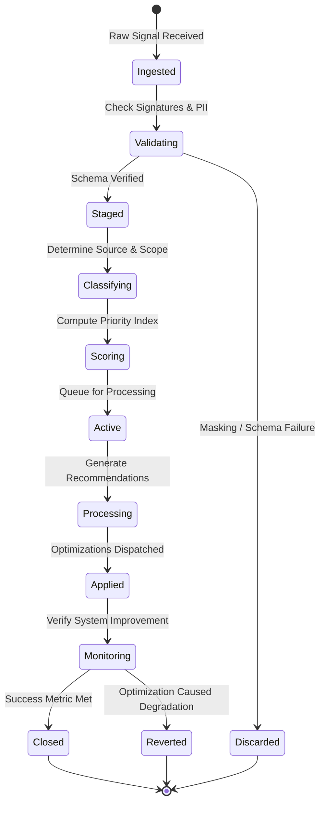

# LifeFresh AI Constitution
## AI Feedback Engine Specification v1.0

**Version:** 1.0  
**Status:** Approved / Core Reference Architecture  
**Last Updated:** July 2026  
**Classification:** Enterprise Internal  

---

### Purpose
The **AI Feedback Engine** is the core continuous learning pipeline and quality-governance arbiter of the LifeFresh AI platform. In a decentralized, offline-first medical and productivity workspace, static system configurations lead to degradation of utility and missed optimization opportunities. The Feedback Engine is responsible for collecting, validating, analyzing, prioritizing, and utilizing user feedback, AI self-feedback, system execution metrics, and performance signals locally on-device. This ensures that the entire platform (from local LLM pipelines to the `AI_Rule_Engine.md` and `AI_Decision_Engine.md`) adapts dynamically, minimizes cognitive load, and continuously improves without compromising data privacy or clinical compliance.

---

### Scope
This specification governs the design, feedback lifecycle, evaluation mechanisms, classification schemas, scoring mathematical models, API contracts, and SQLite relational databases of the local Feedback Engine. It manages user feedback, AI self-feedback, system execution telemetry, performance profiles, quality signals, and behavioral optimization loops.

---

### Objectives
* **Deterministic Quality Guardrails:** Formulate quantitative quality metrics ($Q_s \in [0.0, 1.0]$) for every local AI action, workflow, and interface rendering.
* **Granular Multi-Source Ingestion:** Seamlessly capture and classify feedback signals from users, model self-evaluations, execution statistics, and system logs.
* **Low-Latency Feedback Scoring:** Validate, classify, and score feedback entries locally on-device in **<12ms** to maintain system performance.
* **Private Offline Alignment:** Run complete reinforcement loops and configuration tuning locally, syncing sanitized metadata updates only when secure connections are active.

---

### Design Principles
* **Privacy-First Ingestion:** Raw user interactions, clinical comments, and feedback texts are processed and stored locally, with strict PII masking enforced before any external transmission.
* **Multi-Loop Architecture:** Support micro-loops (immediate UI adaptation), tactical loops (local database index optimization), and strategic loops (long-term model updates).
* **Quantified Objectivity:** All unstructured feedback (e.g., clinician comments) must be decomposed and mapped to structured, quantifiable vectors.
* **Immutable Feedback Trail:** Every collected feedback item, system adjustment recommendation, and optimization check is recorded as an append-only, signed log entry.

---

### 1. Engine Overview
The **AI Feedback Engine** is the optimization core of the platform. It collects raw signals (e.g., user correction clicks, model confidence metrics, disk writes latency), maps them into structured feedback models, scores their relative priority, and generates concrete adjustment recommendations. These recommendations are delivered directly to local learning pipelines and execution schedulers to tune system behaviors dynamically.

---

### 2. Core Responsibilities
* **Multi-Channel Ingestion:** Intercepting and processing feedback from UI controls, model outputs, database operations, and system watchdogs.
* **Feedback Validation and Sanitization:** Sanitizing inputs to remove PII and verifying cryptographic signatures for admin configurations.
* **Priority Allocation and Classification:** Computing dynamic scores based on signal severity, context, and potential optimization impact.
* **Recommendation Generation:** Synthesizing actionable tuning parameters for local engines (e.g., adjustment of thread counts or UI spacing density).

---

### 3. Feedback Architecture
The Feedback Engine utilizes an integrated pipeline to capture, sanitize, analyze, and apply optimizations locally:



---

### 4. Feedback Lifecycle
Feedback items progress through an immutable state machine to guarantee absolute traceability across active learning loops:



---

### 5. User Feedback
User feedback capture spans explicit inputs (e.g., clicking a thumbs-up icon on a generated summary) and implicit behavioral metrics (e.g., how long a clinician pauses before clicking "Confirm").

```json
{
  "feedbackId": "fb_usr_explicit_0911a",
  "source": "USER",
  "type": "EXPLICIT_CORRECTION",
  "ownerId": "usr_clinician_012",
  "payload": {
    "actionId": "summary_gen_8819",
    "score": 1,
    "userCommentMasked": "Clinical summary format adjusted by user"
  },
  "context": {
    "deviceBatteryLevel": 85,
    "userFatigueIndex": 0.45
  }
}
```

---

### 6. AI Self-feedback
AI self-feedback runs during the inference cycle. The local LLM pipeline evaluates its own generated summaries, calculating parameters like confidence intervals and semantic consistency scores, and writing warnings if scores fall below safe margins.

---

### 7. System Feedback
System feedback tracks hardware performance metrics, such as CPU utilization during local AI inference, database write latency, and network handshake durations.

---

### 8. Execution Feedback
Execution feedback monitors the outcomes of commands run by the `AI_Execution_Engine.md`. It tracks retry rates, transaction timeouts, and rollback frequencies to optimize scheduling pipelines.

---

### 9. Performance Feedback
Performance feedback monitors resource utilization metrics, checking thread dispatch latencies and disk write times to identify execution bottlenecks.

---

### 10. Quality Feedback
Quality feedback evaluates the clinical accuracy and structural consistency of local platform outputs against validated baseline schemas.

---

### 11. Error Feedback
Error feedback processes system exceptions and validation warnings, organizing error profiles by category to prioritize recovery operations.

---

### 12. Learning Feedback
Learning feedback integrates directly with local learning models, feeding processed performance scores and user edits back to reinforce local optimization weightings.

---

### 13. Behavioral Feedback
Behavioral feedback evaluates user interaction patterns, analyzing parameters like click cadences, scrolling rates, and screen transition times to optimize interface designs.

---

### 14. Context-aware Feedback
The engine evaluates feedback signals against the active context map, tailoring system optimizations to environmental and user states:

| Dynamic Context | Evaluation Parameter | Action Adjustment | Intended Outcome |
| :--- | :--- | :--- | :--- |
| Fatigue Index $> 0.70$ | UI Prompt Click Rate | Increase prompt size, slow down transitions | Reduce clinician input errors |
| Low Storage $< 100\text{MB}$| Storage Sync Latency | Compress local database tables immediately | Prevent local storage failure |
| Weak Wi-Fi Signal | Network Timeout Rate| Suspend non-critical background uploads | Conserve battery and network bandwidth |

---

### 15. Feedback Classification
Signals are classified into distinct execution namespaces:
* **UI_AESTHETICS:** Interface rendering speeds, layout spacing issues, and text readability.
* **SYSTEM_PERF:** Thread delays, SQLite locking states, and file I/O bottlenecks.
* **AI_QUALITY:** Model generation accuracy, confidence metrics, and tone compliance.

---

### 16. Feedback Prioritization
Feedback items carry explicit priority ratings ($P_f \in [0, 1000]$). Priority is calculated dynamically on-device using a multi-factor weighting formula:

$$ P_f = w_e \cdot E_{sev} + w_c \cdot C_{impact} + w_f \cdot F_w $$

Where:
* $E_{sev}$ is the error severity score.
* $C_{impact}$ is the clinical workflow impact score.
* $F_w$ is the user fatigue weighting index.
* $w_e, w_c, w_f$ are weighting parameters configured by active policies, with $\sum w_i = 1.0$.

---

### 17. Feedback Validation
Before being written to the database, proposed feedback logs undergo validation. The validator sanitizes inputs to remove personal identifier fields, checks the schema format, and verifies signature codes.

---

### 18. Feedback Scoring
The feedback scoring module evaluates raw signals to compute quality ratings:

```kotlin
fun calculateQualityScore(successRate: Float, latencyMs: Long): Float {
    val latencyPenalty = if (latencyMs > 500) 0.2f else 0.0f
    return (successRate - latencyPenalty).coerceIn(0.0f, 1.0f)
}
```

---

### 19. Feedback Processing Pipeline
The processing pipeline runs in a non-blocking background sequence:
1. **Ingest:** Intercepts incoming telemetry and user click actions.
2. **Sanitize:** Strips clinical parameters and identifiers.
3. **Classify:** Groups signals into logical feedback namespaces.
4. **Evaluate:** Calculates the quality score and priority rating.
5. **Recommend:** Generates actionable configurations for the execution engine.

---

### 20. Recommendation Generation
Tuning recommendations are compiled as structured configurations. These parameters are verified by local models before being applied to the active runtime system.

---

### 21. Continuous Improvement
Recommendations are applied in a closed loop. The engine monitors system performance after an update; if quality metrics do not improve, the configuration is reverted to the last stable state.

---

### 22. Feedback Repository
The **Feedback Repository** is a secure, local, encrypted SQLite database. It manages active feedback profiles, historical logs, error statistics, and optimization parameters on-device.

---

### 23. Analytics Integration
The engine aggregates performance metrics over 30-day periods, producing sanitized trend reports that are synchronized with central enterprise portals.

---

### 24. Learning Integration
Processed feedback metrics are routed directly to local reinforcement models, adjusting model weights and parameter priorities to improve output quality over time.

---

### 25. Monitoring
* **Telemetry Latency:** Tracks feedback processing times, logging alerts if ingestion loops exceed **12ms**.
* **Database Utilization:** Monitors Feedback database size, executing auto-compression loops if storage parameters exceed safe bounds.

---

### 26. Logging
Diagnostic log entries write to local encrypted files. No patient details or unmasked keys are allowed in logging outputs:

```
[2026-07-11 02:40:11] [INFO] [FEEDBACK_ENGINE] Ingesting implicit feedback for summary_gen_8819
[2026-07-11 02:40:11] [INFO] [FEEDBACK_ENGINE] Sanitization completed. Signature verified.
[2026-07-11 02:40:12] [INFO] [FEEDBACK_ENGINE] Priority computed: 720. Status stage transition: ACTIVE.
[2026-07-11 02:40:14] [INFO] [FEEDBACK_ENGINE] Recommendation committed: ADJUST_LLM_MAX_TOKENS = 256.
```

---

### 27. APIs
The Feedback Engine exposes type-safe Kotlin interfaces to coordinate operations with other platform layers:

```kotlin
interface FeedbackService {
    suspend fun registerFeedback(feedback: FeedbackDefinition): Result<String>
    suspend fun getRecommendations(category: String): Result<List<TuningRecommendation>>
    suspend fun getQualityMetrics(actionId: String): Result<QualityScoreSnapshot>
    suspend fun applyOptimization(recommendationId: String): Boolean
}
```

---

### 28. Internal Data Structures
To ensure safe background thread operations, feedback configurations use immutable Kotlin structures:

```kotlin
data class FeedbackDefinition(
    val feedbackId: String,
    val source: String,
    val feedbackType: String,
    val ownerId: String,
    val payloadJson: String,
    val timestampUtc: Long
)
```

---

### 29. SQL Feedback Schema
The SQLite tables organize feedback profiles, historical telemetry, and optimization logs in a structured, relational layout:

```sql
CREATE TABLE feedback_records (
    feedback_id TEXT PRIMARY KEY NOT NULL,
    source TEXT NOT NULL,
    feedback_type TEXT NOT NULL,
    owner_id TEXT NOT NULL,
    priority INTEGER NOT NULL,
    state TEXT NOT NULL,
    payload_json TEXT NOT NULL,
    created_at INTEGER NOT NULL
);

CREATE TABLE optimization_recommendations (
    recommendation_id TEXT PRIMARY KEY NOT NULL,
    feedback_id TEXT NOT NULL,
    category TEXT NOT NULL,
    tuning_key TEXT NOT NULL,
    tuning_value TEXT NOT NULL,
    state TEXT NOT NULL,
    FOREIGN KEY (feedback_id) REFERENCES feedback_records(feedback_id) ON DELETE CASCADE
);

CREATE TABLE quality_metrics_log (
    metric_id TEXT PRIMARY KEY NOT NULL,
    action_id TEXT NOT NULL,
    timestamp_utc INTEGER NOT NULL,
    quality_score REAL NOT NULL,
    latency_ms INTEGER NOT NULL,
    battery_delta REAL NOT NULL
);
```

---

### 30. Performance Optimization
* **Prefiltered Ingestion Hooks:** Filters out redundant telemetry signals before writing logs to SQLite, minimizing disk overhead.
* **Aggregated Writes:** Batch-commits background feedback logs to disk every 60 seconds during periods of active user interaction.

---

### 31. Security Controls
* **Signature Verification:** All corporate diagnostic profiles must carry valid signatures from administrative keys.
* **Sandbox Verification:** Tuning recommendations must run inside a secure local sandbox before updating active system settings.

---

### 32. Privacy Controls
* **PII Redaction:** Unstructured text comments pass through local regex redaction filters to scrub names, telephone numbers, and medical IDs.
* **Strict Localization:** Feedback comments and raw UI timing metrics are retained locally on the device, with zero cloud uploads permitted.

---

### 33. Error Handling
* **Stale Workspace Signals:** If system context metrics fail, the engine falls back to default safety parameters, logging a diagnostic warning.
* **Corrupted Log Schemas:** If schema errors are identified, the engine rejects the target feedback package and logs the incident.

---

### 34. Recovery Mechanisms
If systematic errors or performance degradation occur following an optimization update, the watchdog engine rolls back parameters to the last stable configuration.

---

### 35. Enterprise Deployment
For enterprise fleets, default feedback thresholds and model tuning coefficients can be packaged as signed JSON configurations deployed across devices using corporate MDM platforms.

---

### 36. Future Expansion
* **Collaborative Local Learning:** Share sanitized optimization coefficients securely across peer device nodes on offline networks.
* **Dynamic Biomarker Adaptation:** Tune UI spacing and feedback parameters dynamically based on real-time fatigue and focus metrics.

---

### Conclusion
The AI Feedback Engine provides a robust, secure, and continuous optimization framework designed for edge-native healthcare deployments. By enforcing strict local validation, PII redaction, and closed-loop optimization monitoring, the Engine ensures that the host platform dynamically adapts, remains accurate, and maintains performance under all operating conditions.

### Related AI Constitution Documents
* `AI_Execution_Engine.md`
* `AI_Rule_Engine.md`
* `AI_Decision_Engine.md`

### References
1. Continuous Reinforcement Learning at the Edge: Core Concepts and Implementations
2. NIST SP 800-162: Zero Trust Systems and Learning Verification Guidelines
3. Android Keystore System: Best Practices for Local Operations and Privacy Controls
