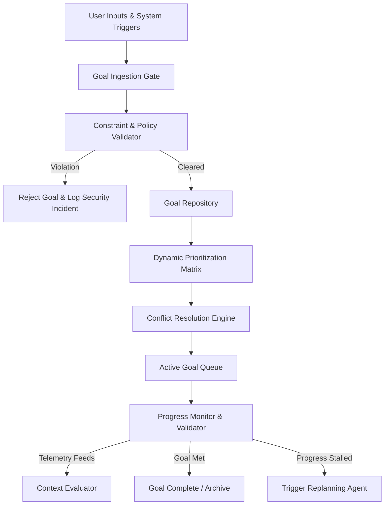
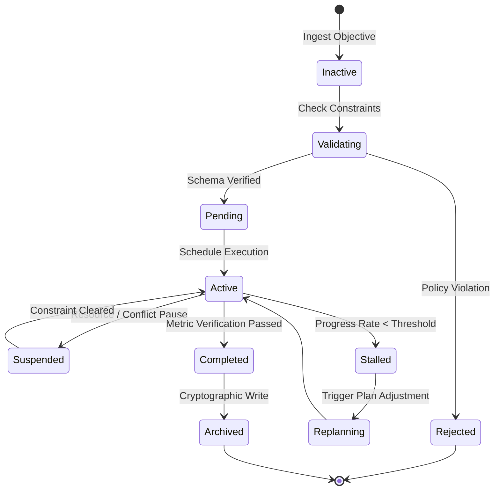

# LifeFresh AI Constitution
## AI Goal Engine Specification v1.0

**Version:** 1.0  
**Status:** Approved / Core Reference Architecture  
**Last Updated:** July 2026  
**Classification:** Enterprise Internal  

---

### Purpose
The **AI Goal Engine** is the ultimate structural mechanism for defining, prioritizing, validating, tracking, and resolving the dynamic objective hierarchies of the LifeFresh AI ecosystem. Operating on-device as an offline-first foundation, it defines "what" the system must achieve while preserving security, clinical safety, user preferences, and resource constraints. It acts as the intentional coordinator for the `AI_Planning_Engine.md` and the `AI_Autonomous_Engine.md`, transforming abstract intent into mathematically bounded and auditable target structures.

---

### Scope
This specification governs the design, lifecycle, validation pipelines, prioritization algorithms, data schemas, security rules, and APIs of the local Goal Engine. It covers all goal types across user interaction optimization, background tasks, data management operations, and clinical workflow coordination.

---

### Objectives
* **Deterministic Goal Modeling:** Ensure all objectives are formulated with strict, quantifiable metrics, eliminating ambiguous or infinite execution states.
* **Granular Multi-Agent Coordination:** Orchestrate and align primary, secondary, short-term, and long-term goals between user commands and AI background operations.
* **Low-Latency Metric Evaluation:** Resolve goal state verification and progress metrics locally in **<10ms** to prevent main-thread latency.
* **Failsafe Bound Constraint:** Enforce strict safety constraints that dynamically prune or invalidate goals violating clinical, privacy, or security rules.

---

### Design Principles
* **Goal Declarativism:** Goals must be modeled as structured, declarative configurations separate from runtime execution frameworks.
* **Hierarchical Alignment:** Secondary, short-term, and operational sub-goals must mathematically align with and support the fulfillment of primary user-defined objectives.
* **Resource Sensitivity:** Throttles or postpones non-critical goals dynamically when system resources (battery, memory, CPU) drop below safe margins.
* **Auditability-by-Default:** Every goal modification, prioritization shift, and completion check is logged as an append-only, cryptographically signed trace.

---

### 1. Engine Overview
The **AI Goal Engine** is the intentional core of the platform. It translates user-defined tasks and system optimization parameters into structured, verifiable goal trees. It tracks completion metrics locally in SQLite, matching targets against incoming telemetry streams from the platform context managers. The results are fed directly into the `AI_Planning_Engine.md` to compile tactical task lists.

---

### 2. Objectives
The objectives of the Goal Engine focus on ensuring absolute logical consistency and safety in a multi-agent system. It must evaluate conflicting intents, prevent goal drift, resolve dependencies, and enforce absolute clinical and security policies.

---

### 3. Design Principles
The Goal Engine follows a strict quantitative and deterministic design philosophy:
* **Quantifiability:** Every goal must define an explicit success function $S_g(x) \in [0.0, 1.0]$.
* **Immutable Isolation:** Goals belong to isolated profiles, preventing cross-tenant leakage.
* **Stability-Centered Clamping:** Limit the rate of dynamic priority shifts to prevent system vibration or task thrashing.

---

### 4. Core Responsibilities
* **Goal Ingestion and Parsing:** Converting declarative JSON schemas into local binary execution trees.
* **Priority Allocation:** Computing dynamic scores based on local resource levels, user fatigue metrics, and clinical urgency.
* **Conflict Resolution:** Identifying and pruning contradictory goal states before planning begins.
* **Progress Verification:** Continually checking objective fulfillment criteria against context buffers.

---

### 5. Goal Architecture
The Goal Engine utilizes a tiered architecture to ingest, validate, score, and monitor active objectives:



---

### 6. Goal Lifecycle
Goals follow an immutable state machine to guarantee absolute traceability across active and historical tasks:



---

### 7. Goal Repository
The **Goal Repository** is stored in a secure, local, AES-256-GCM encrypted SQLite database. It manages active goal nodes, historical records, dependency mappings, and validation metrics on the device.

---

### 8. Goal Categories
To optimize the evaluation loops, objectives are classified into explicit operational namespaces:
* **Primary:** Core user-facing tasks (e.g., patient intake completion).
* **Secondary:** Supporting optimizations (e.g., local table cleanups).
* **Short-term:** Execution sequences with timelines $<60$ minutes.
* **Long-term:** Architectural objectives running over multiple shifts.

---

### 9. Primary Goals
Primary goals represent explicit, top-level user directives. They carry absolute execution priority and dictate the creation of supporting background tasks.

```json
{
  "goalId": "goal_prim_intake_881b",
  "category": "PRIMARY",
  "name": "Complete Patient Intake Form",
  "version": "1.0.0",
  "ownerId": "usr_practitioner_012",
  "priorityScore": 950,
  "successCriteria": {
    "targetField": "intake_form.status",
    "expectedValue": "SUBMITTED"
  }
}
```

---

### 10. Secondary Goals
Secondary goals are background optimization tasks generated automatically to support system performance, resource management, or interface caching.

---

### 11. Short-term Goals
Short-term goals represent transient milestones (e.g., validating a biometrics sensor reading). These carry rapid expiration thresholds and strict completion timeouts.

---

### 12. Long-term Goals
Long-term goals manage multi-shift objectives (e.g., tracking a clinical lead's progress through an intake pipeline), coordinating events and synchronizing data over extended periods.

---

### 13. User Goals
User goals represent personal preferences, such as enabling specific accessibility modes, configuring interface quiet hours, or managing interaction density targets.

---

### 14. AI System Goals
AI system goals govern the execution metrics of local LLM pipelines, optimizing parameters like prompt size, generation speed, and classification confidence scores.

---

### 15. Organizational Goals
Organizational goals align with the clinic's administrative and clinical policies (e.g., enforcing double-blind verification rules for critical medical prescriptions).

---

### 16. Goal Prioritization
Goal priority is computed dynamically on-device using a multi-factor weighting formula. The absolute priority score $P_g$ is modeled as:

$$ P_g = w_u \cdot U_c + w_r \cdot R_s + w_f \cdot F_i $$

Where:
* $U_c$ is the user urgency score (derived from manual selections and deadlines).
* $R_s$ is the local resource availability score (battery, memory, connection status).
* $F_i$ is the clinician cognitive fatigue index.
* $w_u, w_r, w_f$ are weighting parameters configured by active policies, with $\sum w_i = 1.0$.

---

### 17. Goal Scoring
Success scores are calculated after each validation check using metric parameters:

```kotlin
fun calculateGoalSuccess(goal: GoalNode, facts: FactWorkspace): Float {
    val target = facts.getValue(goal.targetField)
    return if (target == goal.expectedValue) {
        1.0f
    } else {
        0.0f
    }
}
```

---

### 18. Goal Dependencies
Goals define clear dependency paths. A sub-goal cannot transition to an `ACTIVE` execution state until all its registered parent dependencies have been validated and marked as `COMPLETED`.

---

### 19. Goal Constraints
All proposed objectives must pass through strict safety filters. The system evaluates:
* **Resource Boundaries:** Minimum battery level required to initiate the goal.
* **Security Boundaries:** Permissions required to access target resource fields.
* **Clinical Boundaries:** Absolute prohibition of writing to raw diagnostic directories without manual validation.

---

### 20. Goal Conflict Resolution
When two active goals propose contradictory states, the conflict resolver prunes candidate paths:
1. **Safety Overrides:** Security and clinical safety goals always override system performance optimizations.
2. **User Intent Priority:** Explicit primary user commands take precedence over automated secondary sub-goals.
3. **Resource Sparing:** In low-resource states, performance optimization goals are suspended.

---

### 21. Goal Validation
Before any goal transitions to `PENDING` or `ACTIVE` states, it must pass a local sandbox validation test. The validator checks the target success schema and ensures no recursive dependencies are present.

---

### 22. Goal Scheduling
Valid goals are queued on a priority-based thread scheduler. The scheduler manages task execution intervals and throttles low-priority background goals during active user typing sessions to prevent input latency.

---

### 23. Goal Monitoring
A background monitor thread audits active goals, tracking execution metrics, timeouts, and resource utilization profiles to prevent thread stalls.

---

### 24. Goal Progress Tracking
The Goal Engine monitors progress rates. If a goal's progress rate falls below a defined threshold $T_{rate}$ over a 5-minute rolling window, the goal is flagged as `STALLED`, triggering replanning requests.

---

### 25. Goal Analytics
Periodic, non-blocking evaluation tasks aggregate completion metrics, tracking parameters like average completion latency, abort frequencies, and resource consumption patterns to optimize the planning engine.

---

### 26. Goal Completion Criteria
A goal is marked `COMPLETED` when its metric evaluation function returns a score of exactly $1.0$ for three consecutive evaluation cycles.

---

### 27. Goal Review Process
Upon completion of a primary goal, the engine compiles a structured review summary, logging performance metrics, completion latency, resource costs, and any policy overrides for audit analysis.

---

### 28. Goal History
The engine maintains a rolling 90-day history of completed and aborted goals in an encrypted history table.

---

### 29. Monitoring
* **Performance Metrics:** Tracks memory and CPU footprints of background goal monitors.
* **Queue Latency:** Audits execution latency, logging warnings if scheduling delays exceed **10ms**.

---

### 30. Logging
All log entries are fully sanitized. They record status transitions and rule matches without writing clinical data or keys:

```
[2026-07-11 02:01:11] [INFO] [GOAL_ENGINE] Ingesting goal: goal_prim_intake_881b
[2026-07-11 02:01:11] [INFO] [GOAL_ENGINE] Validation PASSED. Priority computed: 950
[2026-07-11 02:01:12] [INFO] [GOAL_ENGINE] Goal activated. Dispatched to Planning Engine.
[2026-07-11 02:01:15] [INFO] [GOAL_ENGINE] Metric check: 1.0. Transitioning goal to COMPLETED.
```

---

### 31. APIs
The Goal Engine exposes type-safe Kotlin interfaces to coordinate operations with other platform layers:

```kotlin
interface GoalService {
    suspend fun registerGoal(goal: GoalDefinition): Result<String>
    suspend fun getGoalTree(rootId: String): Result<GoalTreeStructure>
    suspend fun setGoalPriority(goalId: String, score: Int): Boolean
    suspend fun checkGoalMetrics(goalId: String): GoalMetricResult
    suspend fun suspendGoalTree(rootId: String): Boolean
}
```

---

### 32. Internal Data Structures
To ensure safe background thread operations, goal configurations use immutable Kotlin structures:

```kotlin
data class GoalDefinition(
    val goalId: String,
    val category: String,
    val name: String,
    val ownerId: String,
    val basePriority: Int,
    val targetField: String,
    val expectedValue: String,
    val parentDependencies: List<String>
)
```

---

### 33. SQL Goal Schema
The SQLite tables organize active goals, history records, and dependency graphs in a structured, relational layout:

```sql
CREATE TABLE goal_nodes (
    goal_id TEXT PRIMARY KEY NOT NULL,
    category TEXT NOT NULL,
    name TEXT NOT NULL,
    owner_id TEXT NOT NULL,
    current_priority INTEGER NOT NULL,
    state TEXT NOT NULL,
    target_field TEXT NOT NULL,
    expected_value TEXT NOT NULL
);

CREATE TABLE goal_dependencies (
    parent_goal_id TEXT NOT NULL,
    child_goal_id TEXT NOT NULL,
    PRIMARY KEY (parent_goal_id, child_goal_id),
    FOREIGN KEY (parent_goal_id) REFERENCES goal_nodes(goal_id) ON DELETE CASCADE,
    FOREIGN KEY (child_goal_id) REFERENCES goal_nodes(goal_id) ON DELETE CASCADE
);

CREATE TABLE goal_history_log (
    event_id TEXT PRIMARY KEY NOT NULL,
    goal_id TEXT NOT NULL,
    timestamp_utc INTEGER NOT NULL,
    previous_state TEXT NOT NULL,
    new_state TEXT NOT NULL,
    justification_trace TEXT NOT NULL
);
```

---

### 34. Performance Optimization
* **Bitwise State Comparison:** Utilizes binary masks to compile active state trees, enabling fast validation checks.
* **Active Caching:** Caches active goal metrics in memory during active user sessions, minimizing SQLite read overhead.

---

### 35. Error Handling
* **Stale Workspace Flags:** If context signals fail, goals default to the `SUSPENDED` state, and a diagnostic warning is logged.
* **Corrupted Graph Configurations:** If dependency loop detection fails, the engine rejects the target package, logging the incident.

---

### 36. Recovery Mechanisms
If systematic errors or thread stalls occur, the watchdog engine rolls back active goal queues to the last verified stable snapshot.

---

### 37. Enterprise Deployment
For enterprise fleets, default goals and priorities can be packaged as cryptographically signed JSON profiles deployed across devices using MDM platforms.

---

### 38. Future Expansion
* **Decentralized Multi-Device Goals:** Coordinate sub-goals across secure local peer-to-peer networks.
* **Biometric Engagement Calibration:** Adjust goal priorities dynamically based on user engagement metrics and cognitive load.

---

### Conclusion
The AI Goal Engine provides a secure, predictable, and deterministic goal governance framework designed for edge-native healthcare environments. By enforcing local validation, multi-factor prioritization, and cryptographic audit records, the Engine ensures that automated workflows execute safely and compliant under all conditions.

### Related AI Constitution Documents
* `AI_Planning_Engine.md`
* `AI_Autonomous_Engine.md`
* `AI_Decision_Engine.md`

### References
1. Goal-driven Autonomous Systems: Principles and Edge Deployment Patterns
2. NIST SP 800-162: Attribute-Based Agency and Intent Validation Guidelines
3. Android Keystore System: Best Practices for Cryptographic Key Protection
