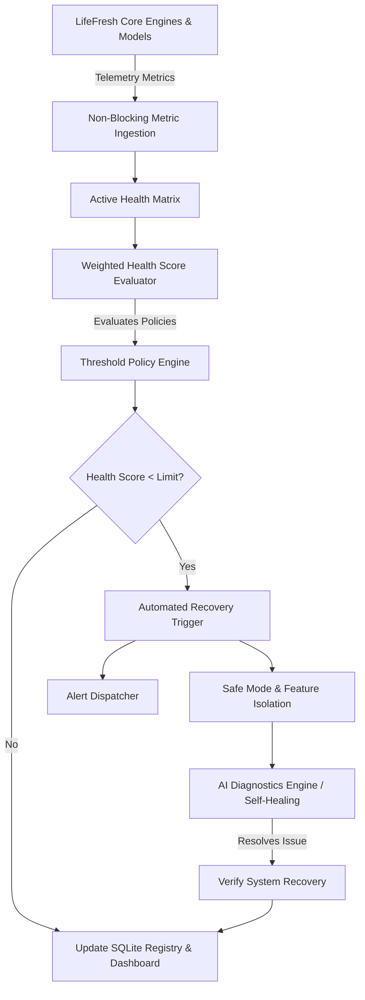
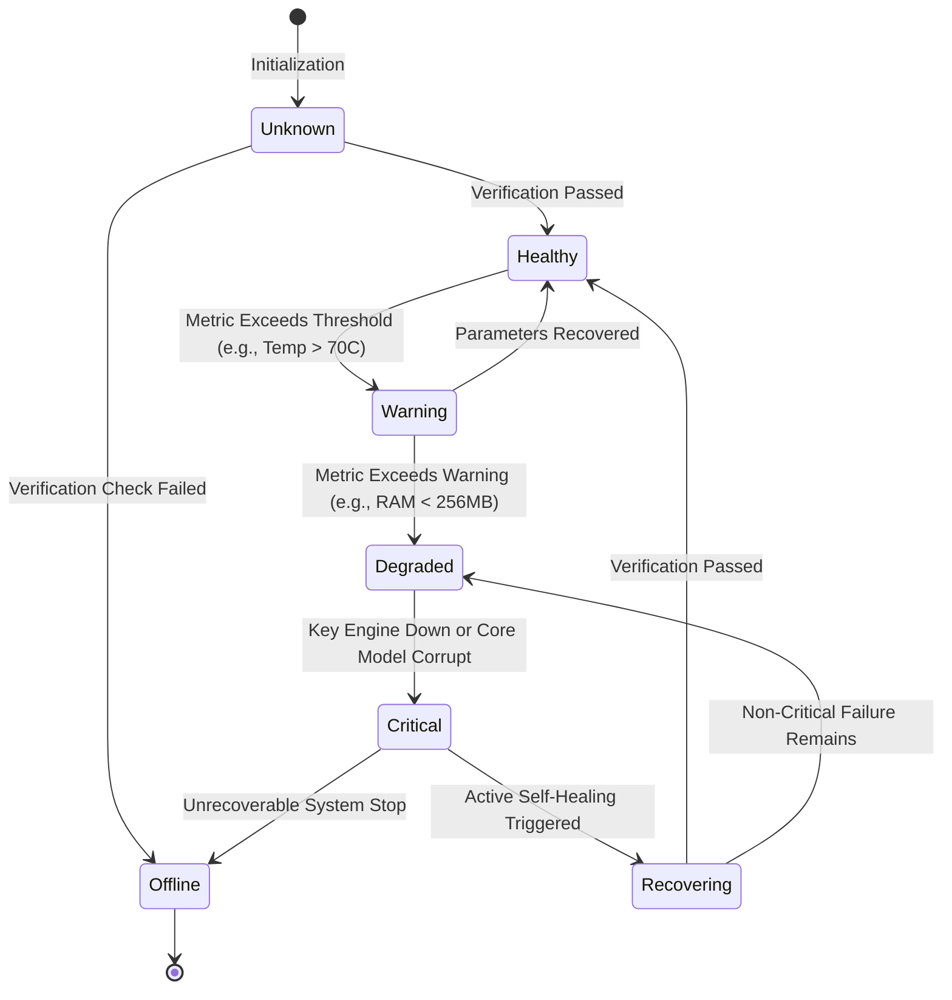
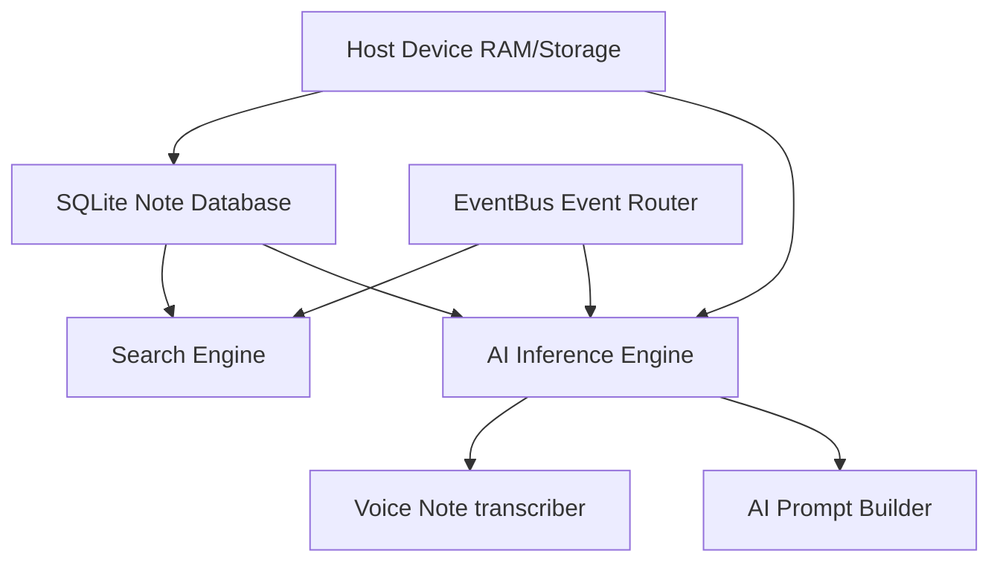
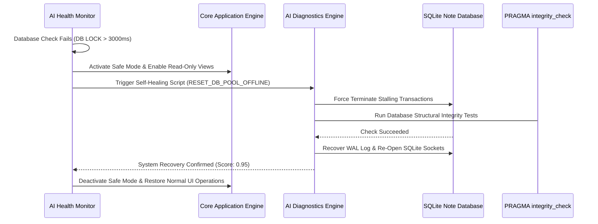

# LifeFresh AI Constitution
## AI Health Monitor Specification v1.1

**Version:** 1.1  
**Status:** Approved / Core Reference Architecture  
**Last Updated:** July 2026  
**Classification:** Enterprise Internal  

---

### Purpose
The **AI Health Monitor** is the primary systems-integrity validator, resource arbitrator, and active status coordinator of the LifeFresh QuickNote Pro ecosystem. Designed to facilitate safe, offline-first AI application control, the Health Monitor continuously tracks the availability, stability, readiness, and operational conditions of all system components. By computing real-time multidimensional health indexes, it protects the local SQLite database, dynamic AI models, in-memory caches, and background execution loops from corrupt states, coordinating directly with the diagnostics layer to trigger immediate self-healing scripts.

---

### Scope
This specification governs the architecture, data-gathering pipelines, scoring algorithms, local database schemas, YAML policies, and verification steps of the on-device Health Monitor. It covers physical system layers (RAM, CPU, thermal states, battery, storage), local AI model availability, database locks, cache states, workflow progress, and local network ports. This module is optimized for low-resource Android edge devices and operates without relying on external internet loops.

---

### Objectives
* **Unified Readiness Auditing:** Continuously aggregate and verify readiness markers from all LifeFresh engines, local models, and system resource pools.
* **Low-Latency Health Scoring:** Calculate composite health metrics ($H_s \in [0.0, 1.0]$) locally in **<4ms** to prevent main-thread latency.
* **Proactive Failure Mitigation:** Identify system degradation, thermal stress, or resource bottlenecks before they cause application crashes or user-facing failures.
* **Safe Mode & Feature Isolation:** Automatically disable heavy AI model executions, restrict background sync loops, or switch system components to graceful fallback states during resource shortages.

---

### Design Principles
* **Passive Execution Overhead:** Health monitoring processes must run on low-priority threads with a CPU usage limit of **<1%** and negligible battery footprints.
* **Functional Decoupling:** System health checks must run independently of core database operations, logging pipelines, and user interfaces.
* **Fail-Closed Separation:** If any critical engine or model fails validation, the Health Monitor must immediately quarantine that component and switch to safe, deterministic local workflows.
* **Deterministic Scoring Rules:** All health scores must rely on explicit, policy-defined thresholds that can be calibrated dynamically via YAML settings.

---

### 1. Functional Boundaries & Distinctions
To prevent overlapping responsibilities, the AI Health Monitor enforces strict functional boundaries:

| Practice | Primary Focus | Data Frequency | Output Action | Reference Module |
| :--- | :--- | :--- | :--- | :--- |
| **Health Monitoring** | Component availability, stability, readiness, and resource health. | Continuous (1s - 10s intervals) | Alerts, state shifts, safe mode triggers. | `AI_Health_Monitor.md` |
| **Diagnostics** | Deeper analysis of root causes, failure traces, and logical troubleshooting. | On-demand (triggered by alert) | Remediation scripts, repair flows. | `AI_Diagnostics_Engine.md` |
| **Logging** | Detailed chronological records of internal operations and stack traces. | Transactional (per-event) | Disk files, local rotation buffers. | `AI_Logging_Engine.md` |
| **Security Auditing** | Tamper detection, permission boundaries, and encryption key state checks. | Transactional / Critical | Cryptographic signatures, access denies. | `AI_Permission_Engine.md` |
| **Crash Reporting** | Unhandled exceptions, memory dumps, and native thread failures. | Exception-based | Recovery restarts, cold-boot clears. | `AI_Diagnostics_Engine.md` |

---

### 2. Health Monitoring Architecture
The AI Health Monitor uses a multi-layered, non-blocking telemetry collector that runs as an isolated background daemon:



---

### 3. Core Components
* **Readiness Assessor:** Inspects local model files, cryptographic keys, SQLite connections, and configuration schemas on boot and during execution.
* **Resource Evaluator:** Gathers physical resource metrics (RAM, CPU, storage, thermal, battery) from the host operating system.
* **Scoring Engine:** Applies multi-factor mathematical models to calculate individual and composite health indexes.
* **Isolation Controller:** Coordinates safe-mode states, disabling resource-heavy workflows while keeping core note-taking and local search services functional.
* **Self-Healing Integrator:** Connects the Health Monitor with local diagnostics scripts to trigger automated recovery actions.

---

### 4. Engine Health States
The Health Monitor assigns every engine, model, and system domain one of seven distinct health states:



* **Healthy ($1.0 \ge H_s \ge 0.85$):** All systems are operational; full AI, voice, note processing, and database operations are active.
* **Warning ($0.85 > H_s \ge 0.70$):** Non-critical resources are strained (e.g., CPU temp $>70^\circ\text{C}$). Throttles low-priority background sync processes.
* **Degraded ($0.70 > H_s \ge 0.50$):** High-power features are restricted. Heavy model inference is suspended, switching the app to a lightweight, rules-based mode.
* **Critical ($0.50 > H_s \ge 0.0$):** Critical dependencies (e.g., SQLite connection or core model files) are compromised. The system activates Safe Mode, saving local states to flat files and disabling AI workflows.
* **Recovering:** The system is executing self-healing scripts (e.g., clearing RAM caches, resetting SQLite pools) and verifying recovery.
* **Offline:** The component is explicitly shut down or disabled by user settings.
* **Unknown:** The component has not completed its initial health check.

---

### 5. Detailed Health Domains

#### 5.1 AI Model Health
Tracks the availability and operational states of on-device AI model weights (such as local tflite or ONNX files):
* **Availability Checks:** Verifies that model weight files exist in protected storage with correct SHA-256 hashes.
* **Load Validation:** Measures the speed and memory requirements of loading model layers into RAM.
* **Inference Validation:** Run periodic dummy prompts in the background, checking that execution times remain within limits ($<2500\text{ms}$) and structures are correct.
* **Corruption and Compatibility:** Detects driver anomalies (such as NNAPI or OpenCL failures), falling back to CPU execution automatically.

#### 5.2 Database Health Monitoring
Monitors the local SQLite instance supporting LifeFresh QuickNote Pro:
* **Integrity Validation:** Executes `PRAGMA integrity_check` during quiet hours to identify corrupted database pages.
* **WAL Health:** Tracks write-ahead log (WAL) sizes, triggering checkpoints if file sizes exceed **10MB**.
* **Lock Detection:** Monitors database transaction times, identifying locks that hang beyond **3000ms**.
* **Storage and Memory:** Monitors database file growth and disk availability, halting transaction logs if remaining storage drops below **50MB**.

#### 5.3 Physical Resource Health
Gathers resource metrics from device APIs:
* **Memory Health:** Tracks application heap usage, triggering garbage collection and flushing caches if free RAM drops below **128MB**.
* **CPU/GPU/NPU Health:** Tracks core temperatures and scheduling delays, throttling thread counts during high thermal conditions.
* **Battery and Thermal Health:** Monitors battery drain and thermal bounds, suspending local AI model training or heavy background searches if the battery drops below **15%** or temperatures exceed **45°C**.

---

### 6. Dependency Health Graph
The platform tracks component dependencies as a directed acyclic graph (DAG), ensuring that a failure in a secondary service does not impact core note-taking.



---

### 7. Health Score Calculation Algorithm
The Health Monitor calculates composite health scores using a weighted geometric mean, ensuring that a critical failure in a major component instantly forces the composite score to a degraded or critical state:

$$ H_{composite} = \prod_{i=1}^{n} (h_i)^{w_i} $$

Where:
* $h_i$ represents the individual health score of domain $i$ ($h_i \in [0.0, 1.0]$).
* $w_i$ represents the weight of domain $i$, where $\sum w_i = 1.0$.
* If any critical component score (e.g., Database or RAM) drops below **0.40**, $H_{composite}$ is automatically overridden to $0.0$, triggering Safe Mode.

```kotlin
class HealthScorer {
    companion object {
        private val CRITICAL_THRESHOLD = 0.40f
    }

    fun calculateCompositeScore(scores: Map<String, Float>, weights: Map<String, Float>): Float {
        var geometricProduct = 1.0
        var totalWeight = 0.0

        for ((component, score) in scores) {
            val weight = weights[component] ?: 0.0f
            if (weight > 0.0f) {
                // If a critical component falls below the threshold, force a Critical State
                if (score < CRITICAL_THRESHOLD && isCriticalComponent(component)) {
                    return 0.0f
                }
                geometricProduct *= Math.pow(score.toDouble(), weight.toDouble())
                totalWeight += weight
            }
        }
        return if (totalWeight > 0.0) geometricProduct.toFloat() else 0.0f
    }

    private fun isCriticalComponent(component: String): Boolean {
        return component == "database" || component == "storage" || component == "memory"
    }
}
```

---

### 8. System State Shift Matrix
The following matrix dictates the active rules and system shifts applied during health state transitions:

| Composite Score | Health State | AI Model Operations | Note Database State | Search & Voice Functions | Safe Mode Active |
| :--- | :--- | :--- | :--- | :--- | :--- |
| **$1.0 \ge H_s \ge 0.85$** | **Healthy** | Full dynamic models (NPU/GPU) | Full WAL mode, active transactions | Full text search, voice active | No |
| **$0.85 > H_s \ge 0.70$** | **Warning** | Throttled inference speeds, GPU fallback | Standard transactions, minor cache flush | Search enabled, voice active | No |
| **$0.70 > H_s \ge 0.50$** | **Degraded** | CPU execution only, lightweight models | Standard transactions, restricted sync | Search restricted, voice offline | No |
| **$0.50 > H_s \ge 0.0$** | **Critical** | Suspended, models unloaded from RAM | Read-only mode, staging backup active | Basic query search, voice offline | **Yes** |

---

### 9. Self-Healing & Isolation Flows
When a critical health state is detected, the monitor isolates the failing feature and triggers automated self-healing scripts:



---

### 10. API Contracts & Data Structures

#### 10.1 Kotlin API Definition
```kotlin
interface HealthMonitorService {
    suspend fun getCompositeHealth(): Float
    suspend fun getComponentHealth(componentId: String): HealthStateRecord
    suspend fun runManualDiagnosticsCheck(): HealthReport
    suspend fun triggerSelfHealing(componentId: String): Boolean
    suspend fun registerHealthStateListener(listener: HealthStateListener): Boolean
}

data class HealthStateRecord(
    val componentId: String,
    val state: String, // HEALTHY, WARNING, DEGRADED, CRITICAL, RECOVERING
    val healthScore: Float,
    val lastCheckUtc: Long,
    val metricsMap: Map<String, Double>
)
```

#### 10.2 SQLite Telemetry Schema
```sql
CREATE TABLE health_component_registry (
    component_id TEXT PRIMARY KEY NOT NULL,
    display_name TEXT NOT NULL,
    current_state TEXT NOT NULL,
    active_score REAL NOT NULL,
    is_critical_dependency INTEGER NOT NULL,
    last_check_utc INTEGER NOT NULL
);

CREATE TABLE health_telemetry_metrics (
    metric_id TEXT PRIMARY KEY NOT NULL,
    component_id TEXT NOT NULL,
    metric_key TEXT NOT NULL,
    metric_value REAL NOT NULL,
    timestamp_utc INTEGER NOT NULL,
    FOREIGN KEY (component_id) REFERENCES health_component_registry(component_id) ON DELETE CASCADE
);

CREATE TABLE health_healing_log (
    healing_id TEXT PRIMARY KEY NOT NULL,
    component_id TEXT NOT NULL,
    incident_state TEXT NOT NULL,
    recovery_script TEXT NOT NULL,
    duration_ms INTEGER NOT NULL,
    execution_result INTEGER NOT NULL, -- 1 = Success, 0 = Failed
    timestamp_utc INTEGER NOT NULL,
    FOREIGN KEY (component_id) REFERENCES health_component_registry(component_id)
);
```

#### 10.3 YAML Configuration Template
```yaml
health_monitor_policy:
  global_settings:
    check_interval_seconds: 15
    low_power_check_interval: 60
    enable_auto_healing: true
  scoring_weights:
    database: 0.35
    storage: 0.20
    memory: 0.15
    ai_models: 0.15
    system_cores: 0.15
  thermal_limits:
    warning_temp_celsius: 40.0
    critical_temp_celsius: 45.0
  memory_limits:
    warning_free_mb: 256
    critical_free_mb: 128
```

#### 10.4 JSON Health Event Example
```json
{
  "eventId": "evt_hlth_00918",
  "timestampUtc": 1783648110000,
  "componentId": "ai_models",
  "previousState": "HEALTHY",
  "currentState": "WARNING",
  "score": 0.72,
  "triggerMetric": "model_inference_latency_ms",
  "metricValue": 2850.0,
  "message": "Model inference latency exceeds warning threshold of 2500ms."
}
```

---

### 11. Security and Privacy
* **Local Data Boundaries:** Telemetry and health reports are kept on-device, scrubbed of PII/PHI, and never sent to cloud systems unless requested by the user.
* **Access Control:** Reading or writing telemetry records requires system administrator privileges, secured by the local permissions module.
* **Tamper Verification:** SQLite health logs are signed using cryptographic hashes linked to the hardware keystore, preventing manual modifications.

---

### 12. Testing Strategy
* **Fault Injection Tests:** Simulates database locks, model file deletions, low-memory conditions, and high thermal spikes to verify safe-mode triggers.
* **Self-Healing Verification:** Confirms that automated recovery scripts can resolve transaction stalls and corrupt WAL files.
* **Low-Resource Emulator Profiles:** Tests monitoring cycles on low-power device configs to ensure CPU limits are maintained ($<1\%$).

---

### 13. Enterprise Deployment
* **MDM Deployment Profiles:** Deployment settings, scoring weights, and warning levels are packaged as signed profiles deployed across device fleets using MDM platforms.
* **Custom Alert Levels:** Alerts can be matched with on-device notification policies, allowing admins to configure silent alerts or high-priority warnings based on organizational needs.

---

### 14. Best Practices & Anti-patterns

#### Best Practices
* **Keep Telemetry Loops Lightweight:** Keep health evaluations simple, avoiding complex string parses or disk access during monitoring cycles.
* **Enforce Graceful Degradation:** Use Safe Mode to preserve essential note-taking and search operations, disabling heavier AI processes when resources are limited.
* **Verify System Recoveries:** Ensure the system completes structural verification checks before returning components to active states.

#### Anti-patterns
* **Over-Monitoring System States:** Setting check intervals too high ($<1\text{s}$), causing battery drain.
* **Overlapping Log Actions:** Mixing telemetry checks with transaction logging pipelines, impacting database performance.
* **Unvalidated Safe-Mode Transitions:** Triggering safe-mode state switches without notifying the user or saving active local files.

---

### Future Enhancements
* **Dynamic Biomarker Diagnostics:** Automatically calibrate diagnostic rules and alert priorities based on active user fatigue trends.
* **Decentralized Local Diagnostics Mesh:** Cross-verify diagnostic reports securely on offline networks, helping administrators locate and isolate failed hardware nodes.

---

### Related AI Constitution Documents
* `AI_Diagnostics_Engine.md`
* `AI_Logging_Engine.md`
* `AI_Execution_Engine.md`

---

### References
1. Edge Device Health Architectures: High-Reliability Telemetry and Performance Engineering
2. NIST SP 800-162: Zero Trust Systems and System Integrity Monitoring Guidelines
3. Android NNAPI: Thermal Calibration and Multi-core Telemetry Best Practices

---

### Conclusion
The AI Health Monitor provides a secure, predictable, and local health evaluation framework designed for edge-native clinical systems. By combining continuous telemetry collection, geometric health scoring, predictive trend analysis, and automated self-healing integrations, the Monitor ensures that the host platform remains safe, stable, and compliant under all operating conditions.
