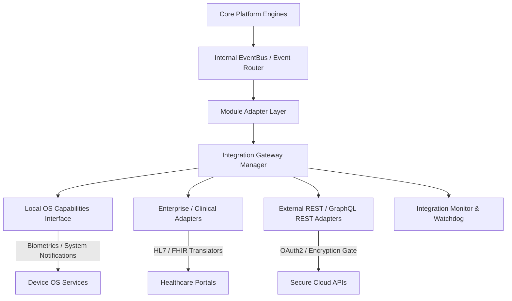
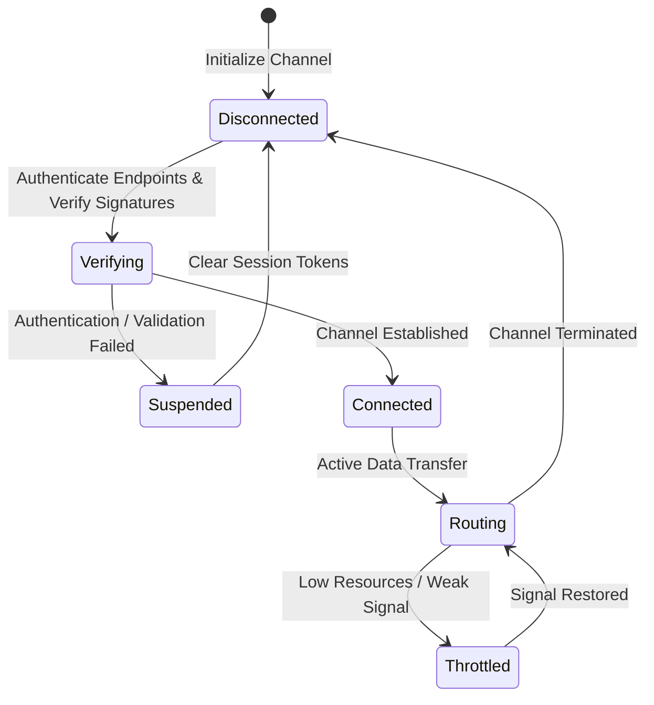

# LifeFresh AI Constitution
## AI Integration Engine Specification v1.0

**Version:** 1.0  
**Status:** Approved / Core Reference Architecture  
**Last Updated:** July 2026  
**Classification:** Enterprise Internal  

---

### Purpose
The **AI Integration Engine** is the core communications, adapter, and synchronization backbone of the LifeFresh AI platform. In an offline-first, decentralized healthcare workspace, interfaces with internal platform modules, host operating systems, enterprise networks, third-party databases, and secure external clinical systems must be governed by a highly unified, secure, and resilient abstraction layer. The Integration Engine acts as this universal gateway, translating schemas dynamically, coordinating cross-engine messages, managing authentication, and enforcing strict data isolation guidelines to prevent unauthorized leakage of clinical or security details.

---

### Scope
This specification governs the design, adapter interfaces, routing mechanisms, lifecycle steps, security baselines, and API patterns of the local Integration Engine. It covers internal Android services, iOS integration guidelines, desktop and web structures, and HL7/FHIR healthcare interface patterns.

---

### Objectives
* **Unified Communication Abstraction:** Provide a single, resilient message and data routing layer for all local platform modules.
* **Low-Latency Routing:** Process and route cross-engine messages and events locally on-device in **<2ms** to prevent main-thread latency.
* **Declarative Data Transformation:** Translate differing schemas (e.g., SQLite rows to JSON objects, or local JSON blocks to standard HL7/FHIR structures) using declarative mappings.
* **Fail-Secure Isolation Gates:** Ensure that if an external integration fails, the system immediately quarantines the connection and prevents any data leaks.

---

### Design Principles
* **Loose Coupling (Adapter-First):** All external interfaces, libraries, and hardware drivers must interact with platform engines via strict Adapter abstractions.
* **Zero-Trust Token Hygiene:** Authentication tokens and cryptographic certificates must never be stored in plain text or shared with untrusted endpoints.
* **Resource Conservation:** Throttles outbound network synchronizations during low battery or weak signal states.
* **Audited Transaction Chains:** Every integration request, connection state transition, and API exchange must log an audit record.

---

### 1. Engine Overview
The **AI Integration Engine** is the dynamic communication supervisor of the platform. It intercepts inter-module events, marshals data payloads across system boundaries, maps custom API schemas to local tables, manages hardware sensor interfaces, and handles secure network synchronization layers.

---

### 2. Core Responsibilities
* **Cross-Engine Communication:** Managing event routing across the database, planning, execution, and user interface layers.
* **OS Capabilities Integration:** Interfacing with on-device hardware sensors, local file systems, and notification managers.
* **Enterprise Integration:** Coordinating data exchanges with HL7/FHIR healthcare servers and enterprise CRM systems.
* **Data Payload Transformation:** Translating data formats between relational tables, XML streams, and JSON structures.

---

### 3. Integration Architecture
The Integration Engine acts as a universal gateway, managing internal and external communication paths:



---

### 4. Integration Lifecycle
Integrations cycle through a set of structured states to guarantee security and performance tracking:



---

### 5. Internal Module Integration
Internal modules (e.g., `AI_Decision_Engine.md` and `AI_Policy_Engine.md`) communicate via a local, in-memory message bus. The bus routes messages asynchronously using type-safe Kotlin channels.

---

### 6. Cross-Engine Communication
Cross-engine messaging utilizes strict schema boundaries. An engine cannot invoke functions in other modules directly; instead, it dispatches events to the integration bus.

```json
{
  "eventId": "evt_int_0991_sync",
  "source": "EXECUTION_ENGINE",
  "target": "INTEGRATION_ENGINE",
  "payload": {
    "action": "SYNC_PATIENT_BATCH",
    "batchId": "bth_00918",
    "recordsCount": 12
  }
}
```

---

### 7. API Integration
The engine manages outbound HTTP requests using Retrofit interfaces configured with strict connection, read, and write timeouts:

```kotlin
interface ExternalClinicalApi {
    @POST("/api/v1/clinical/sync")
    suspend fun syncRecords(
        @Header("Authorization") token: String,
        @Body payload: ClinicalSyncPayload
    ): Response<SyncResponse>
}
```

---

### 8. Database Integration
The database adapter acts as a barrier over local storage. All external synchronization cycles write to temporary staging buffers before updating main tables.

---

### 9. Local Device Integration
Coordinates direct device interactions, managing battery monitoring threads, network signal listeners, and local file storage paths.

---

### 10. Android System Integration
Interfaces with Android core capabilities, including WorkManager background execution frameworks, biometrics authorization checks, and secure Keystore systems.

---

### 11. iOS Integration Readiness
To support future cross-platform updates, the integration layer abstracts Android-specific calls behind platform-agnostic Swift/Kotlin multiplatform interfaces.

---

### 12. Desktop Integration
Defines abstraction interfaces to support desktop packaging, managing file-system paths and window focus listeners.

---

### 13. Web Integration
Supports standard web-app runtimes, managing local storage abstraction layers and secure WebSocket endpoints.

---

### 14. Enterprise Integration
Integrates with enterprise systems, managing SSO integrations, MDM configuration checks, and diagnostic log syndication.

---

### 15. Healthcare System Integration
Supports standard healthcare protocols, translating internal patient records into compliant **HL7 v2** or **FHIR r4** JSON structures before syndication.

---

### 16. Plugin Integration
Allows for modular feature extensions. Plugins run inside isolated sandboxes with restricted permissions, preventing access to core database tables.

---

### 17. EventBus Integration
The **EventBus** is a thread-safe, non-blocking routing bus. It dispatches messages to registered listeners based on event topics, utilizing Coroutines to prevent UI blocking.

---

### 18. Message Routing
Messages are routed dynamically. If a target module is offline or suspended, the router queues the event in local SQLite tables for deferred delivery.

---

### 19. Data Transformation
Transformations map data models using declarative schemas. This allows database rows to be translated into API JSON shapes without writing custom parsing code.

---

### 20. Adapter Pattern
The **Adapter Pattern** decouples engine modules from external SDKs. If a third-party library is updated or replaced, only its adapter layer requires modification.

---

### 21. Integration Gateway
The **Integration Gateway** is the single entry point for all external network requests, managing rate limiting, encryption, and DNS resolution tasks.

---

### 22. Service Discovery
Internal platform services register with a local registry, allowing modules to locate and invoke interfaces dynamically on startup.

---

### 23. Authentication
Authentications are managed securely on-device. Tokens are stored in the hardware-backed keystore, and requests are signed using secure hashes:

```kotlin
fun getAuthToken(alias: String): String {
    val keyStore = KeyStore.getInstance("AndroidKeyStore").apply { load(null) }
    val entry = keyStore.getEntry(alias, null) as? KeyStore.SecretKeyEntry
    return entry?.let { "Bearer " + decryptToken(it.secretKey) } ?: throw IllegalStateException("Token not found")
}
```

---

### 24. Authorization
Outbound requests are checked against active user scopes. If a clinician's session lacks the required scope, the gateway blocks the outbound request.

---

### 25. Encryption
All external network exchanges require TLS 1.3 encryption. For sensitive clinical synchronizations, payloads are wrapped in AES-GCM envelopes prior to transmission.

---

### 26. Monitoring
* **Routing Latency:** Tracks event propagation times, logging alerts if routing cycles exceed **2ms**.
* **Connection Stability:** Monitors network handshake failure rates, triggering fallback modes when thresholds are exceeded.

---

### 27. Logging
Diagnostic log traces are sanitized to prevent PII and security token leaks:

```
[2026-07-11 03:44:11] [INFO] [INT_ENGINE] Intercepted event: evt_int_0991_sync from EXECUTION_ENGINE
[2026-07-11 03:44:11] [INFO] [INT_ENGINE] Transforming payload to FHIR JSON structure.
[2026-07-11 03:44:12] [INFO] [INT_ENGINE] Dispatching to external clinical API endpoint.
[2026-07-11 03:44:13] [INFO] [INT_ENGINE] Sync completed successfully. Payload: 24KB. Duration: 182ms.
```

---

### 28. APIs
The Integration Engine exposes type-safe Kotlin interfaces to dispatch events and manage channel connections:

```kotlin
interface IntegrationService {
    suspend fun publishEvent(event: IntegrationEvent): Result<Boolean>
    suspend fun subscribeToTopic(topic: String, listener: EventListener): Boolean
    suspend fun configureExternalChannel(channelId: String, configJson: String): Boolean
    suspend fun getChannelState(channelId: String): ChannelState
}
```

---

### 29. Internal Data Structures
To ensure thread safety, event data configurations use immutable Kotlin definitions:

```kotlin
data class IntegrationEvent(
    val eventId: String,
    val topic: String,
    val sourceModule: String,
    val targetModule: String,
    val payloadJson: String,
    val timestampUtc: Long
)
```

---

### 30. SQL Integration Schema
The SQLite database stores channel parameters, active configurations, message routing queues, and delivery histories on-device:

```sql
CREATE TABLE integration_channels (
    channel_id TEXT PRIMARY KEY NOT NULL,
    name TEXT NOT NULL,
    protocol_type TEXT NOT NULL,
    endpoint_url TEXT NOT NULL,
    state TEXT NOT NULL,
    last_connected INTEGER
);

CREATE TABLE event_delivery_queue (
    event_id TEXT PRIMARY KEY NOT NULL,
    topic TEXT NOT NULL,
    payload_json TEXT NOT NULL,
    attempts INTEGER NOT NULL,
    next_retry INTEGER NOT NULL,
    state TEXT NOT NULL
);

CREATE TABLE channel_transactions_log (
    transaction_id TEXT PRIMARY KEY NOT NULL,
    channel_id TEXT NOT NULL,
    timestamp_utc INTEGER NOT NULL,
    direction TEXT NOT NULL,
    payload_size_bytes INTEGER NOT NULL,
    status TEXT NOT NULL,
    FOREIGN KEY (channel_id) REFERENCES integration_channels(channel_id)
);
```

---

### 31. Performance Optimization
* **Connection Pooling:** Maintains active, secure network connections to minimize socket handshake delays.
* **Payload Compaction:** Compresses large outbound JSON blobs using GZIP compression prior to transmission.

---

### 32. Error Handling
* **Stalled Sockets:** Network requests that hang beyond configured limits are aborted, and the connection is scheduled for dynamic retries.
* **Corrupted API Schemas:** If payload validations fail, the engine drops the sync task and logs a diagnostic warning.

---

### 33. Recovery Mechanisms
If systematic errors occur during synchronization, the system suspends the connection, falls back to offline staging queues, and initiates recovery procedures.

---

### 34. Compatibility Management
API endpoints must support backward compatibility, utilizing version headers to coordinate changes without breaking legacy device fleets.

---

### 35. Version Management
The platform tracks API version hashes. If a breaking API update is detected on-device, the engine pauses sync operations and prompts for updates.

---

### 36. Enterprise Deployment
For enterprise deployments, channel settings, security certificates, and endpoint whitelists are packaged as signed configurations deployed across device fleets using MDM platforms.

---

### 37. Future Expansion
* **Decentralized Local Mesh Synchronizations:** Share clinical records securely across offline device nodes using peer-to-peer Bluetooth tunnels.
* **Dynamic Biomarker Tuning:** Adjust background network synchronization rates dynamically based on real-time biometric and fatigue metrics.

---

### Conclusion
The AI Integration Engine provides a secure, predictable, and modular interface framework designed for edge healthcare environments. By enforcing adapter isolation, zero-trust token handling, declarative payload translations, and TLS 1.3 encryption, the Engine ensures all communications remain safe, secure, and compliant under all operating conditions.

### Related AI Constitution Documents
* `AI_Decision_Engine.md`
* `AI_Policy_Engine.md`
* `AI_Execution_Engine.md`

### References
1. Enterprise Integration Patterns: Designing and Deploying Edge Architectures
2. NIST SP 800-162: Zero Trust Architectures and Secure Channel Integration Guidelines
3. Android Keystore System: Best Practices for Token Storage and Key Cryptography
