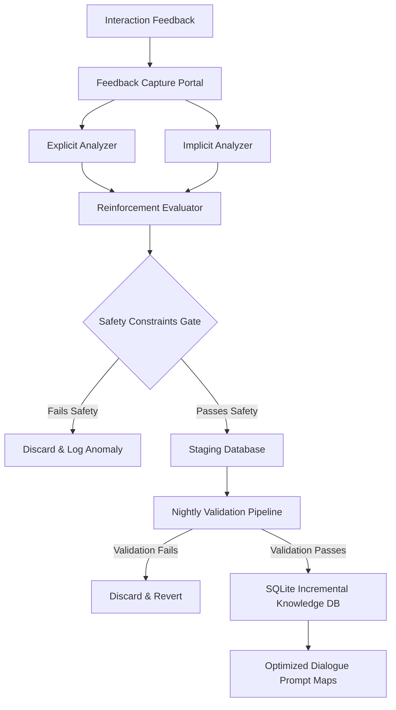
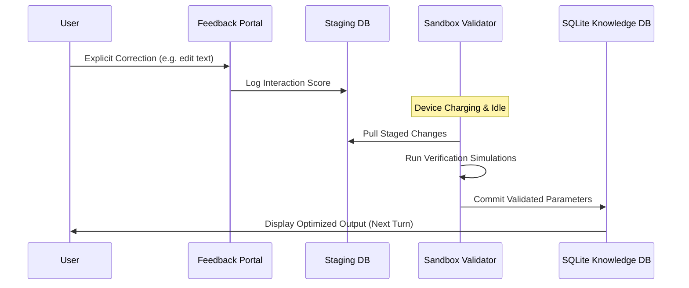

# LifeFresh AI Constitution
## AI Learning Engine Specification v1.0

**Version:** 1.0  
**Status:** Approved / Core Reference Architecture  
**Last Updated:** July 2026  
**Classification:** Enterprise Internal  

---

### 1. Engine Overview
The **AI Learning Engine** is the core continuous improvement, reinforcement, and localized optimization framework of the LifeFresh AI platform. Operating in perfect coordination with the `AI_Personalization_Engine.md` and supervised by the safety protocols of the `AI_Confirmation_Engine.md`, the Learning Engine is responsible for capturing explicit user corrections, implicit feedback loops, and reinforcement signals to incrementally refine model behavior, accuracy, parsing boundaries, and contextual comprehension on the device. It integrates explicit and implicit behaviors to adapt vocabulary and prompt layouts without requiring full model retraining or leaking sensitive HIPAA parameters to remote cloud databases.

---

### 2. Objectives
* **Continuous Edge Adaptation:** Learn and adapt to user vocabulary, slang, and dialect variations over time locally.
* **Double-Gated Feedback Processing:** Process explicit edits and implicit usage patterns, translating them into reinforcement values.
* **Safety-First Bounds:** Implement validation rules to prevent incorrect patterns, clinical mistakes, or security-compromising phrases from entering persistent knowledge databases.
* **Model Optimization:** Periodically refine prompt templates and local dictionary mappings to increase parsing precision.

---

### 3. Design Principles
* **Local Learning Priority:** All learning calculations, feedback analysis, and score adjustments run locally on-device.
* **Deterministic Verification:** Before updating active settings, learned improvements must pass validation tests in a secure sandbox.
* **Stability-Centered Rate Clamping:** Constrain moving-average calculations to avoid skewing model behavior based on a single unusual user interaction.
* **Zero Resource Impact:** Schedule intensive validation sweeps to run during idle device hours when connected to power.

---

### 4. Core Responsibilities
* **Feedback Collection:** Logging manual user corrections, thumbs-up/down selections, and notification actions under strict privacy boundaries.
* **Synonym Discovery:** Extracting custom abbreviations, medical terms, and regional Hinglish slang, then writing them to local synonym tables.
* **Drift Monitoring:** Detecting concept drift (e.g., shifts in clinic calendars or communication pacing patterns) over rolling 30-day windows.
* **Model Validation:** Running in-memory test cycles to verify updated configurations before promoting them.

---

### 5. Learning Architecture
The Learning Engine coordinates inputs, safety systems, and local knowledge bases to compile prompt optimizations:



---

### 6. Learning Lifecycle
Adaptations move through controlled phases to protect the clinical and logical stability of the platform:



---

### 7. Learning Sources
The Engine draws feedback from three primary categories:
* **Explicit Inputs:** Direct user corrections (e.g., editing synthesized summaries, manual data adjustments, clicking feedback buttons).
* **Implicit Telemetry:** Indirect behaviors (e.g., dismissing suggestions, session duration on specific screens, tap speeds).
* **System Metrics:** Execution parameters (e.g., dialog abort frequencies, multi-turn clarification counts).

---

### 8. Explicit Feedback Learning
Manual modifications indicate immediate failures in baseline models.
* **Trigger Event:** User modifies a parsed clinic appointment date from "Monday" to "Tuesday" via manual inputs.
* **Action:** The Engine writes an explicit error record ($Score = -1.0$) to the staging tables, instantly lowering the confidence rating of the parsing rules that generated the incorrect date estimate.

---

### 9. Implicit Feedback Learning
Implicit signals are collected to identify workflow friction.
* **Workflow Detection:** If a user consistently dismisses or ignores a specific scheduled CRM reminder, the Engine logs an implicit dismissal event ($Score = -0.2$).
* **Resolution:** After three consecutive dismissals, the reminder's placement priority is reduced in the layout rules.

---

### 10. Reinforcement Learning Strategy
The Engine calculates feedback priority scores using a localized exponential moving average:

$$ S_t = S_{t-1} \cdot (1 - \alpha) + F_{raw} \cdot \alpha $$

Where $F_{raw}$ is the interaction signal value ($+1.0$ for explicit accept, $-1.0$ for manual edit, $-0.2$ for implicit dismissal), and the local learning rate $\alpha$ is clamped to a maximum of **0.15** to ensure stability.

---

### 11. Preference Learning
User-preferred presentation styles are learned over time:
* **Style Tracking:** If a user consistently edits lengthy paragraphs to extract summary bullet lists, the Engine decreases the priority score for descriptive templates, adjusting prompt selections to prefer list layouts.

---

### 12. Behavioral Learning
The system maps typical shift pacing and interaction speeds. For users showing high interaction speed profiles ($<500\text{ms}$ click intervals), the system reduces the delivery of interactive onboarding tips and secondary tooltips.

---

### 13. Context Learning
The Engine monitors context markers to predict workspace actions:
* **Context Mapping:** Learns the relationship between regional coordinates, current time, and open documentation screens.
* **Action:** If a user consistently opens the billing dashboard when arriving at a specific clinic coordinate on Wednesday mornings, the Engine preloads the billing layout when those conditions are met.

---

### 14. Memory-assisted Learning
By reading the active user session log, the Engine detects repetitive queries and context switches. If the user refers to a specific patient context multiple times within a 10-minute window, the corresponding patient profile is cached in-memory to prevent redundant database fetches.

---

### 15. Pattern Recognition
The Engine scans historical logs for repetitive sequences of CRM actions:
* **Analysis:** If a client lead transition from `NEW` to `QUALIFIED` is regularly followed by scheduling a clinical check-up task, the Engine builds an association rule.
* **Optimization:** The system highlights the "Schedule Task" action on the lead detail screen when a transition occurs.

---

### 16. Knowledge Refinement
To prevent database bloat, the Engine periodically runs data sweeps:
* **De-duplication:** Merges identical synonym suggestions, updating rule confidence metrics.
* **Archiving:** Compresses or removes low-confidence learning records older than 30 days.

---

### 17. Adaptive Intelligence
The platform adapts its prompt guidelines based on the user's role. Administrative staff receive prompts tailored to system status and CRM stages, while medical practitioners receive templates focused on clinical terms and patient histories.

---

### 18. Online Learning
If the user connects to standard enterprise servers, the Engine can pull encrypted, signed configuration packages. These packages contain optimized prompts and synonym mappings compiled across other system nodes.

---

### 19. Offline Learning
Operating without cloud connectivity, the Engine records and processes all learning signals locally in SQLite tables. This ensures the continuous optimization loops function perfectly in disconnected environments.

---

### 20. Incremental Learning
The Engine applies incremental score changes to parameters on-device rather than completely rebuilding models. This guarantees immediate, low-resource adaptations without risking catastrophic forgetting of baseline rules.

---

### 21. Federated Learning Readiness
Learned adaptations write to standard, structured JSON profiles. This design ensures compatibility with federated learning architectures, allowing secure, anonymized metadata updates to be combined and shared across devices in the future.

---

### 22. Learning Policies
* **No-Clinical-Mutation Policy:** No learned rule or configuration update may alter clinical dictionaries, drug names, or baseline medical synonym boundaries.
* **Opt-In Security Policy:** No behavioral profiling or feedback tracking may run unless the user has opted in via the system consent panel.
* **Factory Reset Policy:** Users must be able to purge all local knowledge tables and revert the system to factory defaults instantly in the settings menu.

---

### 23. Learning Rules
This section lists the 30 strict, unyielding rules governing the Learning Engine:

* **RULE_LRN_001:** Every learning transaction must generate a unique learning session UUID on creation.
* **RULE_LRN_002:** Learning updates must compile to temporary staging tables before persistent database commits.
* **RULE_LRN_003:** No reinforcement calculation or verification simulation may run on the main UI thread.
* **RULE_LRN_004:** All incoming feedback signals must undergo sanitization to strip brackets and formatting tags.
* **RULE_LRN_005:** Clinical dictionary tables must be read-only, preventing any local learning mutations.
* **RULE_LRN_006:** Learning and feedback metrics must remain isolated between separate profiles on the same device.
* **RULE_LRN_007:** Explicit settings overrides must immediately lock out and freeze linked parameter learning loops.
* **RULE_LRN_008:** Explicit user corrections must carry a high priority score of exactly 1.0.
* **RULE_LRN_009:** No personal client details or patient HIPAA records may write to active learning logs.
* **RULE_LRN_010:** Baseline learning rates must clamp to a maximum of 0.25 to protect model stability.
* **RULE_LRN_011:** Learned prompt overrides must scale gracefully within system font scale configurations.
* **RULE_LRN_012:** Moving average calculations must use a 14-day trailing feedback log.
* **RULE_LRN_013:** Dialect parsing adaptations must preserve clinical root words unchanged.
* **RULE_LRN_014:** Implicit signal updates must require 3 repetitive events before score adjustments are applied.
* **RULE_LRN_015:** Nightly validation tasks must execute only when the device is charging.
* **RULE_LRN_016:** All localized learning loops must function with zero active cloud dependencies.
* **RULE_LRN_017:** Background optimization threads must yield instantly during active user typing sessions.
* **RULE_LRN_018:** Synonym-discovery algorithms must utilize pre-allocated buffers to prevent GC thrashing.
* **RULE_LRN_019:** Summarization learning tasks must exclude patient names and identifiers.
* **RULE_LRN_020:** Email strings captured during feedback steps must convert to lowercase.
* **RULE_LRN_021:** All recorded timestamps must conform to ISO-8601 UTC formats.
* **RULE_LRN_022:** Double inputs on feedback controls must debounce with a 200ms limit.
* **RULE_LRN_023:** User logout events must instantly clear active in-memory learning caches.
* **RULE_LRN_024:** De-duplication keys for learning records must derive from SHA-256 hashes of interaction data payloads.
* **RULE_LRN_025:** Emergency and critical notifications must bypass quiet-hour schedules.
* **RULE_LRN_026:** Sync conflict parameters must prioritize the latest temporal change.
* **RULE_LRN_027:** Urgent clinical triage cards must request full-screen visual layout priorities.
* **RULE_LRN_028:** Progressive learning states must display standard Material 3 loading animations.
* **RULE_LRN_029:** Inbound configuration files must validate cryptographic signatures before ingestion.
* **RULE_LRN_030:** Manual resets to default states must instantly wipe all computed learning tables.

---

### 24. Learning Constraints
* **Range Constraints:** Learned priority weights must be clamped within strict boundaries ($0.0 \le w \le 1.0$).
* **Memory Bounds:** Local staging tables must have a hard limit of 500 records. Non-essential tracking pauses if storage bounds are exceeded.

---

### 25. Human Override
If a user experiences undesirable system adaptations, they can trigger a reset in the settings menu. This action purges the incremental knowledge tables, resetting prompt templates and layouts to standard platform defaults instantly.

---

### 26. Drift Detection
The Engine runs rolling 30-day monitoring tasks to detect shifts in user behavior. If typical shift start times shift by $>2\text{ hours}$, the Engine schedules an on-screen card to confirm updating the active quiet-hour configurations.

---

### 27. Confidence Evaluation
Each learned optimization is assigned a confidence metric ($0.0 \le c \le 1.0$). Only rules with confidence metrics $>0.75$ are permitted to modify prompt templates or change UI component layouts.

---

### 28. Model Improvement Pipeline
Validated improvements are consolidated into local config profiles. The Engine updates prompt templates by swapping placeholder sections with validated user-specific structures.

---

### 29. Knowledge Validation
Before promoting staged changes to the active SQLite tables, the Engine runs dry-run simulations in an isolated, in-memory sandbox:
* **Validation Check:** Compiles the updated prompt configuration, verifying that generated outputs are structurally valid and contain zero syntax errors.

---

### 30. Privacy Controls
* **Redaction Pipeline:** Telemetry feeds pass through local filters that redact PII and HIPAA metrics before processing.
* **Storage Encryption:** Learning databases are encrypted using device-specific keystore entries, preventing unauthorized system processes from accessing profiling logs.

---

### 31. Security Controls
The Engine verifies SHA-256 HMAC signatures on all inbound configuration packages. The database layer uses parameterized SQLite statements to prevent SQL-injection sequences inside text input feedback fields.

---

### 32. Monitoring
* **Latency Monitoring:** Tracks the latency of background validation tasks, outputting warnings to logs if execution exceeds 5 seconds.
* **Execution Counts:** Tracks the number of validated updates committed per week to detect anomalous system updates.

---

### 33. Logging
System logging captures optimization events using standard indicators:

```
[2026-07-09 16:40:22] [INFO] [LRN_ENGINE] Feedback registered. Target: parsing_rule_7. Score: -1.0
[2026-07-09 16:41:05] [INFO] [LRN_ENGINE] Starting nightly validation sweep. Device: CHARGING. RAM: OK
[2026-07-09 16:41:08] [INFO] [LRN_ENGINE] Validation simulation passed. Committed 3 updates to local DB.
```

---

### 34. APIs
The Learning Engine exposes Kotlin interfaces to register interaction events and query optimized parameters:

```kotlin
interface LearningService {
    suspend fun logFeedback(event: FeedbackEvent): Boolean
    suspend fun getOptimizedParameter(key: String): Result<String>
    suspend fun runNightlyChecks(): ValidationResult
    suspend fun resetKnowledgeBase(): Boolean
}
```

---

### 35. Internal Data Structures
Staged improvements are held in structured Kotlin representation classes:

```kotlin
data class StagedUpdate(
    val updateId: String,
    val targetModule: String,
    val parameterKey: String,
    val proposedValue: String,
    val confidence: Float,
    val sourceTimestamp: Long
)
```

---

### 36. Performance Optimization
* **Pre-Allocation:** Synonym discovery buffers are pre-allocated to reduce GC thrashing during heavy text processing tasks.
* **Batched Inserts:** Interaction signals are batched and written to the staging SQLite tables in single transactions, minimizing disk write actions.

---

### 37. Error Handling
* **Staging Failures:** If staging writes fail due to file-system locks, the event is discarded to protect main thread application responsiveness.
* **Validation Failures:** Staged rules failing dry-run simulations are discarded, and warning metrics are output to diagnostics tables.

---

### 38. Recovery Mechanisms
If the active learning database fails on boot due to file corruption, the Engine purges the corrupted SQLite file and re-initializes clean default configurations, protecting application availability.

---

### 39. Enterprise Deployment
Enterprise administrators can export validated configurations as signed JSON files. These profiles can be distributed via standard deployment frameworks to configure default layouts and shortcuts across corporate device fleets.

---

### 40. Future Expansion
* **Collaborative Contexts:** Securely share anonymized, high-confidence synonym tables between device nodes on trusted local networks.
* **Context-Driven Speech Adaptation:** Adapt speech-to-text parsers to recognize unique user accent patterns dynamically.

---

### Conclusion
The AI Learning Engine implements a private-first, stable, and secure framework for continuous continuous optimization at the edge. By running verification tests locally and placing strict boundaries around clinical terminologies, the Engine ensures model longevity and precision without compromising patient privacy rules.

### Related AI Constitution Documents
* `AI_Personalization_Engine.md`
* `AI_Dialogue_Engine_v1.0.md`
* `AI_Confirmation_Engine_v1.0.md`

### References
1. Material Design 3 Guidelines: Accessibility and Adaptive Design
2. Android Keystore System: Best Practices for Local Cryptographic Key Management
3. Jetpack Compose Window Size Classes Specification
