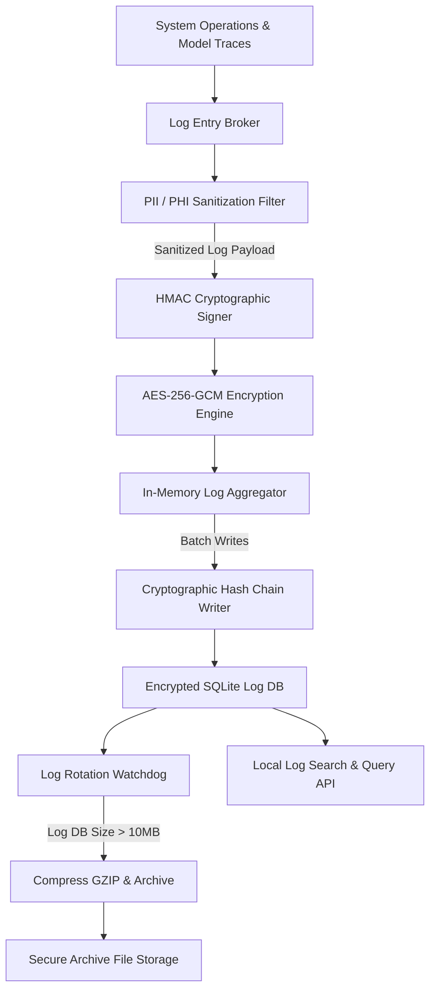
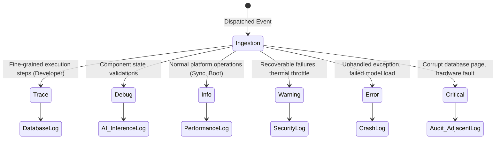
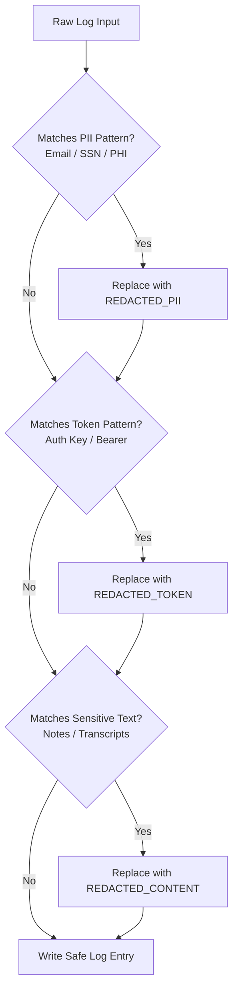
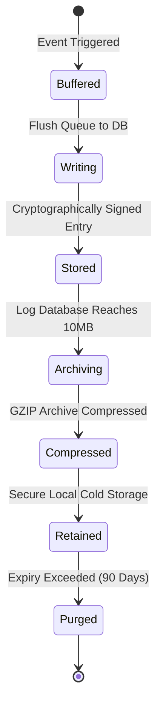

# LifeFresh AI Constitution
## AI Logging Engine Specification v1.1

**Version:** 1.1  
**Status:** Approved / Core Reference Architecture  
**Last Updated:** July 2026  
**Classification:** Enterprise Internal  

---

### Purpose
The **AI Logging Engine** is the primary audit-adjacent trace, security recording, system event tracking, and transactional log broker of the LifeFresh QuickNote Pro ecosystem. Designed to facilitate safe, offline-first operations, this engine records system-level operations, model execution traces, security events, and database actions. It ensures that all recorded information is fully sanitized to protect patient privacy, structured for analytics, encrypted for security, and stored in a tamper-resistant format.

---

### Scope
This specification governs the design, structured log serialization models, cryptographic envelope systems, database storage layouts, rotation policies, and analytics APIs of the local Logging Engine. It covers local, cloud, and hybrid deployment profiles.

---

### Objectives
* **Standardized Structured Logging:** Serialize all platform event traces into compliant, unified JSON/YAML schemas.
* **Zero-Knowledge Sanitization:** Implement automated PII/PHI sanitization filters to scrub patient records and credentials from logs before writes.
* **Low-Latency Serialization:** Process, sanitize, encrypt, and record transaction traces locally in **<1ms** to prevent main-thread blockages.
* **Cryptographic Tamper Prevention:** Enforce append-only, hash-chained log integrity verification to detect and prevent manual database modifications.

---

### Design Principles
* **Strict Privacy Isolation:** No raw clinical data, medical records, or API credentials must ever enter the logging files; all payloads must pass through active sanitization filters first.
* **Fail-Closed Operations:** If the log storage engine is full, corrupted, or unwriteable, the system must freeze active tasks to prevent un-audited transactions.
* **Immutable Storage:** Log records must be stored in secure, append-only structures with cryptographic hash-chain linkings.
* **Resource Optimization:** Maintain efficient log indexing, compression (GZIP), and auto-rotation limits to preserve device storage.

---

### 1. Functional Boundaries & Distinctions
To maintain strict architectural boundaries, the AI Logging Engine enforces the following functional distinctions:

| Boundary Domain | Primary Focus | Storage Method | Sensitive Data Rules | Output Format |
| :--- | :--- | :--- | :--- | :--- |
| **Logging** | Troubleshooting traces, system performance metrics, exceptions. | Local rotating tables, compressed files. | Fully redacted PII/PHI and tokens. | Standardized Structured JSON |
| **Auditing** | Non-repudiation records of user actions and database changes. | Signed, tamper-evident write-once database. | Contains IDs of accessed records, no raw values. | Cryptographically Hash-chained Logs |
| **Diagnostics** | Real-time troubleshooting analysis, self-tests, repair runs. | In-memory structures, ephemeral logs. | Sanitized logs, raw variables excluded. | Diagnostic Error Reports |
| **Telemetry** | System performance snapshots, hardware temps, memory usage. | Local metric aggregates, short retention. | System and hardware levels only, no content. | Metric Time-series Databases |
| **Health Monitoring** | Composite system uptime, state changes, warning thresholds. | Status tables, composite health registry. | Zero context, binary operational flags. | Continuous Scoring Matrices |

---

### 2. Logging Architecture
The AI Logging Engine handles log inputs through a non-blocking ingestion and sanitization pipeline before writing them to encrypted local storage:



---

### 3. Log Event Categories
To streamline search operations and manage storage footprints, logs are grouped into distinct categories:



* **Trace Logs:** Detailed function entry and exit logs, developer-only logs.
* **Debug Logs:** State changes inside models, connection checks, routing details.
* **Information Logs:** Successful transactions, background synchronizations, and system initialization events.
* **Warning Logs:** Minor resource limitations, thermal warnings, or retried API requests.
* **Error Logs:** Unhandled exceptions, failed database transactions, and model loading errors.
* **Critical Logs:** Local file system corruptions, security tamper detections, and complete system failures.

---

### 4. Detailed Logging Fields
The engine defines specialized loggers to capture different operational states:
* **AI Inference Logs:** Tracks prompt length, model selections, token generation latencies, and output verification checks.
* **Security Logs:** Tracks login attempts, permission requests, biometric status, and cryptographic signature failures.
* **Audit-Adjacent Operational Logs:** Tracks database changes, sync events, and model file adjustments to support system audits.
* **Performance Logs:** Monitors database queries, I/O writes, and UI frame latencies, identifying performance bottlenecks.
* **Crash Logs:** Captures unhandled thread exceptions and native crash traces on startup, helping developers debug issues.

---

### 5. Sensitive Data Redaction & Privacy
The Logging Engine enforces strict privacy rules, ensuring no PII or PHI enters the logs:



* **PII Redaction:** Filters match patterns for emails, phone numbers, SSNs, and names, replacing them with standard tags.
* **PHI Masking:** Note titles, text content, and transcribed voice notes are replaced with length descriptors (e.g., `[REDACTED_CONTENT_142_CHARS]`).
* **Secret Redaction:** Auth tokens, API keys, and passwords are removed automatically before saving.
* **Stack Trace Sanitization:** Replaces file paths and database connection strings in stack traces with generic class names.

```kotlin
class LogSanitizer {
    companion object {
        private val PII_PATTERNS = listOf(
            Regex("[a-zA-Z0-9._%+-]+@[a-zA-Z0-9.-]+\\.[a-zA-Z]{2,6}"), // Emails
            Regex("\\b\\d{3}-\\d{2}-\\d{4}\\b") // SSN
        )
        private val AUTH_HEADER_PATTERN = Regex("(?i)bearer\\s+[a-zA-Z0-9_\\-\\.]+")
    }

    fun sanitizeMessage(message: String): String {
        var sanitized = message
        for (pattern in PII_PATTERNS) {
            sanitized = sanitized.replace(pattern, "[REDACTED_PII]")
        }
        sanitized = sanitized.replace(AUTH_HEADER_PATTERN, "Bearer [REDACTED_TOKEN]")
        return sanitized
    }
}
```

---

### 6. Logging Lifecycle
Logs follow a structured lifecycle flow to manage storage footprints and maintain audit histories:



---

### 7. SQLite Logging Schema
The local database stores active log events, rotation settings, and cryptographic hashes:

```sql
CREATE TABLE platform_active_logs (
    log_id TEXT PRIMARY KEY NOT NULL,
    timestamp_utc INTEGER NOT NULL,
    level TEXT NOT NULL,
    category TEXT NOT NULL,
    message TEXT NOT NULL,
    correlation_id TEXT,
    session_id TEXT,
    metadata_json TEXT NOT NULL,
    hash_signature TEXT NOT NULL,
    hash_chain TEXT NOT NULL
);

CREATE TABLE log_retention_rules (
    rule_id TEXT PRIMARY KEY NOT NULL,
    max_db_size_bytes INTEGER NOT NULL,
    retention_days INTEGER NOT NULL,
    compression_enabled INTEGER NOT NULL,
    encryption_key_alias TEXT NOT NULL
);

CREATE TABLE log_archived_files (
    archive_id TEXT PRIMARY KEY NOT NULL,
    file_path TEXT NOT NULL,
    compressed_size_bytes INTEGER NOT NULL,
    start_timestamp INTEGER NOT NULL,
    end_timestamp INTEGER NOT NULL,
    cryptographic_checksum TEXT NOT NULL
);
```

---

### 8. Configuration Templates & Log Formats

#### 8.1 YAML Configuration Template
```yaml
logging_policy:
  global_rules:
    active_level: "INFO"
    enable_async_write: true
    flush_batch_size: 50
    flush_interval_ms: 1000
  retention_rules:
    max_active_db_mb: 10
    purge_after_days: 90
    compression_format: "GZIP"
  redaction_rules:
    enable_pii_scrubbing: true
    mask_note_content: true
    strip_tokens: true
```

#### 8.2 JSON Event Output Example
```json
{
  "eventId": "evt_log_0098a",
  "timestampUtc": 1783648110000,
  "level": "ERROR",
  "category": "AI_MODELS",
  "message": "Dynamic model load failed due to driver exception.",
  "traceContext": {
    "correlationId": "tx_0918-a89",
    "sessionId": "ses_91081",
    "executionId": "exec_811"
  },
  "metadata": {
    "modelId": "mdl_llama3_3b_q4",
    "driver": "NNAPI",
    "exception": "DriverInitializationException"
  },
  "signature": "hmac_sha256_sig_value",
  "hashChain": "chain_hash_linking_previous_entry"
}
```

---

### 9. Technical Specifications

#### 9.1 Log Rotation & Backpressure
* **Queue-Based Writing:** To prevent blocking the main thread, logs are queued in an in-memory ring buffer before being written to SQLite in batches.
* **Auto-Rotation:** When the log database size exceeds **10MB**, the active log file is archived, compressed (GZIP), and replaced with a clean table.
* **Backpressure Throttle:** If the in-memory queue fills during high-traffic periods, the engine drops low-priority debug and trace logs automatically to preserve system stability.

#### 9.2 Cryptographic Hash Chaining
To prevent tamper attempts, each log entry is signed with a cryptographic HMAC, combining its parameters with the hash of the preceding entry:

$$ \text{Hash}_n = \text{HMAC-SHA256}(\text{LogPayload}_n \parallel \text{Hash}_{n-1}, \text{Key}_{device}) $$

This chain makes it impossible to delete or modify past log entries without breaking the cryptographic chain verification.

---

### 10. API Contracts & Data Structures

#### 10.1 Kotlin API Definition
```kotlin
interface AILoggingService {
    suspend fun log(level: LogLevel, category: LogCategory, message: String, metadata: Map<String, String>, context: TraceContext?): Boolean
    suspend fun queryLogs(filter: LogFilter): List<LogRecord>
    suspend fun exportSanitizedLogs(targetPath: String): Result<Boolean>
    suspend fun forceRotation(): Boolean
}

data class TraceContext(
    val correlationId: String,
    val sessionId: String,
    val executionId: String? = null
)

data class LogRecord(
    val logId: String,
    val timestampUtc: Long,
    val level: LogLevel,
    val category: LogCategory,
    val message: String,
    val metadata: Map<String, String>,
    val trace: TraceContext?
)
```

---

### 11. Security and Privacy
* **Local Storage Boundaries:** Log records are kept in private, encrypted local storage, inaccessible to other applications.
* **Device Encryption Keys:** Logging keys are stored in the hardware-backed keystore, protecting data from extraction attempts.
* **Immutable Logs:** Once a log entry is written, it cannot be modified or deleted. Only the system-driven rotation process can purge expired files.

---

### 12. Testing Strategy
* **Redaction Verification Tests:** Passes dummy logs with mock emails and auth keys to verify that sanitization filters scrub PII before writes.
* **Hash-Chain Integrity Tests:** Attempts to modify log database records manually to confirm that the integrity verifier flags the tamper attempt.
* **Stress Load Testing:** Floods the logging queue with 10,000 requests per second to verify that backpressure throttles drop low-priority logs correctly without impacting main thread responsiveness.

---

### 13. Enterprise Deployment
* **Deferred Sync Readiness:** Provides staging buffers to store logs offline, queueing them for secure, encrypted synchronization to administrative hubs when connection gates are active.
* **MDM Log Policies:** Deployment settings, retention boundaries, and encryption keys can be managed and updated using MDM profiles.

---

### 14. Best Practices & Anti-patterns

#### Best Practices
* **Use Asynchronous Logging:** Always use the non-blocking queue to write logs, keeping operations off the main thread.
* **Enforce Strict Redaction:** Apply redaction checks to all logs, protecting PII/PHI from leakage.
* **Maintain Structural Formats:** Keep logs in structured JSON formats, simplifying search operations and supporting automated diagnostics.

#### Anti-patterns
* **Logging Raw User Inputs:** Saving full prompt texts, voice note transcripts, or note content directly in logs.
* **Synchronous Disk Writes:** Writing logs directly to disk on the main UI thread, causing interface stutter.
* **Overwhelming Log Volumes:** Logging trace or debug events continuously in production builds, impacting device performance and storage.

---

### Future Enhancements
* **Decentralized Audit Syndication:** Synchronize audit logs securely across peer device nodes on offline local networks.
* **Context-Driven Log Throttling:** Automatically scale log frequencies based on battery and thermal states.

---

### Related AI Constitution Documents
* `AI_Diagnostics_Engine.md`
* `AI_Health_Monitor.md`
* `AI_Execution_Engine.md`

---

### References
1. Structured Logging and Cryptographic Auditing on Mobile Devices: Architectural Best Practices
2. NIST SP 800-162: Zero Trust Health Monitoring and Secure Log Management Guidelines
3. Android NNAPI: Guidelines for Sanitized Logging and Cryptographic Audit Trails

---

### Conclusion
The AI Logging Engine provides a secure, predictable, and local audit trail framework designed for edge-native clinical systems. By combining continuous PII/PHI sanitization, HMAC signatures, JSON structured records, and automated rotation policies, the Engine ensures that all platform events are securely logged and auditable under all operating conditions.
