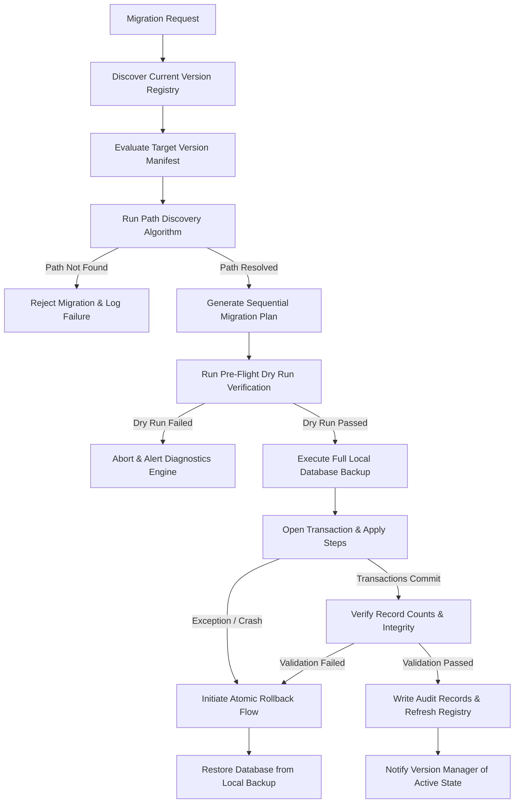
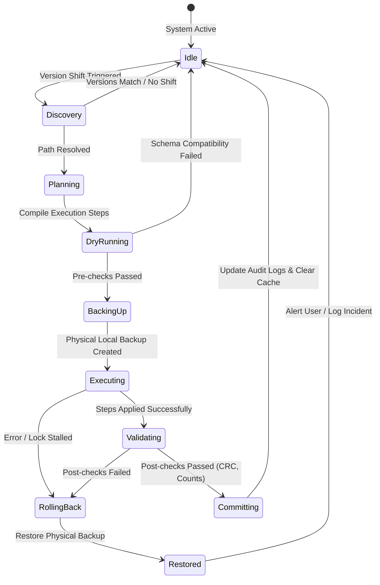
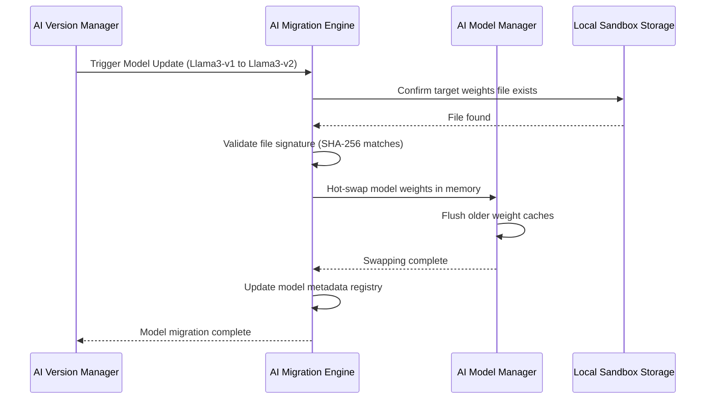

# LifeFresh AI Constitution
## AI Migration Engine Specification v1.0

**Version:** 1.0  
**Status:** Approved / Core Reference Architecture  
**Last Updated:** July 2026  
**Classification:** Enterprise Internal  

---

### Purpose
The **AI Migration Engine** is the core schema transformation, record restructuring, and state synchronization backbone of the LifeFresh QuickNote Pro platform. Designed to facilitate safe, offline-first execution, the Migration Engine manages the dynamic, transactional, and lossless upgrading or downgrading of application databases, AI model metadata, active configurations, prompt definitions, workflow patterns, and user memories. In a decentralized workspace, this engine ensures that local SQLite structures and local AI assets adapt smoothly between version jumps without relying on active cloud connections and with absolute prevention of user data loss.

---

### Scope
This specification governs the design, state machine, path discovery rules, pre/post-conditions, rollback guarantees, verification checks, and API specifications of the on-device Migration Engine. It covers data schema migrations (SQLite), configurations, semantic memories, offline search indexes, backup registers, active workflows, local AI weights, and embedding indexes.

---

### Objectives
* **Lossless Schema Evolution:** Guarantee transactional data transformations, ensuring zero data deletion or corruption of clinical notes during migrations.
* **Low-Resource Adaptability:** Execute complex data transformations within strict physical limits (e.g., $<5\%$ CPU overhead, $<50\text{MB}$ heap, and low-priority background scheduling).
* **Deterministic Path Resolution:** Automatically find and order sequential and non-sequential version paths from any arbitrary source state to the target state.
* **Zero-Downtime Rollback:** Ensure that if any step in the migration sequence fails, the system automatically triggers a point-in-time restore to return the application to its pre-migration state.

---

### Design Principles
* **Transaction Isolation:** Every migration step must run inside an isolated SQLite database transaction, committing only upon successful validation.
* **Idempotency Guarantee:** Migration scripts must be designed such that executing them multiple times results in the identical final state.
* **Metadata-Driven Planning:** Transformation paths must rely entirely on declarative migration manifest files rather than hardcoded logical statements.
* **Validation Prior to Ingestion:** Source and target states must pass strict schema validation, record-count checks, and checksum tests before any changes are committed.

---

### 1. Functional Boundaries & Distinctions
To prevent duplicate responsibilities, the AI Migration Engine is strictly separated from other local systems:

| System Domain | Primary Action | Target Data Type | Dependency Hook | Reference Engine |
| :--- | :--- | :--- | :--- | :--- |
| **Migration Engine** | Transforms structure, columns, and relations during updates. | Active database tables, weights, memory keys. | Version Manager triggers. | `AI_Migration_Engine.md` |
| **Backup & Recovery** | Packages, compresses, and archives the physical database file. | Entire SQLite file, flat parameters. | Run immediately before migration. | `AI_Backup_Engine.md` |
| **Sync Engine** | Merges records horizontally between device nodes. | User notes, active tasks, log rows. | Uses migrated target schema. | `AI_Sync_Engine.md` |
| **Configuration Engine** | Dispatches runtime parameters and toggles features. | Active YAML parameters, feature flags. | Updates dynamic thresholds post-migration. | `AI_Configuration_Engine.md` |
| **Version Manager** | Tracks, registers, and validates software version numbers. | Component tags, SemVer hashes. | Directs path discovery rules. | `AI_Version_Manager.md` |

---

### 2. Migration Architecture
The Migration Engine acts as a structured pipeline, validating states and executing transformations through isolated, transactional blocks:



---

### 3. Core Components
* **Path Resolver:** Evaluates compatibility matrices, calculates version paths, and handles multi-version forward or backward steps.
* **Transaction Supervisor:** Manages database lock checkpoints and rollback files, ensuring atomic, crash-safe operations.
* **Validation Analyst:** Executes checksum verifications, record counts, foreign key constraints, and semantic check scripts.
* **Data Transformer:** Runs columns, tables, indexing transformations, and Full Text Search (FTS) index rebuilds.
* **Model Validator:** Registers and validates local AI weights files, validating checksums and loading properties post-migration.

---

### 4. Migration Lifecycle & State Machine
The Migration Engine cycles through a formal state machine to ensure security and prevent data loss:



---

### 5. Schema Migration & FTS Rebuilding
When modifying database structures, the engine handles migrations in isolated stages:
* **Table Restructuring:** Temporarily duplicates target tables, transfers existing columns, sets default constraints on new schemas, and purges obsolete layouts.
* **FTS Index Migration:** Standard Full Text Search (FTS5) indexes are dropped and rebuilt dynamically post-migration to prevent token anomalies:
```sql
-- Rebuild FTS5 Virtual Indexes safely during database transformations
DROP TABLE IF EXISTS notes_fts_idx;
CREATE VIRTUAL TABLE notes_fts_idx USING fts5(note_id, title, content, content='notes');
INSERT INTO notes_fts_idx(rowid, note_id, title, content) SELECT rowid, note_id, title, content FROM notes;
```
* **WAL-Safe Checkpoint Integration:** The system forces a full SQLite checkpoint to flush all Write-Ahead Log (WAL) records before structural modifications are executed:
```sql
PRAGMA wal_checkpoint(TRUNCATE);
```

---

### 6. Dynamic Asset & Model Migration
The Migration Engine processes non-database assets to keep the system aligned with model updates:
* **User Preferences & Configuration:** Maps flat keys, feature flag parameters, and active configuration tables to updated schema scopes.
* **AI Memories & Knowledge Base:** Adapts semantic memories, vector embeddings, and prompt templates, updating metadata to match target requirements.
* **Local AI Model Weights:** Confirms file placement, registers semantic compatibility keys, and validates model weight integrity using SHA-256 signatures:



---

### 7. Core Execution Algorithms

#### 7.1 Path Resolution Algorithm
The Path Resolver evaluates a directed acyclic graph (DAG) of migrations, finding the shortest path from the current version to the target version:

```kotlin
class MigrationPathResolver {
    fun resolvePath(
        currentVersion: String,
        targetVersion: String,
        availableMigrations: List<MigrationDefinition>
    ): List<MigrationDefinition> {
        val graph = buildMigrationGraph(availableMigrations)
        val shortestPath = findShortestPath(graph, currentVersion, targetVersion)
        
        if (shortestPath.isEmpty() && currentVersion != targetVersion) {
            throw MigrationPathException("No valid migration path found from $currentVersion to $targetVersion")
        }
        return shortestPath
    }

    private fun findShortestPath(
        graph: Map<String, List<MigrationDefinition>>,
        start: String,
        end: String
    ): List<MigrationDefinition> {
        val queue = ArrayDeque<List<MigrationDefinition>>()
        val visited = mutableSetOf<String>()
        
        queue.add(emptyList())
        visited.add(start)

        while (queue.isNotEmpty()) {
            val path = queue.removeFirst()
            val current = if (path.isEmpty()) start else path.last().targetVersion
            
            if (current == end) return path
            
            for (edge in graph[current] ?: emptyList()) {
                if (edge.targetVersion !in visited) {
                    visited.add(edge.targetVersion)
                    val newPath = path + edge
                    queue.add(newPath)
                }
            }
        }
        return emptyList()
    }

    private fun buildMigrationGraph(migrations: List<MigrationDefinition>): Map<String, List<MigrationDefinition>> {
        return migrations.groupBy { it.sourceVersion }
    }
}

data class MigrationDefinition(
    val sourceVersion: String,
    val targetVersion: String,
    val scriptName: String
)
```

---

### 8. Verification and Post-checks
Following migration, the Validation Analyst runs several verification tests:
* **Checksum Verification:** Calculates and compares hash signatures of the database structure to detect schema anomalies.
* **Record Count Validation:** Ensures that matching tables contain identical counts before and after the migration.
* **Foreign Key Constraints:** Confirms referential integrity across all database tables:
```sql
PRAGMA foreign_key_check;
```

---

### 9. API Contracts & Structures

#### 9.1 Kotlin API Definition
```kotlin
interface MigrationService {
    suspend fun checkMigrationStatus(): MigrationStatusRecord
    suspend fun resolveAndPreparePath(targetVersion: String): MigrationPlan
    suspend fun executeMigrationPlan(plan: MigrationPlan, progress: MigrationProgressListener): Result<Boolean>
    suspend fun executeDryRun(plan: MigrationPlan): DryRunReport
    suspend fun rollbackToBackup(): Boolean
}

data class MigrationStatusRecord(
    val currentVersion: String,
    val targetVersion: String,
    val isMigrationRequired: Boolean,
    val estimatedBytesRequired: Long,
    val thermalStateSafe: Boolean
)
```

#### 9.2 SQLite Migration Schema
```sql
CREATE TABLE migration_registry (
    migration_id TEXT PRIMARY KEY NOT NULL,
    source_version TEXT NOT NULL,
    target_version TEXT NOT NULL,
    script_name TEXT NOT NULL,
    applied_utc INTEGER NOT NULL,
    duration_ms INTEGER NOT NULL,
    checksum_verified TEXT NOT NULL,
    state TEXT NOT NULL -- SUCCESS, FAILED, ROLLBACK
);

CREATE TABLE migration_backup_registry (
    backup_id TEXT PRIMARY KEY NOT NULL,
    version_context TEXT NOT NULL,
    file_path TEXT NOT NULL,
    created_utc INTEGER NOT NULL,
    file_size_bytes INTEGER NOT NULL,
    state TEXT NOT NULL
);
```

#### 9.3 YAML Migration Manifest
```yaml
migration_manifest:
  schema_version: "1.0.0"
  release_tag: "v2.1.0"
  migrations:
    - id: "mig_v1_v2"
      source: "1.0.0"
      target: "2.0.0"
      script_path: "assets/migrations/mig_v1_v2.sql"
      requires_blocking: true
      resource_profiles:
        min_battery_percentage: 20
        min_free_storage_mb: 100
    - id: "mig_v2_v3"
      source: "2.0.0"
      target: "3.0.0"
      script_path: "assets/migrations/mig_v2_v3.sql"
      requires_blocking: false
```

#### 9.4 JSON Migration Log Example
```json
{
  "eventId": "evt_mig_00192a",
  "timestampUtc": 1783648110000,
  "source": "1.0.0",
  "target": "2.0.0",
  "state": "SUCCESS",
  "stepsApplied": [
    {
      "stepIndex": 1,
      "description": "Add dynamic_sync column to notes table",
      "durationMs": 42
    },
    {
      "stepIndex": 2,
      "description": "Rebuild FTS5 index notes_fts_idx",
      "durationMs": 118
    }
  ],
  "verification": {
    "checksum": "sha256_structure_hash_value",
    "rowCountVerified": true,
    "foreignKeysVerified": true
  }
}
```

---

### 10. Security and Privacy
* **Local Sandbox Operations:** Backups and transformation steps execute within the application's isolated sandbox storage, preventing access to database files from outside the app.
* **Key Encryption:** Database encryption keys are linked directly to the hardware keystore, ensuring data security is maintained during transformations.
* **Redaction Standards:** Migration logs use generic descriptions, ensuring patient data (PII/PHI) and raw prompt contents are never written to disk.

---

### 11. Testing Strategy
* **Fault Injection Tests:** Interrupts execution threads during active migrations to confirm the Transaction Supervisor can rollback and restore the database to its pre-migration state.
* **Multi-Version Verification:** Tests upgrade paths starting from early legacy versions to confirm data and schema structures are preserved.
* **Resource Constraint Emulation:** Simulates low-battery ($<10\%$) and limited storage states to verify that execution limits block migration starts.

---

### 12. Enterprise Deployment
* **MDM Configurations:** Enterprise administrators can manage, schedule, or delay non-critical background migrations using MDM profiles.
* **Quiet-Hour Scheduling:** Migrations can be configured to run during specific quiet hours, reducing operational impact for clinicians.

---

### 13. Best Practices & Anti-patterns

#### Best Practices
* **Enforce Transaction Isolation:** Wrap all schema modifications in isolated database transactions, ensuring atomic changes.
* **Verify Storage Bounds:** Calculate file requirements and confirm device storage is available before writing database backups.
* **Test Migration Paths:** Test both sequential step-by-step migrations and direct multi-version upgrades to identify structure issues.

#### Anti-patterns
* **Modifying Schemas Directly:** Running schema adjustments directly in client views without using the Migration Engine, causing data corruption.
* **Skipping File Backups:** Running data transformations without creating a local database backup, increasing the risk of unrecoverable database locks or corruptions.
* **Leaving WAL Tables Active:** Attempting migrations with active Write-Ahead Log (WAL) caches, causing write conflicts.

---

### Future Enhancements
* **Dynamic Biomarker Diagnostics:** Automatically calibrate diagnostic rules and alert priorities based on active user fatigue trends.
* **Decentralized Local Diagnostics Mesh:** Cross-verify diagnostic reports securely on offline networks, helping administrators locate and isolate failed hardware nodes.

---

### Related AI Constitution Documents
* `AI_Version_Manager.md`
* `AI_Diagnostics_Engine.md`
* `AI_Execution_Engine.md`

---

### References
1. Database Schema Evolution on Offline-First Mobile and Edge Devices: Architectural Guidelines
2. NIST SP 800-162: Zero Trust Schema Migration and Data Integrity Standards
3. Android NNAPI: Thermal Control and Dynamic Asset Upgrade Best Practices

---

### Conclusion
The AI Migration Engine provides a secure, predictable, and local framework designed to manage database upgrades and model changes for offline healthcare environments. By combining transactional isolation, declarative planning, verification checks, and automated backups, the Engine ensures the host platform remains safe, stable, and compliant under all operating conditions.
