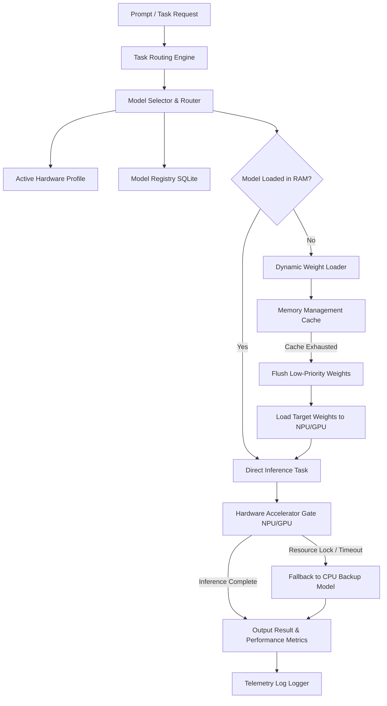
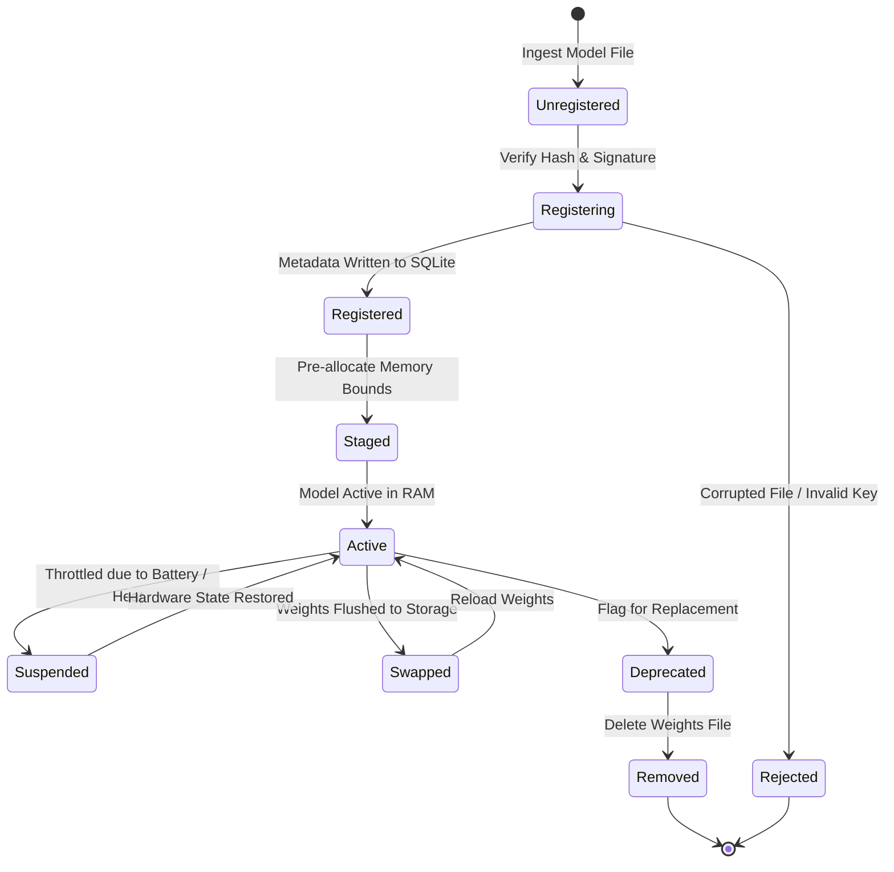
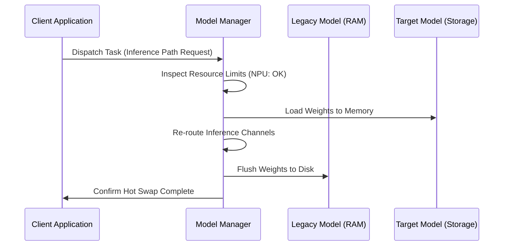

# LifeFresh AI Constitution
## AI Model Manager Specification v1.0

**Version:** 1.0  
**Status:** Approved / Core Reference Architecture  
**Last Updated:** July 2026  
**Classification:** Enterprise Internal  

---

### Purpose
The **AI Model Manager** is the core discovery, deployment, lifecycle-management, resource-arbitration, and governance authority for all artificial intelligence models operating within the LifeFresh AI ecosystem. Operating on-device to enforce offline-first operation, the Model Manager manages model registration, dynamic loading, hot-swapping, runtime routing, hardware acceleration allocation, memory footprints, and optimization rules. By coordinating directly with the `AI_Policy_Engine.md` and the `AI_Execution_Engine.md`, it ensures that local model inferences execute with maximum performance, perfect clinical safety, and absolute confidentiality without relying on constant cloud connectivity.

---

### Scope
This specification governs the design, registry databases, loading strategies, scheduling parameters, hardware-accelerator configuration, optimization pipelines, and security controls of the local Model Manager. It covers local, cloud, and hybrid deployment profiles at the edge.

---

### Objectives
* **Deterministic Model Orchestration:** Coordinate model loading, routing, and hot-swapping processes through structured, metadata-validated pipelines.
* **Optimized Hardware Allocation:** Dynamically balance model execution paths across available CPU, GPU, and NPU accelerators on the device.
* **Low-Latency Selection & Switching:** Resolve model selection and task routing loops locally in **<8ms** to prevent main-thread latency.
* **Intelligent Memory Management:** Prevent memory exhaustion by using lazy loading, active weight flushing, and aggressive caching bounds.

---

### Design Principles
* **Declarative Model Isolation:** Model parameters, architectures, and execution constraints must be declared in structured metadata configurations separate from client code.
* **Zero-Downtime Hot-Swapping:** Support runtime model transitions without breaking active inference streams or clearing parent session context.
* **Fail-Safe Fallbacks:** If a high-capacity quantized model encounters hardware allocation failures, execution must fall back immediately to lightweight backup models.
* **Append-Only Inference Audit:** Every model loading request, hardware allocation decision, optimization step, and execution metric must be logged to a signed ledger.

---

### 1. Engine Overview
The **AI Model Manager** is the execution brain of the platform. It manages local AI assets, maintains model lists, evaluates performance metrics, directs tasks to optimal models, manages weight allocations in device RAM, coordinates CPU/GPU threading, and applies on-device optimization steps.

---

### 2. Core Responsibilities
* **Unified Model Registry:** Maintaining a verified list of active local and remote models.
* **Adaptive Resource Arbitration:** Allocating GPU/NPU engines dynamically based on system temperatures and battery states.
* **Hot-Swapping Operations:** Transitioning execution streams between models seamlessly at runtime.
* **Dynamic Task Routing:** Directing incoming prompts to the model best suited for the task's complexity.

---

### 3. Model Architecture
The Model Manager manages resources, selects execution paths, and deploys model engines using a structured, isolated system:



---

### 4. Model Lifecycle
Models follow a strict lifecycle flow on-device to manage resource consumption and verify data safety:



---

### 5. Model Registry
The **Model Registry** is managed locally in an encrypted SQLite database. It indexes available models, their sizes, parameters, and verification keys, ensuring that only trusted files are executed.

---

### 6. Model Repository
The **Model Repository** is an isolated folder structure inside the app's secure sandbox. It stores local model files (e.g., `.tflite`, ONNX, or GGUF files), shielded from other applications.

---

### 7. Local Models
Local models run entirely on-device, handling low-latency tasks like token generation and formatting adjustments without requiring network connections.

---

### 8. Cloud Models
Cloud models are registered for high-complexity tasks. Endpoints are accessed securely via SSL/TLS, utilizing client certificate handshakes.

---

### 9. Hybrid Models
Hybrid plans evaluate tasks dynamically. Simple steps are processed locally, while complex calculations are sent to cloud services when secure channels are active.

---

### 10. Model Metadata
Metadata records declare target task boundaries, licensing keys, parameters, and baseline validation checks for each model in the database.

```json
{
  "modelId": "mdl_llama3_3b_q4",
  "name": "Llama3 3B Quantized Q4",
  "version": "1.2.0",
  "format": "GGUF",
  "fileSizeMB": 1850,
  "supportedTasks": ["TEXT_SUMMARIZATION", "INTAKE_PARSING"],
  "resourceConstraints": {
    "minRamRequiredMB": 512,
    "preferredAccelerator": "NPU"
  }
}
```

---

### 11. Model Loading
The loading process reads weights from storage into memory, verifying file hashes to block modification attempts.

---

### 12. Lazy Loading
To conserve resources, models are only loaded into RAM when a corresponding task is actively dispatched.

---

### 13. Dynamic Loading
Enables on-the-fly model deployments, loading specialized models dynamically based on real-time task needs.

---

### 14. Hot Swapping
Enables runtime model transitions without clearing user sessions:



---

### 15. Model Selection
Selectors match tasks with models based on priority, resource states, and complexity parameters.

---

### 16. Model Routing
The routing layer directs inputs to target engines, handling queue adjustments and tracking response times.

---

### 17. Model Validation
Before registering files, the validator checks signatures, schemas, and configurations to ensure safety compliance.

---

### 18. Model Compatibility
Compatibility maps link models with supported OS versions and hardware drivers, preventing engine crashes on legacy setups.

---

### 19. Model Versioning
Semantic versioning is tracked for all model files, managing updates and coordinating fallbacks to older versions during updates.

---

### 20. Model Dependencies
Some complex pipelines require multiple synchronized models. The dependency graph ensures that all required models are loaded in sequence.

---

### 21. Quantized Models
Quantized models (e.g., INT4/INT8 weights) are utilized to minimize RAM and storage requirements while preserving inference accuracy.

---

### 22. Edge AI Models
Edge AI models are optimized for mobile processors, leveraging specialized instruction sets to accelerate operations.

---

### 23. Runtime Model Switching
Runtime switching monitors battery levels, scaling back from high-performance models to lightweight configurations when battery levels drop.

---

### 24. Resource Allocation
The resource scheduler monitors NPU, GPU, and CPU states, distributing workloads to prevent thermal throttling.

---

### 25. GPU/CPU Selection
Inferences are dynamically directed to NPUs or GPUs when available, falling back to CPUs only when accelerators are locked or unsupported.

---

### 26. Memory Management
The memory manager uses an LRU cache to handle weights. When memory usage nears critical thresholds, low-priority models are flushed to disk:

```kotlin
fun reclaimModelMemory(requiredBytes: Long, activeModels: MutableList<LoadedModel>) {
    activeModels.sortBy { it.lastAccessTimestamp }
    while (getAvailableDeviceMemory() < requiredBytes && activeModels.isNotEmpty()) {
        val modelToUnload = activeModels.removeAt(0)
        modelToUnload.unloadWeights()
        Log.i("MODEL_MANAGER", "Unloaded model: ${modelToUnload.modelId} to free memory")
    }
}
```

---

### 27. Model Optimization
The optimization pipeline compresses model parameters dynamically, using pruning and layer fusion to speed up execution.

---

### 28. Monitoring
* **Inference Latency:** Monitors processing times, logging warnings if delays exceed **2500ms**.
* **RAM Footprint:** Tracks model memory allocation in real-time to avoid system out-of-memory errors.

---

### 29. Logging
Logs track model lifecycle states. Inputs, outputs, and patient data are fully redacted:

```
[2026-07-11 04:12:11] [INFO] [MODEL_MGR] Registering model file: mdl_llama3_3b_q4
[2026-07-11 04:12:11] [INFO] [MODEL_MGR] Verification passed. Signature verified with corporate key.
[2026-07-11 04:12:12] [INFO] [MODEL_MGR] Lazy-loading model to NPU memory. Size: 1.85GB.
[2026-07-11 04:12:13] [INFO] [MODEL_MGR] Model loaded successfully. Ready for routing in 1420ms.
```

---

### 30. APIs
The Model Manager exposes Kotlin interfaces to manage registrations, route tasks, and monitor memory:

```kotlin
interface ModelManagerService {
    suspend fun registerModel(metadata: ModelMetadataDefinition, filePath: String): Result<Boolean>
    suspend fun loadModel(modelId: String): Result<LoadedModelRef>
    suspend fun routeInference(modelId: String, prompt: String): Result<InferenceResponse>
    suspend fun unloadModel(modelId: String): Boolean
    suspend fun getActiveUsageSnapshot(): MemoryUsageSnapshot
}
```

---

### 31. Internal Data Structures
To ensure safe background operations, metadata and reference maps use immutable Kotlin definitions:

```kotlin
data class ModelMetadataDefinition(
    val modelId: String,
    val name: String,
    val version: String,
    val format: String,
    val fileSizeMB: Long,
    val hashSHA256: String,
    val taskList: List<String>
)
```

---

### 32. SQL Model Registry Schema
The SQLite database stores active model routes, capabilities, metadata parameters, and processing logs:

```sql
CREATE TABLE models_registry (
    model_id TEXT PRIMARY KEY NOT NULL,
    name TEXT NOT NULL,
    version TEXT NOT NULL,
    format TEXT NOT NULL,
    file_size_mb INTEGER NOT NULL,
    file_hash TEXT NOT NULL,
    state TEXT NOT NULL
);

CREATE TABLE model_capabilities (
    model_id TEXT NOT NULL,
    task_type TEXT NOT NULL,
    PRIMARY KEY (model_id, task_type),
    FOREIGN KEY (model_id) REFERENCES models_registry(model_id) ON DELETE CASCADE
);

CREATE TABLE model_execution_log (
    execution_id TEXT PRIMARY KEY NOT NULL,
    model_id TEXT NOT NULL,
    timestamp_utc INTEGER NOT NULL,
    latency_ms INTEGER NOT NULL,
    peak_memory_mb INTEGER NOT NULL,
    status TEXT NOT NULL,
    FOREIGN KEY (model_id) REFERENCES models_registry(model_id)
);
```

---

### 33. Security Controls
* **Integrity Audits:** Model files undergo cryptographic hash checks on every load request.
* **Sandbox Limits:** Local models run inside isolated memory boundaries with zero access to system files.

---

### 34. Performance Optimization
* **Hardware Interop Engines:** Interoperability layers use low-level Android NNAPI drivers to speed up computation.
* **Pre-cached KV Maps:** Context key-value matrices are retained in memory during active dialogues to speed up sequential generation steps.

---

### 35. Error Handling
* **Hardware Driver Failures:** If NNAPI encounters an exception, the manager resets the connection and routes requests to CPU fallback modes.
* **Corrupted Weights Files:** If hash validation fails, the manager quarantines the file and alerts recovery threads.

---

### 36. Recovery Mechanisms
If systematic errors occur during dynamic loading, a diagnostic service cleans the memory cache, restores baseline models, and prompts for model re-downloads.

---

### 37. Enterprise Deployment
For corporate systems, model configurations, access definitions, and model weights are packaged as verified profiles deployed across device fleets using MDM platforms.

---

### 38. Future Expansion
* **Decentralized Model Slicing:** Split complex inference pipelines across multiple peer-to-peer devices on offline local networks.
* **Biometric Calibration Loops:** Dynamically scale model capabilities and parameter constraints based on user focus and fatigue metrics.

---

### Conclusion
The AI Model Manager provides a secure, predictable, and resource-efficient framework designed for edge-native healthcare systems. By enforcing dynamic weight validation, resource allocation controls, lazy-loading caches, and backup fallbacks, the Manager ensures that local model operations run safely, efficiently, and securely under all conditions.

### Related AI Constitution Documents
* `AI_Policy_Engine.md`
* `AI_Execution_Engine.md`
* `AI_Decision_Engine.md`

### References
1. Dynamic Model Loading and Resource Arbitration on Mobile Systems: Edge Best Practices
2. NIST SP 800-162: Zero Trust Systems and Model Governance Standards
3. Android NNAPI: Guidelines for Cryptographic Model Integrity Verification
