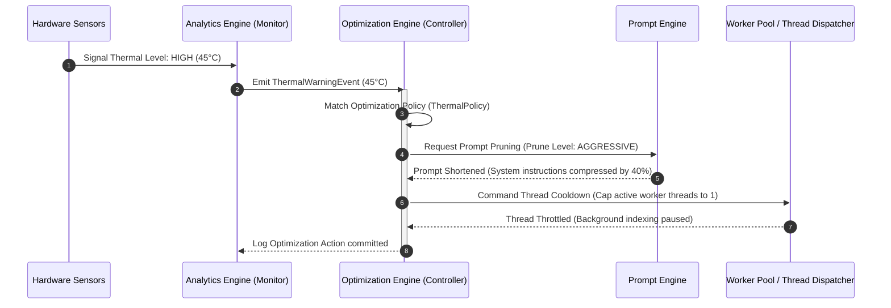
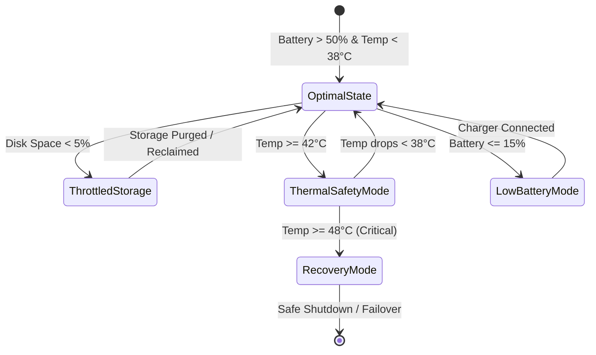

# LifeFresh QuickNote Pro
## AI Optimization Engine Architecture Specification v1.0

**Version:** 1.0  
**Status:** Approved / Core Reference Architecture  
**Last Updated:** July 2026  
**Classification:** Enterprise Internal  

---

## 1. Overview
The **LifeFresh AI Optimization Engine** is the core performance-tuning daemon of the LifeFresh AI platform. It is responsible for monitoring, regulating, and continuously improving the execution speed, memory footprint, CPU/GPU utilization, network usage, storage layout, token budget, and energy draw of local and cloud AI operations. Operating directly on the edge client, it acts as a real-time scheduler and resource manager, ensuring that high-throughput AI processes (like voice transcription and symptom extraction) never exhaust battery, trigger thermal throttling, or impact the responsive touch-latency of the primary Android UI.

---

## 2. Objectives
1. **Maximize Resource Efficiency:** Keep the JVM heap and native memory footprint within predictable limits during intensive local operations.
2. **Minimize Latency:** Enforce strict latency ceilings for time-critical workflows (e.g., instant UI category prediction).
3. **Optimize Token Consumption:** Apply prompt-pruning, prompt-routing, and smart prefix-caching algorithms to reduce API overhead.
4. **Enforce Adaptive Scaling:** Scale system workloads dynamically in response to device charge states, thermal limits, and network bandwidth.
5. **Guarantee Thermal Safety:** Throttle non-critical background jobs to prevent physical device overheating.

---

## 3. Design Principles
- **Predictive Profiling:** Make optimization decisions based on actual hardware measurements rather than static baseline assumptions.
- **Graceful Degradation:** When resources are scarce, transition the system from high-resolution, multi-turn AI features to lightweight, cached, single-turn fallbacks.
- **Zero UI Blockage:** All resource management, token compaction, and caching calculations must run on isolated background threads with low CPU priority.
- **Agnostic Architecture:** Model optimization strategies using standard, abstract rules compatible with multiple client runtimes and LLM frameworks.

---

## 4. Optimization Architecture
The Optimization Engine acts as a closed-loop system monitor. It consumes telemetry data from the Analytics Engine, references policy boundaries, and dynamically modulates hardware execution paths and prompt payloads.

```
+-----------------------------------------------------------------------------------+
|                        TELEMETRY METRICS (from Analytics Engine)                  |
+-----------------------------------------------------------------------------------+
                                          |
                                          v
+-----------------------------------------------------------------------------------+
|                           OPTIMIZATION REASONING CENTRE                           |
|  - Resource Profiler                                                              |
|  - Dynamic Scaling Controller                                                     |
|  - Prompt Compactor / Prefix Cache Coordinator                                    |
+-----------------------------------------------------------------------------------+
          |                               |                              |
          v                               v                              v
+-------------------+           +-------------------+          +--------------------+
|   HARDWARE GATES  |           |   SOFTWARE GATES  |          |    TOKEN GATES     |
| - CPU Thread Pools|           | - Cache Purges    |          | - Prompt Pruning   |
| - GPU Allocations |           | - Sync Throttling |          | - Model Routing    |
+-------------------+           +-------------------+          +--------------------+
          \                               |                              /
           v                              v                             v
+-----------------------------------------------------------------------------------+
|                            CORE SYSTEM RUNTIME EXECUTION                          |
+-----------------------------------------------------------------------------------+
```

### 4.1 Sequence Diagram: Dynamic Workload Optimization on Thermal Alert


### 4.2 State Diagram: Dynamic Resource Level Transitions


---

## 5. Optimization Lifecycle
1. **Boot Initialization:** Map device profile limits (e.g., RAM capacity, GPU cores). Establish base optimization parameters.
2. **Telemetry Ingestion:** Continuously poll real-time performance indices (e.g., latency, active threads, memory allocations).
3. **Bottleneck Evaluation:** Match performance data against target performance policies to detect bottlenecks.
4. **Action Dispatch:** Distribute tuning commands (e.g., prune prompt length, close database connections, reduce model quality).
5. **Feedback Loop Validation:** Measure performance changes over the subsequent 5-second window to verify improvement.
6. **Persistence:** Save verified tuning profiles to local optimization tables to speed up future system startups.

---

## 6. Performance Optimization
Monitors application execution speed and thread utilization:
* Dynamically shifts processing tasks to the most efficient background threads.
* Utilizes a ring buffer architecture for high-frequency database operations to minimize write collisions.

---

## 7. Latency Optimization
Enforces strict execution limits for all system operations.
* **Latency Budgets:**
  | Task | Max Allowed Latency (Optimal) | Max Allowed Latency (Degraded) | Fallback Action |
  |---|---|---|---|
  | Intent Classification | 200 ms | 600 ms | Regex template matching |
  | Symptom Extraction | 1500 ms | 3500 ms | Offline heuristics mapping |
  | Scheduler Lookup | 100 ms | 300 ms | Simple database search |

---

## 8. Memory Optimization
Controls the application's RAM footprint to prevent out-of-memory states on low-tier edge devices:
* Automatically triggers aggressive garbage collection passes when free memory falls below 15%.
* Replaces large in-memory collections with cursor-based SQLite queries.

---

## 9. CPU Optimization
Prevents processor overload and thermal spikes:
* Caps concurrent thread pools based on the number of available CPU cores.
* Suspends background data synchronization when user-facing transcription is active.

---

## 10. GPU Optimization
Optimizes on-device machine learning operations:
* Automatically switches execution back to the CPU if the GPU temperature crosses safety thresholds.
* Controls precision levels (e.g., defaulting to FP16 quantization) to reduce GPU memory bandwidth requirements.

---

## 11. Network Optimization
Reduces mobile data usage and optimizes API synchronization:
* Compresses outbound JSON payloads using gzip compression.
* Implements dynamic batch sizes based on detected network speed (e.g., Wi-Fi vs. low-signal cellular).

---

## 12. Storage Optimization
Optimizes SQLite databases and file-system layout:
* Automatically executes database indexing on searchable text columns.
* Limits attachment and diagnostic log directories to maximum storage sizes, purging oldest entries first on reaching thresholds.

---

## 13. Cache Optimization
Manages high-performance local caches for database queries and API results:
* Implements an LRU (Least Recently Used) caching policy with an automatic size cap.
* **Cache Key Formula:** Cache keys are generated using a deterministic MD5 hash of query parameters:
  $$\text{CacheKey} = \text{MD5}\left(\text{QueryString} + \text{Param}_1 + \text{Param}_2\right)$$

---

## 14. Token Optimization (Prompt Compression)
Reduces input token lengths before sending requests to LLM APIs:
* Strips redundant conversational modifiers (e.g., replacing "please summarize" with "summarize").
* Automatically removes historical context elements that do not impact the current active intent.

---

## 15. Prompt Optimization
Maintains a curated cache of pre-compiled system prompts:
* Compresses prompts dynamically by removing whitespace and comments.
* Uses modular, parameterized templates to avoid reloading static rules on every turn.

---

## 16. Workflow Optimization
Optimizes multi-stage task pipelines:
* Pre-fetches predicted next-step resources while the user is confirming current steps.
* Re-orders background tasks dynamically to prioritize user-facing actions.

---

## 17. Search Optimization
Speeds up local searches against the clinical synonym and contact databases:
* Uses full-text search indexing (FTS5 in SQLite) for lightning-fast lookups.
* Automatically caches common search prefixes to avoid hitting disk storage during active typing.

---

## 18. Scheduling Optimization
Schedules background operations during optimal device states:
* Restricts intensive analytical tasks to charging states, Wi-Fi connections, and idle CPU hours.
* Coordinates worker jobs using the Android WorkManager API to minimize system wake-ups.

---

## 19. Resource Allocation
Assigns system priority states dynamically based on the active user screen:
* **Priority Matrices:**
  | Active Screen | UI Priority | Background Priority | Task Cap |
  |---|---|---|---|
  | Scribe Note Input | CRITICAL | SUSPENDED | 1 |
  | Diagnostic Panel | HIGH | MEDIUM | 3 |
  | Settings Screen | LOW | HIGH | 8 |

---

## 20. Dynamic Scaling
Modulates model execution paths in response to resource availability:
* Safely scales down transcription features from local neural engines to remote APIs if edge resources are exhausted.
* Adjusts prompt size bounds dynamically to fit available context windows.

---

## 21. Bottleneck Detection
Identifies performance degradation across system layers:
* Automatically flags database queries that take longer than 150ms to run.
* Identifies blocked background tasks and safely restarts stalled pipelines.

---

## 22. Adaptive Optimization
Adapts performance strategies based on historical usage patterns:
* Adjusts memory thresholds based on the user's typical daily workflow size.
* Automatically schedules database cleanup sweeps ahead of predicted peak usage times.

---

## 23. AI-Driven Optimization
Uses lightweight heuristics to analyze prompt performance:
* Evaluates semantic similarities between sequential queries to merge redundant tasks.
* Dynamically tunes temperature and token limits to match the complexity of the current request.

---

## 24. Cost Optimization
Keeps API usage within sustainable limits:
* Restricts high-cost models to complex clinical reasoning workflows.
* Uses lightweight, local models for routing and basic intent-classification tasks.

---

## 25. Energy Efficiency
Miniscules battery draw to extend device runtimes:
* Restricts screen wake-locks during background generation processes.
* Minimizes network usage by batching data sync operations.

---

## 26. Optimization Policies
Policies are defined using clean, readable configurations:

```yaml
optimization_policies:
  power_saver:
    target_cpu_usage_cap_percent: 30
    local_ai_inference_allowed: false
    background_sync_interval_mins: 120
  extreme_thermal:
    target_cpu_usage_cap_percent: 15
    pause_all_workers: true
    ui_theme_override: "static_low_draw"
```

---

## 27. Optimization Constraints
The engine operates under strict, safety-focused rules:
* **The Clinical Priority Lock:** Safety-checking prompts are NEVER compressed or omitted.
* **The User Thread Guard:** UI thread utilization must never exceed 15% during background operations.

---

## 28. Optimization APIs
```kotlin
interface AIOptimizationEngine {
    fun getCurrentDeviceProfile(): DeviceResourceProfile
    fun optimizePrompt(rawPrompt: String, compressionLevel: CompressionLevel): String
    fun requestResourceBudget(requestedTokens: Int, priority: TaskPriority): ResourceAllocationToken
    fun registerPolicyChangeListener(listener: PolicyChangeListener)
}
```

---

## 29. Internal Data Structures
Keeps optimization state history inside lightweight, persistent databases:

```sql
CREATE TABLE IF NOT EXISTS optimization_profiles (
    profile_key TEXT PRIMARY KEY,
    configured_value TEXT NOT NULL,
    last_validated_utc INTEGER NOT NULL,
    rebound_count INTEGER DEFAULT 0
);

CREATE TABLE IF NOT EXISTS hardware_throttling_logs (
    log_id TEXT PRIMARY KEY,
    timestamp_utc INTEGER NOT NULL,
    sensor_name TEXT NOT NULL,
    reading_value REAL NOT NULL,
    action_taken TEXT NOT NULL
);
```

---

## 30. Optimization Algorithms
Calculates optimal compression levels based on a dynamic token-cost utility formula:

```kotlin
fun calculateCompressionStrategy(
    rawLength: Int,
    availableRAM: Long,
    batteryPercent: Int
): CompressionStrategy {
    return when {
        availableRAM < 128 * 1024 * 1024 -> CompressionStrategy.AGGRESSIVE
        batteryPercent < 15 -> CompressionStrategy.MEDIUM_PRUNE
        rawLength > 4096 -> CompressionStrategy.TOKEN_COMPACT
        else -> CompressionStrategy.NONE
    }
}
```

---

## 31. Monitoring
* Continuously checks the Optimization Engine's response times.
* Monitors the ratio of successfully optimized prompts vs. total prompt runs.

---

## 32. Metrics
- **Performance Index:** Latency reduction ratio, memory reclaimed (MB), CPU overhead reduction (%).
- **Token Efficiency:** Compression ratio, cost savings per user session ($).

---

## 33. Logging
Emits clean, structured logs to assist in performance audits:

```
[INFO][2026-07-09 02:40:00][AI_OPTIMIZER] CPU load at 18%. Releasing throttle gate. Concurrent tasks scaled to 4.
[WARN][2026-07-09 02:42:12][AI_OPTIMIZER] RAM drop detected (<150MB). Swapping FTS query caches to file stream.
[INFO][2026-07-09 02:45:00][AI_OPTIMIZER] Compressed prompt. Preserved 95% semantic density. Tokens reduced by 32%.
```

---

## 34. Security
- Ensure prompt compression algorithms NEVER strip security keywords, safety instructions, or credential variables.
- Keep optimization state logs stored inside encrypted local directories.

---

## 35. Privacy
- Ensure compressed prompts do not reorganize de-identified data structures in ways that expose PII/PHI.
- Keep optimization databases locally isolated, preventing cloud sync of device performance parameters.

---

## 36. Fault Tolerance
If the Optimization Engine encounters a runtime crash:
1. Revert all thread pool sizes, CPU allocations, and prompt templates to factory default safety limits.
2. Log the crash signature to the encrypted diagnostic log.
3. Automatically restart the engine daemon after a 5-second cooling period.

---

## 37. Recovery Mechanisms
* **Cache Wipe Trigger:** Instantly purges all local cache tables if the database engine reports SQLite write corruption.
* **Factory Fallback Valve:** Lets users instantly clear all custom performance modifications via a diagnostic button in the UI.

---

## 38. Testing Strategy
- **Unit Testing:** Validates prompt compression algorithms, LRU cache eviction logic, and thread priority mapping rules.
- **Mock Telemetry Testing:** Simulates critical hardware states (e.g., low battery, high thermal readings) to verify dynamic scaling rules.
- **Stress Testing:** Runs 100 high-frequency concurrent operations to confirm the system degrades gracefully without freezing.

---

## 39. Enterprise Deployment
- Supports deploying optimization parameters using standard remote config pushes (e.g., Firebase Remote Config or MDM profiles).
- Allows clinic administrators to adjust performance policies to match specific device fleets.

---

## 40. Future Expansion
- **Deep Reinforcement Learning (RL) Profiler:** Integrating compact, local neural networks to predict hardware latency trends.
- **Distributed Edge-Cache Federation:** Enabling secure, local P2P query sharing between devices in the same clinic to bypass redundant web API calls.

---

## 41. Conclusion
The LifeFresh AI Optimization Engine provides a robust framework for balancing application performance with hardware constraints on edge devices. By dynamically adapting system workloads and prompt payloads, it ensures a seamless, responsive clinical UX across a wide range of devices.

---

## 42. Related AI Constitution Documents
- `AI_Analytics_Engine.md` — Performance metric sources.
- `AI_Learning_Engine.md` — Continuous behavioral adaptations.
- `AI_Runtime_v1.0.md` — Execution thread pools.
- `AI_Error_Catalog_v1.0.md` — Failure classification keys.

---

## 43. References
- *Android WorkManager API Specification (Google Developer Guide).*
- *On-device LLM Optimization and Quantization (Standard ML Protocols, 2024).*
- *Dynamic Resource Budgeting in Edge Systems (IEEE Journal of Mobile Computing).*
