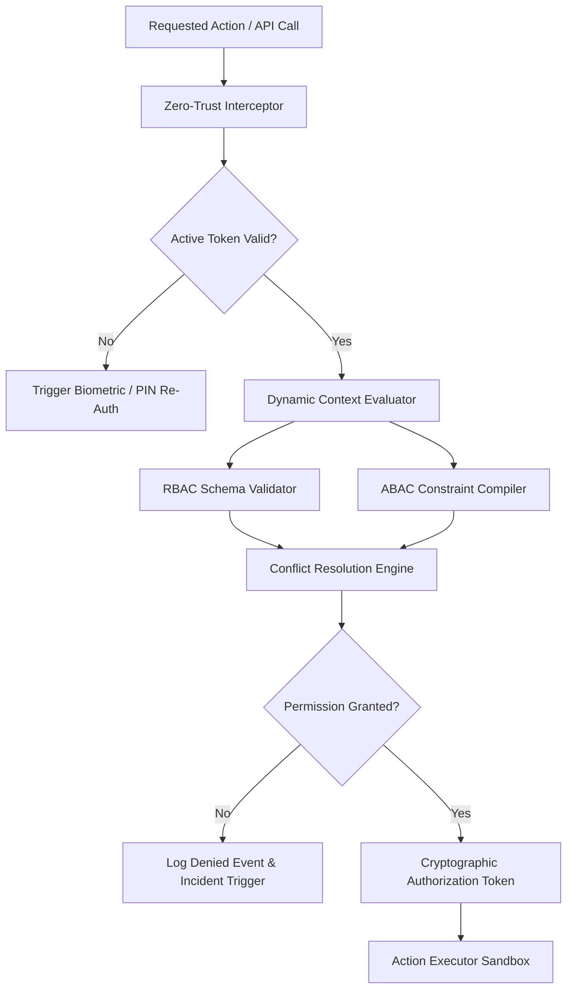
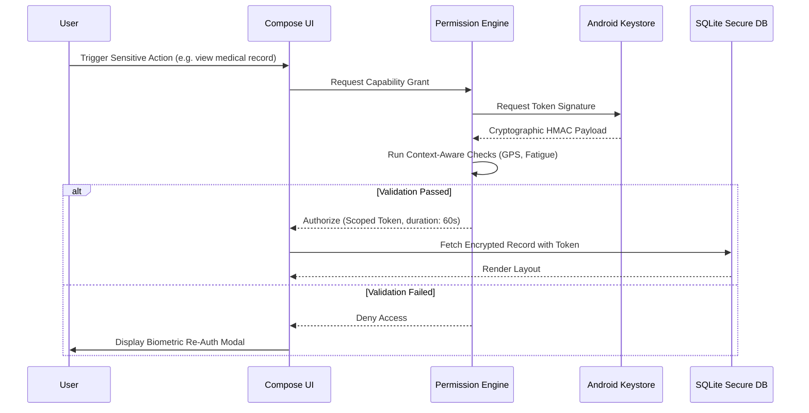

# LifeFresh AI Constitution
## AI Permission Engine Specification v1.0

**Version:** 1.0  
**Status:** Approved / Core Reference Architecture  
**Last Updated:** July 2026  
**Classification:** Enterprise Internal  

---

### Purpose
The **AI Permission Engine** is the ultimate security gateway and cryptographic authorization arbiter of the LifeFresh AI platform. In a high-integrity, decentralized, offline-first healthcare ecosystem, traditional authorization paradigms (e.g., cloud-gated OAuth/session checks) fail during disconnected states. This Engine provides deterministic, context-aware, cryptographic privilege enforcement and access control dynamically at the edge. By combining Role-Based Access Control (RBAC), Attribute-Based Access Control (ABAC), and transient session-based tokenization, the Permission Engine guarantees that no user, device, rule, or autonomous AI agent can execute an action or read sensitive clinical files without explicit, verifiable authorization.

---

### Scope
This specification governs the design, lifecycle, validation pipelines, data schemas, security rules, and APIs of the local Permission Engine. It covers all access control requests across database tables, file storage, OS services, external REST interfaces, and AI generative/decision execution contexts.

---

### Objectives
* **Zero-Trust Access Control:** Enforce strict access boundaries for every system interaction, assuming zero prior trust even for internal service loops.
* **Low-Latency Decision Processing:** Resolve complex context-aware permission trees in **<10ms** to prevent UI and thread-execution bottlenecks.
* **Cryptographic Traceability:** Sign every authorized grant and access denial locally using hardware-backed cryptographic keys to produce a tamper-resistant forensic journal.
* **Resilient Offline Autonomy:** Guarantee uninterrupted, high-security permission verification cycles during disconnected states using local policy-evaluation models.

---

### Design Principles
* **Failsafe Default to Deny:** If any privilege check returns an incomplete, corrupted, or ambiguous state, access is instantly denied.
* **Least Privilege Enforcement:** Grant the minimum possible capabilities required for a specific transaction, restricting the duration of elevated states.
* **Dynamic Context Sensitivity:** Continually evaluate environmental factors (e.g., location coordinates, device network threat posture, cognitive fatigue levels) to adjust permissions in real time.
* **Immutable Policy Separation:** Keep authorization schemas decoupled from runtime business logic, ensuring policy-level changes do not compromise core application stability.

---

### 1. Engine Overview
The Permission Engine is the central gatekeeper filtering all interactions between system layers. It sits below the `AI_Policy_Engine.md` and intercepts requests generated by the `AI_Decision_Engine.md` and the `AI_Autonomous_Engine.md`. It validates capabilities using a secure Local Sandbox before dispatching commands to local SQLite databases or system devices.

---

### 2. Core Responsibilities
* **Identity and Role Verification:** Authenticating local user structures and mapping identities to role definitions.
* **Dynamic Context Parsing:** Evaluating environmental and device attributes (e.g., GPS coordinates, local clock, Wi-Fi SSID security).
* **Token Lifecycle Management:** Generating, rotating, and instantly invalidating transient, scoped authorization tokens.
* **Audit Trail Compilation:** Chaining execution signatures to a local forensic ledger.

---

### 3. Permission Architecture
The Permission Engine filters incoming execution requests through layered evaluation networks:



---

### 4. Permission Lifecycle
Permissions are managed as transient states that evolve dynamically based on live interaction signals:



---

### 5. Authorization Pipeline
The pipeline operates in sequence:
1. **Intercept:** Catches incoming service, database, or API invocations.
2. **Collect Facts:** Loads active session metadata, user roles, target resource characteristics, and system metrics.
3. **Analyze Constraints:** Compiles active RBAC and ABAC structures.
4. **Evaluate Context:** Checks dynamic boundaries (e.g., quiet-hours, location fencing).
5. **Issue Token:** If cleared, returns a short-lived cryptographic authorization token.

---

### 6. Permission Repository
The local **Permission Repository** is stored in an encrypted SQLite database. It maintains the master schemas of system roles, capability listings, and attribute constraints. 

---

### 7. Permission Categories
To ensure granular control, permissions are classified into distinct execution namespaces:
* **System:** OS-level service bounds, thread priority, and process controls.
* **User:** Access thresholds for clinical roles and administrative tasks.
* **AI:** Generative model processing parameters, contextual prompt overrides, and token budgets.
* **Device:** Local camera, hardware sensors, and location APIs.

---

### 8. System Permissions
System-level controls govern processing constraints:
* **Storage IO:** restrains database connections to prevent memory exhaustion.
* **Notification Scheduling:** gates the registration of local alarms.

---

### 9. User Permissions
User capabilities map directly to organizational hierarchies (e.g., `CLINIC_ADMIN`, `FIELD_PRACTITIONER`, `PATIENT_PROXY`).

---

### 10. AI Permissions
These rules govern local LLM pipelines:
* **Model Selection:** Restricts high-performance execution blocks to authorized administrative staff.
* **Token Budgeting:** Controls maximum prompt sizes to preserve system battery.

---

### 11. Device Permissions
Governs hardware usage, mandating on-the-fly authorization when accessing the device's camera or location providers.

---

### 12. File Permissions
Enforces isolated storage. The application's local folders use strict OS-level permissions (`MODE_PRIVATE`) to block external application reads.

---

### 13. Database Permissions
We define access boundaries at the table and column level within the local database. Administrative roles can query all tables, while clinical roles are restricted from reading diagnostic logs or security tables.

---

### 14. API Permissions
Controls outbound HTTP/HTTPS tunnels, blocking communication unless the endpoint is present on the enterprise whitelist.

---

### 15. Feature Permissions
Enables or disables UI components (e.g., administrative dashboards or CSV export utilities) depending on the active user profile's capability set.

---

### 16. Role-Based Access Control (RBAC)
The Engine resolves static hierarchies by checking the user's registered role against permission tables:

| Role Identifier | Permitted Operations | Restricted Boundaries |
| :--- | :--- | :--- |
| `CLINICAL_DIRECTOR` | `ALL_OPERATIONS` | None |
| `FIELD_PRACTITIONER`| `READ_PATIENT`, `CREATE_NOTES`, `SYNC_DATA` | No deletion capabilities |
| `CLINIC_ADMIN` | `CREATE_PATIENT`, `VIEW_SCHEDULING` | No access to raw medical records |

---

### 17. Attribute-Based Access Control (ABAC)
To handle complex scenarios, the Engine layers ABAC rules over static roles, checking variables like time, coordinates, and ownership:

```json
{
  "abacRuleId": "abac_rule_practitioner_01",
  "targetAction": "READ_PATIENT_RECORDS",
  "conditions": {
    "userRole": "FIELD_PRACTITIONER",
    "resourceOwnerId": "current_user_id",
    "systemTime": {
      "between": ["08:00:00", "20:00:00"]
    },
    "locationRadiusMeters": {
      "lessThan": 500.0,
      "referenceCoordinate": "clinic_geofence"
    }
  }
}
```

---

### 18. Context-aware Permissions
The Engine adapts access thresholds dynamically based on real-time environmental context:

| Dynamic Context | Evaluation Parameter | Action Adjustment | Resulting Behavior |
| :--- | :--- | :--- | :--- |
| Fatigue Index $> 0.70$ | High-Risk Transaction | Require Dual Approval | Clinician must get peer sign-off |
| Public Unsecure Wi-Fi | Active Connection | Demote Capabilities | Block file exports, limit database access |
| Low Battery $< 10\%$ | Local AI Model | Suspend GPU Task | Fallback to rule-based parser |

---

### 19. Temporary Permissions
Temporary permission elevations (e.g., emergency overrides during clinical critical events) can be requested. These elevations require an explicit justification string, carry a strict time-to-live parameter of exactly **15 minutes**, and write a permanent audit trace.

---

### 20. Delegated Permissions
Enables users to delegate restricted roles to others (e.g., a practitioner delegating note-taking capabilities to an administrative assistant). Delegations carry explicit expiration timestamps and can be revoked instantly.

---

### 21. Permission Inheritance
Roles inherit traits down a structured tree. Lower levels can restrict capabilities further but cannot bypass permission barriers established by higher roles.

---

### 22. Permission Conflict Resolution
When multiple rules conflict, the engine uses three resolution guidelines:
1. **Absolute Denials:** If any policy or rule denies an action, it is blocked.
2. **Dynamic Constraints:** Dynamic safety and location constraints override static role grants.
3. **Implicit Safety Score:** If logic is ambiguous, the pathway with the lower risk score is selected.

---

### 23. Permission Validation
Before updating local SQLite tables, proposed schema adjustments undergo validation inside an in-memory staging area. The engine verifies signature codes and ensures the change does not result in logic conflicts.

---

### 24. Runtime Permission Evaluation
Evaluation loops run on dedicated, isolated background threads. By using pre-allocated maps and bitwise comparison vectors, evaluations are resolved in **<10ms**.

---

### 25. Permission Auditing
Every grant, denial, context calculation, and manual override writes to an encrypted, append-only security table:

```sql
CREATE TABLE local_permission_audit (
    audit_id TEXT PRIMARY KEY NOT NULL,
    timestamp_utc INTEGER NOT NULL,
    user_id TEXT NOT NULL,
    requested_action TEXT NOT NULL,
    evaluation_result TEXT NOT NULL,
    risk_score REAL NOT NULL,
    cryptographic_signature TEXT NOT NULL
);
```

---

### 26. Permission Analytics
A background thread periodically runs non-blocking analyses on access records to identify anomalous access frequencies or repeat authorization failures.

---

### 27. Monitoring
* **Failure Tracks:** Monitors consecutive permission denial occurrences, triggering lockouts if thresholds are exceeded.
* **Execution Latency:** Audits processing durations, outputting warning logs if checks exceed **10ms**.

---

### 28. Logging
All log entries are fully sanitized. They record execution states and rule matches without writing raw clinical data or keys:

```
[2026-07-09 17:15:11] [INFO] [PERM_ENGINE] Evaluating permission: READ_PATIENT_RECORDS for usr_executive_9011
[2026-07-09 17:15:11] [INFO] [PERM_ENGINE] ABAC constraint matched. GPS location within bounds.
[2026-07-09 17:15:11] [INFO] [PERM_ENGINE] Access GRANTED. Emitted transient token: tok_scoped_221a9
[2026-07-09 17:18:42] [WARN] [PERM_ENGINE] Access DENIED. Attempted override of pol_glob_baseline_001. Triggering MFA.
```

---

### 29. APIs
The Permission Engine exposes type-safe Kotlin interfaces to coordinate checks with other application layers:

```kotlin
interface PermissionService {
    suspend fun checkPermission(userId: String, action: String, context: ContextSnapshot): PermissionDecision
    suspend fun requestTemporaryElevation(userId: String, scope: String, reason: String): Result<TransientToken>
    suspend fun registerDelegation(delegation: DelegationRecord): Boolean
    suspend fun revokeActiveTokens(userId: String): Boolean
}
```

---

### 30. Internal Data Structures
To prevent concurrency issues during active checks, context snap configurations utilize immutable Kotlin data structures:

```kotlin
data class PermissionDecision(
    val authorized: Boolean,
    val decisionId: String,
    val matchedRole: String,
    val transientToken: String?,
    val expirationUtc: Long,
    val cryptographicProof: String
)
```

---

### 31. SQL Permission Schema
The SQLite tables organize users, roles, capabilities, and dynamic attributes within a secure schema layout:

```sql
CREATE TABLE sys_roles (
    role_key TEXT PRIMARY KEY NOT NULL,
    parent_role TEXT,
    description TEXT NOT NULL
);

CREATE TABLE role_capabilities (
    role_key TEXT NOT NULL,
    capability_key TEXT NOT NULL,
    PRIMARY KEY (role_key, capability_key),
    FOREIGN KEY (role_key) REFERENCES sys_roles(role_key)
);

CREATE TABLE user_roles (
    user_id TEXT NOT NULL,
    role_key TEXT NOT NULL,
    PRIMARY KEY (user_id, role_key),
    FOREIGN KEY (role_key) REFERENCES sys_roles(role_key)
);
```

---

### 32. Performance Optimization
* **Bitwise Maps:** Compiles permissions into binary mask strings on boot, allowing fast validation using bitwise operations.
* **Cache Management:** Maintains active permissions in memory during active user sessions, minimizing disk query overhead.

---

### 33. Error Handling
* **Missing Configurations:** If database tables are empty, the engine loads pre-compiled safe schemas, blocking all actions except basic configuration screens.
* **Corrupted Database Logs:** If database corruption is detected, the engine locks all operations and prompts for administrative recovery.

---

### 34. Recovery Mechanisms
If systematic errors or logic blocks are identified, the engine executes a safe rollback sequence, restoring default permission levels to ensure system stability.

---

### 35. Enterprise Deployment
For enterprise fleets, permission configurations can be packaged as signed JSON files. These profiles are deployed using Mobile Device Management (MDM) platforms and verified on boot.

---

### 36. Future Expansion
* **Biometric Pacing Challenges:** Adapt authorization challenges dynamically based on biometric metrics and clinician fatigue scores.
* **Decentralized Trust Networks:** Share validated capability tokens securely across peer devices on disconnected networks.

---

### Conclusion
The AI Permission Engine provides a highly secure, deterministic, and context-aware authorization framework designed for edge-native healthcare deployments. By combining granular RBAC and ABAC structures, dynamic context validation, and cryptographic tracing, the Engine ensures the host platform remains safe, compliant, and resilient against unauthorized access.

### Related AI Constitution Documents
* `AI_Policy_Engine.md`
* `AI_Decision_Engine.md`
* `AI_Security_Operations_Engine.md`

### References
1. ANSI/INCITS 359-2004: Role-Based Access Control (RBAC) Standard
2. NIST SP 800-162: Guide to Attribute-Based Access Control (ABAC) Definition
3. Android Keystore System: Best Practices for Local Cryptographic Key Protection
