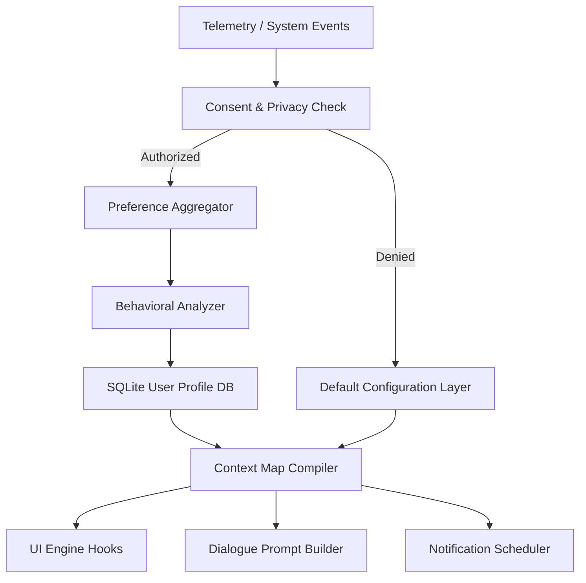
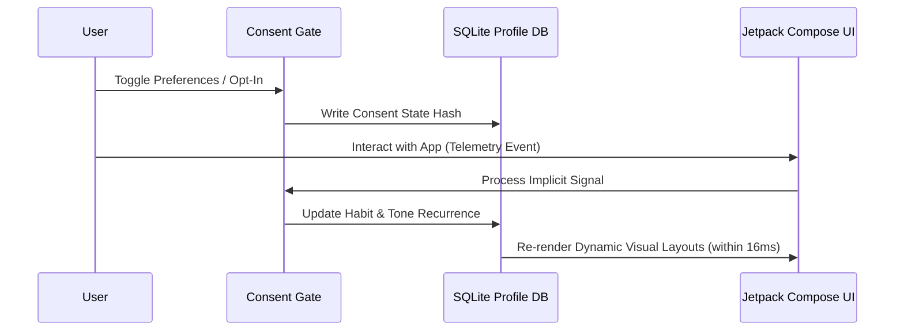

# LifeFresh AI Constitution
## AI Personalization Engine Specification v1.0

**Version:** 1.0  
**Status:** Approved / Core Reference Architecture  
**Last Updated:** July 2026  
**Classification:** Enterprise Internal  

---

### 1. Engine Overview
The **AI Personalization Engine** is the core subsystem of the LifeFresh AI platform responsible for orchestrating adaptive AI behavior, user-specific intelligence, and localized experience tailoring. In modern decentralized ecosystems, personalization must act as a trusted assistant that adapts dynamically to individual behavioral cues, cognitive preferences, and geographic configurations without compromising security or architectural stability. This Engine sits as an intermediary between incoming telemetry streams, the `AI_Dialogue_Engine.md` (for custom prompting/responses), and Jetpack Compose dynamic rendering layouts, producing a tailored execution context on a per-user, offline-first basis.

---

### 2. Objectives
* **Contextual Resonance:** Deliver low-latency adaptation of dialogue tone, length, language format, and UI density to match user-specific states.
* **Deterministic Privacy:** Enforce user privacy policies and absolute data minimization controls locally prior to profile compilation.
* **Predictive Automation:** Recognize routines and scheduling cadences to proactively suggest CRM follow-ups and notes completions without user prompting.
* **Interoperable Isolation:** Maintain strict separation of distinct user profiles sharing the same hardware node.

---

### 3. Design Principles
* **Privacy-by-Design:** All behavioral modeling, habit loops, and profiling algorithms execute locally on-device.
* **Zero Cognitive Friction:** Personalization adapts to the user's implicit cues to reduce physical interaction steps.
* **Fail-Safe Baseline:** If a user revokes profiling consent, the system falls back instantly to standard baseline models.
* **Asynchronous Efficiency:** All preference aggregations and profile sweeps operate on background threads, yielding instantly to active UI user tasks.

---

### 4. Core Responsibilities
* **User Modeling:** Managing stateful representations of user behavioral styles, linguistical codes, scheduling habits, and accessibility overrides.
* **Dynamic Translation:** Compiling contextual prompt templates using user-specific translation code-switching biases (e.g., English, Hinglish, Spanish).
* **UI/UX Re-layout:** Modifying density, font sizes, and container padding dynamically based on user accessibility properties.
* **Consent Gating:** Monitoring and enforcing granular consent tables before writing telemetry to local SQLite databases.

---

### 5. Personalization Architecture
The Engine follows an event-driven loop that processes system triggers, updates localized preferences, and outputs an in-memory Context Map:



---

### 6. Personalization Lifecycle
User personalization states transition through strict phases to verify data integrity and immediately apply preferences:



---

### 7. User Profile Model
The system maps all user facets into a single type-safe schema stored locally within a dedicated database.

```json
{
  "profileId": "prof_admin_881a7b",
  "userId": "usr_executive_9011",
  "meta": {
    "version": 1,
    "lastSavedUtc": 1783584311000
  },
  "preferences": {
    "language": {
      "primary": "en-IN",
      "fallback": "hi-IN",
      "allowHinglishCodeSwitching": true,
      "dialectBias": "NORTH_DELHI_COLLOQUIAL"
    },
    "regional": {
      "measurementSystem": "METRIC",
      "dateFormat": "DD/MM/YYYY",
      "timeFormat": "24H",
      "coordinateSystem": "WGS84",
      "timezoneId": "Asia/Kolkata"
    },
    "accessibility": {
      "highContrastMode": false,
      "minimumTouchTargetDp": 48,
      "forcedFontScale": 1.15,
      "screenReaderActive": false,
      "voiceSpeedOverride": 1.0
    }
  },
  "behaviorStyle": {
    "communicationStyle": "CONCISE_PROFESSIONAL",
    "typicalShiftStartLocal": "08:30:00",
    "typicalShiftEndLocal": "17:30:00",
    "interactionPacing": "RAPID",
    "toneComfortScore": 0.95
  }
}
```

---

### 8. Preference Management
Preference states exist in two primary categories: **Explicit Preferences** (directly configured via user settings panels) and **Implicit Signals** (deduced via behavioral tracking under strict opt-in terms). Explicit choices instantly override any implicitly calculated parameters. When a setting is updated, the Engine emits a serialized change event across the `AI_EventBus.md` to trigger immediate downstream component adjustments.

---

### 9. Behavioral Analysis
The **Behavioral Analyzer** runs mathematical processing tasks locally on-device. It monitors active workspace usage to adapt systems to the user's dynamic pace.

* **Metric Tracking:** Measures task completion speeds, click intervals, and prompt review durations.
* **Style Aggregation:** Translates interactions into style vectors (e.g., Rapid-Concise vs. Methodical-Detailed) to shape dialogue structures.

---

### 10. Usage Pattern Recognition
Pattern tracking analyzes the sequencing of user operations. If a user consistently opens a specific client notes screen after completing a CRM lead stage change, the Engine maps this sequence as a high-probability pattern. The next time the lead stage is advanced, the target screen's assets are pre-cached in memory to reduce visual loading times.

---

### 11. Habit Detection
The Engine analyzes user routines to construct active work shift windows:
* **Window Detection:** Compiles task creation times over a rolling 14-day window. If $>80\%$ of modifications occur between 08:30 and 16:30, non-urgent notification events are locked into this daily schedule.
* **Quiet-Hour Enforcement:** Suppresses non-critical CRM check reminders outside of detected active shift windows.

---

### 12. Context-aware Personalization
The **Context Map Compiler** combines system configurations, environment data, and user profile parameters into an active, low-latency, in-memory context tree. This tree is queried dynamically during dialogue generation, notification scheduling, and visual layout rendering.

| Context Element | Data Source | Sample Value | Target Action |
| :--- | :--- | :--- | :--- |
| Active Timezone | System Location Providers | `GMT+5:30` | Adjusts scheduling offsets |
| Battery Status | Android PowerManager | `LOW_BATTERY` | Compresses UI graphics, disables animations |
| Distraction Index | Notification Watcher | `HIGH` | Condenses dialogues to essential notes only |

---

### 13. Dynamic Preference Adaptation
Calculated preferences update using an exponential moving average calculation:

$$ P_{new} = P_{old} \cdot (1 - \gamma) + S_{signal} \cdot \gamma $$

Where $P$ represents the preference parameter score, $S$ represents the score of the latest implicit interaction signal, and $\gamma$ represents the adaptation decay rate clamped to a maximum of **0.15** to guarantee behavioral stability over time.

---

### 14. Recommendation Personalization
The Engine personalizes CRM action cards and client suggestions. When a user consistently dismisses certain recommendations, the system reduces the priority scores of corresponding cards in local SQLite tables, moving them to secondary tabs.

---

### 15. Prompt Personalization
Prompt generation modules consuming data from the `AI_Dialogue_Engine.md` inject localized styling tokens derived from the compiled personalization Context Map:

```yaml
prompt_context_injection:
  user_profile_id: "prof_admin_881a7b"
  style_guidelines:
    tone_profile: "CONCISE_CLINICAL"
    translation_bias: "HINGLISH_INTERLEAVED"
    sentence_limit: 3
    clinical_jargon_allowed: true
```

---

### 16. Response Personalization
Dialogue outputs are modified locally before rendering. If the user's communication style is mapped as `RAPID`, long paragraphs are truncated to bulleted lists. If the style is `METHODICAL`, the system includes extra reference fields and background context parameters in the generated markdown output.

---

### 17. UI Personalization
Visual layout adapters in Jetpack Compose query accessibility and language structures to modify layouts dynamically.

```kotlin
@Composable
fun PersonalizedTaskCard(
    task: Task,
    profile: UserProfile
) {
    val padding = if (profile.preferences.accessibility.screenReaderActive) 16.dp else 12.dp
    val minTouchTarget = profile.preferences.accessibility.minimumTouchTargetDp.dp
    
    Card(
        modifier = Modifier
            .padding(padding)
            .widthIn(max = 600.dp)
            .testTag("task_card_${task.id}")
    ) {
        Column(modifier = Modifier.padding(16.dp)) {
            Text(
                text = task.title,
                fontSize = MaterialTheme.typography.bodyLarge.fontSize * profile.preferences.accessibility.forcedFontScale
            )
            Spacer(modifier = Modifier.height(8.dp))
            Button(
                onClick = { /* Complete Task */ },
                modifier = Modifier.defaultMinSize(minWidth = minTouchTarget, minHeight = minTouchTarget)
            ) {
                Text(text = stringResource(R.string.complete_task_action))
            }
        }
    }
}
```

---

### 18. Notification Personalization
System-level notifications adapt to the active shift window. Non-critical alerts are delayed and queued, then batched together and delivered when the user begins their detected shift window, avoiding workspace distractions during rest hours.

---

### 19. Language Preferences
The Engine manages language preferences, supporting localized translation configurations:
* **Hinglish Code-Switching:** Interleaves Hindi nouns with English verbs (e.g., `"Meeting schedule ho chuki hai"`) when the corresponding profile flag is active.
* **Standardization:** Keeps core medical terminology and status codes in standard English to maintain system data integrity.

---

### 20. Regional Preferences
* **Measurement Standardization:** Converts and translates measurements (e.g., Imperial to Metric) inside rendered text buffers without altering the source SQL database fields.
* **Local Date-Time Formats:** Translates date formats (e.g., DD/MM/YYYY vs. MM/DD/YYYY) dynamically based on the active regional profile configuration.

---

### 21. Accessibility Preferences
The system guarantees touch target limits of at least **48dp by 48dp** (complying with Material Design 3 guidelines) across all visual structures. Font scales scale proportionally using system-provided scale modifiers, and speech-to-text outputs adapt playback speed dynamically using the user's explicit profile overrides.

---

### 22. Timezone Awareness
All database timestamps are stored in standard UTC millisecond format. When the Engine detects a system timezone adjustment, it recomputes localized active shift windows and calendar offsets relative to the new zone within 150ms of the system change event.

---

### 23. Personalization Policies
* **Decentralization Policy:** All behavioral profile metrics and custom habit scores must reside strictly on-device. No personalization analytics may write to remote databases.
* **Deterministic Priority Policy:** User manual configurations must instantly bypass and lock out any calculated algorithmic adjustments.
* **Data Isolation Policy:** Multi-profile systems must maintain separate local database instances, fully isolating distinct user profiles.

---

### 24. Personalization Rules
This section lists the 30 strict, unyielding rules governing the Personalization Engine:

* **RULE_PER_001:** Every user profile must generate a unique profile UUID on initialization.
* **RULE_PER_002:** User profile modifications must commit to SQLite before triggering UI updates.
* **RULE_PER_003:** No behavioral profiling or routine calculations may run on the main UI thread.
* **RULE_PER_004:** All incoming telemetry signals must be sanitized to strip HTML characters.
* **RULE_PER_005:** Personalization states must remain fully isolated between separate user accounts.
* **RULE_PER_006:** Default communication style must initialize to `CONCISE_PROFESSIONAL` on profile setup.
* **RULE_PER_007:** Explicit user settings must immediately override implicitly calculated habit parameters.
* **RULE_PER_008:** Granular opt-in consent must be logged in a secure local database table before telemetry capture.
* **RULE_PER_009:** No HIPAA data fields or patient records may be used to build personalization context files.
* **RULE_PER_010:** Personalization context caches must update immediately when system settings shift.
* **RULE_PER_011:** Compiled text outputs must scale gracefully with forced user font scale modifications.
* **RULE_PER_012:** Dialogue lengths must scale proportionally with user interaction pacing metrics.
* **RULE_PER_013:** Dialect translation modules must maintain standard clinical and status codes unchanged.
* **RULE_PER_014:** Active shift windows must compute using a 14-day rolling window of task creations.
* **RULE_PER_015:** Non-urgent system notifications must align with active shift windows to avoid interruptions.
* **RULE_PER_016:** All personalization and habit tracking must function with zero cloud dependencies.
* **RULE_PER_017:** Background profiling sweeps must pause during user text input sessions.
* **RULE_PER_018:** Typo-correction databases must utilize local synonym mappings to minimize allocations.
* **RULE_PER_019:** Personalization models must not write raw patient names to profiling logs.
* **RULE_PER_020:** Emails captured during workspace sweeps must convert to lowercase string buffers.
* **RULE_PER_021:** All date fields must render in the format specified by active regional settings.
* **RULE_PER_022:** Settings toggle clicks must debounce with a 200ms limit to prevent double commits.
* **RULE_PER_023:** User logout events must instantly clear in-memory personalization context caches.
* **RULE_PER_024:** Telemetry signal keys must derive from SHA-256 hashes of interaction data payloads.
* **RULE_PER_025:** Emergency and critical notifications must bypass quiet-hour schedules.
* **RULE_PER_026:** Sync conflicts during profile replication must use exponential backoffs with random jitter.
* **RULE_PER_027:** High-severity alarms must request full-screen visual layout priority.
* **RULE_PER_028:** Progressive settings changes must display standard Material 3 loading animations.
* **RULE_PER_029:** Inbound configuration files must validate cryptographic signatures before ingestion.
* **RULE_PER_030:** Manual resets to default states must instantly wipe all computed behavioral tables.

---

### 25. User Segmentation
Users are mapped to local behavioral cohorts (e.g., `POWER_USER_CLINICIAN`, `ADMINISTRATIVE_STAFF`) based on their role metadata. This cohort mapping controls the initial distribution of recommended CRM dashboard structures and default prompt templates.

---

### 26. Interest Modeling
The Engine constructs localized interest profiles by monitoring user searches, clicked topics, and documentation categories. These interest records are used to rank news feeds, application help guides, and system feature tips.

---

### 27. Privacy Controls
* **Opt-Out Checking:** The Engine intercepts every telemetry event to verify consent before processing.
* **Cryptographic Keys:** Profiling databases are encrypted using device-specific keystores to prevent unauthorized access.

---

### 28. Consent Management
Consent states are modeled as a structured database schema:

```sql
CREATE TABLE user_consent_records (
    user_id TEXT NOT NULL,
    category TEXT NOT NULL,
    granted INTEGER NOT NULL,
    signed_timestamp UTC_MS NOT NULL,
    PRIMARY KEY (user_id, category)
);
```

---

### 29. Data Minimization
The Engine applies strict data filters to all telemetry streams:
* **Redaction Pipeline:** Strips patient identifiers, clinical notes, values, and location coordinates before writing to the profiling log.
* **Retention Boundary:** Automatically deletes all raw interaction logs older than 30 days.

---

### 30. Security Controls
To prevent tampering, the local SQLite database is encrypted with AES-256-GCM. The key is managed using the Android Keystore System. Any configuration profiles loaded from remote servers must carry an HMAC signature verified against pre-shared platform public keys.

---

### 31. Monitoring
* **Latency Logging:** Tracks the execution latency of context compilations, triggering warnings if processing times exceed **100ms**.
* **Metrics Ingestion:** Counts the frequency of profile load events and records cache hit rates across diagnostic tables.

---

### 32. Logging
Diagnostic log entries write to local encrypted files. No user PII or patient clinical data is allowed in the log streams.

```
[2026-07-09 16:32:11] [INFO] [PER_ENGINE] Initialized profile: prof_admin_881a7b
[2026-07-09 16:32:11] [INFO] [PER_ENGINE] Context compilation completed in 12ms. Cache: MISS
[2026-07-09 16:35:44] [WARN] [PER_ENGINE] Input toggle debounced. Event discarded.
```

---

### 33. APIs
The Personalization Engine exposes type-safe Kotlin contracts to coordinate actions with external system components:

```kotlin
interface PersonalizationService {
    suspend fun compileContext(userId: String): Result<PersonalizationContext>
    suspend fun recordSignal(userId: String, signal: TelemetrySignal): Boolean
    suspend fun updateConsent(userId: String, category: ConsentCategory, granted: Boolean): Boolean
    suspend fun resetPreferences(userId: String): Boolean
}
```

---

### 34. Internal Data Structures
The active context is held in-memory inside a type-safe Kotlin data structure to guarantee fast lookups:

```kotlin
data class PersonalizationContext(
    val userId: String,
    val timestamp: Long,
    val communicationStyle: String,
    val translationBias: String,
    val activeShiftStart: String,
    val activeShiftEnd: String,
    val fontScale: Float,
    val touchTargetDp: Int
)
```

---

### 35. Performance Optimization
* **Query Caching:** Compiles the Context Map into an in-memory cache, reducing SQLite read traffic during active dialogue sweeps.
* **Resource Optimization:** Background sweeps run only when the device is idle, charging, and connected to unmetered networks.

---

### 36. Error Handling
* **Database Corruption:** If the local SQLite database becomes corrupted, the Engine deletes the corrupted file and initializes a clean, default configuration schema on reboot.
* **Constraint Violations:** If telemetry ingestion violates schema constraints, the event is discarded and logged as a system anomaly.

---

### 37. Recovery Mechanisms
A rollback log is maintained to track preference modifications. If an updated configuration file causes application crashes, the Engine rolls back the change to the previous known stable configuration state on boot.

---

### 38. Enterprise Deployment
In enterprise environments, default personalization profiles can be deployed as signed JSON config files. These files are distributed via standard Mobile Device Management (MDM) servers and verified by the Engine's local cryptographic layers.

---

### 39. Future Expansion
* **Federated Profiling:** Support secure, federated profile updates that combine local, privacy-safe analytics across devices to improve default settings.
* **Multi-Modal Adaptation:** Introduce adaptive changes to local voice synthesis tones and volume levels based on ambient noise metrics.

---

### Conclusion
The AI Personalization Engine provides private, low-latency, and contextually rich experiences across the LifeFresh AI platform. By running profiling tasks locally and prioritizing manual configurations, the Engine delivers intuitive, secure, and user-centric workflows.

### Related AI Constitution Documents
* `AI_Dialogue_Engine_v1.0.md`
* `AI_Confirmation_Engine_v1.0.md`
* `AI_Validation_Engine_v1.0.md`

### References
1. Material Design 3 Guidelines: Accessibility and Adaptive Design
2. Android Keystore System: Best Practices for Local Cryptographic Key Management
3. Jetpack Compose Window Size Classes Specification
