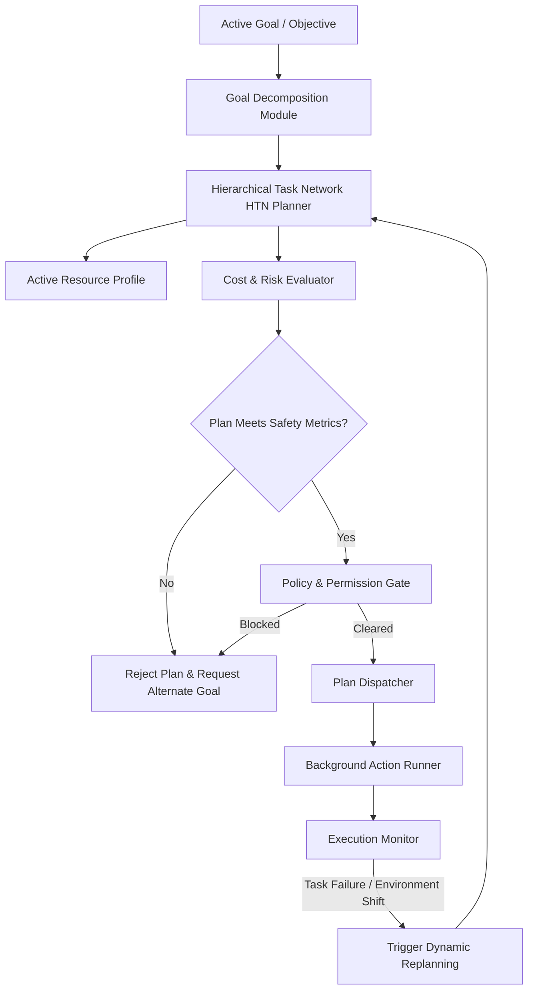
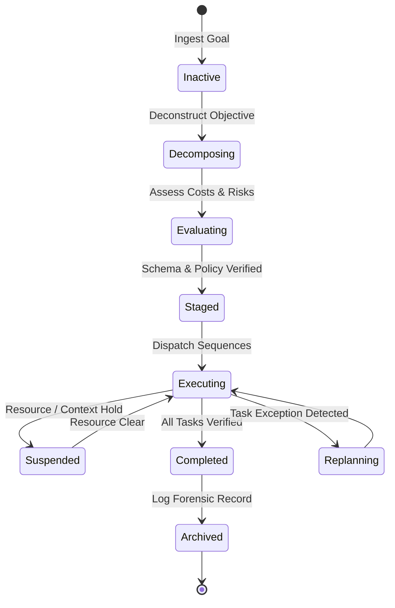
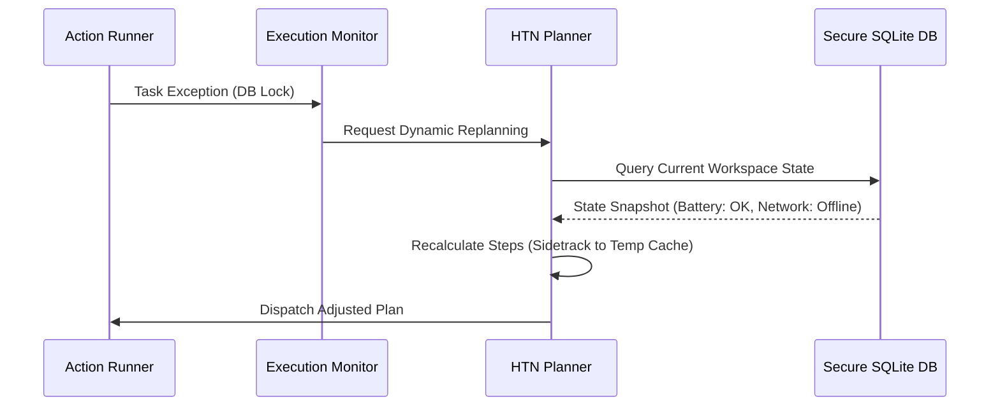

# LifeFresh AI Constitution
## AI Planning Engine Specification v1.0

**Version:** 1.0  
**Status:** Approved / Core Reference Architecture  
**Last Updated:** July 2026  
**Classification:** Enterprise Internal  

---

### Purpose
The **AI Planning Engine** is the core tactical execution strategist of the LifeFresh AI ecosystem. It is responsible for translating high-level objectives established by the `AI_Goal_Engine.md` into concrete, structured, and validated sequence lists of executable tasks. Operating entirely on-device to support offline-first healthcare operations, the Planning Engine evaluates constraints, resources, cost estimates, and risk parameters to synthesize, execute, and dynamically adapt plan chains. By maintaining perfect policy compliance via the `AI_Policy_Engine.md`, it ensures all agent workflows remain safe, consistent, and audit-ready.

---

### Scope
This specification governs the design, planning lifecycle, hierarchical decomposition strategies, cost estimation mathematical models, dynamic replanning mechanisms, and API endpoints of the local Planning Engine. It manages task sequences for local database optimization, interface caching, network synchronization, and clinical workflow coordination.

---

### Objectives
* **Optimized Plan Synthesis:** Generate highly efficient task execution paths with minimal processing overhead, keeping planning calculations within **<20ms** at the edge.
* **Deterministic Sequence Execution:** Ensure all synthesized plans are linear, conflict-free, and mathematically bounded, preventing deadlocks.
* **Adaptive Multi-Agent Replanning:** Dynamically recalculate task sequences and dependency states in response to environmental or resource shifts.
* **Granular Constraint Enforcement:** Enforce strict clinical, security, and resource boundaries during both planning and execution stages.

---

### Design Principles
* **Bounded Agency:** The Planning Engine is strictly blocked from generating or executing tasks that exceed capabilities verified by the active policy and permission databases.
* **Hierarchical Decomposition:** Complex objectives are systematically decomposed into modular sub-tasks, ensuring each step remains traceable, measurable, and auditable.
* **Predictive Resource Sensitivity:** Throttles planning depth and postpones non-critical actions during low-resource scenarios (battery, memory, CPU).
* **Audit-Chained Traces:** Every generated plan, replanning event, and task outcome is written as an append-only, signed audit trace.

---

### 1. Engine Overview
The **AI Planning Engine** sits between the `AI_Goal_Engine.md` and the `AI_Autonomous_Engine.md`. It parses active objectives from the Goal Engine, assesses current device resources, compiles structured step sequences, and dispatches them to background runners. The planning loops evaluate active variables locally, enabling complete workflow planning without relying on external cloud APIs.

---

### 2. Objectives
The objectives of the Planning Engine are centered on stability, safety, and efficiency:
* **Constraint Compliance:** Never generate plan sequences that violate local clinical or security boundaries.
* **Resource Optimization:** Minimize battery consumption, CPU usage, and memory allocations during active planning steps.
* **Resilient Replanning:** Ensure system recovery when tasks encounter execution errors or environmental changes.

---

### 3. Design Principles
The Planning Engine utilizes a deterministic and resource-aware planning paradigm:
* **Quantifiable Cost Estimations:** Every proposed plan step is evaluated against a concrete, multidimensional cost function.
* **Predictability over Novelty:** Prioritize proven, templated execution patterns over newly generated planning paths.
* **Safety Isolation:** Isolate plan workspaces within secure sandboxes, preventing cross-tenant leakage.

---

### 4. Core Responsibilities
* **Hierarchical Task Decomposition:** Translating high-level objectives into modular, executable actions.
* **Dynamic Resource Profiling:** Measuring CPU, memory, and battery parameters before compiling plan steps.
* **Dynamic Replanning:** Adjusting remaining plan paths in real-time when execution exceptions are detected.
* **Risk and Cost Profiling:** Computing risk indicators for each plan sequence prior to dispatch.

---

### 5. Planning Architecture
The Planning Engine ingests goals and coordinates task execution with the platform's security and policy engines:



---

### 6. Planning Lifecycle
Plans cycle through a strict, auditable state machine to maintain complete system traceability:



---

### 7. Strategic Planning
Strategic planning is the highest operational layer. It maps long-term objectives (e.g., optimizing multi-shift scheduling structures) to a succession of tactical planning cycles.

---

### 8. Tactical Planning
Tactical planning bridges strategic goals and operational steps. It groups tasks into logical execution chains (e.g., preparing local databases for an offline sync), validating dependency states.

---

### 9. Operational Planning
Operational planning handles execution-level schedules. It manages direct device interactions, specifying timing bounds, execution threads, and local resource allocations.

---

### 10. Hierarchical Planning
The engine utilizes a **Hierarchical Task Network (HTN)** planner to decompose abstract objectives into concrete actions. High-level tasks are broken down using pre-defined operational methods until only primitive actions remain.

---

### 11. Goal Decomposition
Decomposition parses goals into structured, hierarchical trees. Each node defines required parent states and outputs, ensuring clear execution pathways.

---

### 12. Task Decomposition
Task decomposition breaks complex tasks down into atomic primitive actions (e.g., opening a local SQLite connection, writing a row, and committing the transaction), validating each step.

---

### 13. Dependency Mapping
The engine maps dependency states into a directed acyclic graph (DAG). This ensures that actions only execute once all their dependent parent states have completed successfully.

---

### 14. Resource Planning
Before dispatching a plan, the resource planner verifies that the device can sustain the execution, checking parameters like battery, storage, and thermal profiles:

```json
{
  "resourceThresholds": {
    "minBatteryLevel": 15,
    "minAvailableMemoryMB": 128,
    "maxThermalState": "NORMAL"
  }
}
```

---

### 15. Time Planning
Every plan step defines explicit timing parameters:
* **Execution Timeout:** Maximum duration allowed for the step to complete before triggering a timeout error.
* **Scheduling Delay:** Delay parameters utilized to throttle background tasks during active user interaction windows.

---

### 16. Scheduling Integration
The engine integrates with the platform's scheduler. Highly critical tasks are dispatched to high-priority execution channels, while optimization tasks are throttled to preserve battery.

---

### 17. Execution Planning
Execution planning converts compiled sequences into executable thread chains, validating that required database and device permissions are active.

---

### 18. Dynamic Replanning
If an action encounters an exception (e.g., temporary database lock), the engine initiates a replanning loop. It captures the current state, identifies the point of failure, and recalculates the remaining plan steps:



---

### 19. Contingency Planning
Templated plans define explicit fallback paths. If a high-priority action fails, the system automatically redirects execution to pre-verified contingency sequences (e.g., caching writes locally if network connections stall).

---

### 20. Scenario Planning
The engine can simulate alternative execution pathways inside a secure, in-memory sandbox. It models resource depletion rates to select the optimal planning sequence.

---

### 21. Constraint Evaluation
All plan sequences are continuously validated against active policy constraints, ensuring no generated action sequence can bypass system access rules.

---

### 22. Cost Estimation
The computational and environmental cost of a planned sequence is calculated dynamically using a multi-factor weighting formula:

$$ E_{cost} = \sum_{i=1}^{n} (c_{cpu} \cdot T_i + c_{mem} \cdot M_i + c_{bat} \cdot B_i) $$

Where:
* $T_i$ is the estimated execution duration of step $i$.
* $M_i$ is the estimated memory footprint.
* $B_i$ is the projected battery drain.
* $c_{cpu}, c_{mem}, c_{bat}$ are coefficients defined by active device profiles.

---

### 23. Risk-aware Planning
Risk levels are assessed prior to plan execution. If a plan contains high-risk actions (e.g., database optimizations that write to shared directories), it is routed to human-in-the-loop interfaces for manual confirmation.

---

### 24. Optimization Integration
Plans are optimized dynamically using heuristic parameters. The engine trims redundant tasks and groups similar I/O operations to minimize disk activity.

---

### 25. Decision Integration
The Planning Engine coordinates with the `AI_Decision_Engine.md` to resolve logical branches, evaluating conditional choices within the plan sequence based on current context.

---

### 26. Workflow Integration
The engine links plan sequences with active CRM and clinical pipelines, ensuring that background tasks support current user workflows.

---

### 27. Plan Validation
Proposed plans must pass a local sandbox validation test. The validator checks the sequence schema for circular dependencies, infinite loops, and unresolved parent states.

---

### 28. Plan Versioning
Generated plans are assigned version numbers. The execution monitor tracks plan versions, ensuring that old or interrupted plans are properly invalidated during system updates.

---

### 29. Plan Analytics
A background thread periodically runs non-blocking analyses on execution logs to monitor average planning latencies, task failure frequencies, and replanning rates.

---

### 30. Monitoring
* **Planning Latency:** Audits calculation times, logging warnings if plan compilation exceeds **20ms**.
* **Failure Frequencies:** Tracks task failures, triggering system alerts if rates exceed defined thresholds.

---

### 31. Logging
All log entries are fully sanitized. They record execution steps, state changes, and rule matches without writing clinical data or keys:

```
[2026-07-11 02:22:11] [INFO] [PLAN_ENGINE] Ingesting goal: OPTIMIZE_LOCAL_STORAGE
[2026-07-11 02:22:11] [INFO] [PLAN_ENGINE] HTN compiled: 3 primitive steps. Cost: 12.4
[2026-07-11 02:22:12] [INFO] [PLAN_ENGINE] Policy verification passed. Dispatched to Action Runner.
[2026-07-11 02:22:15] [INFO] [PLAN_ENGINE] Plan execution completed successfully.
```

---

### 32. APIs
The Planning Engine exposes type-safe Kotlin interfaces to coordinate operations with other platform layers:

```kotlin
interface PlanningService {
    suspend fun generatePlan(goalId: String, context: PlanningContext): Result<ExecutionPlan>
    suspend fun triggerReplanning(planId: String, failedStepId: String): Result<ExecutionPlan>
    suspend fun getActivePlanState(planId: String): PlanExecutionState
    suspend fun suspendPlan(planId: String): Boolean
}
```

---

### 33. Internal Data Structures
To prevent concurrency issues during background execution, plan configurations use immutable Kotlin structures:

```kotlin
data class ExecutionPlan(
    val planId: String,
    val goalId: String,
    val version: Int,
    val steps: List<PrimitiveStep>,
    val projectedCost: Float,
    val safetyRiskScore: Float,
    val timestampUtc: Long
)
```

---

### 34. SQL Planning Schema
The SQLite tables organize active plans, step execution states, and dependency links on-device:

```sql
CREATE TABLE active_plans (
    plan_id TEXT PRIMARY KEY NOT NULL,
    goal_id TEXT NOT NULL,
    version INTEGER NOT NULL,
    state TEXT NOT NULL,
    projected_cost REAL NOT NULL,
    safety_risk_score REAL NOT NULL,
    created_at INTEGER NOT NULL
);

CREATE TABLE plan_steps (
    step_id TEXT PRIMARY KEY NOT NULL,
    plan_id TEXT NOT NULL,
    sequence_index INTEGER NOT NULL,
    action_type TEXT NOT NULL,
    parameters_json TEXT NOT NULL,
    state TEXT NOT NULL,
    FOREIGN KEY (plan_id) REFERENCES active_plans(plan_id) ON DELETE CASCADE
);

CREATE TABLE step_dependencies (
    parent_step_id TEXT NOT NULL,
    child_step_id TEXT NOT NULL,
    PRIMARY KEY (parent_step_id, child_step_id),
    FOREIGN KEY (parent_step_id) REFERENCES plan_steps(step_id) ON DELETE CASCADE,
    FOREIGN KEY (child_step_id) REFERENCES plan_steps(step_id) ON DELETE CASCADE
);
```

---

### 35. Performance Optimization
* **Pre-compiled HTN Templates:** Compiles common planning flows into memory on boot, minimizing disk read overhead during active user sessions.
* **Thread Throttling:** Reduces background planning depth during periods of high CPU or memory utilization.

---

### 36. Error Handling
* **Stalled Action Watchdogs:** If a plan step stalls, the watchdog cancels the task, logs the anomaly, and initiates plan recovery.
* **Unresolved Parent States:** If parent state validations fail, the engine pauses the sequence and triggers replanning loops.

---

### 37. Recovery Mechanisms
If systematic errors or thread stalls occur, the watchdog engine rolls back the workspace, cancels active plans, and restores default baseline queues on boot.

---

### 38. Enterprise Deployment
For enterprise fleets, default planning templates and resource coefficients can be packaged as signed JSON configurations deployed across devices using corporate MDM platforms.

---

### 39. Future Expansion
* **Distributed Collaborative Planning:** Share background tasks and resource loads across secure, peer-to-peer device networks.
* **Aesthetic-aware UI Planning:** Dynamically adjust layout composition plans based on real-time rendering constraints.

---

### Conclusion
The AI Planning Engine provides a secure, predictable, and resource-aware tactical planning framework designed for edge-native healthcare deployments. By combining hierarchical task networks, dynamic replanning pipelines, and robust policy enforcement, the Engine ensures that automated sequences execute safely and compliant under all conditions.

### Related AI Constitution Documents
* `AI_Goal_Engine.md`
* `AI_Autonomous_Engine.md`
* `AI_Policy_Engine.md`

### References
1. Hierarchical Task Network (HTN) Planning: Core Concepts and Edge Implementation
2. NIST SP 800-162: Zero Trust Systems and Planning Security Guidelines
3. Android Keystore System: Cryptographic Best Practices for Local Operations
