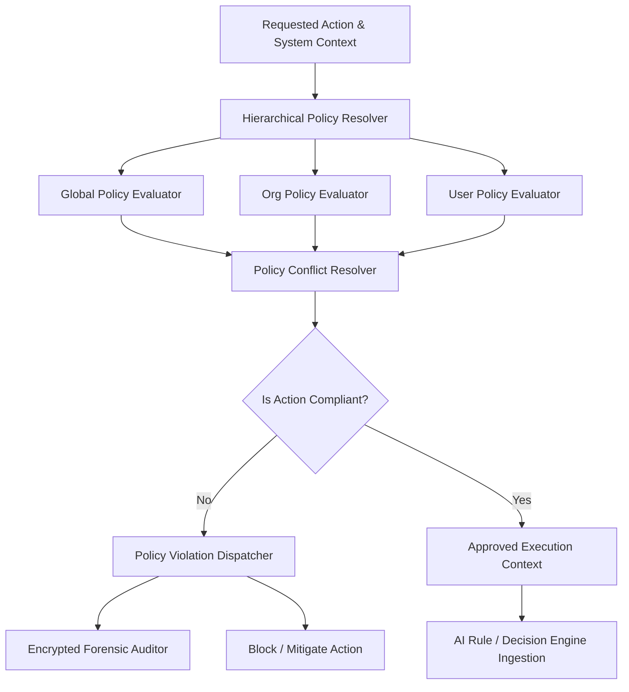
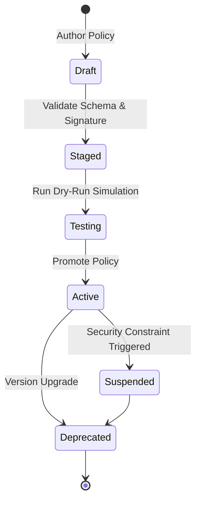

# LifeFresh AI Constitution
## AI Policy Engine Specification v1.0

**Version:** 1.0  
**Status:** Approved / Core Reference Architecture  
**Last Updated:** July 2026  
**Classification:** Enterprise Internal  

---

### 1. Engine Overview
The **AI Policy Engine** is the governance and compliance control plane of the LifeFresh AI platform. It is responsible for defining, managing, validating, enforcing, updating, and auditing all operational, privacy, security, and behavioral policies across the entire platform. In a decentralized, edge-native, and offline-first environment, policies must act as immutable boundaries that govern the execution of the `AI_Rule_Engine.md` and the `AI_Decision_Engine.md`. The Policy Engine converts high-level compliance and organizational directives into machine-enforceable, cryptographically verifiable local constraints, guaranteeing that the AI system remains safe, secure, and compliant under all operating conditions.

---

### 2. Objectives
* **Absolute Compliance Guardrails:** Enforce HIPAA, GDPR, CCPA, and custom enterprise compliance structures deterministically at the edge.
* **Low-Overhead Evaluation:** Execute dynamic policy checks with extremely low latency (**<15ms**) to avoid slowing down user workflows.
* **Cryptographic Verification:** Ensure all distributed policy definitions are signed, tamper-evident, and traceable to an authorized administrative source.
* **Resilient Offline Enforcement:** Maintain strict policy evaluation states and audit trail logging when disconnected from enterprise networks.

---

### 3. Design Principles
* **Declarative Governance:** Policies are defined as structured, declarative documents independent of underlying system implementation code.
* **Fail-Secure Defaults:** Any policy evaluation that results in an ambiguous, incomplete, or corrupted state defaults to the most restrictive deny policy.
* **Immutable Audit Trail:** Every policy evaluation event, override, and violation is logged as an append-only, cryptographically chained trace.
* **Inheritance with Strict Override Bounds:** Support hierarchical policy inheritance (Global -> Organization -> User) while enforcing non-overrideable safety rules.

---

### 4. Core Responsibilities
* **Policy Lifecycle Management:** Handling policy ingestion, validation, activation, deployment, and deprecation.
* **Dynamic Policy Evaluation:** Evaluating system contexts and requested actions against the active hierarchical policy tree.
* **Hierarchical Resolution:** Resolving inheritance and overlapping rules dynamically based on priority metrics.
* **Policy Distribution and Ingestion:** Securely fetching, validating signatures for, and activating policy updates from enterprise control hubs.

---

### 5. Policy Architecture
The Policy Engine acts as the top-level gatekeeper, controlling execution contexts before rules or decisions are dispatched:



---

### 6. Policy Lifecycle
Policies transition through strict lifecycle states to prevent unverified or corrupted configurations from affecting runtime environments:



---

### 7. Policy Repository
The **Policy Repository** is a secure, local, encrypted storage zone containing all active, staged, and historical policies. It is implemented using SQLite with AES-256-GCM encryption, managed by the platform's key system.

---

### 8. Policy Categories
Operational constraints are divided into functional categories to enable modular rule evaluation and simplify governance:
* **Global:** Core baseline rules mandated across the entire platform ecosystem.
* **User:** Settings specified by individual users within permitted boundaries.
* **Security:** Access control, encryption standards, and threat mitigation rules.
* **Compliance:** Statutory guidelines (e.g., medical record access tracking).

---

### 9. Global Policies
Global policies define the absolute boundaries of the platform. These policies are loaded during cold boot and cannot be modified or overridden by organizational or user configurations.

```json
{
  "policyId": "pol_glob_baseline_001",
  "name": "Global Baseline Policy",
  "version": "1.0.4",
  "lastUpdated": 1783584812000,
  "rules": {
    "allowUnencryptedStorage": false,
    "requireBiometricForHighRisk": true,
    "maxOfflineDurationHours": 72
  }
}
```

---

### 10. User Policies
User policies govern personal interface preferences, quiet hours, and data tracking opt-ins. These choices sit within the bounds defined by global and organizational policy frameworks.

---

### 11. AI Behavior Policies
AI behavior policies control the generation constraints of local LLM pipelines, managing style metrics, safety boundaries, and code-switching capabilities:
* **Generative Scoping:** Restricts generated summaries to clinical fields retrieved strictly from local database queries.
* **Tone Constraint:** Forces outputs to conform to defined professional profiles, blocking casual or non-neutral phrases.

---

### 12. Safety Policies
Safety policies prevent hazardous or unstable actions:
* **Loop Prevention:** Detects and blocks recursive automation actions that exceed defined execution frequency limits.
* **Override Gating:** Mandates multi-factor verification before any system-level configuration override can take place.

---

### 13. Privacy Policies
Privacy policies enforce local data minimization, redaction, and retention standards:
* **On-Device Restriction:** Restricts raw telemetry collection to sanitized interaction events.
* **PII Redaction:** Enforces regex-based redaction of patient names, medical IDs, and telephone numbers prior to any model ingestion.

---

### 14. Security Policies
Security policies dictate credential validation intervals, encryption parameters, and runtime postures:
* **Re-Auth Cadence:** Enforces PIN validation intervals based on current risk scores.
* **Storage Encryption:** Dictates the use of AES-256-GCM for all local SQLite databases.

---

### 15. Compliance Policies
Compliance policies map to statutory frameworks (e.g., HIPAA). They mandate that every transaction accessing patient medical records must record a permanent, cryptographically signed trace.

---

### 16. Organization Policies
Organization policies allow enterprise tenants to customize operational workflows, setting custom shift durations, dashboard hierarchies, and mandatory data fields.

---

### 17. Runtime Policies
Runtime policies monitor live operational environments:
* **Resource Optimization:** Reduces optional visual effects and background profiling sweeps when battery levels drop below **15%**.
* **Threat Mitigation:** Automatically terminates active user sessions when debugger attachments or emulator environments are detected.

---

### 18. Offline Policies
Offline policies govern platform behavior during disconnected states:
* **Write Caching:** Allows localized record caching in secure, encrypted staging tables during offline operations.
* **Sync Locks:** Blocks synchronization pipelines from initiating until network interfaces establish secure TLS 1.3 handshakes.

---

### 19. Cloud Policies
Cloud policies dictate data transit parameters, specifying that no telemetry, personal preferences, or audit trails can be synced to cloud instances without verified mutual TLS certificates.

---

### 20. Context-aware Policies
The **Context-aware Policy Evaluator** dynamically adjusts policy limits based on environmental, user, and device parameters compiled by the platform context engines.

| Dynamic Context | Evaluated Policy | Adjusted Limit | Expected Outcome |
| :--- | :--- | :--- | :--- |
| Fatigue Index $> 0.75$ | UI Prompt Density | High Restriction | Reduce optional tooltips |
| Unsafe Public WiFi | Session Timeout | 60 seconds | Prevent session hijacking |
| Low Storage | Data Retention | Delete logs $>14$ days | Prevent local storage failure |

---

### 21. Dynamic Policy Evaluation
The Engine evaluates active policies using a fast, non-blocking evaluation pipeline that matches requested action signatures against active hierarchical nodes within **<15ms**.

---

### 22. Policy Inheritance
Policies are inherited down a structured hierarchical tree. Lower levels can refine policies but cannot override absolute denial gates defined higher in the tree:

```
[Global Policy: DENY all unencrypted storage]
       └── [Organization Policy: ALLOW custom field layouts]
                    └── [User Policy: ALLOW high-contrast accessibility]
```

---

### 23. Policy Versioning
All policy files are versioned using Semantic Versioning (SemVer) and carry a cryptographic signature. Upgrades require a valid version hash sequence matching the local policy schema ledger.

---

### 24. Policy Validation
Before promotion to the active directory, proposed policies must pass a local sandbox test. The validation script parses the policy schema and executes simulations to ensure no logic conflicts occur.

---

### 25. Policy Conflict Resolution
Conflicts are resolved using a strict prioritization hierarchy:
1. **Absolute Denials:** Any policy that explicitly denies an action overrides any policy that allows it.
2. **Global Rules:** Global baseline constraints take precedence over organizational and user-specific configurations.
3. **Implicit Safety Scores:** The policy path resulting in the lowest calculated risk score is prioritized.

---

### 26. Policy Priority System
Rules and policies carry explicit priority values ($P_v \in [0, 1000]$). In standard evaluations, higher $P_v$ levels take precedence, with security containment and system safety policies assigned the highest priority levels ($P_v \ge 900$).

---

### 27. Policy Distribution
Policy updates are compiled as signed JSON payload packages. These packages are distributed via secure enterprise deployment pipelines, verified locally against public keys, and loaded on boot.

---

### 28. Policy Rollback
A rollback utility maintains a sliding backup of previously verified policy configurations. If an updated policy causes application exceptions, the system automatically rolls back the update to the last stable configuration.

---

### 29. Policy Auditing
Every policy evaluation, validation pass, and violation logs a structured audit record to a secure local database table:

```sql
CREATE TABLE policy_audit_trail (
    event_id TEXT PRIMARY KEY NOT NULL,
    timestamp_utc INTEGER NOT NULL,
    policy_id TEXT NOT NULL,
    rule_key TEXT NOT NULL,
    evaluation_result TEXT NOT NULL,
    user_id TEXT NOT NULL
);
```

---

### 30. Policy Analytics
A background evaluator runs periodic, non-blocking aggregations on policy logs, monitoring metrics like violation frequencies and evaluation latencies to identify system bottlenecks.

---

### 31. Monitoring
* **Latency Tracks:** Monitors evaluation latencies, outputting warnings to log channels if processing times exceed **15ms**.
* **Metrics Captures:** Counts total policy evaluation loops and active ruleset memory footprints.

---

### 32. Logging
Diagnostic log entries write to local encrypted files. No patient details or unmasked keys are allowed in logging outputs:

```
[2026-07-09 16:55:11] [INFO] [POL_ENGINE] Loading global policy: pol_glob_baseline_001
[2026-07-09 16:55:11] [INFO] [POL_ENGINE] Policy signature verified successfully.
[2026-07-09 16:58:32] [WARN] [POL_ENGINE] Policy violation detected. Rule: pol_glob_baseline_001. Action blocked.
```

---

### 33. APIs
The Policy Engine exposes type-safe Kotlin interfaces to coordinate operations with other platform layers:

```kotlin
interface PolicyService {
    suspend fun evaluateAction(action: PolicyAction, context: EvaluationContext): PolicyDecision
    suspend fun loadPolicyPackage(payload: String, signature: String): Boolean
    suspend fun getAuditHistory(policyId: String): List<PolicyAuditRecord>
    suspend fun rollbackToPreviousVersion(): Boolean
}
```

---

### 34. Internal Data Structures
Policy configurations use immutable Kotlin definitions to guarantee safe concurrency during evaluation cycles:

```kotlin
data class PolicyDecision(
    val authorized: Boolean,
    val policyId: String,
    val ruleKey: String,
    val constraintOverrides: Map<String, String>,
    val auditHash: String
)
```

---

### 35. Performance Optimization
* **Pre-Compiled Decision Trees:** Evaluated policies are compiled into binary decision graphs on boot, avoiding overhead during runtime processing.
* **Query Caching:** Active evaluation decisions are cached in-memory, minimizing SQLite read traffic during active user sessions.

---

### 36. Error Handling
* **Signature Failures:** If a policy package fails cryptographic signature verification, it is discarded, and the system reverts to the baseline configuration.
* **Syntax Anomalies:** Malformed policy schemas trigger validation warnings, falling back to safe default behaviors.

---

### 37. Recovery Mechanisms
If the local Policy database becomes corrupted, a watchdog utility purges the corrupted file and restores default policy configurations from pre-compiled asset archives on boot.

---

### 38. Enterprise Deployment
In enterprise environments, system policies can be distributed as signed JSON profiles. These profiles are parsed and activated locally on-device, bypassing dynamic calculations to enforce corporate workflows.

---

### 39. Future Expansion
* **Decentralized Policy Synchronization:** Support secure, peer-to-peer policy updates across local device nodes without relying on cloud servers.
* **Contextual Voice Policies:** Adapt local voice synthesis volume limits dynamically based on environmental noise metrics.

---

### Conclusion
The AI Policy Engine provides a robust, private, and deterministic governance framework designed for edge-native deployments. By enforcing local validation, strict inheritance, and cryptographic audit records, the Engine ensures the platform operates safely and compliant under all conditions.

### Related AI Constitution Documents
* `AI_Rule_Engine.md`
* `AI_Decision_Engine.md`
* `AI_Confirmation_Engine_v1.0.md`

### References
1. OPA (Open Policy Agent) Rego Language Architecture
2. NIST SP 800-207: Zero Trust Architecture Guidelines
3. Android Keystore System: Best Practices for Local Cryptographic Key Protection
