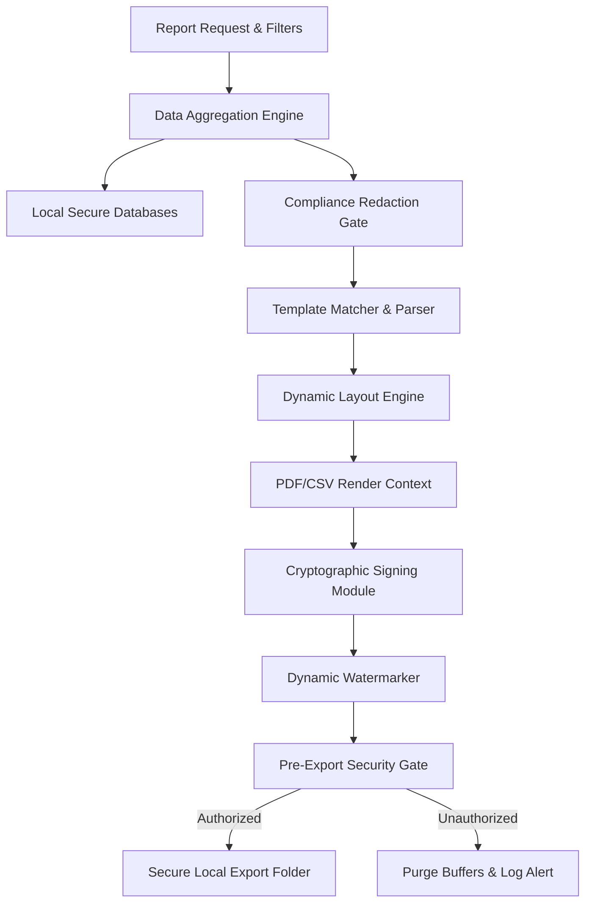
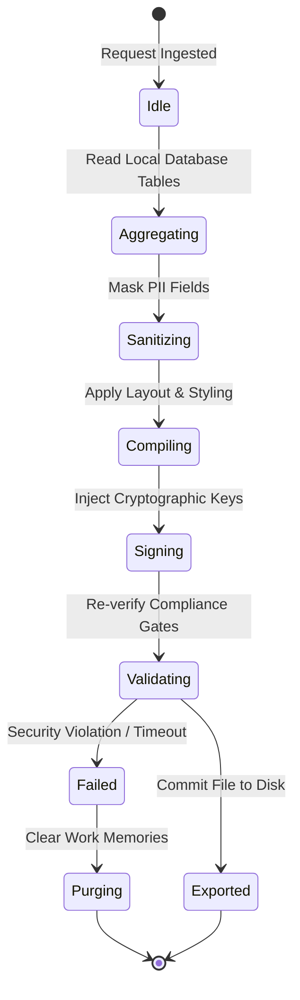

# LifeFresh AI Constitution
## AI Report Engine Specification v1.0

**Version:** 1.0  
**Status:** Approved / Core Reference Architecture  
**Last Updated:** July 2026  
**Classification:** Enterprise Internal  

---

### Purpose
The **AI Report Engine** is the core documentation, synthesis, formatting, and secure distribution authority of the LifeFresh AI platform. In a decentralized, offline-first healthcare workspace, standard reporting tools that rely on continuous cloud connections are fragile and insecure. The Report Engine operates fully on-device to assemble, validate, render, sign, and distribute clinical summaries, compliance logs, performance traces, and business intelligence. By integrating with the `AI_Policy_Engine.md` and `AI_Permission_Engine.md`, it ensures that all generated documents remain secure, private, and fully compliant with statutory guardrails like HIPAA and GDPR.

---

### Scope
This specification details the architecture, rendering pipelines, data serialization, template management, signing systems, schema layouts, and API contracts of the local Report Engine. It covers PDF, Excel, CSV, JSON, and HTML report generation formats.

---

### Objectives
* **On-Device Synthesis and Rendering:** Compile and export complex clinical and business reports without sending raw patient data to external cloud rendering services.
* **Low-Overhead Generation:** Complete dynamic document assemblies and PDF rendering tasks with minimal processing pipelines, optimizing execution times to **<1.5s** for standard clinical briefs.
* **Cryptographic Signing and Watermarking:** Embed hardware-backed digital signatures and dynamic, context-aware visual watermarks into all exported files.
* **Granular Compliance Filter:** Prevent unauthorized data leaks by validating all compiled reports against active privacy and role permission gates before writing to the local export directory.

---

### Design Principles
* **Declarative Template Separation:** Report layouts, schemas, and styling must be defined in structured, declarative templates separate from compilation logic.
* **Fail-Secure Access Gates:** Any report compilation or export action that experiences validation errors or context timeouts must default to complete execution termination and data purge.
* **Offline Autonomy:** Enable full rendering, layout calculation, and export functionalities when disconnected from central enterprise networks.
* **Unmodifiable Audit Trails:** Every report request, generation, export, and distribution event must log a signed entry to the platform forensic database.

---

### 1. Engine Overview
The **AI Report Engine** is the formatting and distribution supervisor of the platform. It takes raw fact tables, analytical summaries, and audit ledgers, processes them through declarative design templates, validates schema safety constraints, signs the output with cryptographic device keys, and exports production-ready files.

---

### 2. Core Responsibilities
* **Template Ingestion and Rendering:** Parsing layout configurations (HTML/JSON) and dynamically compiling content blocks.
* **Dynamic Data Aggregation:** Fetching, sorting, and sanitizing dataset sequences from local SQLite databases.
* **Pre-Export Privacy Redaction:** Stripping PII metrics automatically based on active user role profiles.
* **File Format Compilation:** Exporting data into optimized PDF, CSV, Excel, HTML, and JSON file streams.

---

### 3. Report Architecture
The Report Engine aggregates, validates, and renders records within a secure on-device pipeline:



---

### 4. Report Lifecycle
Reports progress through a sequence of processing states before being written to disk:



---

### 5. Report Repository
The local **Report Repository** is a secure directory located within the app's isolated private sandbox. It maintains compiled PDF/CSV file buffers and manages active templates inside an encrypted SQLite database.

---

### 6. Report Categories
To optimize rendering pipelines, reports are classified into explicit operational types:
* **Operational:** Intake summaries, shift handoff sheets, and clinician activity reports.
* **AI Performance:** LLM latency trends, confidence scores, and error classification trackers.
* **Audit:** Historical policy evaluations, access denials, and permission elevation sequences.

---

### 7. Operational Reports
Operational reports govern real-time clinic workflows. They compile clinician inputs, check-up targets, and scheduling histories into highly scannable handoff files.

---

### 8. AI Performance Reports
These tracking metrics document local inference quality, capturing token processing durations, model parameter modifications, and verification failures.

---

### 9. Analytics Reports
Analytics reports process platform efficiency metrics, aggregating system load indicators, database vacuum schedules, and battery depletion rates.

---

### 10. Audit Reports
Audit reports compile raw platform traces, summarizing system startup loops, keystore checks, and baseline security validations.

---

### 11. Security Reports
Security reports document authorization activity, mapping permission failures, validation locks, and dynamic geofence triggers.

---

### 12. Compliance Reports
Compliance reports organize statutory tracking parameters, validating that HIPAA logs and access traces conform to regulatory rules.

---

### 13. User Activity Reports
User activity reports document active interaction patterns, recording click-densities, active session durations, and screen transition times.

---

### 14. Executive Reports
Executive reports summarize clinic KPIs, aggregating task completion rates, check-up counts, and lead-to-patient conversion metrics.

---

### 15. Dashboard Reports
Dashboard reports compile layout structures, exporting system widgets and graphs as offline-ready HTML files.

---

### 16. Scheduled Reports
Scheduled reports are triggered by background cron tasks, compiling weekly logs and database cleanups during off-peak hours.

---

### 17. On-demand Reports
On-demand reports are triggered directly by user requests, prioritizing fast rendering layouts to ensure quick UI responsiveness.

---

### 18. Report Templates
Templates are declared as structured, lightweight JSON objects detailing formatting components, tables, and typography constraints.

```json
{
  "templateId": "tpl_clinical_summary_v1",
  "name": "Standard Clinical Summary Template",
  "styles": {
    "fontFamily": "Inter",
    "primaryColor": "#1E293B",
    "accentColor": "#0F766E",
    "fontSizeHeading": 16,
    "fontSizeBody": 10
  },
  "sections": [
    {
      "id": "header",
      "type": "BANNER",
      "title": "LifeFresh Clinical Summary"
    },
    {
      "id": "patient_details",
      "type": "GRID",
      "fields": ["patient_id", "intake_date", "lead_status"]
    }
  ]
}
```

---

### 19. Dynamic Report Generation
Dynamic generation is handled by a stream-based parser that maps compiled JSON layout modules against active context variables.

---

### 20. Data Aggregation
The aggregation pipeline queries local SQLite databases, sorting records into temporary schema buffers. All queries utilize read-only transactions to prevent database contention.

---

### 21. Data Validation
Aggregated fields are validated against strict schema libraries prior to compilation to block malformed inputs or buffer overflow attempts.

---

### 22. Report Formatting
Formatting layers convert styling vectors (margins, line heights, page breaks) into target layout coordinate files, ensuring consistent outputs across formats.

---

### 23. PDF Generation
PDF compilation runs inside an isolated background sandbox, utilizing stream-based rendering pipelines to compile pages incrementally and preserve device memory.

---

### 24. Excel/CSV Export
Data exports convert flat database matrices into standard CSV files, automatically validating delimiter structures and field strings.

---

### 25. JSON Export
JSON serialization compiles application states into hierarchical datasets, using schema-validation maps to verify data structures before export.

---

### 26. HTML Report Generation
HTML formatting produces responsive, lightweight, offline-ready web packages complete with embedded vector icons and CSS grids.

---

### 27. Report Versioning
All report structures and compiled outputs carry explicit version and generation counters. If a template changes, historical files retain their original format versions.

---

### 28. Report Distribution
Distribution loops handle safe internal and external file deliveries, routing completed reports to secure local storage folders or whitelisted external targets.

---

### 29. Email-ready Export Architecture
To support outbound communications, reports can be compiled as fully self-contained MIME packages with encapsulated stylesheets, pre-rendered graphics, and base64 payloads.

---

### 30. Report Security
Security barriers prevent unauthorized file system read attempts:
* **Storage Isolation:** Export files write to private directories, hidden from other on-device apps.
* **Crypto Locking:** Sensitive exports are wrapped in ZIP packages secured with AES-256 passwords.

---

### 31. Digital Signatures
Every exported report is signed with the device's hardware-backed private key. The signature is appended to the PDF metadata stream, allowing for validation of authenticity:

```kotlin
fun signDocumentMetadata(pdfBytes: ByteArray, keyAlias: String): String {
    val privateKey = KeyStore.getInstance("AndroidKeyStore").getEntry(keyAlias, null) as KeyStore.PrivateKeyEntry
    val signatureBytes = Signature.getInstance("SHA256withECDSA").run {
        initSign(privateKey.privateKey)
        update(pdfBytes)
        sign()
    }
    return Base64.encodeToString(signatureBytes, Base64.DEFAULT)
}
```

---

### 32. Monitoring
* **Rendering Latency:** Tracks rendering times, logging warnings if file output generation exceeds **1500ms**.
* **Memory Peak:** Audits RAM usage during PDF compilation to prevent system out-of-memory errors.

---

### 33. Logging
Diagnostic log traces are sanitized to prevent PII leakage:

```
[2026-07-11 03:10:11] [INFO] [REP_ENGINE] Ingesting report compile request: tpl_clinical_summary_v1
[2026-07-11 03:10:11] [INFO] [REP_ENGINE] SQLite read transaction initiated.
[2026-07-11 03:10:12] [INFO] [REP_ENGINE] Document signed successfully. Hash: sha256_09a1f2b...
[2026-07-11 03:10:12] [INFO] [REP_ENGINE] PDF file committed to private storage path. Execution duration: 1140ms.
```

---

### 34. APIs
The Report Engine exposes Kotlin interfaces to manage template configurations and trigger file compilations:

```kotlin
interface ReportService {
    suspend fun generateReport(templateId: String, parameters: Map<String, Any>, format: ExportFormat): Result<ExportResult>
    suspend fun registerTemplate(templateJson: String): Boolean
    suspend fun getExportHistory(): List<ReportLogEntry>
    suspend fun deleteCompiledReport(reportId: String): Boolean
}
```

---

### 35. Internal Data Structures
To ensure thread safety, export configurations use immutable Kotlin definitions:

```kotlin
data class ExportResult(
    val reportId: String,
    val filePath: String,
    val fileSizeKBytes: Long,
    val cryptographicSignature: String,
    val compilationDurationMs: Long,
    val format: String
)
```

---

### 36. SQL Report Schema
The SQLite database stores report metadata, tracking templates, scheduled parameters, and export logs on-device:

```sql
CREATE TABLE report_templates (
    template_id TEXT PRIMARY KEY NOT NULL,
    name TEXT NOT NULL,
    version TEXT NOT NULL,
    layout_json TEXT NOT NULL,
    created_at INTEGER NOT NULL
);

CREATE TABLE report_schedules (
    schedule_id TEXT PRIMARY KEY NOT NULL,
    template_id TEXT NOT NULL,
    cron_expression TEXT NOT NULL,
    export_format TEXT NOT NULL,
    last_run INTEGER,
    FOREIGN KEY (template_id) REFERENCES report_templates(template_id) ON DELETE CASCADE
);

CREATE TABLE generated_reports_log (
    report_id TEXT PRIMARY KEY NOT NULL,
    template_id TEXT NOT NULL,
    user_id TEXT NOT NULL,
    file_path TEXT NOT NULL,
    file_size_bytes INTEGER NOT NULL,
    digital_signature TEXT NOT NULL,
    generated_at INTEGER NOT NULL,
    FOREIGN KEY (template_id) REFERENCES report_templates(template_id)
);
```

---

### 37. Performance Optimization
* **Streaming Layout Parsers:** Incremental layout managers read files piece-by-piece to minimize memory usage during compilation.
* **Template Pre-Caching:** Common layout JSON structures are pre-compiled and retained in memory to avoid parsing overhead during high-frequency requests.

---

### 38. Error Handling
* **Stalled IO Buffers:** If file generation times exceed 5000ms, the watchdog thread terminates the task, cleans the temporary sandbox, and logs a warning.
* **Invalid Parameter Types:** Malformed inputs trigger immediate generation abortion and buffer purges to prevent potential exploit vectors.

---

### 39. Recovery Mechanisms
If the local file export space experiences structural storage errors, a cleanup utility purges old cached PDF/CSV files to restore required storage capacity.

---

### 40. Enterprise Deployment
For corporate environments, report schemas and signing keys can be packaged as signed configurations deployed across devices using MDM platforms.

---

### 41. Future Expansion
* **Dynamic Biomarker Charts:** Inject responsive, offline-ready vector charts based on user fatigue and performance telemetry.
* **Decentralized Secure File Sharing:** Share signed compliance reports securely across offline device nodes using peer-to-peer tunnels.

---

### Conclusion
The AI Report Engine provides a secure, predictable, and local document generation framework designed for edge healthcare environments. By enforcing local rendering, dynamic data redaction, cryptographic signing, and strict template controls, the Engine ensures exported files remain compliant, accurate, and secure under all operating conditions.

### Related AI Constitution Documents
* `AI_Policy_Engine.md`
* `AI_Permission_Engine.md`
* `AI_Execution_Engine.md`

### References
1. Dynamic PDF Document Assembly and Stream Rendering: Edge Implementation Patterns
2. NIST SP 800-162: Zero Trust Systems and Secure Data Export Guidelines
3. Android Keystore System: Best Practices for Local Cryptographic Signing Operations
