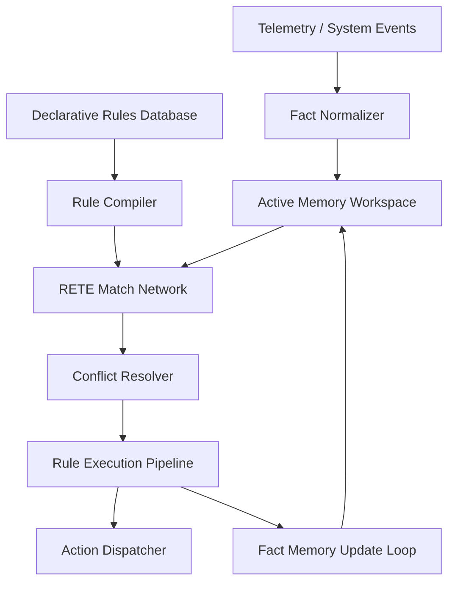
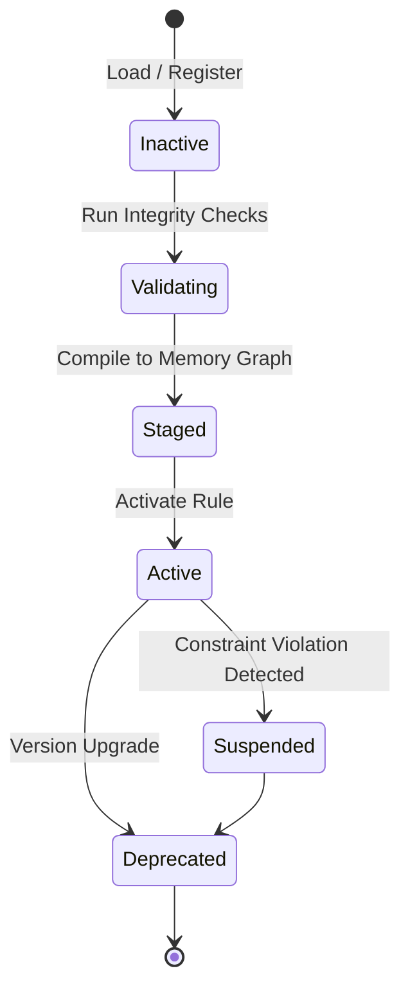

# LifeFresh AI Constitution
## AI Rule Engine Specification v1.0

**Version:** 1.0  
**Status:** Approved / Core Reference Architecture  
**Last Updated:** July 2026  
**Classification:** Enterprise Internal  

---

### 1. Engine Overview
The **AI Rule Engine** is the execution brain of the LifeFresh AI platform. It is responsible for evaluating, executing, managing, and optimizing business rules, workflow rules, security rules, automation rules, and decision rules throughout the application. Working in absolute synchronization with the `AI_Policy_Engine.md` and supervised by the safety boundaries of the `AI_Confirmation_Engine.md`, the Rule Engine provides a high-performance, deterministic execution environment that translates complex logic into reliable platform actions. By parsing conditions, processing facts, and executing rule chains, the system guarantees that all automated behaviors remain consistent, auditable, and secure.

---

### 2. Objectives
* **High-Performance Rule Execution:** Execute rule evaluations with minimal memory overhead and latencies of **<20ms** at the edge.
* **Deterministic Behavior:** Ensure all rule outcomes are predictable, repeatable, and mathematically bounded.
* **Dynamic Rule Injection:** Support runtime rule loading, compilation, and registration without requiring application restarts.
* **Offline Autonomy:** Enable complete rule evaluation and decision-making capabilities without active cloud connections.

---

### 3. Design Principles
* **Separation of Concerns:** Keep rule definitions decoupled from application source code using declarative syntax.
* **RETE-Based Pattern Matching:** Utilize optimized pattern-matching algorithms to evaluate rules efficiently against active fact spaces.
* **Conflict Resolution Priority:** Resolve overlapping rule actions using explicit priority, specificity, and safety criteria.
* **Chaining Limits:** Enforce strict loop-detection boundaries and recursion limits to prevent runaway execution chains.

---

### 4. Core Responsibilities
* **Rule Compilation and Parsing:** Parsing declarative rules from storage and compiling them into high-performance memory execution graphs.
* **Fact Ingestion:** Collecting, normalising, and feeding system, user, and environmental variables into the active memory workspace.
* **Dynamic Chaining:** Supporting forward and backward rule chaining to resolve complex logical dependencies.
* **Validation and Sanity Checks:** Running structural verification loops to ensure rulesets contain no infinite loops or syntax errors.

---

### 5. Rule Engine Architecture
The Rule Engine manages facts and rules within an isolated execution context to emit safe, validated action commands:



---

### 6. Rule Lifecycle
Rules follow a strict lifecycle from creation to deprecation to ensure the stability of active business logic:



---

### 7. Rule Repository
The **Rule Repository** is a secure, local, encrypted storage zone containing all active, staged, and historical rules. It is implemented using SQLite with AES-256-GCM encryption, managed by the platform's key system.

---

### 8. Rule Categories
Operational rules are divided into logical categories to simplify governance and optimize evaluation pipelines:
* **Business:** Workflow transitions, CRM stages, and administrative policies.
* **Workflow:** Automated progression of status states and check-ups.
* **Automation:** Trigger-action sequences (e.g., sending diagnostic alerts).
* **Security:** Access control, encryption parameters, and threat containment.

---

### 9. Business Rules
Business rules govern operational workflows, lead scoring, and CRM transitions, ensuring that processes align with organizational requirements.

```json
{
  "ruleId": "rule_biz_lead_transition_01",
  "name": "Qualified Lead Check-up Task Creation",
  "version": "1.0.1",
  "priority": 500,
  "conditions": [
    {
      "field": "lead.status",
      "operator": "EQUALS",
      "value": "QUALIFIED"
    }
  ],
  "actions": [
    {
      "type": "CREATE_TASK",
      "parameters": {
        "title": "Schedule Clinical Intake",
        "priority": "HIGH",
        "dueDateOffsetHours": 24
      }
    }
  ]
}
```

---

### 10. AI Rules
AI rules define the constraints, confidence gates, and fallback logic for all local generative and predictive AI actions.

---

### 11. Decision Rules
Decision rules manage complex logical trees and dynamic classifications, using context and historical parameters to select optimal action candidates.

---

### 12. Workflow Rules
Workflow rules automate transition paths across CRM pipelines, managing status changes, timing delays, and check-up schedules.

---

### 13. Automation Rules
Automation rules manage triggered events, listening to telemetry alerts and sensor data to execute local updates or show notifications.

---

### 14. Security Rules
Security rules define the access thresholds, encryption requirements, and threat mitigation actions enforced during active user sessions.

---

### 15. Permission Rules
Permission rules manage dynamic role mappings, validating requested operations against the user's role and authorization level before execution.

---

### 16. Validation Rules
Validation rules verify the integrity of all data changes and inputs, ensuring that values conform to strict system boundaries and schemas.

---

### 17. Context-aware Rules
Context-aware rules utilize real-time environmental, user, and device parameters compiled by the context manager to dynamically adjust rule logic.

| Dynamic Context | Evaluated Rule | Adjusted Behavior | Target Outcome |
| :--- | :--- | :--- | :--- |
| Network Status: OFFLINE | Sync Interval | Extend backoff delay | Prevent connection retry loops |
| Fatigue Index $> 0.70$ | On-Screen Help | Increase tips delay | Prevent user cognitive overload |
| Storage Available $< 100\text{MB}$| Log Rotation | Compress logs immediately | Free up flash space |

---

### 18. Rule Evaluation Pipeline
The rule evaluation pipeline runs sequentially to process facts against compiled rules:
1. **Fact Normalization:** Ingests raw input variables and maps them to structured memory schemas.
2. **RETE Match:** Resolves conditions dynamically against the compiled match network.
3. **Conflict Resolution:** Filters candidate rules to select the highest priority action.
4. **Action Execution:** Dispatches the selected action, updating fact memory if necessary.

---

### 19. Rule Execution Flow
Rule execution is managed by a high-performance, background runner that compiles fact states, coordinates dependency chains, and dispatches actions securely.

---

### 20. Rule Priority
Rules carry priority ratings ($P_r \in [0, 1000]$). Higher priorities take precedence during conflict resolution. Security and system-integrity rules are assigned the highest values ($P_r \ge 900$), ensuring they evaluate before other logic paths.

---

### 21. Rule Chaining
The Engine supports forward chaining. If an executed action updates the fact memory workspace, the evaluation cycle runs again to resolve downstream rule dependencies dynamically.

---

### 22. Rule Dependencies
To prevent execution anomalies, rules can define explicit dependency paths. A rule will only execute if its parent dependencies have been validated in the current pipeline cycle.

---

### 23. Conflict Resolution
When multiple rules match the same fact state, conflicts are resolved using:
1. **Priority Score:** The rule with the highest priority rating is selected.
2. **Specificity Index:** More specific rules take precedence over general configurations.
3. **Implicit Safety Score:** The candidate with the lower risk score is selected.

---

### 24. Rule Optimization
The RETE-like pattern matching network is compiled into memory on boot. This ensures that condition checks evaluate in $\mathcal{O}(1)$ time complexity relative to the total number of registered rules.

---

### 25. Dynamic Rule Loading
Declarative rules can be registered dynamically at runtime without requiring application rebuilds. Validated rulesets are parsed, compiled, and merged into the active memory graph.

---

### 26. Rule Versioning
All rulesets are versioned using Semantic Versioning (SemVer). The compiled memory graph logs all active rule versions, ensuring consistent, verifiable execution traces.

---

### 27. Rule Testing
Before promotion to active configurations, rules must pass local validation scripts that run in-memory tests to verify that the updates contain no recursive loops or logic conflicts.

---

### 28. Rule Analytics
A background analytics process monitors rule execution frequencies, logging execution counts, triggers, and latencies to identify system bottlenecks.

---

### 29. Monitoring
* **Latency Monitoring:** Tracks evaluation times, logging alerts if any single rule cycle exceeds **20ms**.
* **Memory Utilization:** Monitors the memory footprint of compiled RETE networks to prevent resource degradation.

---

### 30. Logging
Rule execution traces are logged strictly to local, encrypted SQLite databases. No patient identifiers are allowed in logging outputs:

```
[2026-07-09 17:01:22] [INFO] [RULE_ENGINE] Matching fact: lead.status = QUALIFIED
[2026-07-09 17:01:22] [INFO] [RULE_ENGINE] Conflict resolved. Executing: rule_biz_lead_transition_01. Priority: 500
[2026-07-09 17:01:22] [INFO] [RULE_ENGINE] Action committed: CREATE_TASK. Fact memory updated.
```

---

### 31. APIs
The Rule Engine exposes type-safe Kotlin interfaces to coordinate operations with other platform layers:

```kotlin
interface RuleEngineService {
    suspend fun evaluateFacts(facts: Map<String, Any>): List<RuleAction>
    suspend fun registerRule(ruleDefinition: String): Boolean
    suspend fun getActiveRuleset(): List<RuleDefinition>
    suspend fun clearWorkspace(): Boolean
}
```

---

### 32. Internal Data Structures
Rule configurations utilize immutable Kotlin structures to guarantee thread-safe execution during evaluation cycles:

```kotlin
data class RuleAction(
    val ruleId: String,
    val actionType: String,
    val parameters: Map<String, String>,
    val executionPriority: Int
)
```

---

### 33. Performance Optimization
* **Index Configurations:** Facts tables use hash-indexed keys to ensure quick workspace lookups.
* **Pre-Allocated Memory:** Rule evaluation queues use pre-allocated buffers to minimize GC overhead during active sessions.

---

### 34. Error Handling
* **Empty Workspaces:** If facts tables contain no valid variables, execution is blocked, and the engine logs a diagnostic warning.
* **Validation Anomalies:** Rulesets failing sandbox validation are discarded, and the system reverts to the baseline configuration.

---

### 35. Recovery Mechanisms
If a rule evaluation error results in systematic application crashes, a watchdog utility purges the active ruleset and reloads the default baseline rules on boot.

---

### 36. Enterprise Deployment
In enterprise environments, system policies and rules can be distributed as cryptographically signed JSON profiles. These profiles are parsed and activated locally on-device, bypassing dynamic calculations to enforce corporate workflows.

---

### 37. Future Expansion
* **Collaborative Fact Sharing:** Support secure, peer-to-peer fact sharing across local device nodes to optimize local coordination workflows.
* **Automated Rule Refinement:** Enable local learning models to propose and validate rule optimizations based on historical user interactions.

---

### Conclusion
The AI Rule Engine implements a highly optimized, deterministic rule execution framework designed for edge-native deployments. By enforcing local validation, RETE-based pattern matching, and conflict resolution, the Engine ensures that automated workflows remain safe, consistent, and secure.

### Related AI Constitution Documents
* `AI_Policy_Engine.md`
* `AI_Decision_Engine.md`
* `AI_Confirmation_Engine_v1.0.md`

### References
1. Forgy, C. L. (1982). "Rete: A Fast Algorithm for the Many Pattern/Many Object Pattern Match Problem".
2. Material Design 3 Guidelines: Accessibility and Dynamic Layout Adapters
3. ISO/IEC 19507: Object Constraint Language (OCL) Specification
