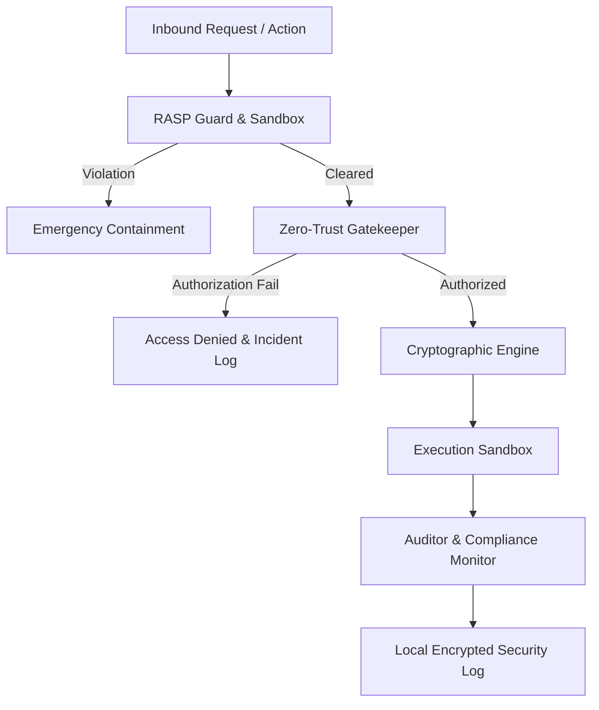
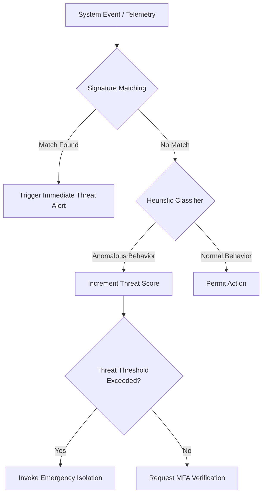

# LifeFresh AI Constitution
## AI Security Operations Engine Specification v1.0

**Version:** 1.0  
**Status:** Approved / Core Reference Architecture  
**Last Updated:** July 2026  
**Classification:** Enterprise Internal  

---

### 1. Engine Overview
The **AI Security Operations Engine** is the defensive sentinel of the LifeFresh AI platform. It is responsible for continuous threat detection, runtime application self-protection (RASP), cryptographic integrity enforcement, vulnerability assessment, and immediate incident mitigation across the entire application ecosystem. In an offline-first deployment, traditional cloud-based security monitoring (SIEM/SOAR) is insufficient. The Security Operations Engine runs locally on the device to monitor system states, telemetry flows, database access, memory utilization, and external API requests, detecting and neutralizing malicious activity or data breaches in real time.

---

### 2. Objectives
* **Real-time Threat Mitigation:** Identify and block malicious behaviors, unauthorized access attempts, and injection attacks in **<10ms** of detection.
* **Zero-Trust Local Boundary:** Validate every data exchange, API call, and configuration change at every system boundary.
* **Cryptographic Integrity:** Encrypt and protect all stored data, memory segments, and network tunnels using modern, device-backed hardware keys.
* **Continuous Compliance Enforcement:** Ensure the system operates in complete compliance with HIPAA, GDPR, and enterprise security policies.

---

### 3. Design Principles
* **Security-by-Default:** Implement maximum-security policies at all levels, requiring explicit, timed authorization grants for all high-risk operations.
* **Local Sandboxing:** Execute untrusted components, configurations, and scripts within isolated, low-privilege memory environments.
* **Failsafe Containment:** Default to complete lockouts, credential suspension, and data encapsulation when high-severity security breaches are detected.
* **Defense-in-Depth:** Layer security controls across the operating system, runtime memory, local databases, network layers, and prompt generation frameworks.

---

### 4. Core Responsibilities
* **Continuous Monitoring:** Auditing and parsing system metrics, database queries, and network configurations for security threats.
* **Runtime Protection (RASP):** Detecting root access, debugger attachments, emulator environments, and code injection attempts.
* **Cryptographic Key Management:** Orchestrating encryption key rotation, generation, and retrieval using Android Keystore and Secure Element components.
* **Incident Containment:** Executing automated mitigations, including clearing active sessions, encapsulating database files, and notifying security administrators.

---

### 5. Security Operations Architecture
The Security Operations Engine operates as a high-priority, isolated subsystem, filtering all incoming requests and system actions:



---

### 6. Security Monitoring
The Engine continuously audits system events and file alterations:
* **System Watchers:** Monitor background tasks, thread creations, and process parent hierarchies.
* **Storage Watchers:** Monitor localized database files and config parameters to prevent tamper attempts.

---

### 7. Threat Detection
Threat detection uses a hybrid approach combining static signature matching and dynamic heuristic checks. 



---

### 8. Threat Intelligence
The Engine maintains a local database of known attack signatures, compromised certificates, untrusted IP addresses, and blacklisted device characteristics. This database is updated via cryptographically signed packages received when the device connects to enterprise networks.

---

### 9. Risk Analysis
Risk scores are calculated for every critical transaction. The system scores transactions using five core metrics, ranging from $[0.0, 1.0]$:

$$ \text{Risk Score} = 0.3 \cdot I_{network} + 0.3 \cdot I_{user} + 0.2 \cdot I_{action} + 0.1 \cdot I_{system} + 0.1 \cdot I_{time} $$

If the final calculated risk exceeds **0.65**, the transaction is blocked, requiring biometric multi-factor authentication (MFA) to proceed.

---

### 10. Vulnerability Assessment
A scheduled background process scans local databases, library versions, and file permissions, verifying that the local execution environment complies with the platform security baseline.

---

### 11. Intrusion Detection
The local Intrusion Detection System (IDS) monitors interface behaviors:
* **Brute-Force Detection:** Monitors rapid consecutive authentication failures, enforcing exponential lockouts after 3 invalid attempts.
* **API Inbound Auditing:** Detects anomalies like unexpected parameter modifications or high-frequency request sequences.

---

### 12. Behavioral Analysis
By analyzing user operational profiles, the Engine maps baseline workflows. If a user account suddenly requests hundreds of patient records outside of their regular shift window, the system flags the behavior as a potential compromise, locking the session until administrative verification is completed.

---

### 13. Anomaly Detection
Anomaly levels are calculated by comparing current operation sequences against historical baseline patterns using an in-memory clustering engine:

$$ D_{anomaly} = \sqrt{\sum_{i=1}^{k} (x_i - \mu_i)^2} $$

If $D_{anomaly}$ is greater than $3\sigma$ from the calculated user centroid, the system flags the interaction, logging the trace and requesting biometric confirmation.

---

### 14. Security Event Processing
Inbound events are normalized into a standardized, type-safe security schema:

```json
{
  "eventId": "sec_evt_88a91c0e",
  "timestampUtc": 1783584612000,
  "severity": "CRITICAL",
  "threatType": "DEBUGGER_ATTACHED",
  "source": {
    "processName": "com.aistudio.lifefresh",
    "pid": 4821,
    "userProfileId": "prof_admin_881a7b"
  },
  "actionTaken": "FORCE_TERMINATE_PROCESS"
}
```

---

### 15. Security Incident Management
Incidents are assigned structured priority classes based on threat severity, mapping directly to automated containment playbooks:

| Severity Level | Threat Indicators | Automated Containment Playbook |
| :--- | :--- | :--- |
| Low | Invalid login, high touch error rates | Debounce inputs, increment threat score |
| Medium | Location drift, unsigned configuration upload | Clear context cache, request Biometric MFA |
| Critical | Debugger attached, database decryption failure | Revoke local keys, isolate files, terminate process |

---

### 16. Incident Response
When a critical incident is detected, the Engine executes containment procedures within 10ms:
1. **Revocation:** Discards and invalidates active session tokens and cached cryptographic keys.
2. **Encapsulation:** Locks SQLite databases, preventing read or write actions.
3. **Log Write:** Records a detailed cryptographic trace of the incident to local flash storage.
4. **Termination:** Terminates the host application process to prevent memory inspections.

---

### 17. Digital Forensics
The Engine maintains a cryptographic, append-only transaction ledger. Each entry is chained to the preceding log hash using SHA-256 signatures, ensuring that incident history logs cannot be tampered with or deleted:

$$ H_n = \text{SHA-256}(H_{n-1} \parallel \text{LogPayload}_n) $$

---

### 18. Security Policies
* **On-Device Cryptography Policy:** All database tables and configuration files must remain fully encrypted on-disk using AES-256-GCM.
* **Zero-Trust Network Policy:** All remote connections must use TLS 1.3 with pinned SHA-256 certificate hashes.
* **Minimal Permission Policy:** The application must run using the most restrictive permissions possible, requesting dangerous OS permissions dynamically at runtime.

---

### 19. Security Rules
This section lists the 30 strict, unyielding rules governing the Security Operations Engine:

* **RULE_SEC_001:** Every security incident must generate a unique, cryptographic transaction hash trace.
* **RULE_SEC_002:** Containment actions must execute within 10ms of threat identification.
* **RULE_SEC_003:** Cryptographic keys must remain isolated inside the Android Keystore System.
* **RULE_SEC_004:** Decryption keys must never write to persistent disk storage or crash dump files.
* **RULE_SEC_005:** Debugger detection sweeps must execute on every application cold-start sequence.
* **RULE_SEC_006:** All security and auditing logs must remain fully isolated between device user accounts.
* **RULE_SEC_007:** Detection of device root access must trigger an immediate application lockout.
* **RULE_SEC_008:** SQL database connections must utilize parameterized queries to prevent injection attacks.
* **RULE_SEC_009:** Password input elements must carry unique, snake_case test tags.
* **RULE_SEC_010:** Local encryption configurations must use AES-256-GCM with unique 12-byte initialization vectors.
* **RULE_SEC_011:** Consecutive authentication failures exceeding 3 attempts must trigger exponential lockouts.
* **RULE_SEC_012:** Network interfaces must enforce TLS 1.3 with certificate pinning.
* **RULE_SEC_013:** Unmasked patient identifiers or HIPAA metrics must never write to diagnostics logs.
* **RULE_SEC_014:** Memory-allocated PIN codes must be wiped by overwriting buffers with zero bytes after validation.
* **RULE_SEC_015:** App execution must be blocked if signature verifications on inbound configs fail.
* **RULE_SEC_016:** Configuration updates must utilize pre-allocated staging directories.
* **RULE_SEC_017:** Forensic ledgers must use SHA-256 hash chaining to ensure tamper resistance.
* **RULE_SEC_018:** Biometric re-authentication must be requested when risk scores exceed 0.65.
* **RULE_SEC_019:** Background security auditing tasks must yield instantly to active user typing actions.
* **RULE_SEC_020:** Interactive choices shown to the user must conform to Material 3 display scales.
* **RULE_SEC_021:** Settings modifications must be debounced with a 200ms limit.
* **RULE_SEC_022:** High-severity alert modules must request top-level display focus.
* **RULE_SEC_023:** Session termination events must instantly flush active context caches.
* **RULE_SEC_024:** Database validation checks must run on every application boot sequence.
* **RULE_SEC_025:** Execution traces must carry the active engine and build identifier.
* **RULE_SEC_026:** Sync tasks must use exponential backoff mechanisms.
* **RULE_SEC_027:** No security decision may result in infinite recursion loops within rules databases.
* **RULE_SEC_028:** Security processes must run on dedicated, high-priority background threads.
* **RULE_SEC_029:** Progress indicators must display Material 3 loading animations during evaluations.
* **RULE_SEC_030:** Manual system resets must instantly wipe all cached credentials and active keys.

---

### 20. Device Security
The Engine monitors device posture on start-up. It verifies that the bootloader is locked, checks for the presence of root binaries (e.g., `su`), and blocks application execution if suspicious configurations are detected.

---

### 21. Application Security
The host application uses code obfuscation tools to protect the code against reverse-engineering. On boot, the Engine runs an integrity verification check, comparing the current application signature hash against pre-compiled platform values to detect modification.

---

### 22. Data Security
Local databases are encrypted with AES-256-GCM. The encryption key is protected using the Android Keystore System. The database automatically closes active connections and flushes memory caches after 5 minutes of system-wide inactivity.

---

### 23. Memory Security
To prevent memory inspection attacks, the system wipes sensitive values (e.g., passwords or auth keys) from memory as soon as validation completes. Buffers containing keys are overwritten with zero bytes rather than relying on standard garbage collection sweeps.

---

### 24. Runtime Protection
The Engine implements Runtime Application Self-Protection (RASP):
```kotlin
fun checkRuntimeIntegrity(): Boolean {
    if (Debug.isDebuggerConnected() || isRooted() || isRunningOnEmulator()) {
        executeEmergencyContainment()
        return false
    }
    return true
}
```

---

### 25. API Security
All communications with external endpoints use secure TLS 1.3 connections. The Engine enforces certificate pinning, matching server certificate public key hashes against pre-compiled values to prevent man-in-the-middle attacks.

---

### 26. Encryption Strategy
* **Symmetric Encryption:** Uses AES-256-GCM with a unique 12-byte Initialization Vector (IV) for local files.
* **Asymmetric Encryption:** Uses ECC Secp256r1 for signing configurations and verifying external data payloads.

---

### 27. Authentication Integration
The Engine coordinates authentication checks. Users can authenticate using system PIN, passcode, or hardware-backed biometrics (e.g., fingerprint or facial recognition). Authentication state tokens are protected by the hardware's Secure Enclave.

---

### 28. Authorization Integration
The system uses Role-Based Access Control (RBAC). When a user requests an action, the Engine verifies their role against the permissions defined in the active rules database before granting access:

```sql
CREATE TABLE role_permissions (
    role TEXT NOT NULL,
    permission_key TEXT NOT NULL,
    PRIMARY KEY (role, permission_key)
);
```

---

### 29. Audit Integration
Every security decision, authentication event, configuration modification, and data access request logs a structured audit trail to the cryptographic forensic ledger, providing a tamper-resistant record of system operations.

---

### 30. Compliance Monitoring
The compliance subsystem monitors platform operations to ensure security standards are met. It tracks data retention limits, verifies that logging streams contain no unredacted patient details, and monitors the encryption status of stored files.

---

### 31. Monitoring
* **Attack Metrics:** Tracks the frequency of failed login attempts, credential validations, and cryptographic verification failures.
* **Task Latency:** Audits execution latency across security boundaries, logging warnings if checks take longer than **10ms**.

---

### 32. Logging
Log entries write strictly to the local encrypted database. Logs utilize parameterized schemas to ensure PII and clinical metrics are never written to disk:

```
[2026-07-09 16:50:22] [INFO] [SEC_ENGINE] Started start-up integrity check. Posture: SECURE
[2026-07-09 16:51:05] [INFO] [SEC_ENGINE] Active session token validated. Access: GRANTED
[2026-07-09 16:55:12] [WARN] [SEC_ENGINE] Authentication failure. User: prof_admin_881a7b. Count: 1
```

---

### 33. APIs
The Security Operations Engine exposes Kotlin interfaces to query states and trigger security containment protocols:

```kotlin
interface SecurityService {
    suspend fun verifyRuntimeIntegrity(): Boolean
    suspend fun calculateRiskScore(transaction: TransactionDetails): Float
    suspend fun encryptData(payload: ByteArray): ByteArray
    suspend fun decryptData(cipherText: ByteArray): ByteArray
    suspend fun triggerEmergencyIsolation(reason: String): Boolean
}
```

---

### 34. Internal Data Structures
Internal security structures use immutable, memory-protected Kotlin definitions:

```kotlin
data class SystemSecurityState(
    val bootStateSecure: Boolean,
    val debuggerConnected: Boolean,
    val deviceRooted: Boolean,
    val activeKeysLoaded: Boolean,
    val complianceViolations: List<String>
)
```

---

### 35. Performance Optimization
* **Index Configurations:** Cryptographic logs are indexed by `timestampUtc` to ensure fast diagnostics queries.
* **Pre-Loaded Keys:** Active decryption keys are held in protected memory segments during active user sessions, reducing overhead from constant Keystore queries.

---

### 36. Error Handling
* **Key Retrieval Failures:** If the Android Keystore fails to retrieve active encryption keys, the Engine locks the database and requests user re-authentication.
* **Storage Integrity Issues:** If an integrity check detects unauthorized database file modifications, the file is quarantined, and execution is blocked.

---

### 37. Recovery Mechanisms
If the Engine encounters a state recovery scenario, it triggers an automated backup restoration check. Backups are verified against public key signatures, restored within a secure sandbox environment, and verified before database files are re-opened.

---

### 38. Enterprise Deployment
In enterprise environments, system administrators can configure and enforce custom security policies (e.g., minimum PIN length or disallowed devices) using cryptographically signed JSON profiles deployed via Mobile Device Management (MDM).

---

### 39. Future Expansion
* **Collaborative Anomaly Detection:** Share anonymized threat signature profiles between trusted local network nodes to detect network-wide attacks.
* **Biometric Pacing:** Adapt authentication challenges dynamically based on biometric sensor data and user interaction pacing.

---

### Conclusion
The AI Security Operations Engine implements a robust, continuous runtime protection framework designed for offline-first deployments. By enforcing local encryption, zero-trust access boundaries, and automated threat containment, the Engine ensures the host platform remains safe, compliant, and resilient against security risks.

### Related AI Constitution Documents
* `AI_Decision_Engine.md`
* `AI_Personalization_Engine.md`
* `AI_Confirmation_Engine_v1.0.md`

### References
1. OWASP Mobile Application Security Verification Standard (MASVS)
2. Android Keystore System: Best Practices for Cryptographic Key Protection
3. NIST SP 800-207: Zero Trust Architecture Guidelines
