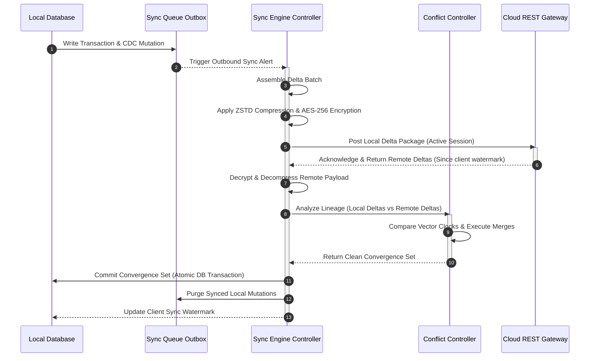
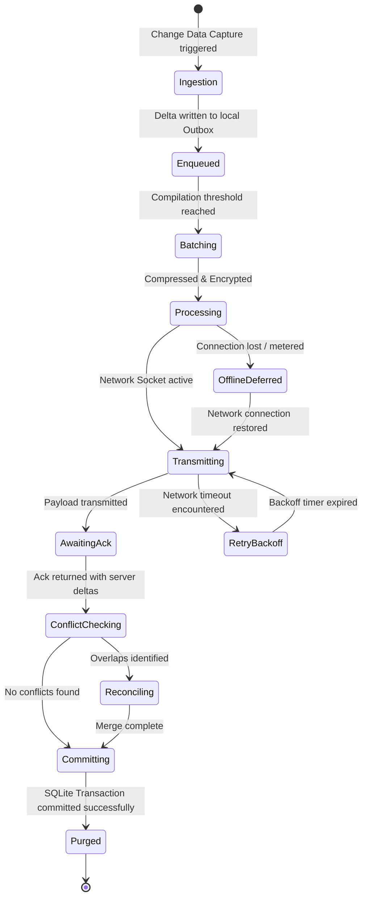

# LifeFresh QuickNote Pro
## AI Sync Engine Architecture Specification v1.0

**Version:** 1.0  
**Status:** Approved / Core Reference Architecture  
**Last Updated:** July 2026  
**Classification:** Enterprise Internal  

---

## 1. Engine Overview
The **LifeFresh AI Sync Engine** is the critical data synchronization, replication, and conflict-resolution backbone of the LifeFresh AI ecosystem. It is designed to bridge the gap between local-first offline execution on client edge devices and centralized, multi-tenant cloud or enterprise server architectures. In professional healthcare and clinical CRM environments, uninterrupted availability of customer information, note scribes, transaction logs, and context windows is paramount. This engine ensures that data remains consistent, secured, and strictly ordered across all replicas in a distributed cluster without compromising user experience or violating healthcare compliance standards (HIPAA/GDPR).

---

## 2. Objectives
1. **Uninterrupted Edge Autonomy:** Support zero-latency local operations by prioritizing offline-first write-paths.
2. **Deterministic Conflict Resolution:** Eliminate data loss and convergence drift using proven replication mathematics.
3. **Bandwidth Minimization:** Deliver optimal delta payloads using advanced binary encoding and streaming compression.
4. **End-to-End Privacy Preservation:** Encrypt clinical details at rest, in transit, and during synchronization using a zero-knowledge key topology.
5. **Multi-Platform Convergence:** Seamlessly coordinate states across Android, iOS, Web, and Enterprise Server nodes.

---

## 3. Design Principles
- **Eventual Consistency via Monotonic Logical Clocks:** Every mutation is stamped with a vector clock to establish a partial ordering of events across distributed nodes.
- **Payload Idempotency:** Sync execution pipelines are designed so that replaying a synchronization batch multiple times yields the exact same logical state.
- **Resource-Aware Background Execution:** Background synchronization runs are managed via system-throttled worker pools that adjust frequency based on telemetry (battery status, thermal limits, network type).
- **Client-Preserved Zero-Knowledge Privacy:** Patient Health Information (PHI) is sealed on-device using a client-controlled key; cloud systems act as blind replication logs.

---

## 4. Core Responsibilities
- **Change Data Capture (CDC):** Tracking database mutations down to individual row-level changes.
- **Sync Queue Ingestion:** Buffering outgoing deltas and coordinating priority-based synchronization.
- **Network Routing Gates:** Inspecting connection profiles to select optimal network channels.
- **Bidirectional Reconciliation:** Merging local changes with incoming server updates.
- **Peer-to-Peer Synchronization:** Enabling direct device-to-device replication inside offline clinic rooms.

---

## 5. Complete Architecture
The Sync Engine consists of a decoupled, layered layout interfacing with local database layers, transport controllers, and encryption gateways.

```
+-----------------------------------------------------------------------------------+
|                        LOCAL EDGE TRANSACTION CONTROLLER (L2)                     |
+-----------------------------------------------------------------------------------+
                                          |
                                          v (Capture Database Mutations)
+-----------------------------------------------------------------------------------+
|                             SYNC QUEUE MANAGER (OUTBOX)                           |
|  - Tracks pending local mutations as chronological delta batches                  |
|  - Deduplicates consecutive changes to identical rows                             |
+-----------------------------------------------------------------------------------+
          |                                                               |
          v (Local Clinic Wi-Fi Mesh)                                     v (Internet/Cloud Uplink)
+-----------------------------------+                           +-------------------+
|        LOCAL P2P ENGINE           |                           | CLOUD GATEWAY     |
|                                   |                           |                   |
| - mDNS Peer Discovery             |                           | - TLS 1.3 Routing |
| - Wi-Fi Direct Sync               |                           | - Gzip/Brotli     |
+-----------------------------------+                           +-------------------+
          \                                                               /
           +------------------------------+------------------------------+
                                          |
                                          v
+-----------------------------------------------------------------------------------+
|                           CONFLICT RECONCILIATION ENGINE                          |
|  - Parses Vector Clocks & Transaction Lineages                                    |
|  - Executes Domain-Specific CRDT Set Unions / LWW merges                          |
|  - Invokes User UI Gating for High-Value Overlaps                                 |
+-----------------------------------------------------------------------------------+
```

### 5.1 Synchronization Sequence


---

## 6. Synchronization Lifecycle
The execution path of any synchronization transaction is governed by a strict state-machine model:



---

## 7. Offline-First Synchronization
In offline-first setups, the system never suspends data operations during disconnections:
- **Write Optimization:** All writes are written directly to local database engines, returning instant feedback to the user.
- **Chronological Sequencing:** Writes are stamped with logical clocks before persistence, preventing out-of-order execution issues when reconnected.

---

## 8. Online Synchronization
When a persistent, unmetered network connection is detected:
- The system opens a Server-Sent Events (SSE) or WebSocket connection for real-time remote updates.
- Pending items inside the local Outbox queue are pushed in immediate batches to minimize divergence.

---

## 9. Hybrid Synchronization
Designed for multi-device environments operating across varying local networks:
- **Local Network Routing:** Devices discover neighboring nodes via multicast DNS (mDNS) and synchronize files over local Wi-Fi, bypassing public gateways.
- **Enterprise Sync Uplink:** A designated clinic broker device consolidates local records and relays them to the enterprise cloud servers.

---

## 10. Local Database Synchronization
Manages change records locally using standard database constraints:
- Uses SQLite triggers to automatically capture table updates, insertions, and deletes.
- Ensures the synchronization outbox tables are written within the same atomic transaction as the source entity to guarantee integrity.

---

## 11. Cloud Synchronization
Orchestrates connections to remote multi-tenant endpoints:
- Verifies that all PHI-designated payload structures are fully encrypted on-device.
- Manages batch payloads using strict HTTP limits to prevent server performance degradation.

---

## 12. Enterprise Server Synchronization
Supports deep integration with legacy hospital enterprise structures:
- Standardizes local entity payloads to match HL7 FHIR database standards.
- Employs strict server-side schema verification before merging clinical records into the enterprise system.

---

## 13. Multi-Device Synchronization
Coordinates real-time updates across multiple devices owned by a single clinician:
- Prevents write-race scenarios when a doctor edits notes concurrently on a tablet and laptop.
- Implements device-specific lineage keys to isolate and track simultaneous write actions.

---

## 14. Background Synchronization
Executes sync operations as low-power background routines:
- Leverages OS-level background task managers to run synchronization checks when the device is idle.
- Limits database and network operations when battery levels fall below 15%.

---

## 15. Manual Synchronization
Allows clinicians to explicitly trigger synchronization when immediate updates are required:
- Bypasses active background throttling rules to force connection checks.
- Displays a visual progress bar and reports detailed success/failure states.

---

## 16. Automatic Synchronization
The standard silent operating model of the Sync Engine:
- Dispatched automatically on key application lifecycle events (e.g., application boot, note completion, tab switching).
- Adjusts execution frequencies dynamically based on active network profiles.

---

## 17. Incremental Synchronization
The standard operational mode to optimize bandwidth:
- Identifies and packages modifications made since the local client's latest synchronized transaction sequence identifier.
- Reduces network overhead by only sending modified fields rather than whole databases.

---

## 18. Differential Synchronization
Used to reconcile out-of-sync clients after prolonged disconnections:
- Compares state digests between client replicas and server logs.
- Transmits only the conflicting or missing data points to align the replica states.

---

## 19. Full Synchronization
An emergency recovery process triggered when system integrity fails:
- Completely rebuilds the local client database by downloading all active entities from the cloud backup ledger.
- Erases the local transaction outbox to prevent corrupt local states from syncing upstream.

---

## 20. Delta Synchronization
A highly efficient synchronization model that uses fine-grained diffs:
- Tracks individual field-level changes inside large text blocks (like clinical note transcriptions).
- Synchronizes character diff indices rather than transmitting the complete text block.

---

## 21. Event-Driven Synchronization
Triggers synchronization runs in response to specific system alerts:
- **Triggers:** Dispatched when receiving high-priority push notifications (e.g., critical diagnostic alerts or urgent patient scheduling changes).
- Ensures that critical alerts bypass standard background sync queues.

---

## 22. Scheduled Synchronization
Maintains system consistency during idle periods:
- Runs scheduled synchronization tasks at regular intervals (e.g., every 30 minutes).
- Automatically scales down interval checks during late-night or low-activity hours.

---

## 23. Real-Time Synchronization
Provides instantaneous updates when stable high-speed connections are available:
- Establishes a persistent bidirectional connection using secure WebSockets.
- Propagates user edits to other active devices within 500 milliseconds of being written.

---

## 24. Queue Management
The Sync Engine manages three distinct, prioritized internal queues:

| Queue Name | Priority Level | Target Payload Types | Execution Trigger |
|---|---|---|---|
| **Priority 1 (System)** | CRITICAL | Security keys, user auth state, emergency alerts | Instant / Real-time |
| **Priority 2 (Clinical)** | HIGH | Clinical notes, patient files, appointment slots | Event-driven / 10s delay |
| **Priority 3 (System)** | LOW | Log telemetry, cache reports, analytics packets | Background / Wi-Fi only |

---

## 25. Change Tracking
- **Change Data Capture (CDC):** Uses a dedicated local change tracking table that records insertions, updates, and soft-deletes.
- **Deletions Management:** Enforces soft-deletes using an `is_deleted` column to ensure delete operations are synchronized across all devices before being permanently purged.

---

## 26. Version Control
- **Vector Clocks:** Every data row is stamped with a vector clock structure representing the logical version across all replicas.
- **Version Mapping:**
  ```json
  {
    "device_a": 104,
    "device_b": 102,
    "server_node": 104
  }
  ```

---

## 27. Conflict Detection
Conflicts are identified when concurrent edits occur on the same entity without knowledge of one another:
- **Clock Dominance:** A conflict is flagged if neither version dominates the other.
- **Resolution Path:** Conflicting items are routed to the Conflict Resolution Engine.

---

## 28. Conflict Resolution
The engine uses deterministic, domain-specific merge rules to resolve conflicting edits:
- **Last-Write-Wins (LWW):** Compares physical UTC timestamps on conflicting entities. The entity with the latest verified timestamp is kept. Used for basic text fields and theme configurations.
- **Conflict-Free Replicated Data Types (CRDTs):** Used for array structures like symptom list checkmarks. Merges conflicting states using set unions without losing concurrent data points.
- **Interactive Human Override:** Used for complex CRM lead state transitions and scheduling overlaps. Renders a standard visual review panel inside the application interface, allowing the user to explicitly select the preferred version.

---

## 29. Merge Algorithms
The engine implements **LWW-Element-Set** and **PN-Counter** CRDT structures:

```kotlin
class LWWElementSet<T> {
    private val addSet = mutableMapOf<T, Long>()
    private val removeSet = mutableMapOf<T, Long>()

    fun add(element: T, timestamp: Long) {
        val existing = addSet[element]
        if (existing == null || existing < timestamp) {
            addSet[element] = timestamp
        }
    }

    fun remove(element: T, timestamp: Long) {
        val existing = removeSet[element]
        if (existing == null || existing < timestamp) {
            removeSet[element] = timestamp
        }
    }

    fun value(): Set<T> {
        return addSet.keys.filter { element ->
            val addTime = addSet[element] ?: 0
            val removeTime = removeSet[element] ?: 0
            addTime > removeTime
        }.toSet()
    }
}
```

---

## 30. Data Integrity Verification
Ensures data has not been corrupted during transmission or storage:
- Generates a SHA-256 hash of each synchronization batch.
- Verified on receipt to confirm the package has not been tampered with or corrupted during transmission.

---

## 31. Consistency Validation
Prevents database schema and foreign key violations:
- Performs database validation checks (e.g., checking references exist) before writing incoming sync packages.
- If a check fails, the transaction is rejected, and the sync state is rolled back.

---

## 32. Retry Policies
The system implements an exponential backoff retry strategy with randomized jitter to manage unstable network connections:

$$T_{\text{wait}} = \min\left(T_{\text{max}}, T_{\text{base}} \times 2^{\text{attempt}}\right) \pm \text{RandomJitter}$$

- **Parameters:**
  - $T_{\text{base}} = 2$ seconds
  - $T_{\text{max}} = 300$ seconds
  - $\text{RandomJitter} = \pm 15\%$

---

## 33. Bandwidth Optimization
Reduces cellular data consumption using strict data transfer policies:
- Restricts synchronization of heavy files (like audio recordings) to unmetered Wi-Fi connections.
- Limits active sync payload sizes when roaming or on metered networks.

---

## 34. Compression
- **Algorithm:** Uses **ZSTD (Zstandard)** due to its rapid decompression speeds and highly efficient resource profiles.
- **Trigger:** Compression is bypassed for payloads smaller than 256 bytes to avoid computational overhead on tiny text strings.

---

## 35. Encryption
- **AES-256-GCM Encryption:** Every L2 disk cache entry payload is encrypted using on-device AES-256-GCM.
- **Key Derivation:** The encryption key is derived dynamically using PBKDF2 with the user's system PIN and a unique local hardware salt.
- **Cryptographic Memory Zeroing:** JVM byte arrays holding sensitive cached entities are overwritten with zeros immediately after usage.

---

## 36. Authentication
- Enforces OAuth 2.0 with JSON Web Tokens (JWT) for all cloud sync connections.
- Utilizes hardware-backed secure storage keys to securely sign sync requests.

---

## 37. Authorization
- Validates user roles and access rights before synchronizing specific database tables.
- If a user tries to sync unauthorized data, the system blocks the request and creates a security log entry.

---

## 38. Sync Policies
- Defines synchronization rules based on data classification, network type, and device status.
- Administered remotely through centralized JSON policy files.

---

## 39. Sync Rules
- Specifies validation rules for data fields (e.g., maximum length, valid characters).
- Changes that do not pass sync validation rules are flagged and placed in a quarantine queue for manual review.

---

## 40. Monitoring
- Tracks system metrics including active sync latency, success rates, payload sizes, and conflict frequency.
- Publishes real-time telemetry to the system diagnostics dashboard.

---

## 41. Logging
Logs system events without exposing Protected Health Information (PHI):

```
[INFO][2026-07-09 03:00:15][AI_SYNC] Triggered sync run: bak_20260709_030000. Mode: Incremental.
[INFO][2026-07-09 03:01:22][AI_SYNC] Sync completed. Payload size: 45 KB. Latency: 120ms.
[WARN][2026-07-09 03:15:00][AI_SYNC] Network connection lost. Queue paused.
[ERROR][2026-07-09 03:30:12][AI_SYNC] Sync failed: Authentication token expired. Re-auth required.
```

---

## 42. APIs (YAML Configuration Specification)
```yaml
sync_engine_configuration:
  active_topology: "HYBRID_CLOUD_LAN"
  mDNS_service_type: "_lifefresh-sync._tcp"
  local_p2p_port: 8443
  cloud_gateway_url: "https://sync.lifefresh-enterprise.com/v1"
  limits:
    max_batch_mutation_count: 100
    max_payload_size_bytes: 5242880
  connection_policies:
    cellular:
      allow_audio_sync: false
      max_batch_size: 20
    wifi:
      allow_audio_sync: true
      max_batch_size: 100
```

---

## 43. Internal Data Structures
JSON representation of a synchronization payload batch:

```json
{
  "sync_batch_id": "syb_88291_adfe",
  "client_id": "cli_9883_ffac",
  "watermark": 1783585200000,
  "mutations": [
    {
      "mutation_id": "mut_29201_ccbb",
      "table": "clinical_notes",
      "action": "UPDATE",
      "row_key": "not_98212",
      "change_vector": "{\"device_a\": 104, \"device_b\": 102}",
      "encrypted_payload": "e2a1b3c4d5e6f7a8b9c0..."
    }
  ]
}
```

---

## 44. SQL Storage Design
The SQLite database schema used to track sync actions and replication progress:

```sql
CREATE TABLE IF NOT EXISTS sync_cdc_log (
    mutation_id TEXT PRIMARY KEY,
    target_table TEXT NOT NULL,
    row_key TEXT NOT NULL,
    action TEXT NOT NULL,
    change_vector TEXT NOT NULL,
    payload TEXT NOT NULL,
    created_utc INTEGER NOT NULL,
    sync_status TEXT DEFAULT 'PENDING'
);

CREATE TABLE IF NOT EXISTS replication_watermarks (
    peer_identifier TEXT PRIMARY KEY,
    last_synced_mutation_id TEXT,
    last_synced_timestamp INTEGER NOT NULL,
    vector_clock_state TEXT NOT NULL
);

CREATE INDEX IF NOT EXISTS idx_sync_status ON sync_cdc_log(sync_status);
CREATE INDEX IF NOT EXISTS idx_cdc_timestamp ON sync_cdc_log(created_utc);
```

---

## 45. Performance Optimization
- **Batch Commits:** Commits incoming changes in small batches within a single transaction to reduce database write overhead.
- **Asynchronous Execution:** Runs intensive serialization, encryption, and network operations on low-priority background threads to prevent UI performance issues.

---

## 46. Error Handling
The Sync Engine isolates execution errors using clean try-catch blocks to prevent system crashes:

```kotlin
try {
    syncEngine.processOutgoingBatch()
} catch (e: Exception) {
    Log.e("AI_SYNC", "Failed to process outgoing sync batch: ${e.message}")
    syncEngine.handleSyncError(e)
}
```

---

## 47. Recovery Mechanisms
- **Re-synchronization:** If synchronization drift is detected, the system executes a full sync.
- **Outbox Repair:** Clears and rebuilds corrupted local Outbox queues if verification checks fail.

---

## 48. Disaster Scenarios
- **Local Database Corruption:** If the local database is corrupted, the system restores the latest local backup and resynchronizes changes from the cloud.
- **Permanent Cloud Server Outage:** Fallback to local Peer-to-Peer synchronization to keep clinic systems connected during internet outages.

---

## 49. Enterprise Deployment
- Enforces high-availability deployment structures utilizing redundant load balancers and Kubernetes clusters.
- Configured to support enterprise database scaling and storage partition models.

---

## 50. Future Expansion
- **Continuous Stream Mirroring:** Real-time synchronization of voice recordings using WebRTC channels.
- **Predictive Pre-fetching:** Using on-device machine learning to predict required files and download them ahead of internet disconnections.

---

## 51. Conclusion
The LifeFresh AI Sync Engine provides a highly secure, offline-first synchronization framework. By utilizing vector clocks and deterministic merge rules, it ensures data consistency across devices while maintaining absolute compliance with medical CRM standards.

---

## 52. Future Enhancements
- Support for blockchain-based cryptographic ledger sync.
- Dynamic data compression scaling based on active CPU and battery temperatures.

---

## 53. Related AI Constitution Documents
- `AI_Cache_Engine.md` — Accelerating lookup actions.
- `AI_Backup_Recovery_Engine.md` — Managing database preservation.
- `AI_Audit_Engine.md` — Tracking compliance logs.
- `AI_Error_Catalog_v1.0.md` — Failure classification tags.

---

## 54. References
- *Conflict-Free Replicated Data Types (Shapiro et al., INRIA 2011).*
- *Vector Clocks in Distributed Systems (Leslie Lamport).*
- *SQLite Online Replication and Hot Backup Protocols (sqlite.org).*
