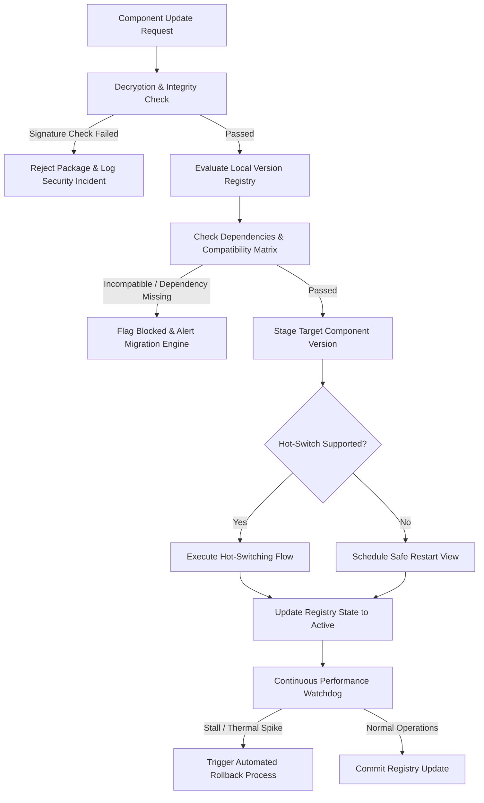
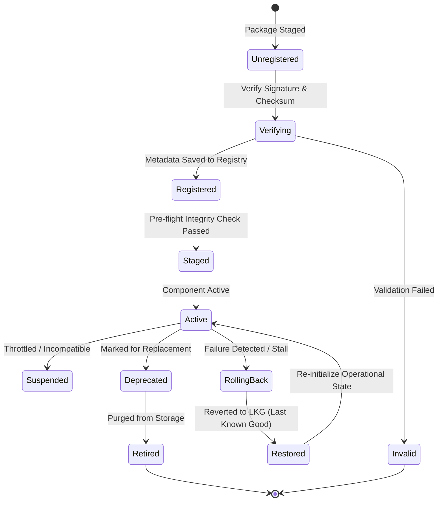
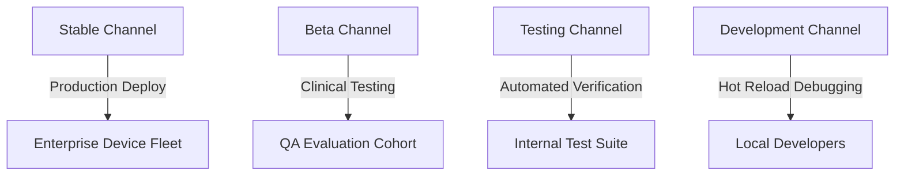
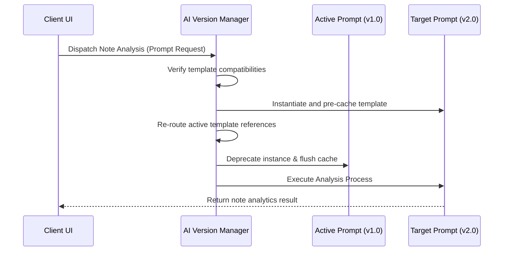

# LifeFresh AI Constitution
## AI Version Manager Specification v1.0

**Version:** 1.0  
**Status:** Approved / Core Reference Architecture  
**Last Updated:** July 2026  
**Classification:** Enterprise Internal  

---

### Purpose
The **AI Version Manager** is the primary tracking, validating, comparing, governing, and rollback authority for all software components, database schemas, prompt templates, and local AI assets inside the LifeFresh QuickNote Pro platform. Designed for offline-first, edge-native operations, it enforces version compatibility constraints and coordinates hot-switching routines, allowing the local AI engine to control application features, workflows, and local databases safely without constant internet connectivity and preventing unexpected compatibility issues.

---

### Scope
This specification governs the design, deployment, semantic versioning rules, compatibility matrices, and API interfaces of the local Version Manager. It covers database schemas, prompt templates, model versions, workflow patterns, and local configuration sets on the device.

---

### Objectives
* **Deterministic Version Control:** Maintain a local registry tracking versions for all software and AI components.
* **Enforce Compatibility Rules:** Prevent system degradation by blocking incompatible model files, database schemas, or prompt templates.
* **Zero-Downtime Hot Switching:** Support runtime model and template transitions without breaking active inference sessions.
* **Automated Rollback Guards:** Identify failed updates and automatically roll back components to their last known stable states.

---

### Design Principles
* **Declarative Asset Registry:** Asset versions, hashes, and dependencies must be declared in structured metadata configurations separate from code.
* **Strict Version Separation:** Support running different versions of templates, workflows, and configurations side-by-side during transitions.
* **Fail-Closed Verification:** If signature or checksum verifications fail, the Version Manager must block the component activation.
* **Signed Mutation Auditing:** Every version transition, verification event, and rollback must be recorded in an append-only log.

---

### 1. Functional Boundaries & Distinctions
To prevent overlapping responsibilities, the AI Version Manager enforces strict system boundaries:

| System Domain | Primary Action | Target Data Type | Dependency Hook | Reference Engine |
| :--- | :--- | :--- | :--- | :--- |
| **Version Manager** | Tracks, registers, and validates software version numbers. | Component tags, SemVer hashes. | Directs path discovery rules. | `AI_Version_Manager.md` |
| **Migration Engine** | Transforms structure, columns, and relations during updates. | Active database tables, weights, memory keys. | Version Manager triggers. | `AI_Migration_Engine.md` |
| **Model Manager** | Manages loading, memory footprints, and resource scheduling. | Local model files, weights, drivers. | Verifies model file version and compatibility before load. | `AI_Model_Manager.md` |
| **Configuration Engine** | Dispatches runtime parameters and toggles features. | Active YAML parameters, feature flags. | Maps config parameter updates dynamically. | `AI_Configuration_Engine.md` |

---

### 2. Version Management Architecture
The Version Manager evaluates, registers, and controls component versions using a structured, offline-first pipeline:



---

### 3. Core Components
* **Version Registry:** A local, encrypted SQLite registry tracking active and staged version metadata for all local system components.
* **Semantic Analyst:** Evaluates version rules, comparing Semantic Versioning (SemVer) tags and checking dependency requirements.
* **Compatibility Matrix:** Maps dependencies and compatibility bounds, ensuring matching schema, model, and application configurations are loaded.
* **Switching Coordinator:** Manages the hot-switching of prompt templates, workflows, and configurations at runtime, avoiding system pauses.
* **Verification Specialist:** Runs cryptographic checksum and digital signature validations on incoming update packages to ensure code safety.

---

### 4. Version Lifecycle & State Machine
Active system components flow through a defined state machine, managed securely by the Version Manager:



---

### 5. Multi-Domain Version Control
The Version Manager tracks versions across several platform scopes, ensuring consistent state tracking across different assets:
* **Semantic Software Versioning (SemVer):** Standard three-factor version tracking (`Major.Minor.Patch`) used for applications and plugins.
* **Dynamic Database Schema Versioning:** Tracks active schemas and table versions, prompting database migrations when version mismatches occur.
* **AI Model Weights Versioning:** Tracks local model files, matching them with compatible driver and application versions.
* **Prompt Template Versioning:** Tracks system prompts and context templates, allowing template updates without requiring application restarts.
* **Workflow & Rule Versioning:** Version-controls local workflow rules and security policies, ensuring predictable and repeatable state actions.

---

### 6. Release Channels & Compatibility
The Version Manager provides four release channels to support structured corporate updates:
* **Stable Channel:** Tested, high-reliability configurations deployed to active clinicians.
* **Beta Channel:** Feature-preview builds deployed to specific evaluation groups.
* **Testing Channel:** Internal QA builds used to test and verify new features.
* **Internal Development Channel:** Local development builds configured with debug overrides.



---

### 7. Core Version Allocation Algorithm
The Semantic Analyst compares version tags, resolving compatibility and dependency requirements dynamically:

```kotlin
class VersionComparator {
    fun compare(v1: String, v2: String): Int {
        val parts1 = v1.split(".").map { it.toIntOrNull() ?: 0 }
        val parts2 = v2.split(".").map { it.toIntOrNull() ?: 0 }
        
        val maxLen = maxOf(parts1.size, parts2.size)
        for (i in 0 until maxLen) {
            val part1 = parts1.getOrElse(i) { 0 }
            val part2 = parts2.getOrElse(i) { 0 }
            if (part1 != part2) {
                return part1.compareTo(part2)
            }
        }
        return 0
    }

    fun isCompatible(current: String, minSupported: String, maxSupported: String): Boolean {
        return compare(current, minSupported) >= 0 && compare(current, maxSupported) <= 0
    }
}
```

---

### 8. System Switch Shift Matrix
The following matrix dictates component state rules and safe switching configurations during version upgrades:

| Component | Side-by-Side Supported | Hot-Switch Supported | Restart Required | Verification Method |
| :--- | :--- | :--- | :--- | :--- |
| **Application Software** | No | No | Yes (Cold Boot) | Digital Signature |
| **Database Schema** | No | No | Yes (Warm Boot) | Structure Hash Check |
| **AI Model Weights** | Yes | Yes | No | File Checksum (SHA-256) |
| **Prompt Templates** | Yes | Yes | No | Format Schema Test |
| **Workflow Rules** | Yes | Yes | No | Validation Script Run |

---

### 9. Hot-Switching Flow
Enables on-the-fly prompt template transitions, avoiding system restarts and preserving active clinician workflows:



---

### 10. API Contracts & Structures

#### 10.1 Kotlin API Definition
```kotlin
interface VersionManagerService {
    suspend fun getActiveRegistry(): List<VersionRecord>
    suspend fun registerComponentVersion(manifestJson: String): Result<Boolean>
    suspend fun checkCompatibility(componentId: String, version: String): CompatibilityReport
    suspend fun activateStagedVersion(componentId: String): Result<Boolean>
    suspend fun rollbackComponent(componentId: String): Boolean
}

data class VersionRecord(
    val componentId: String,
    val activeVersion: String,
    val releaseChannel: String,
    val digitalSignature: String,
    val timestampAppliedUtc: Long
)
```

#### 10.2 SQLite Version Registry Schema
```sql
CREATE TABLE version_components (
    component_id TEXT PRIMARY KEY NOT NULL,
    display_name TEXT NOT NULL,
    active_version TEXT NOT NULL,
    release_channel TEXT NOT NULL,
    digital_signature TEXT NOT NULL,
    last_verified_utc INTEGER NOT NULL
);

CREATE TABLE version_compatibility_matrix (
    compatibility_id TEXT PRIMARY KEY NOT NULL,
    component_id TEXT NOT NULL,
    dependent_component_id TEXT NOT NULL,
    min_supported_version TEXT NOT NULL,
    max_supported_version TEXT NOT NULL,
    FOREIGN KEY (component_id) REFERENCES version_components(component_id) ON DELETE CASCADE
);

CREATE TABLE version_transition_log (
    transition_id TEXT PRIMARY KEY NOT NULL,
    component_id TEXT NOT NULL,
    from_version TEXT NOT NULL,
    to_version TEXT NOT NULL,
    initiated_utc INTEGER NOT NULL,
    duration_ms INTEGER NOT NULL,
    execution_result TEXT NOT NULL, -- SUCCESS, FAILED, ROLLBACK
    FOREIGN KEY (component_id) REFERENCES version_components(component_id)
);
```

#### 10.3 YAML Version Manifest
```yaml
version_manifest:
  component_id: "ai_note_summarizer"
  name: "LifeFresh AI Prompt Summarizer"
  target_channel: "Stable"
  version_tag: "2.1.0"
  signature: "sig_rsa_corporate_identity_checksum"
  dependencies:
    - dependent_id: "core_app"
      min_version: "2.0.0"
      max_version: "3.0.0"
    - dependent_id: "notes_db"
      min_version: "1.4.0"
      max_version: "1.6.0"
```

#### 10.4 JSON Version Diff Example
```json
{
  "eventId": "evt_vdiff_00192a",
  "timestampUtc": 1783648110000,
  "componentId": "ai_note_summarizer",
  "changeHistory": {
    "fromVersion": "2.0.0",
    "toVersion": "2.1.0",
    "releaseNotes": "Optimized clinical context mapping for note summarizing.",
    "filesModified": [
      {
        "filePath": "assets/prompts/summary_template.json",
        "action": "MODIFY",
        "sha256": "sha256_new_prompt_file_hash"
      }
    ]
  }
}
```

---

### 11. Security and Privacy
* **Signature Verifications:** All version updates require cryptographic signature validation using keys stored in the hardware keystore before activation.
* **Sanitized Metadata Logs:** Logging excludes notes and patient identifiers (PII/PHI), focusing purely on model IDs, transaction types, and version tags.
* **Local Sandboxing:** Version catalogs and registries are kept in private sandboxed storage, inaccessible to outside applications.

---

### 12. Testing Strategy
* **Compatibility Matrix Validation:** Tests dependency resolution logic with incompatible components to verify that activation attempts are blocked.
* **Failed Activation Rollback:** Simulates runtime exceptions during hot-switching to confirm the system automatically reverts to the last known good configuration.
* **Corrupted Package Detection:** Attempts to load assets with invalid cryptographic signatures, verifying that the integrity verifier flags and purges the file.

---

### 13. Enterprise Governance
* **MDM Version Locking:** Corporate administrators can manage, schedule, or lock versions of specific components using MDM profiles.
* **Quiet-Hour Upgrades:** Non-critical version transitions are scheduled to run during quiet hours, reducing operational impact for clinicians.

---

### 14. Best Practices & Anti-patterns

#### Best Practices
* **Compare Dependency Rules:** Always evaluate complete dependency graphs before initiating updates.
* **Create Pre-check Backups:** Save physical data backups before applying changes that affect SQLite tables or model paths.
* **Verify Cryptographic Signatures:** Run complete checksum and signature validations on all incoming assets.

#### Anti-patterns
* **Using Force-Overrides:** Bypassing compatibility checks to force-activate mismatched templates, causing application crashes.
* **Hardcoding Schema Versions:** Defining database version numbers directly in code, causing database migration failures during software upgrades.
* **Running Silent Upgrades:** Updating active models or prompts in the background without validating resource states, triggering thermal throttles.

---

### Future Enhancements
* **Dynamic Biomarker Diagnostics:** Automatically calibrate diagnostic rules and alert priorities based on active user fatigue trends.
* **Decentralized Local Diagnostics Mesh:** Cross-verify diagnostic reports securely on offline networks, helping administrators locate and isolate failed hardware nodes.

---

### Related AI Constitution Documents
* `AI_Migration_Engine.md`
* `AI_Diagnostics_Engine.md`
* `AI_Execution_Engine.md`

---

### References
1. Semantic Versioning and Dynamic Asset Governance on Decentralized Edge Networks: Best Practices
2. NIST SP 800-162: Zero Trust Systems and Enterprise Versioning Standards
3. Android NNAPI: Guidelines for Cryptographic Integrity and Safe Asset Upgrades

---

### Conclusion
The AI Version Manager provides a secure, predictable, and local framework designed to manage and coordinate version updates across database schemas, models, and application settings. By combining SemVer tracking, dependency matrices, cryptographic validations, and automated rollback systems, the Manager ensures the LifeFresh platform remains safe, stable, and compliant under all conditions.
